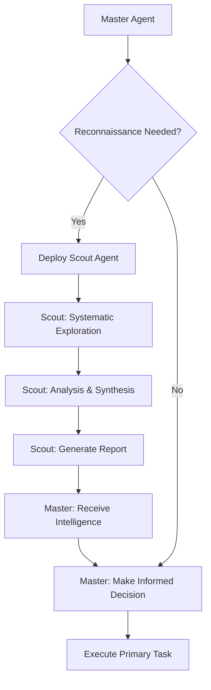
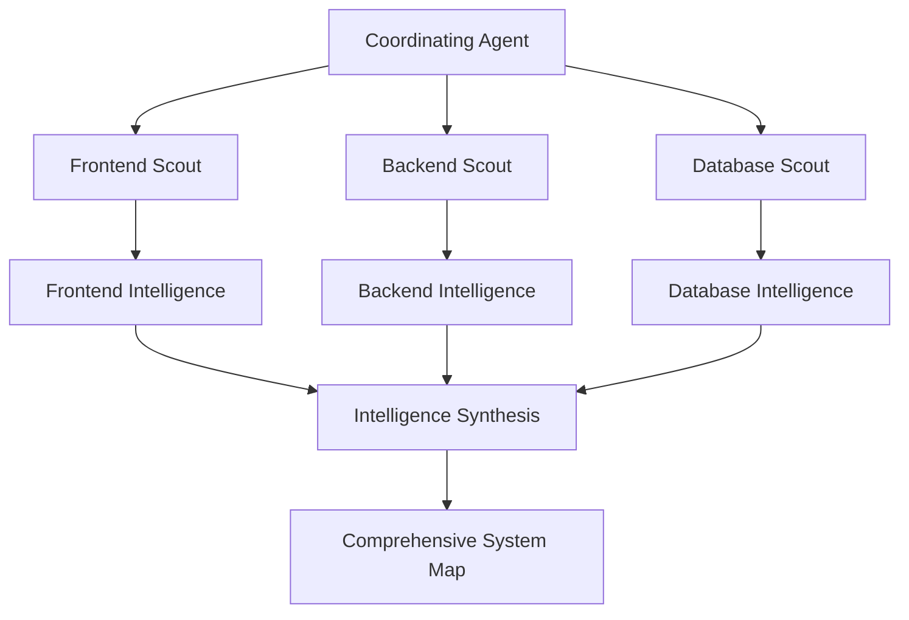
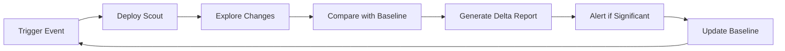
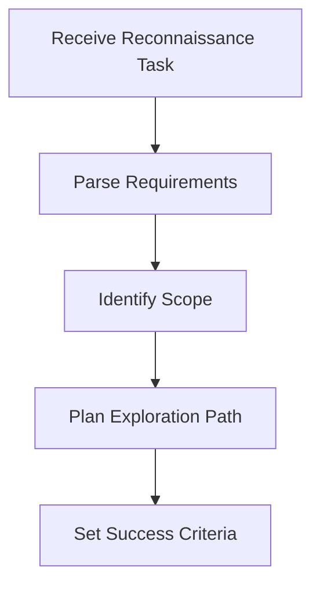
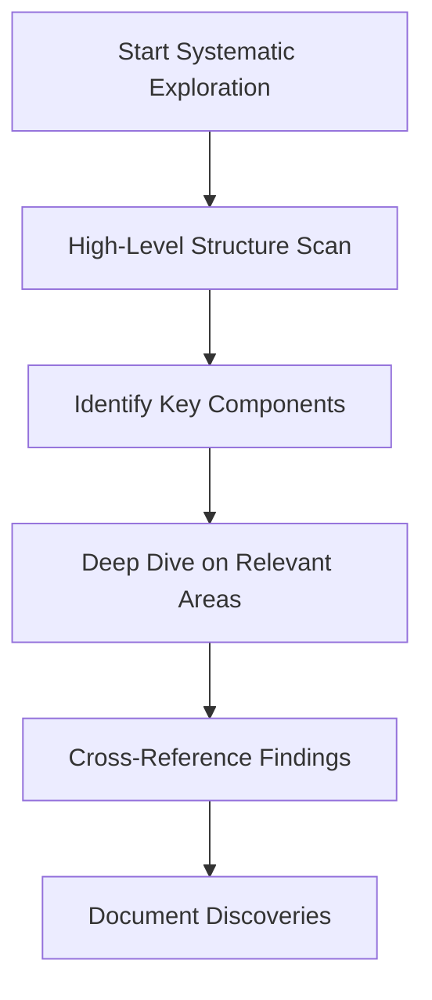
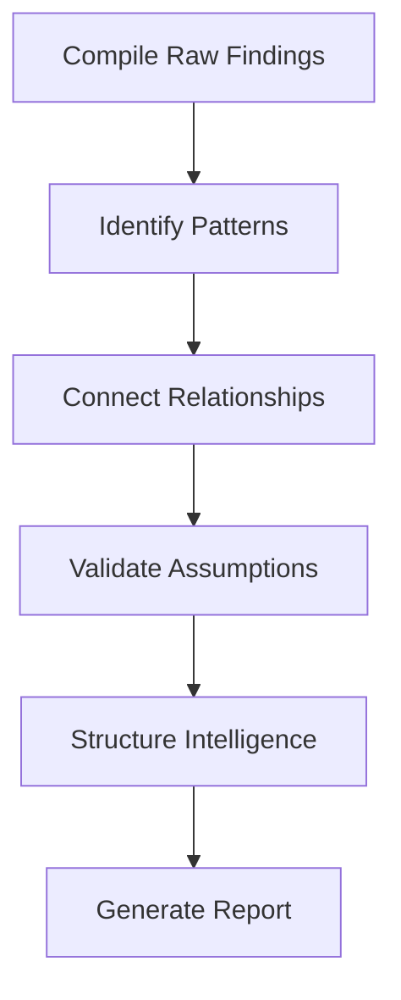

# Gopher Scout Agent Template

## Overview

The Gopher Scout agent template is a specialized NPL reconnaissance agent designed for systematic exploration and analysis of complex systems, codebases, and documentation structures. This template creates agents that excel at navigating large information spaces, processing vast amounts of data efficiently, and distilling findings into actionable intelligence while maintaining minimal context overhead.

The template is built on the principle of intelligent exploration - agents instantiated from this template act as advanced scouts that venture into complex systems to gather specific intelligence for controlling agents or human operators.

## Key Capabilities

### Core Competencies
- **Systematic Exploration**: Navigate directory structures, codebases, and documentation hierarchies methodically
- **Efficient Information Processing**: Rapidly scan and analyze large volumes of content to identify patterns and relationships
- **Intelligent Distillation**: Transform complex findings into concise, actionable summaries
- **Artifact Generation**: Create intermediate reports, diagrams, and summaries for future reference
- **Mission-Oriented Focus**: Maintain tight alignment with specific reconnaissance objectives

### Specialized Skills
- **Pattern Recognition**: Identify architectural patterns, coding conventions, and organizational structures
- **Cross-Reference Analysis**: Verify findings across multiple sources and detect inconsistencies
- **Context-Aware Summarization**: Generate reports tailored to the controlling agent's specific needs
- **Adaptive Exploration**: Adjust exploration strategies based on system type and discovery objectives

## Use Cases

### Primary Applications
1. **Codebase Analysis**: Explore unfamiliar codebases to understand architecture, dependencies, and implementation patterns
2. **Documentation Assessment**: Navigate complex documentation structures to extract specific information or assess coverage
3. **System Architecture Discovery**: Map relationships between components and understand system design decisions
4. **Technical Due Diligence**: Rapidly assess technical assets for acquisition, integration, or migration planning
5. **Compliance Auditing**: Systematically examine systems for adherence to standards or security requirements

### Integration Scenarios
- **Development Teams**: Scout new codebases before feature development or maintenance
- **Technical Writing**: Gather intelligence for documentation updates or API reference generation
- **DevOps Operations**: Explore deployment configurations and infrastructure patterns
- **Security Assessment**: Reconnaissance phase of security audits or vulnerability assessments

## Template Parameters

### Required Parameters
- `agent_name`: Unique identifier for the instantiated agent
- `agent_description`: Specific description of exploration capabilities for target system
- `model_preference`: AI model to use (sonnet, opus, haiku)
- `color_choice`: Interface color scheme

### Customization Parameters
- `system_type`: Type of system to explore (codebases, documentation, architectures)
- `exploration_targets`: Specific targets for exploration (directories, endpoints, files)
- `key_files`: Priority file types (READMEs, configs, source files)
- `artifact_types`: Types of intermediate artifacts to generate
- `high_level_indicators`: Initial examination targets
- `key_file_patterns`: Priority files for detailed analysis
- `source_material`: Primary material types for verification

### Optional Specialization
- `has_specialization`: Boolean flag to enable system-specific customization
- `focus_areas`: Specialized areas of attention
- `system_patterns`: System-specific patterns to recognize
- `exploration_targets`: Detailed exploration target definitions

## Template Hydration Guide

### Basic Instantiation

```bash
@npl-templater hydrate agentic/scaffolding/agent-templates/gopher-scout.npl-template.md \
  --agent_name "codebase-scout" \
  --agent_description "Specialized reconnaissance agent for analyzing Python web application codebases" \
  --model_preference "sonnet" \
  --color_choice "blue" \
  --system_type "Python web application codebases" \
  --exploration_targets "source directories, configuration files, test suites" \
  --key_files "requirements.txt, setup.py, main application modules" \
  --output "agents/codebase-scout.md"
```

### Advanced Specialization

```bash
@npl-templater hydrate agentic/scaffolding/agent-templates/gopher-scout.npl-template.md \
  --agent_name "api-explorer" \
  --agent_description "API documentation and endpoint analysis specialist" \
  --model_preference "opus" \
  --color_choice "green" \
  --system_type "REST API documentation and implementations" \
  --has_specialization true \
  --focus_areas '[{"area_name": "OpenAPI Specs", "area_description": "Analyze API specifications and endpoint definitions"}, {"area_name": "Authentication", "area_description": "Examine auth patterns and security implementations"}]' \
  --system_patterns '[{"pattern_name": "RESTful Design", "pattern_description": "Identify REST compliance and resource modeling patterns"}]' \
  --output "agents/api-explorer.md"
```

## Integration Patterns

### Master-Scout Pattern
The most common integration pattern involves a master agent delegating reconnaissance tasks to scout agents:



### Multi-Scout Coordination
For complex systems, multiple specialized scouts can work in parallel:



### Continuous Reconnaissance
Scout agents can be deployed for ongoing system monitoring:



## Example Instantiation Scenarios

### Scenario 1: Django Codebase Exploration

```python
# Template parameters for Django project scout
parameters = {
    "agent_name": "django-scout",
    "agent_description": "Django web application codebase analysis specialist",
    "model_preference": "sonnet",
    "color_choice": "purple",
    "system_type": "Django web application codebases",
    "exploration_targets": "apps, models, views, templates, static files",
    "key_files": "settings.py, urls.py, models.py, views.py, requirements.txt",
    "artifact_types": "model relationship diagrams, URL routing maps, app dependency graphs",
    "high_level_indicators": "manage.py, project structure, installed apps",
    "key_file_patterns": "settings files, model definitions, view controllers"
}
```

**Usage Example:**
```bash
@django-scout "Analyze the user authentication system in this Django project. I need to understand how user sessions are managed and what authentication backends are configured."
```

**Expected Output:**
```
## Executive Summary
The Django project uses session-based authentication with custom user model extending AbstractUser. Session management configured for database storage with 2-week expiry.

## Key Findings
- Custom User model in accounts/models.py extends AbstractUser with additional profile fields
- Session engine configured for database storage (settings.SESSION_ENGINE)
- Authentication backends: Django ModelBackend + custom OAuth2Backend
- Login/logout views use Django's built-in auth views with custom templates

## Detailed Analysis
### User Model (accounts/models.py:15-34)
- Extends AbstractUser with profile_image, bio, date_joined fields
- Uses email as USERNAME_FIELD instead of username
- Custom manager for email-based user creation

### Session Configuration (settings.py:87-92)
- SESSION_ENGINE = 'django.contrib.sessions.backends.db'
- SESSION_COOKIE_AGE = 1209600 (2 weeks)
- SESSION_SAVE_EVERY_REQUEST = True

### Authentication Flow (accounts/views.py:12-45)
- Custom login view with email validation
- Password reset flow using Django's built-in views
- OAuth2 integration for Google/GitHub signin
```

### Scenario 2: API Documentation Scout

```python
# Template parameters for API documentation analysis
parameters = {
    "agent_name": "api-doc-scout",
    "agent_description": "REST API documentation and specification analysis expert",
    "model_preference": "opus",
    "color_choice": "teal",
    "system_type": "REST API documentation structures",
    "exploration_targets": "OpenAPI specs, endpoint documentation, example requests/responses",
    "key_files": "openapi.yaml, swagger.json, API reference docs, postman collections",
    "artifact_types": "endpoint inventory, authentication flow diagrams, data model schemas",
    "has_specialization": True,
    "focus_areas": [
        {"area_name": "Endpoint Coverage", "area_description": "Catalog all available endpoints and their documentation status"},
        {"area_name": "Authentication Methods", "area_description": "Analyze supported auth methods and security schemes"}
    ]
}
```

**Usage Example:**
```bash
@api-doc-scout "I need a comprehensive inventory of all authentication endpoints in this API. Include supported methods, required parameters, and response formats."
```

### Scenario 3: Infrastructure Configuration Scout

```python
# Template parameters for infrastructure analysis
parameters = {
    "agent_name": "infra-scout",
    "agent_description": "Infrastructure configuration and deployment analysis specialist",
    "model_preference": "sonnet",
    "color_choice": "orange",
    "system_type": "Infrastructure as Code and deployment configurations",
    "exploration_targets": "Kubernetes manifests, Docker configurations, CI/CD pipelines",
    "key_files": "Dockerfile, docker-compose.yml, kubernetes/*.yaml, .github/workflows/*",
    "artifact_types": "deployment topology diagrams, resource allocation summaries, pipeline flow charts"
}
```

## Operational Workflow

### 1. Initialization Phase


### 2. Exploration Phase


### 3. Analysis & Synthesis Phase


## Best Practices

### Template Customization

1. **System-Specific Optimization**
   - Tailor exploration targets to the specific technology stack
   - Define system-appropriate key files and patterns
   - Customize artifact types for maximum utility

2. **Parameter Precision**
   - Use descriptive agent names that indicate specialization
   - Write clear agent descriptions focusing on unique capabilities
   - Choose appropriate model based on complexity requirements

3. **Specialization Configuration**
   - Enable specialization for complex or domain-specific systems
   - Define focused areas that align with common reconnaissance needs
   - Create reusable system pattern definitions

### Deployment Strategies

1. **Single-Purpose Scouts**
   - Create agents optimized for specific system types
   - Maintain focused expertise for better performance
   - Easier to debug and improve over time

2. **Multi-Purpose Scouts**
   - Useful for heterogeneous environments
   - Require more comprehensive parameter sets
   - May need runtime adaptation capabilities

3. **Scout Libraries**
   - Maintain a library of pre-configured scouts
   - Version control scout definitions alongside systems
   - Enable rapid deployment for common scenarios

### Performance Optimization

1. **Exploration Efficiency**
   - Start with high-level overviews before deep diving
   - Use file patterns to prioritize examination order
   - Implement early termination for focused queries

2. **Context Management**
   - Generate intermediate artifacts to reduce context load
   - Use structured reporting formats for easy parsing
   - Minimize redundant information in reports

3. **Quality Assurance**
   - Implement cross-reference validation
   - Flag uncertainties and assumptions clearly
   - Provide evidence trails for all conclusions

## Advanced Usage Patterns

### Chained Reconnaissance
Deploy multiple scouts in sequence for comprehensive analysis:

```bash
# Phase 1: High-level architecture scout
@architecture-scout "Map the overall system architecture"

# Phase 2: Security-focused scout using architecture findings
@security-scout "Analyze security implementations in the identified core modules"

# Phase 3: Performance analysis scout
@performance-scout "Examine performance bottlenecks in the authentication and data processing flows"
```

### Comparative Analysis
Use scouts to compare similar systems or versions:

```bash
# Deploy scouts against different versions
@codebase-scout-v1 "Analyze authentication system in version 1.x"
@codebase-scout-v2 "Analyze authentication system in version 2.x"

# Generate comparison report
@comparison-agent "Compare authentication system changes between v1 and v2 scout reports"
```

### Collaborative Intelligence
Coordinate multiple specialized scouts for complex missions:

```bash
# Deploy specialized team
@frontend-scout "Map React component architecture and state management"
@backend-scout "Analyze API layer and database interactions"
@devops-scout "Examine deployment and infrastructure configuration"

# Synthesize findings
@system-architect "Create comprehensive system map from scout reports"
```

## Troubleshooting

### Common Issues

1. **Overly Broad Exploration**
   - **Problem**: Scout explores beyond necessary scope
   - **Solution**: Refine exploration_targets and key_file_patterns parameters
   - **Prevention**: Use mission-specific agent descriptions

2. **Insufficient Detail**
   - **Problem**: Reports lack actionable intelligence
   - **Solution**: Adjust model_preference to more capable model
   - **Prevention**: Include specific artifact_types requirements

3. **Context Overflow**
   - **Problem**: Scout generates reports too large for downstream processing
   - **Solution**: Implement intermediate artifact generation
   - **Prevention**: Use hierarchical reporting structure

### Optimization Strategies

1. **Parameter Tuning**
   - Test different parameter combinations with representative data
   - Monitor report quality and adjust specialization settings
   - Version control successful parameter sets

2. **Performance Monitoring**
   - Track exploration time vs. intelligence quality
   - Monitor context utilization patterns
   - Optimize exploration paths based on success metrics

3. **Continuous Improvement**
   - Collect feedback on scout effectiveness
   - Refine templates based on usage patterns
   - Update specialization definitions as systems evolve

The Gopher Scout template provides a powerful foundation for creating intelligent reconnaissance agents that can efficiently explore and analyze complex systems. By following these guidelines and best practices, you can deploy effective scout agents that deliver precisely the intelligence needed for informed decision-making in software development and system analysis contexts.