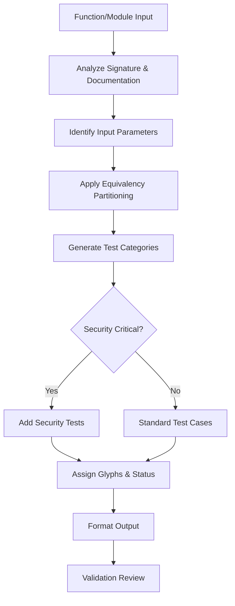
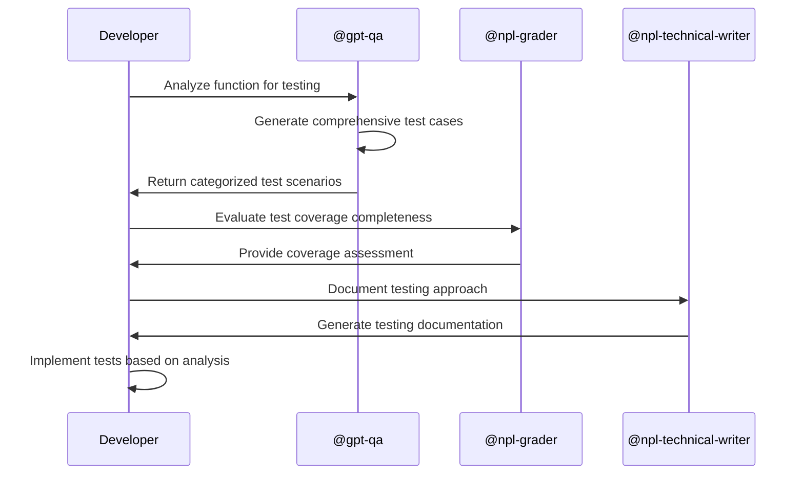

# GPT-QA Agent Template Documentation

## Overview

The `gpt-qa` template is a specialized NPL agent template designed for comprehensive test case generation and quality assurance analysis. This template creates agents that systematically analyze functions and modules to generate structured test coverage using equivalency partitioning methodology, producing categorized test cases with visual organization and validation status indicators.

## Purpose and Core Value

The gpt-qa template addresses the critical need for systematic test coverage analysis in software development. It transforms manual test planning into a structured, repeatable process that ensures comprehensive coverage while maintaining clear organization and actionable insights.

Key benefits include:
- Systematic application of testing methodologies like equivalency partitioning
- Visual categorization of test cases using glyph systems
- Validation status indicators for immediate implementation guidance
- Domain-specific testing approach adaptation
- Consistent test case documentation and organization

## Key Capabilities

### Test Generation Features
- **Function/Module Analysis**: Deep analysis of code structure, parameters, return values, and usage patterns
- **Equivalency Partitioning**: Systematic identification of input classes and boundary conditions
- **Multi-Category Testing**: Organized coverage of happy path, edge cases, security, performance, and integration scenarios
- **Visual Organization**: Glyph-based categorization for quick test case identification
- **Implementation Status**: Clear indicators of expected pass/fail outcomes

### Testing Methodology Integration
- **Boundary Value Analysis**: Automatic identification of edge cases and limits
- **Error Condition Coverage**: Systematic generation of negative test scenarios
- **Security Testing**: Focused security vulnerability test case generation
- **Performance Testing**: Performance and optimization scenario coverage
- **Integration Testing**: End-to-end and system integration test cases

### Language and Framework Adaptation
The template includes project analysis capabilities to:
- Detect primary programming language and testing frameworks
- Identify existing test patterns and conventions
- Apply domain-specific testing requirements
- Generate framework-appropriate test implementations

## Template Structure and Components

### Core Template Variables

| Variable | Purpose | Example Values |
|----------|---------|----------------|
| `agent_name` | Unique identifier for the agent | `qa-backend-api`, `test-generator-ui` |
| `agent_description` | Functional description | `Test case generator for REST API endpoints` |
| `model_preference` | Target AI model | `opus`, `sonnet`, `haiku` |
| `color_choice` | Interface styling | `green`, `blue`, `red` |
| `core_functions` | Additional capabilities list | Custom testing functions |

### Glyph System Configuration

The template uses a standardized glyph system for visual test organization:

```markdown
- 🟢 **Happy Path** - Standard successful execution scenarios
- 🔴 **Negative Case** - Error conditions and invalid inputs  
- ⚠️ **Security** - Security-focused test scenarios
- 🔧 **Performance** - Performance and optimization test cases
- 🌐 **E2E/Integration** - End-to-end and integration testing scenarios
- 💡 **Improvement** - Ideas, suggestions, or enhancement opportunities
```

Custom glyphs can be added through the `custom_glyphs` template section.

## How to Use and Hydrate the Template

### Basic Template Instantiation

```bash
# Using npl-templater to generate a QA agent for a Python API project
@npl-templater "Create a QA test generator agent for my FastAPI project using the gpt-qa template"

# Manual hydration with specific values
@npl-templater hydrate agentic/scaffolding/agent-templates/gpt-qa.npl-template.md \
  --agent_name="api-test-generator" \
  --agent_description="Comprehensive test case generator for FastAPI endpoints" \
  --model_preference="sonnet" \
  --color_choice="green"
```

### Project-Specific Customization

#### Python/Django Project Example
```bash
@npl-templater "Generate a Django QA agent from gpt-qa template with:
- Focus on model validation and view testing
- Django-specific test patterns
- Database fixture management
- Custom security test cases for authentication"
```

#### JavaScript/React Project Example  
```bash
@npl-templater "Create React component test generator using gpt-qa template:
- Component prop validation testing
- Event handler coverage
- Accessibility testing scenarios
- Performance testing for large datasets"
```

### Advanced Template Configuration

#### Custom Testing Categories
```handlebars
{{#if custom_glyphs}}
- 🔐 **Authentication** - User authentication and authorization tests
- 📊 **Data Validation** - Input validation and data integrity tests  
- 🌍 **Localization** - Internationalization and localization scenarios
{{/if}}
```

#### Project Documentation Integration
```handlebars
{{#if has_project_docs}}
## Getting Started Resources
📚 **Key Documentation**:
- `docs/api-specification.md` - API endpoint requirements
- `tests/testing-standards.md` - Project testing conventions
- `docs/security-requirements.md` - Security testing guidelines
{{/if}}
```

## Integration Patterns with Other Agents

### Sequential Testing Workflow

```mermaid
flowchart TD
    A[Code Analysis] --> B[@gpt-qa Generate Tests]
    B --> C[@npl-grader Evaluate Coverage]
    C --> D[@npl-technical-writer Document Results]
    D --> E[Implementation Phase]
    E --> F[@gpt-qa Validate Tests]
    F --> G[Deploy to CI/CD]
```

### Parallel Quality Assurance Pipeline

```mermaid
flowchart LR
    A[New Feature Code] --> B[@gpt-qa Test Generation]
    A --> C[@npl-grader Code Review]
    A --> D[@npl-technical-writer Documentation]
    B --> E[Merge Results]
    C --> E
    D --> E
    E --> F[Quality Gate]
```

### Integration Commands

```bash
# Complete QA workflow with multiple agents
@gpt-qa "Analyze the user authentication module and generate comprehensive test cases"
@npl-grader "Evaluate test coverage completeness using testing-rubric.md"
@npl-technical-writer "Document the testing strategy and implementation guide"

# Iterative test refinement
@gpt-qa "Generate initial test cases for payment processing"
@npl-thinker "Analyze test case effectiveness and suggest improvements"
@gpt-qa "Refine test cases based on analysis recommendations"
```

## Example Instantiation Scenarios

### Scenario 1: API Testing Agent

```bash
# Template instantiation command
@npl-templater "Create QA agent for REST API testing using gpt-qa template with:
- Agent name: api-qa-generator  
- Focus on endpoint validation, authentication, and data validation
- Include performance and security test categories
- Sonnet model for comprehensive analysis"
```

**Generated Agent Usage:**
```bash
@api-qa-generator "Generate test cases for the /users/{id}/profile endpoint:
- GET operation returning user profile data
- Requires JWT authentication
- Returns 200 with profile JSON or 404 if user not found"
```

**Expected Output:**
```
1. 🟢 Valid User Profile Retrieval: GET /users/123/profile with valid JWT token. ✅
   - Expected: Returns 200 status with complete user profile JSON containing id, name, email, and metadata fields.

2. 🔴 Invalid User ID: GET /users/999999/profile with valid JWT token. ✅  
   - Expected: Returns 404 status with error message "User not found".

3. ⚠️ Authentication Required: GET /users/123/profile without JWT token. ✅
   - Expected: Returns 401 status with authentication error message.

4. 🔧 Performance Load Test: GET /users/123/profile with 1000 concurrent requests. ❌
   - Expected: Response time under 200ms for 95th percentile, no memory leaks.
```

### Scenario 2: Frontend Component Testing Agent

```bash
# Template instantiation for React component testing
@npl-templater "Generate React component QA agent from gpt-qa template:
- Agent name: component-test-generator
- Specialized in prop validation, event handling, and accessibility
- Include custom glyphs for accessibility and user interaction testing"
```

**Generated Agent Usage:**
```bash
@component-test-generator "Create test cases for UserCard component:
- Props: user (object), onEdit (function), onDelete (function)  
- Displays user avatar, name, email with edit/delete buttons
- Should handle loading and error states"
```

### Scenario 3: Database Testing Agent

```bash
# Database-focused QA agent generation
@npl-templater "Create database QA agent using gpt-qa template:
- Name: db-test-generator
- Focus on data integrity, constraints, and transaction testing
- Include migration and performance testing categories"
```

## Workflow Diagrams

### Test Generation Process Flow



### Multi-Agent Testing Workflow



### Continuous Integration Testing Pipeline

```mermaid
flowchart LR
    A[Code Commit] --> B[@gpt-qa Auto-Generate Tests]
    B --> C[Execute Test Suite]
    C --> D{All Tests Pass?}
    D -->|No| E[@gpt-qa Analyze Failures]
    D -->|Yes| F[Deploy to Staging]
    E --> G[Generate Failure Report]
    G --> H[Developer Review]
    H --> I[Code Fixes]
    I --> A
    F --> J[@gpt-qa Smoke Tests]
    J --> K[Production Deploy]
```

## Best Practices for Customization and Deployment

### Template Customization Guidelines

#### 1. Domain-Specific Adaptations
```handlebars
{{#if domain_specific_testing}}
## Domain-Specific Testing Patterns
{{#if is_financial_system}}
- Regulatory compliance test scenarios
- Audit trail validation
- Currency precision handling
{{/if}}
{{#if is_healthcare_system}}  
- HIPAA compliance testing
- Medical data validation
- Patient privacy scenarios
{{/if}}
{{/if}}
```

#### 2. Framework Integration Patterns
```handlebars
{{#if test_framework}}
## Framework Integration
{{#if is_pytest}}
- Generate pytest fixtures and parametrized tests
- Include pytest-specific assertion patterns
{{/if}}
{{#if is_jest}}
- Create Jest test suites with describe/it structure
- Include mock and spy testing scenarios
{{/if}}
{{/if}}
```

### Deployment Strategies

#### 1. Project-Level Deployment
```bash
# Deploy as project-wide QA agent
cp generated-qa-agent.md .claude/agents/project-qa.md
echo "project-qa" >> .claude/agent-registry.txt
```

#### 2. Module-Specific Deployment  
```bash
# Deploy specialized agents for different modules
@npl-templater "Create auth-module QA agent from gpt-qa template"
@npl-templater "Create payment-module QA agent from gpt-qa template"  
@npl-templater "Create reporting-module QA agent from gpt-qa template"
```

#### 3. CI/CD Integration
```yaml
# .github/workflows/qa-analysis.yml
name: Automated QA Analysis
on: [pull_request]
jobs:
  qa-analysis:
    runs-on: ubuntu-latest
    steps:
      - uses: actions/checkout@v2
      - name: Generate Test Analysis
        run: |
          @gpt-qa "Analyze changed files for test coverage gaps"
          @npl-grader "Evaluate test completeness using qa-rubric.md"
```

### Performance Optimization

#### 1. Template Caching
- Cache generated agents for reuse across similar projects
- Version template instances for evolution tracking
- Maintain agent registry for quick access

#### 2. Batch Processing
```bash
# Analyze multiple modules simultaneously
@gpt-qa "Generate test cases for modules: auth, payment, reporting, notification"

# Parallel agent execution
@gpt-qa "Analyze auth module" & @gpt-qa "Analyze payment module" &
```

#### 3. Integration with Development Tools
```bash
# VS Code integration
echo '@gpt-qa' >> .vscode/claude-agents.json

# Git hooks integration  
echo '@gpt-qa analyze-changed-files' >> .git/hooks/pre-commit
```

### Quality Assurance for QA Agents

#### 1. Agent Validation
```bash
# Test the generated QA agent
@npl-grader "Evaluate generated QA agent using agent-quality-rubric.md"
@npl-thinker "Analyze QA agent effectiveness and suggest improvements"
```

#### 2. Continuous Improvement
```bash
# Regular agent assessment
@gpt-qa "Analyze recent test case generation accuracy"
@npl-persona "Enhance QA agent with domain expertise patterns"
```

#### 3. Documentation Maintenance
```bash
# Keep agent documentation current
@npl-technical-writer "Update QA agent documentation with new capabilities"
@npl-templater "Version control QA template improvements"
```

## Advanced Usage Patterns

### Custom Test Category Development
When standard categories are insufficient, extend the glyph system:

```handlebars
{{#if advanced_categories}}
- 🔬 **Experimental** - Cutting-edge feature testing scenarios
- 📱 **Mobile** - Mobile-specific testing requirements  
- 🌊 **Load** - High-volume and stress testing scenarios
- 🔄 **Migration** - Data migration and upgrade testing
{{/if}}
```

### Multi-Language Project Support
For polyglot projects, configure language-specific testing approaches:

```handlebars
{{#if multi_language_support}}
## Language-Specific Testing Patterns
{{#each supported_languages}}
- **{language}**: {testing_framework} with {test_patterns}
{{/each}}
{{/if}}
```

### Integration with External Testing Tools
Configure connections to testing infrastructure:

```handlebars
{{#if external_tools}}
## External Tool Integration  
- **CI/CD**: {ci_system} pipeline integration
- **Coverage**: {coverage_tool} reporting
- **Performance**: {perf_tool} benchmarking
{{/if}}
```

The gpt-qa template provides a robust foundation for systematic test case generation while remaining flexible enough to adapt to diverse project requirements and testing methodologies. Through careful customization and integration with other NPL agents, it becomes a powerful component in comprehensive quality assurance workflows.