# NIMPS Agent Documentation

## Overview

The **Noizu Idea to MVP Service (NIMPS)** is an advanced AI/LLM augmented project planning, specification, design and prototyping service that transforms ideas into comprehensive MVP specifications through structured yield-and-iterate methodology. NIMPS follows a systematic seven-phase approach to convert conceptual ideas into detailed, actionable project plans with comprehensive documentation.

## Core Purpose

NIMPS serves as a comprehensive project planning and specification service that:

- Transforms high-level ideas into detailed MVP specifications
- Creates deep user personas with psychological and behavioral profiles
- Generates structured user stories with acceptance criteria
- Designs system architecture and component specifications
- Produces project artifacts and prototypes
- Integrates with Notion for project management
- Maintains iterative feedback loops throughout the process

## Key Capabilities

### 1. Yield-Driven Development
- **Structured Iteration**: Stops every 10 deliverable items for user review
- **Controlled Feedback**: Specific yield points for targeted review
- **Adaptive Planning**: Incorporates user feedback in real-time
- **Phase Management**: Allows skipping or expanding phases based on needs

### 2. Deep Persona Analysis
- **Comprehensive Profiling**: Creates detailed psychological, professional, and behavioral profiles
- **Visual Personas**: Generates DALL-E compatible persona descriptions
- **Relationship Mapping**: Maps interactions between different user types
- **Organizational Context**: Includes B2B decision-making hierarchies

### 3. Structured Project Planning
- **Seven-Phase Methodology**: Discovery → Analysis → Persona → Planning → Architecture → Creation → Documentation
- **Strategic Epics**: High-level business goals tied to user value
- **Detailed User Stories**: Complete with acceptance criteria and definition of done
- **Architecture Specifications**: Technical components with dependencies and requirements

### 4. Integration & Artifacts
- **Notion Compatibility**: Structured content for direct Notion integration
- **Multiple Artifact Types**: Mockups, prototypes, code, documentation, designs
- **Template Systems**: Reusable formats for consistent output
- **Version Control**: Tracks iterations and maintains change history

## Operational Workflow

```mermaid
flowchart TD
    A[Idea Input] --> B[Discovery Phase]
    B --> C[Analysis Phase]
    C --> D[Persona Phase]
    D --> E[Planning Phase]
    E --> F[Architecture Phase]
    F --> G[Creation Phase]
    G --> H[Documentation Phase]
    
    B --> Y1[🎯 Yield Point]
    C --> Y2[🎯 Yield Point]
    D --> Y3[🎯 Yield Point]
    E --> Y4[🎯 Yield Point]
    F --> Y5[🎯 Yield Point]
    G --> Y6[🎯 Yield Point]
    H --> Y7[🎯 Final Yield Point]
    
    Y1 --> B1[User Feedback]
    Y2 --> B2[User Feedback]
    Y3 --> B3[User Feedback]
    Y4 --> B4[User Feedback]
    Y5 --> B5[User Feedback]
    Y6 --> B6[User Feedback]
    Y7 --> B7[User Feedback]
    
    B1 --> C
    B2 --> D
    B3 --> E
    B4 --> F
    B5 --> G
    B6 --> H
    B7 --> I[Final Delivery]
    
    style Y1 fill:#ff9999
    style Y2 fill:#ff9999
    style Y3 fill:#ff9999
    style Y4 fill:#ff9999
    style Y5 fill:#ff9999
    style Y6 fill:#ff9999
    style Y7 fill:#ff9999
```



## How to Invoke the Agent

### Basic Invocation
```bash
@nimps "Create an MVP plan for [your idea description]"
```

### Advanced Invocation with Context
```bash
@nimps "Plan an MVP for a task management app for freelancers. Target market is US-based creative professionals. Budget constraint of $50K. Need to launch in 6 months."
```

### Phase-Specific Invocation
```bash
# Start from specific phase
@nimps "Continue from persona phase for project [name]"

# Focus on specific deliverable
@nimps "Create detailed user stories for the authentication epic"
```

## Detailed Phase Breakdown

### Phase 1: Discovery
**Purpose**: Clarify requirements, assumptions, and project scope

**Deliverables**:
- Project definition and value proposition
- Executive summary
- Elevator pitch and investor pitch
- Problem statement and solution overview
- Success metrics and KPIs

**Yield Control**: Reviews project definition before proceeding

### Phase 2: Analysis
**Purpose**: Research market conditions and competitive landscape

**Deliverables**:
- Market size analysis (TAM, SAM, SOM)
- Competitive landscape mapping
- Market trends identification
- Revenue model definition
- Risk assessment

### Phase 3: Persona Development
**Purpose**: Create comprehensive user profiles and relationship mapping

**Deliverables per Persona**:
- Visual profile with DALL-E description
- Demographic profile (age, income, education, occupation)
- Psychological profile (MBTI, values, motivations, fears)
- Professional profile (work history, career goals, pain points)
- Behavioral profile (daily routines, digital habits, shopping behavior)
- Context and relationships mapping
- Impact and outcome expectations

**Special Features**:


### Phase 4: Planning
**Purpose**: Create strategic epics and detailed user stories

**Epic Structure**:
- Strategic theme alignment
- Business value quantification
- Technical complexity assessment
- Success criteria definition
- Timeline estimation

**User Story Structure**:
- Enhanced narrative format
- Multiple acceptance criteria
- Definition of done checklist
- Technical and UX considerations
- Dependencies and assumptions

### Phase 5: Architecture
**Purpose**: Design system components and technical specifications

**Component Specifications**:
- Technical details (technologies, data models, APIs)
- Performance requirements
- Scalability considerations
- Interface contracts
- Security and monitoring requirements

### Phase 6: Creation
**Purpose**: Generate project artifacts and prototypes

**Asset Types**:
- Mockups and wireframes
- Functional prototypes
- Code samples
- Design systems
- Data models
- API specifications

### Phase 7: Documentation
**Purpose**: Create comprehensive project documentation and Notion integration

**Documentation Deliverables**:
- Project overview pages
- Persona detail pages
- Epic planning pages
- Technical specification documents
- Notion database schemas
- Page templates

## Yield Control Protocol

### Yield Point Management


### User Commands at Yield Points
- **"continue"**: Proceed to next batch or phase
- **"modify [specific items]"**: Revise specified items and re-yield
- **"expand [specific area]"**: Add more detail to specified area
- **"next phase"**: Skip remaining items in current phase

## Integration Patterns

### With Other NPL Agents

#### @npl-templater Integration
```bash
# Use templater to customize NIMPS output formats
@npl-templater "Convert this NIMPS persona format to company-specific template"
@nimps "Use custom persona template for SaaS startup planning"
```

#### @npl-grader Integration
```bash
# Grade NIMPS deliverables for completeness
@nimps "Create MVP plan for mobile app"
@npl-grader "Evaluate the user stories for completeness and clarity"
```

#### @npl-persona Integration
```bash
# Enhanced persona development
@nimps "Create basic project plan"
@npl-persona "Develop specialized personas for technical decision makers"
```

#### @npl-thinker Integration
```bash
# Strategic analysis of plans
@nimps "Generate MVP architecture"
@npl-thinker "Analyze technical risks and optimization opportunities"
```

### External Tool Integration

#### Notion MCP Integration
```bash
# Automatic Notion workspace creation
@nimps "Create project plan and set up Notion workspace"
```

#### DALL-E Integration
```bash
# Persona visualization
@nimps "Generate persona profiles with visual representations"
```

## Example Usage Scenarios

### Scenario 1: SaaS Startup MVP
```bash
@nimps "Plan an MVP for a project management tool for remote teams. Target market is small businesses (10-50 employees) transitioning to remote work. Budget of $75K, 8-month timeline."
```

**Expected Output**:
- Market analysis of remote work tools
- 3-5 detailed personas (manager, team lead, individual contributor)
- 8-12 strategic epics
- 40-60 user stories with acceptance criteria
- Component architecture for web application
- Integration specifications for calendar/communication tools

### Scenario 2: E-commerce Platform
```bash
@nimps "Create comprehensive plan for marketplace connecting local artisans with customers. Focus on handmade crafts and personalized items. Target launch in Pacific Northwest."
```

**Expected Output**:
- Two-sided market analysis (buyers and sellers)
- Personas for artisans and customers
- Payment processing and logistics planning
- Mobile-responsive web application architecture
- Marketing and onboarding strategies

### Scenario 3: B2B Enterprise Solution
```bash
@nimps "Plan enterprise software for supply chain visibility. Target Fortune 500 manufacturing companies. Complex integration requirements with existing ERP systems."
```

**Expected Output**:
- Enterprise buyer persona mapping
- Decision-making hierarchy analysis
- Integration architecture specifications
- Compliance and security requirements
- Enterprise sales and deployment strategies

## Complex Multi-Step Process Example

### Complete Project Planning Workflow


## Best Practices and Tips

### 1. Preparation Tips
- **Be Specific**: Provide detailed context about your idea, target market, and constraints
- **Set Expectations**: Clearly communicate budget, timeline, and scope constraints
- **Prepare for Iteration**: Be ready to provide feedback at yield points

### 2. Effective Feedback
- **Be Specific**: Instead of "this looks good", say "expand the technical complexity analysis for Epic 2"
- **Focus on Priorities**: Identify which elements are most important for your use case
- **Ask Questions**: Use yield points to clarify assumptions or request additional detail

### 3. Yield Point Management
- **Review Thoroughly**: Take time to review each batch of deliverables
- **Request Clarification**: Ask for expansion on areas that seem unclear
- **Stay Engaged**: Active participation improves final output quality

### 4. Integration Optimization
- **Plan Integration Early**: Consider how NIMPS output will integrate with your existing tools
- **Customize Templates**: Work with @npl-templater to create organization-specific formats
- **Validate Assumptions**: Use @npl-grader to ensure deliverable quality

### 5. Phase-Specific Tips

#### Discovery Phase
- Provide comprehensive background information
- Share existing research or market knowledge
- Clarify success metrics and constraints

#### Persona Phase
- Request additional personas for edge cases
- Specify organizational context for B2B projects
- Ask for relationship mapping between persona types

#### Planning Phase
- Balance epic scope with development capacity
- Prioritize user stories based on business value
- Consider technical dependencies early

#### Architecture Phase
- Specify technology preferences or constraints
- Consider scalability requirements from start
- Plan for integration with existing systems

#### Creation Phase
- Specify asset formats and requirements
- Request multiple prototype iterations
- Focus on assets that support validation

### 6. Common Pitfalls to Avoid
- **Insufficient Initial Context**: Provide comprehensive problem and solution context
- **Skipping Yield Points**: Don't rush through without reviewing deliverables
- **Over-Specification**: Focus on MVP essentials rather than comprehensive features
- **Ignoring Constraints**: Clearly communicate budget, timeline, and resource constraints

## Technical Implementation Notes

### Agent Configuration
- **Model**: Opus (for complex reasoning and comprehensive output)
- **Color**: Purple (for visual identification in multi-agent workflows)
- **Invocation**: `@nimps` or `@noizu-nimps`

### Output Formats
- **Markdown**: Primary documentation format
- **Notion Schema**: Database and page structures
- **Structured Data**: JSON-compatible formats for integration
- **Visual Assets**: SVG diagrams, mockups, and prototypes

### Version Compatibility
- **NPL Version**: 1.0
- **Integration**: Compatible with all NPL agents and tools
- **Export Formats**: Supports multiple output formats for different tools

This comprehensive agent transforms ideas into actionable MVP specifications through structured iteration and deep analysis, making it ideal for entrepreneurs, product managers, and development teams planning new projects.