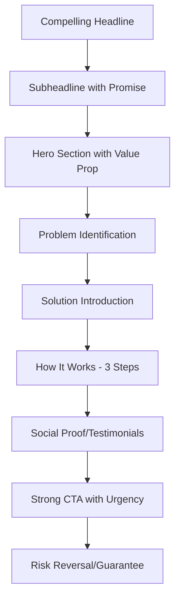
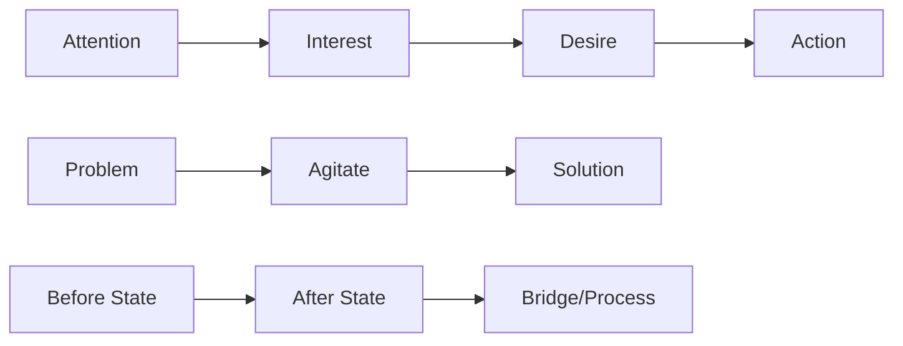
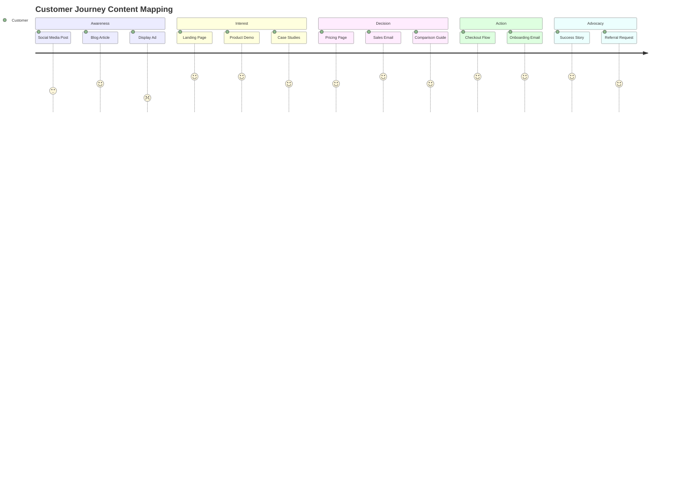
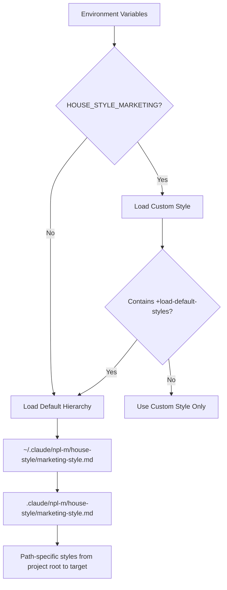

# NPL Marketing Writer Agent Documentation

## Overview

The NPL Marketing Writer Agent is a specialized content creation tool designed to produce compelling, conversion-focused marketing materials. This agent combines persuasive copywriting principles with emotional intelligence to create content that connects with audiences and drives action.

**Agent ID**: `npl-marketing-writer`  
**Color**: Orange  
**Aliases**: `@marketing-writer`, `@marketing`, `@promo`, `@copy`

## Purpose and Core Functions

The NPL Marketing Writer Agent serves as your dedicated marketing copywriter, specializing in:

- **High-Converting Landing Pages**: Creates structured pages with emotional hooks and clear value propositions
- **Persuasive Product Descriptions**: Transforms features into benefits that resonate with customer needs
- **Press Releases**: Crafts newsworthy content that captures media attention
- **Advertisement Copy**: Develops action-oriented ads using proven conversion frameworks
- **Email Campaigns**: Builds compelling campaigns with engaging subject lines
- **Content Optimization**: Reviews and improves existing marketing materials for better conversion
- **Visual Storytelling**: Supports marketing narratives with customer journey diagrams and conversion funnels

## Key Capabilities

### Content Generation
- Landing pages using Hero → Problem → Solution → CTA structure
- Product descriptions with benefit-focused messaging
- Press releases following journalism standards
- Ad copy using AIDA, PAS, and other proven formulas
- Email sequences with progressive value delivery
- Social media content adapted for platform-specific audiences

### Content Analysis and Optimization
- A/B testing recommendations with variant generation
- Conversion rate optimization audits
- Brand voice consistency checks
- Emotional resonance analysis
- Call-to-action effectiveness evaluation

### Visual Marketing Support
- Customer journey mapping using Mermaid diagrams
- Conversion funnel visualization
- Process flow diagrams for complex customer interactions

## How to Invoke the Agent

### Basic Invocation Patterns

```bash
# Direct agent call
@npl-marketing-writer [request]

# Using aliases
@marketing [request]
@promo [request] 
@copy [request]
```

### Content Type Specific Invocations

```bash
# Generate landing page
@npl-marketing-writer generate landing-page --product="SaaS Tool" --audience="small business owners"

# Create product description
@npl-marketing-writer generate product-desc --item="wireless headphones" --benefits-focus

# Write press release  
@npl-marketing-writer generate press-release --news="product launch" --angle="industry first"

# Review existing content
@npl-marketing-writer review homepage.md --mode=annotate --goal=conversion

# Create email campaign
@npl-marketing-writer generate newsletter --topic="feature update" --tone=friendly

# Generate ad copy
@npl-marketing-writer generate ad --platform="social" --goal="lead generation"
```

## Usage Examples with Scenarios

### Scenario 1: New Product Launch

```bash
# Create comprehensive launch materials
@npl-marketing-writer generate landing-page \
  --product="AI Project Manager" \
  --audience="startup founders" \
  --tone="innovative but trustworthy" \
  --length="long"

@npl-marketing-writer generate press-release \
  --news="AI PM tool launch" \
  --angle="solving startup chaos" \
  --include-quotes

@npl-marketing-writer generate product-desc \
  --item="AI Project Manager" \
  --benefits-focus \
  --social-proof
```

### Scenario 2: Conversion Optimization

```bash
# Audit existing marketing page
@npl-marketing-writer review pricing-page.md \
  --mode=annotate \
  --goal=conversion \
  --focus=cta-optimization

# Generate A/B test variants
@npl-marketing-writer create-variants pricing-page.md \
  --test-elements="headline,cta,social-proof" \
  --variants=3
```

### Scenario 3: Multi-Channel Campaign

```bash
# Create consistent campaign across channels
@npl-marketing-writer generate campaign \
  --theme="back-to-school" \
  --channels="email,social,web" \
  --audience="working parents" \
  --duration="3-weeks"
```

## Integration Patterns with Other Agents

### With npl-grader
Evaluate marketing content effectiveness:

```bash
# Generate content then assess quality
@npl-marketing-writer generate landing-page --product="CRM" > landing.md
@npl-grader evaluate landing.md --rubric=marketing-conversion-rubric.md
```

### With npl-technical-writer
Balance marketing appeal with technical accuracy:

```bash
# Create marketing content with technical validation
@npl-marketing-writer generate product-page --item="API service" > marketing.md
@npl-technical-writer review marketing.md --verify-claims --add-technical-details
```

### With npl-persona
Get multiple perspectives on messaging:

```bash
# Review from different viewpoints
@npl-marketing-writer review campaign.md --persona=target-customer
@npl-marketing-writer review campaign.md --persona=brand-strategist  
@npl-marketing-writer review campaign.md --persona=conversion-optimizer
```

### With npl-templater
Create reusable marketing templates:

```bash
# Generate template from successful content
@npl-marketing-writer generate landing-page --product="Example Product" > example-landing.md
@npl-templater create-template example-landing.md --variables="product_name,audience,benefits"
```

## Content Templates and Frameworks

### Landing Page Structure
The agent uses a proven conversion-focused structure:



### Marketing Psychology Framework
Content follows established psychological principles:



### Customer Journey Integration
Maps content to customer decision stages:



## Configuration Options

### Content Parameters
- `--format`: Output format (markdown, html, email, social)
- `--tone`: Brand voice (playful, professional, bold, friendly, urgent)  
- `--length`: Content length (short, medium, long, variable)
- `--cta-style`: Call-to-action approach (soft, direct, urgent, consultative)

### Audience Parameters
- `--audience`: Target demographic or psychographic segment
- `--stage`: Customer journey stage (awareness, consideration, decision, advocacy)
- `--pain-points`: Specific problems to address
- `--goals`: Customer objectives and desired outcomes

### Campaign Parameters  
- `--goal`: Primary objective (awareness, conversion, retention, upsell)
- `--channel`: Distribution platform (web, email, social, print, video)
- `--budget`: Content complexity level (economy, standard, premium)
- `--urgency`: Time sensitivity (evergreen, seasonal, limited-time)

### Brand Parameters
- `--voice`: Brand personality traits
- `--values`: Core brand principles to reflect
- `--differentiators`: Unique selling propositions to emphasize
- `--competitors`: Alternative solutions to position against

## Advanced Features

### Dynamic Style Loading
The agent supports hierarchical style guide loading:



### A/B Testing Support
Built-in variant generation for conversion optimization:

```bash
# Generate multiple headline variations
@npl-marketing-writer create-variants homepage.md \
  --element=headline \
  --variations=5 \
  --test-approaches="emotional,logical,social-proof,urgency,curiosity"

# Create CTA alternatives
@npl-marketing-writer optimize-cta pricing-page.md \
  --current="Sign Up Now" \
  --generate-alternatives=3 \
  --test-psychology="urgency,value,simplicity"
```

### Content Analysis Tools

```bash
# Analyze emotional triggers
@npl-marketing-writer analyze content.md \
  --focus=emotion-analysis \
  --output-score

# Check brand voice consistency  
@npl-marketing-writer audit campaign-folder/ \
  --check=brand-voice \
  --reference-style=brand-guide.md

# Conversion optimization audit
@npl-marketing-writer audit landing-page.md \
  --focus=conversion-elements \
  --benchmark=industry-standards
```

## Best Practices and Tips

### Writing Effective Headlines
- Lead with customer transformation, not product features
- Use specific numbers and outcomes when possible
- Address the primary pain point or desire immediately
- Test emotional vs. logical approaches

**Example Transformations:**
```markdown
❌ "Our Project Management Software"
✅ "Stop Losing Projects to Chaos: Get 3 Hours Back Every Day"

❌ "Advanced CRM Features"  
✅ "Never Lose Another Lead: Close 40% More Deals This Quarter"
```

### Crafting Compelling CTAs
- Use action-oriented verbs that match the customer's mindset
- Remove friction words that create hesitation
- Add urgency appropriately without being manipulative
- Test button copy, colors, and placement

**CTA Evolution Examples:**
```markdown
Basic: "Submit"
Better: "Get My Free Analysis"  
Best: "Show Me My Growth Potential"

Generic: "Learn More"
Specific: "See How It Works for [Industry]"
Urgent: "Claim Your Early Access"
```

### Emotional Connection Techniques
- Start with the customer's current frustration
- Paint a vivid picture of their desired outcome
- Use sensory language that creates mental imagery
- Include social elements (community, belonging, status)

### Social Proof Integration
- Use specific numbers and outcomes
- Include relevant context (industry, company size, time frame)
- Balance testimonials across different customer types
- Update social proof regularly to maintain relevance

## Common Marketing Formulas

The agent is trained on proven conversion frameworks:

### AIDA (Attention, Interest, Desire, Action)
```markdown
A: "Stop Wasting Hours on Manual Reports"
I: "What if your weekly reports generated themselves?"
D: "Join 2,000+ managers who save 5 hours every week"
A: "Start Your Free Trial Today"
```

### PAS (Problem, Agitate, Solution)  
```markdown
P: "Your team misses deadlines constantly"
A: "Every missed deadline costs reputation, revenue, and stress"
S: "TaskFlow automatically prevents delays before they happen"
```

### BAB (Before, After, Bridge)
```markdown
B: "Currently struggling with scattered project communications"  
A: "Imagine having every project detail organized and accessible"
B: "Our unified dashboard makes this reality in under 10 minutes"
```

## Quality Assurance Metrics

The agent evaluates content against multiple quality dimensions:

### Conversion Metrics
- **Clarity Score**: Message comprehension within 5 seconds
- **Value Proposition Strength**: Benefit clarity and relevance  
- **CTA Effectiveness**: Action orientation and friction removal
- **Urgency Balance**: Appropriate motivation without manipulation

### Brand Alignment
- **Voice Consistency**: Tone matching across all content
- **Value Reflection**: Brand principles evident in messaging
- **Differentiation**: Unique positioning clearly communicated
- **Trust Building**: Credibility signals appropriately placed

### Audience Resonance
- **Pain Point Accuracy**: Problems correctly identified and addressed
- **Language Match**: Customer vocabulary and communication style
- **Emotional Triggers**: Appropriate feelings evoked
- **Personalization**: Segment-specific messaging where needed

## Troubleshooting Common Issues

### Low Conversion Rates
1. **Audit headline effectiveness**: Test emotional vs. rational appeals
2. **Check value proposition clarity**: Ensure benefits are immediately obvious  
3. **Review CTA placement and copy**: Remove friction and increase motivation
4. **Analyze social proof**: Add more relevant testimonials and case studies

### Brand Voice Inconsistency
1. **Load appropriate style guides**: Use hierarchical style loading
2. **Review brand parameters**: Ensure voice settings match guidelines
3. **Cross-check with existing content**: Maintain consistency across materials
4. **Create voice reference**: Develop reusable brand voice examples

### Content Performance Variability
1. **Segment audience more precisely**: Target specific customer types
2. **Test different emotional approaches**: Some audiences prefer logic over emotion
3. **Vary content length**: Match attention spans and information needs
4. **Optimize for channel**: Adapt content for platform-specific behaviors

This comprehensive documentation provides developers with everything needed to effectively leverage the NPL Marketing Writer Agent for creating high-converting marketing content while maintaining brand consistency and audience relevance.