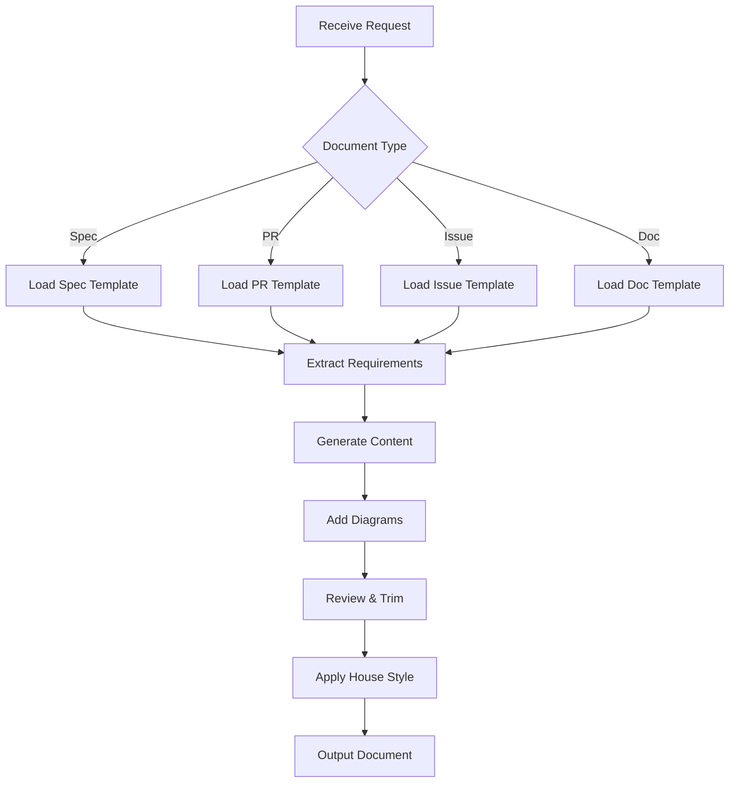
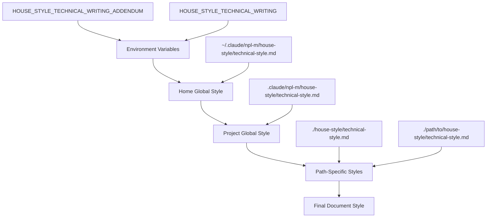
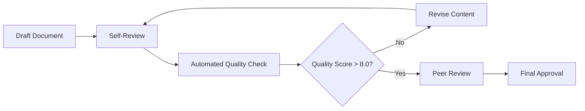

# NPL Technical Writer Agent Documentation

## Overview

The `npl-technical-writer` agent is a specialized technical documentation generator designed to produce clear, concise, and actionable technical content. Unlike typical AI-generated text, this agent actively avoids "LLM speak syndrome" by eliminating marketing language, unnecessary qualifiers, and verbose explanations in favor of direct, precise technical communication.

## Purpose and Core Value Proposition

This agent addresses a critical need in technical documentation: creating content that developers can immediately act upon without wading through marketing fluff or redundant explanations. It generates specifications, pull request descriptions, GitHub issues, API documentation, and README files that prioritize clarity and technical accuracy over verbosity.

## Key Capabilities

### Document Generation
- **Technical Specifications**: Structured requirement documents with clear acceptance criteria
- **Pull Request Descriptions**: Focused on what changed and why, with testing checklists
- **GitHub Issues**: Complete with reproduction steps and environment details
- **API Documentation**: Examples, schemas, and precise endpoint specifications
- **README Files**: Essential information only, no marketing content
- **Architecture Documentation**: With integrated visual diagrams

### Content Enhancement Features
- **Visual Diagrams**: Native support for Mermaid and PlantUML diagrams
- **Inline Annotations**: Document review capabilities with specific improvement suggestions
- **Template-Driven Generation**: Consistent structure across document types
- **House Style Integration**: Customizable style guide loading system

### Writing Quality Assurance
- **Anti-Pattern Detection**: Actively removes common LLM verbosity patterns
- **Technical Precision**: Uses exact terminology and version numbers
- **Structured Validation**: Built-in rubric system for document quality

## Agent Invocation

### Basic Syntax
```bash
@npl-technical-writer <command> [options]
```

### Available Commands
- `spec` - Generate technical specifications
- `pr` - Create pull request descriptions  
- `issue` - Write GitHub issues
- `doc` - Generate general documentation
- `readme` - Create README files
- `api-doc` - Generate API documentation
- `annotate` - Add inline feedback to existing documents
- `review` - Perform document review and editing

## Usage Examples

### Generate Technical Specification
```bash
# Basic specification generation
@npl-technical-writer spec --component=user-authentication

# Specification with specific format
@npl-technical-writer spec --component=payment-gateway --format=markdown --diagrams=mermaid
```

### Create Pull Request Description
```bash
# PR description from changed files
@npl-technical-writer pr --changes="src/auth.js,test/auth.test.js,docs/auth.md"

# PR description with context
@npl-technical-writer pr --branch=feature/oauth-integration --target=main
```

### Generate GitHub Issue
```bash
# Bug report generation
@npl-technical-writer issue --type=bug --component=login-form

# Feature request
@npl-technical-writer issue --type=feature --component=user-dashboard
```

### Create API Documentation
```bash
# From OpenAPI specification
@npl-technical-writer api-doc --source=openapi.yaml --format=markdown

# From code annotations
@npl-technical-writer api-doc --source=src/api/ --scan-comments=true
```

### Document Review and Annotation
```bash
# Add inline annotations for improvement
@npl-technical-writer annotate docs/architecture.md --mode=suggestions

# Full document review with rewrite recommendations
@npl-technical-writer review README.md --mode=rewrite --focus=clarity
```

### README Generation
```bash
# Basic README for project
@npl-technical-writer readme --project-type=nodejs --include-setup=true

# README with specific sections
@npl-technical-writer readme --sections="overview,installation,usage,api"
```

## Document Generation Workflow

The agent follows a systematic approach to document creation:



## Configuration and Customization

### Environment Variables
```bash
# House style configuration
export HOUSE_STYLE_TECHNICAL_WRITING="/path/to/style-guide.md"
export HOUSE_STYLE_TECHNICAL_WRITING_ADDENDUM="/path/to/addendum.md"

# Document type templates
export DOCUMENT_TYPE="api-spec"  # Loads specific template
```

### Command Line Options

#### Output Parameters
- `--format`: Output format (`markdown`, `html`, `pdf`)
- `--style`: Writing style (`technical`, `tutorial`, `reference`)
- `--diagrams`: Include diagrams (`mermaid`, `plantuml`, `both`, `none`)
- `--verbose`: Additional detail level
- `--annotate`: Enable annotation mode

#### Review Parameters
- `--mode`: Review mode (`annotate`, `rewrite`, `suggest`)
- `--focus`: Review focus (`clarity`, `completeness`, `accuracy`)
- `--preserve`: Elements to keep unchanged

### House Style System

The agent supports a hierarchical house style loading system:



#### Style Guide Precedence
1. Environment variable addendum (highest priority)
2. Environment variable override
3. Home global style (`~/.claude/npl-m/house-style/technical-style.md`)
4. Project global style (`.claude/npl-m/house-style/technical-style.md`)
5. Path-specific styles (loaded from project root toward target)

## Integration Patterns

### With npl-grader Agent
Generate and immediately evaluate documentation quality:
```bash
# Generate then evaluate
@npl-technical-writer generate readme --output=README.md
@npl-grader evaluate README.md --rubric=tech-doc-rubric.md

# Pipeline approach
@npl-technical-writer spec --component=auth | @npl-grader evaluate --rubric=spec-rubric.md
```

### With npl-persona Agent
Create specialized technical writing perspectives:
```bash
# Multiple reviewer perspectives
@npl-technical-writer review spec.md --persona=senior-architect
@npl-technical-writer review spec.md --persona=security-expert
@npl-technical-writer review spec.md --persona=qa-engineer
```

### With npl-thinker Agent
Complex analysis and optimization:
```bash
# Analyze document effectiveness
@npl-thinker analyze "effectiveness of technical specification structure"
@npl-technical-writer spec --component=auth --apply-analysis

# Optimize documentation strategy
@npl-thinker plan "documentation strategy for microservices architecture"
@npl-technical-writer generate-suite --strategy=microservices
```

### With npl-templater Agent
Create reusable documentation templates:
```bash
# Generate project-specific templates
@npl-templater create --type=spec-template --project=ecommerce
@npl-technical-writer spec --template=ecommerce-template --component=payment
```

## Advanced Usage Scenarios

### Multi-Document Generation
```bash
# Generate complete documentation suite for a feature
@npl-technical-writer generate-suite \
  --component=user-management \
  --documents="spec,api-doc,readme" \
  --format=markdown \
  --diagrams=mermaid
```

### Batch Processing
```bash
# Process multiple files for review
find docs/ -name "*.md" | xargs -I {} @npl-technical-writer review {} --mode=annotate

# Update all API documentation
@npl-technical-writer api-doc \
  --source-dir=src/api/ \
  --output-dir=docs/api/ \
  --batch-mode=true
```

### Custom Template Integration
```bash
# Use custom templates
@npl-technical-writer spec \
  --template-file=.templates/microservice-spec.md \
  --component=notification-service
```

## Document Templates and Structures

### Technical Specification Template
```markdown
# [Component/Feature Name]

## Overview
[One sentence description]

## Requirements
- [Specific requirement 1]
- [Specific requirement 2]

## Technical Details
### Architecture
[Mermaid/PlantUML diagram]

### Implementation
- Technology: [exact versions]
- Dependencies: [list with versions]
- Constraints: [technical/business constraints]

## Acceptance Criteria
- [ ] [Testable criterion 1]
- [ ] [Testable criterion 2]

## Security Considerations
[If applicable]

## Performance Requirements
[If applicable]
```

### Pull Request Description Template
```markdown
## Changes
- `src/auth.js`: Implement OAuth2 flow with PKCE
- `test/auth.test.js`: Add comprehensive OAuth2 tests
- `docs/auth.md`: Update authentication documentation

## Reason
Replace deprecated password-only authentication with OAuth2 for improved security.

## Testing
- [ ] Unit tests pass (47/47)
- [ ] Integration tests pass (12/12)
- [ ] Manual testing completed
- [ ] Security review completed

## Breaking Changes
- `AuthService.login()` now requires OAuth2 token instead of username/password
- Environment variable `OAUTH_CLIENT_ID` now required
```

### GitHub Issue Template
```markdown
## Problem
Authentication fails when using special characters in username.

## Steps to Reproduce
1. Navigate to login page
2. Enter username with special characters (e.g., "user@domain.com")
3. Enter valid password
4. Click "Login" button
5. Observe error message

## Expected Behavior
User should be authenticated successfully with valid credentials.

## Actual Behavior
Error message: "Invalid characters in username" appears.

## Environment
- Version: 2.1.4
- OS: Ubuntu 20.04 LTS
- Browser: Chrome 118.0.5993.88
- Dependencies: express@4.18.2, bcrypt@5.1.0

## Possible Solution
Update username validation regex to allow email format and common special characters.
```

## Writing Principles and Anti-Patterns

### Direct Communication Guidelines
✅ **Good Examples:**
- "The system validates input data"
- "Authentication requires OAuth2 tokens"
- "Response time must not exceed 200ms"

❌ **Anti-Patterns to Avoid:**
- "Certainly, the system can validate input data"
- "It's worth noting that authentication requires tokens"
- "Interestingly, response time should ideally be under 200ms"

### Technical Precision Requirements
✅ **Specific and Actionable:**
- "Node.js 18.17.0 or higher required"
- "Install dependencies: `npm install express@4.18.2`"
- "Configure environment variable: `DATABASE_URL=postgresql://...`"

❌ **Vague and Unusable:**
- "Recent version of Node.js recommended"
- "Install the necessary dependencies"
- "Set up your database connection"

## Quality Assurance Features

### Built-in Document Rubric
The agent evaluates documents against these criteria:

1. **Clarity**: Direct, unambiguous language without jargon
2. **Completeness**: All required sections and information present
3. **Brevity**: No unnecessary content or redundant explanations
4. **Technical Accuracy**: Correct terminology, versions, and specifications
5. **Usability**: Actionable information that enables implementation

### Automated Content Review
```bash
# Enable automatic quality checking
@npl-technical-writer spec --component=auth --auto-review=true --quality-threshold=8.5
```

## Best Practices

### Document Structure
1. **Start with structure**: Define all sections before writing content
2. **Lead with essentials**: Most important information first
3. **Use hierarchical organization**: Clear heading structure
4. **Include examples**: Show, don't just describe
5. **Provide context**: Link to related specifications and standards

### Content Guidelines
1. **Version everything**: Include exact version numbers for all dependencies
2. **Test readability**: Ensure someone can implement from the document
3. **Diagram complex flows**: Visual representations over verbose descriptions
4. **Edit ruthlessly**: Remove any word that adds no value
5. **Maintain consistency**: Use templates and house styles

### Review Workflow


## Troubleshooting

### Common Issues

#### "Template not found" Error
```bash
# Check template availability
ls .claude/npl/templates/
# Specify custom template
@npl-technical-writer spec --template=custom-spec.md
```

#### House Style Not Loading
```bash
# Verify style guide paths
export HOUSE_STYLE_TECHNICAL_WRITING_DEBUG=true
@npl-technical-writer spec --component=test

# Check file permissions
ls -la ~/.claude/npl-m/house-style/technical-style.md
```

#### Output Quality Issues
```bash
# Enable verbose debugging
@npl-technical-writer spec --component=auth --debug=true --verbose=true

# Force specific quality checks
@npl-technical-writer review output.md --focus=clarity,brevity
```

## Performance Considerations

### Large Document Handling
- Documents over 50KB are processed in chunks
- Automatic pagination for multi-section specifications
- Memory-efficient processing for batch operations

### Caching and Optimization
- Template caching for repeated document generation
- House style caching for performance
- Incremental updates for large document suites

## Extension and Customization

### Custom Document Types
Create new document types by adding templates:
```bash
# Add custom template
mkdir -p .claude/npl/templates/
cp my-custom-template.md .claude/npl/templates/custom-doc.md

# Use custom template
@npl-technical-writer generate --document-type=custom-doc --component=my-feature
```

### Integration Hooks
The agent supports pre and post-processing hooks:
```bash
# Pre-processing hook
export NPL_WRITER_PRE_HOOK="/scripts/prepare-content.sh"

# Post-processing hook  
export NPL_WRITER_POST_HOOK="/scripts/finalize-document.sh"
```

## Conclusion

The npl-technical-writer agent represents a focused approach to technical documentation that prioritizes clarity, precision, and actionability over verbosity. By actively avoiding common AI writing pitfalls and maintaining strict quality standards, it produces documentation that developers can immediately use to understand, implement, and maintain technical systems.

The agent's integration with the broader NPL ecosystem allows for sophisticated workflows combining generation, review, and quality assurance while maintaining the flexibility to adapt to different organizational styles and requirements through the house style system.