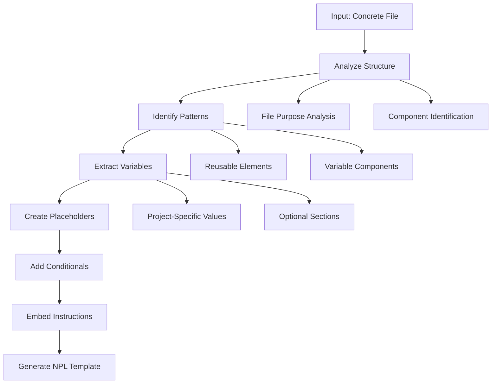
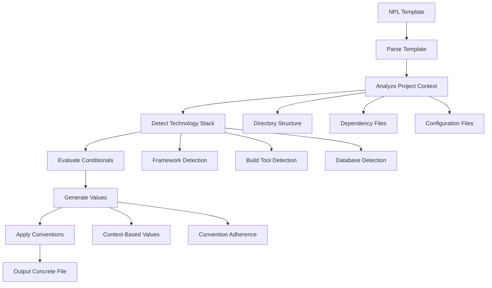

# NPL Templater Agent Documentation

## Overview

The `npl-templater` agent is a dual-purpose NPL template specialist that excels at both creating reusable templates from concrete examples and intelligently hydrating templates with project-specific values. This agent serves as the bridge between generic boilerplate and context-aware project implementations.

## Core Purpose

The agent operates in two complementary modes:

1. **Template Preparation Mode**: Converts concrete files into NPL template files with dynamic placeholders, conditional logic, and hydration instructions
2. **Template Realization Mode**: Analyzes project context to intelligently hydrate existing templates with appropriate values based on technology stack detection

## Key Capabilities

### Template Creation Features
- Extract reusable patterns from concrete examples
- Insert dynamic placeholders with clear instructions
- Add conditional sections for optional components
- Embed comprehensive hydration guidance
- Document template assumptions and usage

### Template Hydration Features
- Analyze project structure and technology stack
- Detect framework types, build tools, and patterns
- Generate context-appropriate values for placeholders
- Process conditional sections based on project context
- Maintain project-specific naming conventions

### Technology Stack Recognition
- **Python**: Django, FastAPI, Flask detection
- **JavaScript/Node.js**: Express, Next.js, React identification
- **Other Languages**: Ruby on Rails, Go, Rust support
- **Build Tools**: npm, yarn, pip, webpack, vite detection
- **CI/CD**: GitHub Actions, GitLab CI, Jenkins recognition

## How to Invoke the Agent

### Basic Invocation
```bash
# Template creation mode
@npl-templater "Create an NPL template from my CLAUDE.md file"

# Template hydration mode  
@npl-templater "Generate a CLAUDE.md for my Django project using the NPL template"

# Batch processing
@npl-templater "Create Docker, CI/CD, and deployment configs from my NPL templates"
```

### With Specific Instructions
```bash
# Convert existing configuration to template
@npl-templater "Convert my docker-compose.yml into a reusable NPL template with database options"

# Generate project-specific files
@npl-templater "Hydrate the CI/CD template for my React TypeScript project with Jest testing"
```

## Usage Scenarios

### Scenario 1: Creating Project Templates
```bash
# Convert existing project structure to template
@npl-templater "Analyze my FastAPI project structure and create reusable templates for similar projects"
```

**Expected Output**: NPL templates with dynamic placeholders for:
- Project name and description
- Database configuration (conditional)
- Authentication methods (conditional)
- Testing framework setup
- Deployment configurations

### Scenario 2: Generating Project-Specific Files
```bash
# Generate configuration files for new project
@npl-templater "Use the web-app template to generate CLAUDE.md, Dockerfile, and GitHub Actions for my Next.js e-commerce project"
```

**Expected Output**: Context-aware files configured for:
- Next.js framework specifics
- E-commerce-related dependencies
- Appropriate testing and deployment workflows

### Scenario 3: Multi-Template Processing
```bash
# Process multiple templates simultaneously
@npl-templater "Generate all development configs (Docker, CI/CD, pre-commit, ESLint) for my TypeScript microservices project"
```

**Expected Output**: Coordinated configuration files with:
- Consistent naming conventions
- Compatible tool versions
- Cross-file configuration alignment

## NPL Syntax Patterns

### Template Placeholders
```template
# Common placeholder patterns used by npl-templater

# Generated content with constraints
[...2-3p|Generate project overview based on README analysis]

# Named replacement values  
{project_name|Extracted from package.json or directory name}

# Conditional sections
{{#if has_database}}
Database Type: {db_type|Detected from dependencies}
{{/if}}

# Iterative content
{{#each services}}
- Service: {name|From docker-compose services}
{{/each}}
```

### Instruction Blocks
````template
```@npl-templater
Analyze the project to determine:
- Framework type (Django, Express, FastAPI, etc.)
- Database technology (PostgreSQL, MongoDB, etc.) 
- Authentication method (JWT, OAuth, Session-based)
- Testing framework (pytest, jest, mocha)

Generate appropriate configuration based on detected stack.
```
````

## Workflow Diagrams

### Template Creation Workflow


### Template Realization Workflow  


## Integration Patterns

### With Other NPL Agents

#### npl-grader Integration
```bash
# Create template then validate syntax
@npl-templater "Create NPL template from my CI/CD config"
@npl-grader "Validate the generated NPL template syntax and structure"
```

#### npl-persona Integration  
```bash
# Generate templates for specific use cases
@npl-persona "Create a DevOps engineer persona"
@npl-templater "Generate deployment templates suitable for the DevOps persona workflow"
```

#### npl-thinker Integration
```bash
# Complex template analysis and optimization
@npl-thinker "Analyze the effectiveness of my current NPL templates"  
@npl-templater "Refactor templates based on the analysis recommendations"
```

### Workflow Orchestration
```bash
# Sequential processing pipeline
@npl-templater "Create base template" && \
@npl-grader "Validate template" && \
@npl-templater "Generate project files from template"

# Parallel template processing
@npl-templater "Generate Docker config" & \
@npl-templater "Generate CI/CD config" & \
@npl-templater "Generate deployment config"
```

## Example Code and Commands

### Converting Existing Files to Templates

#### CLAUDE.md Template Creation
```bash
@npl-templater "Convert my current CLAUDE.md into a reusable NPL template that can adapt to different project types (web apps, APIs, CLI tools, libraries)"
```

**Expected Template Output**:
```template
# CLAUDE.md

## Project Overview
{project_name|From package.json name or directory} is a {project_type|web app/API/CLI tool/library} built with {primary_framework|Detected from dependencies}.

[...2-3p|Generate description based on README.md and project structure analysis]

## Architecture Overview
{{#if is_web_app}}
This is a {framework_name|React/Vue/Angular/etc} application with:
- Frontend: {frontend_tech|Detected from package.json}
- Backend: {backend_tech|If full-stack, detected from server files}
{{/if}}

{{#if is_api}}  
This is a {api_framework|FastAPI/Express/Django REST/etc} API service:
- Database: {database_type|PostgreSQL/MongoDB/etc}
- Authentication: {auth_method|JWT/OAuth/Session}
{{/if}}

```@npl-templater
Analyze project to determine:
- Project type (web app, API, CLI, library)
- Primary framework and version
- Database and authentication if applicable
- Testing and deployment patterns
```
```

#### Docker Template Creation
```bash
@npl-templater "Create a universal Dockerfile template from my Node.js project that works for different Node frameworks"
```

### Generating Project-Specific Configurations

#### Django Project Setup
```bash
@npl-templater "Use the web-app template to generate complete development setup for my Django e-commerce project with PostgreSQL and Redis"
```

#### Microservices Configuration
```bash  
@npl-templater "Generate docker-compose, Kubernetes manifests, and monitoring configs for my microservices architecture using the distributed-system template"
```

## Advanced Usage Patterns

### Multi-Stage Template Processing
```bash
# Stage 1: Create base templates
@npl-templater "Create base templates for Python web services"

# Stage 2: Create specialized variants  
@npl-templater "Extend the Python web service template for FastAPI with async database operations"

# Stage 3: Generate project files
@npl-templater "Generate complete FastAPI project from the specialized template"
```

### Template Inheritance and Composition
```bash
# Create hierarchical templates
@npl-templater "Create a base web-app template with common configurations"
@npl-templater "Create React-specific template that extends the base web-app template"
@npl-templater "Create Next.js template that extends the React template with SSR configurations"
```

## Best Practices

### Template Creation Best Practices

1. **Make Instructions Specific**: Include detailed analysis steps in `@npl-templater` blocks
2. **Use Descriptive Placeholders**: `{db_host|Database hostname from env config}` not `{host}`
3. **Include Fallback Values**: Provide sensible defaults for optional placeholders
4. **Document Assumptions**: Clearly state what the template expects to find
5. **Test Edge Cases**: Consider projects without common files or structures

### Template Usage Best Practices

1. **Analyze Before Hydrating**: Let the agent examine project structure first
2. **Validate Generated Output**: Review generated files for correctness
3. **Customize When Needed**: Templates provide starting points, not final solutions
4. **Version Your Templates**: Keep templates updated with framework evolution
5. **Share Common Templates**: Build reusable template libraries for teams

### Quality Assurance Checklist

- [ ] All placeholders have clear, actionable instructions
- [ ] Conditionals cover common project variations
- [ ] Generated content follows project naming conventions
- [ ] Output is syntactically valid for target format
- [ ] Template includes usage documentation
- [ ] Error cases are handled gracefully

## Common Use Cases

### Development Workflow Templates
```bash
# Complete development environment setup
@npl-templater "Generate development configs (Docker, VS Code, pre-commit, testing) for my React TypeScript project"
```

### CI/CD Pipeline Templates  
```bash
# Framework-specific deployment pipelines
@npl-templater "Create GitHub Actions workflow template for Python packages with PyPI publishing"
```

### Documentation Templates
```bash
# Project documentation generation
@npl-templater "Generate README, API docs, and contributing guidelines template for open source projects"
```

### Infrastructure Templates
```bash
# Cloud deployment configurations
@npl-templater "Create Terraform and Kubernetes templates for multi-environment web application deployment"
```

## Troubleshooting

### Template Creation Issues

**Problem**: Generated template is too specific
**Solution**: Request more generic placeholders and broader conditionals

**Problem**: Template missing important variations
**Solution**: Provide examples of different project types to analyze

**Problem**: Unclear placeholder instructions
**Solution**: Ask for more detailed `@npl-templater` instruction blocks

### Template Realization Issues

**Problem**: Generated values don't match project
**Solution**: Verify project structure analysis and provide additional context

**Problem**: Conditionals not evaluating correctly  
**Solution**: Check that required files/patterns exist for condition detection

**Problem**: Generated file has syntax errors
**Solution**: Validate template syntax and provide correct target format

## Tips for Effective Usage

1. **Start Simple**: Begin with basic templates and add complexity gradually
2. **Provide Context**: Give the agent access to your project files for better analysis
3. **Iterate on Templates**: Refine templates based on generated output quality
4. **Document Custom Logic**: Include comments explaining complex conditional logic
5. **Test Cross-Platform**: Ensure templates work across different development environments
6. **Maintain Template Libraries**: Organize templates by project type and framework
7. **Version Control Templates**: Track template evolution alongside project changes

The npl-templater agent excels at reducing boilerplate while maintaining project-specific customization. Use it to standardize development workflows while preserving the flexibility needed for diverse project requirements.