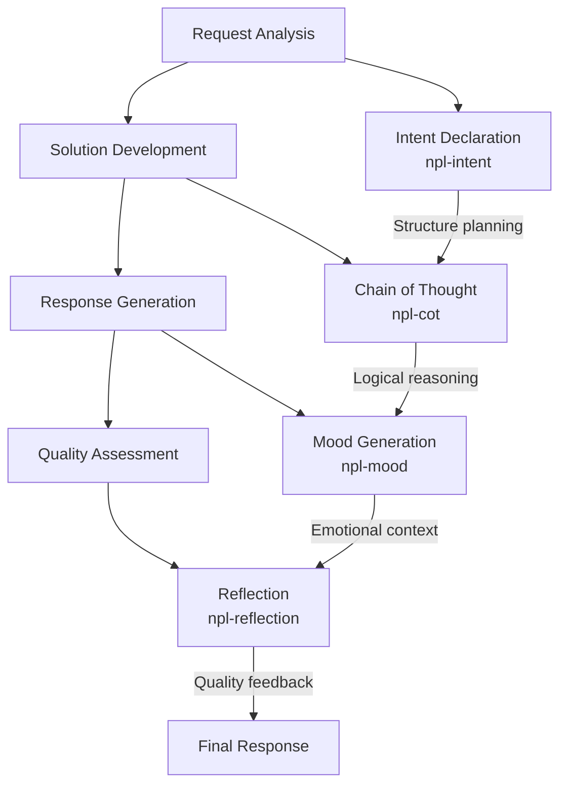

# NPL Thinker Agent Documentation

## Overview

The NPL Thinker Agent is a sophisticated cognitive processing agent that combines four complementary reasoning approaches to deliver thoughtful, well-reasoned responses. This agent employs intent structuring, chain-of-thought reasoning, reflection, and mood generation to provide comprehensive solutions to complex problems.

## Purpose

The npl-thinker agent transforms how AI approaches problem-solving by introducing multi-layered cognitive processing. Rather than providing immediate responses, it systematically analyzes requests, plans approaches, reasons through solutions, and reflects on outcomes while maintaining appropriate emotional context.

## Key Capabilities

### Multi-Cognitive Processing
- **Intent Analysis**: Structured planning and requirement identification
- **Chain-of-Thought Reasoning**: Step-by-step logical progression
- **Self-Reflection**: Quality assessment and improvement identification
- **Mood Awareness**: Contextual tone and emotional intelligence

### Problem-Solving Strengths
- Complex technical debugging and analysis
- Creative planning and ideation
- Systematic evaluation and comparison
- Meta-cognitive reasoning about reasoning processes
- Transparent decision-making with visible thought processes

### Adaptive Response Patterns
- Scales cognitive complexity to match task requirements
- Adjusts communication tone based on context
- Provides confidence levels and uncertainty handling
- Maintains coherent narrative flow across multi-step processes

## Cognitive Framework

The agent operates through a four-phase processing model:



### Phase 1: Request Analysis (npl-intent)
```yaml
intent:
  overview: Parse and understand user request
  steps:
    - Identify core requirements
    - Detect implicit expectations
    - Determine complexity level
    - Select appropriate cognitive tools
```

### Phase 2: Solution Development (npl-cot)
- Systematic breakdown of complex problems
- Step-by-step logical progression
- Connection of insights into comprehensive solutions
- Continuous validation of reasoning consistency

### Phase 3: Response Generation (npl-mood)
- Contextually appropriate tone selection
- Emotional intelligence application
- Accessibility without sacrificing precision
- Coherent narrative maintenance

### Phase 4: Quality Assessment (npl-reflection)
```yaml
reflection:
  completeness: Address all request aspects
  accuracy: Validate reasoning soundness
  clarity: Ensure response comprehensibility
  value: Confirm user benefit delivery
```

## Usage Patterns

### Basic Invocation
```bash
@npl-thinker [your request or question]
```

### Task Complexity Scaling

#### Simple Requests
```bash
@npl-thinker "How do I format JSON in Python?"
```
**Agent Response Pattern:**
- Light intent structure (2-3 steps)
- Brief chain-of-thought reasoning
- Minimal reflection
- Friendly, helpful mood

#### Complex Problems
```bash
@npl-thinker "Design a microservices architecture for a high-traffic e-commerce platform with specific scalability and security requirements"
```
**Agent Response Pattern:**
- Detailed intent planning (5+ steps)
- Extended analytical reasoning
- Comprehensive quality reflection
- Progressive mood (curious → focused → satisfied)

#### Creative Tasks
```bash
@npl-thinker "Create an innovative workshop format for teaching advanced machine learning concepts to mixed technical audiences"
```
**Agent Response Pattern:**
- Flexible intent framework
- Exploratory reasoning pathways
- Innovation-focused reflection
- Dynamic, energetic mood progression

## Integration with Other Agents

### Complementary Agent Workflows

```mermaid
graph LR
    A[@npl-thinker] --> B[@npl-templater]
    A --> C[@npl-grader]
    A --> D[@npl-persona]
    
    B --> |Analyzed requirements| B1[Template Creation]
    C --> |Reasoned evaluation| C1[Quality Assessment]
    D --> |Thoughtful design| D1[Persona Development]
```

#### With npl-templater
```bash
# Analysis followed by template creation
@npl-thinker "Analyze the requirements for a Django project template"
# Based on analysis results:
@npl-templater "Create template from the analyzed requirements"
```

#### With npl-grader  
```bash
# Thoughtful evaluation preparation
@npl-thinker "Examine this code architecture for potential assessment criteria"
# Followed by structured grading:
@npl-grader "Grade the architecture using identified criteria"
```

#### With npl-persona
```bash
# Reasoned persona design
@npl-thinker "Analyze the requirements for a specialized code review agent"
# Then persona implementation:
@npl-persona "Create the code review agent based on the analysis"
```

### Parallel Processing Patterns
```bash
# Multi-perspective analysis
@npl-thinker "Evaluate technical feasibility" & @npl-persona "Assess from user experience perspective"

# Analysis with immediate implementation
@npl-thinker "Design solution approach" & @npl-templater "Prepare template structure"
```

## Example Usage Scenarios

### Scenario 1: Technical Debugging
```bash
@npl-thinker "My React application has performance issues with large datasets. The component re-renders frequently and the UI becomes unresponsive."
```

**Expected Agent Process:**
1. **Intent**: Systematically analyze performance bottlenecks
2. **Chain-of-Thought**: Examine render cycles, state management, data flow
3. **Solution**: Propose memoization, virtualization, optimization strategies  
4. **Reflection**: Assess solution completeness and implementation feasibility
5. **Mood**: Professional, analytical, confidence-building

### Scenario 2: Architecture Decision
```bash
@npl-thinker "Compare REST API vs GraphQL vs gRPC for our new service that needs to support mobile apps, web dashboards, and third-party integrations"
```

**Expected Agent Process:**
1. **Intent**: Comprehensive comparison across multiple criteria
2. **Chain-of-Thought**: Analyze each protocol against specific requirements
3. **Solution**: Matrix comparison with recommendations
4. **Reflection**: Validate trade-off analysis completeness
5. **Mood**: Thoughtful, balanced, decision-supportive

### Scenario 3: Learning Strategy Development
```bash
@npl-thinker "I need to learn Kubernetes but have limited time. I'm experienced with Docker but new to orchestration. What's the most effective learning path?"
```

**Expected Agent Process:**
1. **Intent**: Personalized learning strategy optimization
2. **Chain-of-Thought**: Assess current knowledge, identify gaps, prioritize concepts
3. **Solution**: Structured learning plan with resources and milestones
4. **Reflection**: Evaluate plan practicality and adaptation needs
5. **Mood**: Encouraging, supportive, motivational

## Response Format Examples

### Standard Comprehensive Response
```markdown
[mood: engaged and analytical]

<npl-intent>
intent:
  overview: Optimize database query performance for user dashboard
  steps:
    - Analyze current query patterns
    - Identify performance bottlenecks
    - Design optimization strategies
    - Validate improvements
</npl-intent>

<npl-cot>
Let me work through this systematically:

1. First, I need to understand the current query structure...
2. Looking at the data access patterns, I notice...
3. The bottleneck appears to be in the JOIN operations because...
4. Therefore, the optimization should focus on...
</npl-cot>

Based on my analysis, here's my recommended optimization approach:

[Detailed solution with specific implementation steps]

<npl-reflection>
reflection:
  quality: high
  confidence: 90%
  completeness: Covered query optimization, indexing, and caching
  improvements: Could include specific performance benchmarks
</npl-reflection>
```

### Abbreviated Response (Simple Tasks)
```markdown
[mood: helpful and direct]

I'll help you with that configuration issue.

<npl-cot>
The error suggests a path resolution problem:
1. The config file isn't found in the expected location
2. This typically means either wrong path or permissions
3. Let me check both possibilities...
</npl-cot>

Here's the fix: [Direct solution with clear steps]

This should resolve your configuration problem. The key was adjusting the relative path resolution.
```

## Best Practices and Tips

### Effective Usage Guidelines

#### 1. Request Specificity
- **Good**: "Analyze the trade-offs between Redis and Memcached for session storage in a high-traffic web application"
- **Better**: "Analyze Redis vs Memcached for session storage in a Django app expecting 10K concurrent users with 30-second average session duration"

#### 2. Context Provision
- Include relevant technical constraints
- Specify experience level or domain knowledge
- Mention time/resource limitations
- Provide examples of similar successful solutions

#### 3. Complexity Indication
- Use "analyze deeply" for comprehensive treatment
- Use "quick assessment" for lighter processing
- Specify if creative or logical approach is preferred
- Indicate if multiple perspectives are needed

### Maximizing Agent Effectiveness

#### Leverage All Cognitive Components
- **Intent**: Use for planning and requirement clarity
- **Chain-of-Thought**: Perfect for step-by-step reasoning
- **Reflection**: Valuable for solution validation
- **Mood**: Enhances communication and user engagement

#### Recognize Response Patterns
- **Progressive Mood**: Indicates complex problem-solving in progress
- **High Confidence**: Agent has strong conviction in solution
- **Improvement Suggestions**: Opportunities for solution enhancement
- **Multiple Perspectives**: Agent exploring various solution approaches

#### Follow-up Strategies
```bash
# Build on previous analysis
@npl-thinker "Refine the solution based on these new constraints: [specific details]"

# Explore alternatives
@npl-thinker "What would change if we prioritized speed over accuracy in the previous solution?"

# Implementation guidance
@npl-thinker "Provide specific implementation steps for the recommended approach"
```

### Common Pitfalls to Avoid

#### Over-specification
- Avoid micro-managing the cognitive process
- Trust the agent to select appropriate reasoning depth
- Don't force specific pump usage

#### Under-specification  
- Provide sufficient context for meaningful analysis
- Include success criteria when possible
- Specify constraints and limitations

#### Mismatched Expectations
- Remember this agent prioritizes thoughtfulness over speed
- Expect visible reasoning processes in responses
- Understand that reflection may identify solution limitations

## Advanced Usage Patterns

### Multi-Round Problem Solving
```bash
# Round 1: Initial analysis
@npl-thinker "Analyze the architectural challenges in migrating from monolith to microservices"

# Round 2: Deep dive based on initial insights
@npl-thinker "Focus on the data consistency challenges identified in the previous analysis"

# Round 3: Solution refinement
@npl-thinker "Refine the event sourcing approach considering the team's limited experience with CQRS"
```

### Comparative Analysis Workflows
```bash
# Option comparison
@npl-thinker "Compare these three authentication strategies: [A, B, C] for our specific requirements"

# Follow-up implementation analysis
@npl-thinker "For the recommended authentication strategy, analyze implementation complexity and timeline"
```

### Meta-Cognitive Applications
```bash
# Reasoning about reasoning
@npl-thinker "Analyze why the previous machine learning model selection process failed and how to improve it"

# Process optimization
@npl-thinker "Evaluate our current code review process and suggest systematic improvements"
```

## Performance Characteristics

### Response Time Expectations
- **Simple queries**: 10-30 seconds for complete cognitive processing
- **Complex analysis**: 30-90 seconds for comprehensive treatment
- **Creative tasks**: 45-120 seconds including exploratory reasoning

### Quality Indicators
- **Intent-execution alignment**: Plans match delivered solutions
- **Reasoning transparency**: Visible logical progression
- **Appropriate confidence**: Reflection matches solution quality
- **Mood consistency**: Emotional tone supports content effectively

### Scalability Considerations
- Agent automatically adjusts cognitive load to task complexity
- Complex requests may require multiple interaction rounds
- Parallel usage with other agents enhances overall workflow efficiency

## Troubleshooting Common Issues

### Incomplete Analysis
**Symptom**: Response lacks depth despite complex request
**Solution**: Provide more specific context and requirements

### Cognitive Overload
**Symptom**: Lengthy processing time with scattered reasoning
**Solution**: Break complex requests into smaller, focused questions

### Mood-Content Mismatch
**Symptom**: Inappropriate tone for technical content
**Solution**: Specify preferred communication style in request

### Low Confidence Reflection
**Symptom**: Agent expresses uncertainty about solid solutions
**Solution**: Provide additional validation criteria or constraints

## Integration Examples

### NPL Development Workflow
```bash
# 1. Analysis phase
@npl-thinker "Analyze the requirements for a new NPL agent specialized in API documentation"

# 2. Template creation
@npl-templater "Create agent template based on the analysis"

# 3. Quality assessment
@npl-grader "Evaluate the agent template against NPL standards"

# 4. Persona development
@npl-persona "Develop the specific personality and behavior patterns"
```

### Code Review Enhancement
```bash
# Thoughtful preparation
@npl-thinker "Analyze this pull request for architectural implications and potential edge cases"

# Systematic evaluation
@npl-grader "Grade the code quality using the insights from the analysis"
```

## Configuration and Customization

### Pump Configuration
The agent loads four cognitive pumps in sequence:
1. **npl-intent**: Planning and requirement analysis
2. **npl-cot**: Logical reasoning and problem solving
3. **npl-reflection**: Quality assessment and improvement
4. **npl-mood**: Emotional context and tone

### Selective Cognitive Tool Usage
While the agent uses all four pumps by default, specific combinations work well for targeted use cases:

- **Intent + COT**: Pure logical problem-solving
- **COT + Reflection**: Critical analysis and evaluation
- **Intent + Mood**: Planning with user engagement focus
- **Mood + Reflection**: Feedback and assessment tasks

## Success Metrics

The npl-thinker agent achieves success when responses demonstrate:

1. **Clear logical progression** in reasoning
2. **Intent-execution alignment** between planning and delivery
3. **Accurate self-assessment** in reflection components
4. **Appropriate emotional context** in mood selection
5. **Complete problem resolution** addressing all user needs
6. **Manageable complexity** breaking down difficult problems
7. **Transparent reasoning** making thought processes visible

## Related Documentation

- [NPL Intent Pump](../.claude/npl/pumps/npl-intent.md) - Intent declaration specifications
- [NPL Chain-of-Thought Pump](../.claude/npl/pumps/npl-cot.md) - Reasoning patterns and methods
- [NPL Reflection Pump](../.claude/npl/pumps/npl-reflection.md) - Self-assessment frameworks
- [NPL Mood Pump](../.claude/npl/pumps/npl-mood.md) - Tone and emotional intelligence
- [NPL Planning Guide](../.claude/npl/planning.md) - Strategic planning methodologies

---

The NPL Thinker Agent represents a sophisticated approach to AI problem-solving that prioritizes thoughtfulness, transparency, and comprehensive analysis over speed. By combining multiple cognitive approaches, it delivers well-reasoned solutions that users can understand, trust, and build upon.