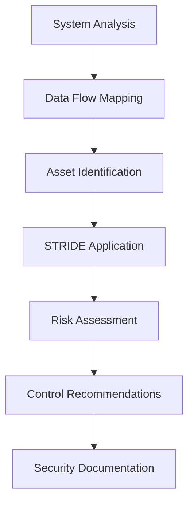

# NPL Threat Modeler Agent Documentation

## Overview

The NPL Threat Modeler Agent is a specialized defensive security analysis tool that helps organizations identify vulnerabilities, assess security risks, and design secure architectures using established threat modeling methodologies. This agent focuses exclusively on defensive security practices, providing comprehensive threat analysis, risk assessment, and security control recommendations while maintaining strict ethical boundaries around defensive-only security applications.

## Purpose and Core Value

The npl-threat-modeler agent transforms how organizations approach cybersecurity by providing systematic, methodical security analysis. It serves as a defensive security specialist that can:

- Apply established threat modeling frameworks like STRIDE systematically
- Identify security vulnerabilities and attack vectors without exploitation
- Quantify security risks and prioritize remediation efforts
- Generate comprehensive security documentation and policies
- Ensure compliance with security frameworks (SOC 2, ISO 27001, NIST)
- Design security architectures and incident response plans

## Key Capabilities

### Defensive Security Analysis
- **STRIDE Methodology**: Systematic threat identification across Spoofing, Tampering, Repudiation, Information Disclosure, Denial of Service, and Elevation of Privilege
- **Risk Assessment**: Quantitative and qualitative risk analysis with business impact evaluation
- **Architecture Review**: Security assessment of system designs and data flows
- **Compliance Mapping**: Alignment with industry security frameworks and regulations
- **Security Documentation**: Generation of policies, procedures, and incident response plans

### Ethical Security Scope
**✅ PERMITTED ACTIVITIES**
- Help organizations identify and fix security vulnerabilities
- Create threat models to understand potential attack vectors
- Develop security policies and procedures
- Assess compliance with security frameworks
- Design secure system architectures
- Generate security documentation and training materials

**❌ PROHIBITED ACTIVITIES**
- No offensive security techniques or exploitation methods
- No vulnerability exploitation or active attacks
- No malicious code generation or security bypass methods
- No penetration testing execution (planning/scoping only)

## How to Invoke the Agent

### Basic Security Analysis
```bash
# System architecture threat modeling
@npl-threat-modeler "Analyze security threats for e-commerce platform with web frontend, API gateway, and database layers"

# Risk assessment for specific scenario
@npl-threat-modeler assess-risk "cloud migration of customer data" --compliance=GDPR

# Security policy development
@npl-threat-modeler develop-policies "fintech startup" --framework=SOC2 --target="Type II certification"
```

### Advanced Security Assessments
```bash
# Comprehensive enterprise analysis
@npl-threat-modeler analyze "healthcare SaaS platform" --compliance=HIPAA --scope="identity management, data encryption, audit logging"

# Architecture security review
@npl-threat-modeler review-architecture microservices.yaml --focus="service-to-service auth, data isolation, API security"

# Compliance gap analysis
@npl-threat-modeler gap-analysis --framework=ISO27001 --current-state="documented" --target="certification ready"
```

### Specialized Security Services
```bash
# Incident response planning
@npl-threat-modeler create-ir-plan "SaaS healthcare platform" --compliance=HIPAA --include="breach notification procedures"

# Zero trust architecture design
@npl-threat-modeler design-security "zero-trust network" --components="identity provider, policy engine, proxies"

# Container security assessment
@npl-threat-modeler assess-containers --platform=kubernetes --registry="private" --scanning="runtime and build-time"
```

## STRIDE Threat Modeling Framework

The agent applies the industry-standard STRIDE methodology for comprehensive threat identification:

### STRIDE Categories
1. **Spoofing**: Identity verification and authentication threats
2. **Tampering**: Data integrity and unauthorized modification risks
3. **Repudiation**: Non-repudiation and audit trail vulnerabilities
4. **Information Disclosure**: Confidentiality and data exposure risks
5. **Denial of Service**: Availability and service disruption threats
6. **Elevation of Privilege**: Authorization and access control weaknesses

### Analysis Process


## Usage Scenarios

### Scenario 1: Enterprise System Security Assessment

**Context**: Large enterprise needs comprehensive security analysis of their customer portal system.

```bash
@npl-threat-modeler analyze "customer portal with single sign-on, document management, payment processing, and mobile app integration" --framework=NIST --compliance=SOX,PCI-DSS
```

**Expected Output**:
- Complete STRIDE threat analysis identifying 15-25 specific threats
- Risk assessment matrix with likelihood and impact ratings
- Prioritized list of security controls mapped to NIST framework
- Compliance gap analysis for SOX and PCI-DSS requirements
- Implementation roadmap with timelines and resource requirements

### Scenario 2: Cloud Migration Security Planning

**Context**: Healthcare organization migrating patient data systems to cloud infrastructure.

```bash
@npl-threat-modeler assess-migration "on-premises patient records system to AWS" --compliance=HIPAA --focus="data encryption, access controls, audit logging"
```

**Expected Output**:
- Migration-specific threat model addressing cloud security concerns
- HIPAA compliance requirements mapped to AWS services
- Data flow diagrams showing encryption at rest and in transit
- Identity and access management recommendations
- Incident response procedures for cloud environment

### Scenario 3: Startup Security Program Development

**Context**: Early-stage fintech startup preparing for SOC 2 Type II certification.

```bash
@npl-threat-modeler develop-security-program "fintech startup" --framework=SOC2 --services="financial data processing, API integrations, web application" --maturity="initial"
```

**Expected Output**:
- Comprehensive security policy framework aligned with SOC 2
- Risk assessment template and procedures
- Information security governance structure
- Vendor management and third-party risk assessment procedures
- Security awareness training program outline

### Scenario 4: Application Security Architecture Review

**Context**: Development team needs security review of microservices architecture before production deployment.

```bash
@npl-threat-modeler review-architecture "microservices platform" --components="API gateway, service mesh, container orchestration, database layer" --focus="authentication, authorization, data protection"
```

**Expected Output**:
- Architecture-specific threat model with service-level analysis
- Inter-service communication security recommendations
- Container and orchestration security controls
- API security best practices and implementation guidance
- Security testing and monitoring recommendations

## Security Documentation Templates

### Threat Model Report Structure
```template
# Threat Model: {{system_name}}

## Executive Summary
[High-level security posture and key recommendations]

## System Architecture
- Components and data flows
- Trust boundaries and security perimeters
- Critical assets and data classification

## STRIDE Threat Analysis
[Systematic threat identification across all categories]

## Risk Assessment
- Risk matrix with likelihood and impact
- Prioritized threat rankings
- Business impact analysis

## Security Controls
- Technical controls (firewalls, encryption, monitoring)
- Administrative controls (policies, procedures, training)
- Physical controls (access controls, environmental)

## Compliance Mapping
[Framework alignment and gap analysis]

## Implementation Roadmap
[Phased approach with timelines and resources]
```

### Risk Assessment Framework
```template
## Risk Assessment Template

### Asset Inventory
- Critical Assets: [High-value business and technical assets]
- Data Classification: [Sensitive data categories and handling]
- System Dependencies: [Critical system components and relationships]

### Threat Analysis
| Threat Type | Description | Likelihood | Impact | Risk Score | Mitigation |
|-------------|-------------|------------|---------|------------|------------|
| [Category] | [Specific threat] | [H/M/L] | [H/M/L] | [Calculated] | [Controls] |

### Recommended Controls
1. **[Priority Level]**: [Control Description]
   - Implementation: [Specific steps]
   - Timeline: [Implementation timeframe]
   - Resources: [Required resources]
```

## Integration Patterns with Other Agents

### With @npl-grader
```bash
# Generate threat model then evaluate completeness
@npl-threat-modeler analyze "web application architecture"
@npl-grader evaluate threat-model.md --rubric=security-assessment-rubric
```

### With @npl-thinker
```bash
# Deep security analysis and strategic planning
@npl-thinker "Analyze the security implications of moving to microservices architecture"
@npl-threat-modeler review-architecture microservices-design --guided-by-analysis
```

### With @npl-templater
```bash
# Create reusable security assessment templates
@npl-templater "Create NPL template for SOC 2 compliance assessment"
@npl-threat-modeler apply-template soc2-assessment --organization="healthcare-startup"
```

### Multi-Agent Security Workflows
```bash
# Comprehensive security program development
@npl-thinker "Analyze security requirements for financial services startup" &&
@npl-threat-modeler develop-program --requirements-based &&
@npl-grader evaluate --rubric=regulatory-compliance
```

## Configuration Options

### Assessment Parameters
- `--framework`: Security framework (STRIDE, PASTA, OCTAVE, NIST, ISO27001)
- `--compliance`: Regulatory requirements (SOC2, HIPAA, GDPR, PCI-DSS, SOX)
- `--scope`: Assessment boundaries (system, application, network, organization)
- `--industry`: Industry-specific considerations (healthcare, finance, retail, government)
- `--maturity`: Security maturity level (initial, developing, defined, managed, optimized)

### Output Formats
- `--format`: Document format (executive-summary, technical-report, presentation, checklist)
- `--audience`: Target audience (executives, technical-team, auditors, developers)
- `--detail-level`: Analysis depth (high-level, detailed, comprehensive)

### Risk Assessment Options
- `--methodology`: Risk analysis approach (quantitative, qualitative, hybrid)
- `--risk-appetite`: Organizational risk tolerance (conservative, balanced, aggressive)
- `--timeframe`: Assessment period and review cycle

## Best Practices

### Effective Threat Modeling
1. **Start with Architecture**: Understand the system before identifying threats
2. **Be Systematic**: Apply frameworks consistently across all components
3. **Focus on Business Risk**: Prioritize threats based on business impact
4. **Consider All Stakeholders**: Include business, technical, and compliance perspectives
5. **Iterate and Improve**: Regularly update threat models as systems evolve

### Security Documentation Standards
- Use clear, non-technical language for executive communications
- Include visual diagrams for complex architectures
- Provide specific, actionable recommendations with implementation guidance
- Reference industry standards and regulatory requirements
- Include cost-benefit analysis for security investments

### Risk Assessment Guidelines
1. **Risk-Based Approach**: Focus resources on highest-impact threats
2. **Layered Defense**: Recommend multiple complementary security controls
3. **Practical Implementation**: Ensure recommendations fit organizational capabilities
4. **Continuous Monitoring**: Include ongoing assessment and improvement processes
5. **Stakeholder Communication**: Tailor messages to appropriate audience levels

## Compliance Framework Support

### Supported Frameworks
- **SOC 2**: Service Organization Control 2 (Trust Service Criteria)
- **ISO 27001**: International standard for information security management
- **NIST Framework**: National Institute of Standards and Technology cybersecurity framework
- **GDPR**: General Data Protection Regulation privacy requirements
- **HIPAA**: Health Insurance Portability and Accountability Act
- **PCI-DSS**: Payment Card Industry Data Security Standard
- **SOX**: Sarbanes-Oxley Act financial controls

### Gap Analysis Capabilities
```bash
# Assess current state against target framework
@npl-threat-modeler gap-analysis --framework=SOC2 --current="basic policies" --target="Type II ready"

# Multi-framework compliance assessment
@npl-threat-modeler assess-compliance --frameworks="GDPR,SOC2,ISO27001" --scope="data processing operations"
```

## Agent Limitations and Ethical Boundaries

### Scope Limitations
- **Analysis Only**: Provides security analysis and recommendations, not technical implementation
- **No Offensive Testing**: Does not perform penetration testing or vulnerability exploitation
- **Documentation Focus**: Generates policies and procedures, doesn't configure security tools
- **Strategic Guidance**: Offers security strategy, not tactical execution

### Professional Disclaimers
- Security assessments represent point-in-time evaluations
- Recommendations require validation by qualified security professionals
- Compliance mappings should be verified with auditors and legal counsel
- Implementation requires appropriate technical expertise and testing

## Quality Assurance and Validation

### Assessment Quality Metrics
- **Threat Coverage**: Comprehensive identification across all STRIDE categories
- **Risk Accuracy**: Realistic likelihood and impact assessments
- **Control Appropriateness**: Practical, cost-effective security recommendations
- **Compliance Alignment**: Accurate mapping to regulatory requirements
- **Implementation Feasibility**: Realistic timelines and resource requirements

### Validation Checklist
- [ ] All system components analyzed for security threats
- [ ] Risk assessments include business impact considerations
- [ ] Recommended controls are specific and actionable
- [ ] Compliance requirements accurately addressed
- [ ] Documentation is clear and professionally formatted
- [ ] Implementation roadmap is realistic and prioritized

## Troubleshooting Common Issues

### Incomplete Analysis
**Problem**: Threat model seems to miss important security concerns
**Solution**: Provide more detailed system architecture information and specify all data flows

### Generic Recommendations
**Problem**: Security controls are too generic for specific environment
**Solution**: Include industry context, compliance requirements, and organizational constraints

### Compliance Confusion
**Problem**: Uncertainty about which frameworks apply
**Solution**: Specify business context, data types processed, and geographic locations

### Implementation Challenges
**Problem**: Recommendations seem impractical or expensive
**Solution**: Include current security maturity level and budget constraints in analysis request

The NPL Threat Modeler agent provides comprehensive defensive security analysis capabilities that help organizations build robust security programs while maintaining strict ethical boundaries and focusing exclusively on protective security measures.