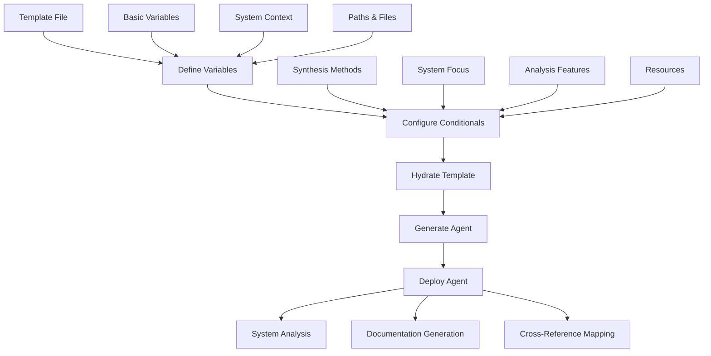
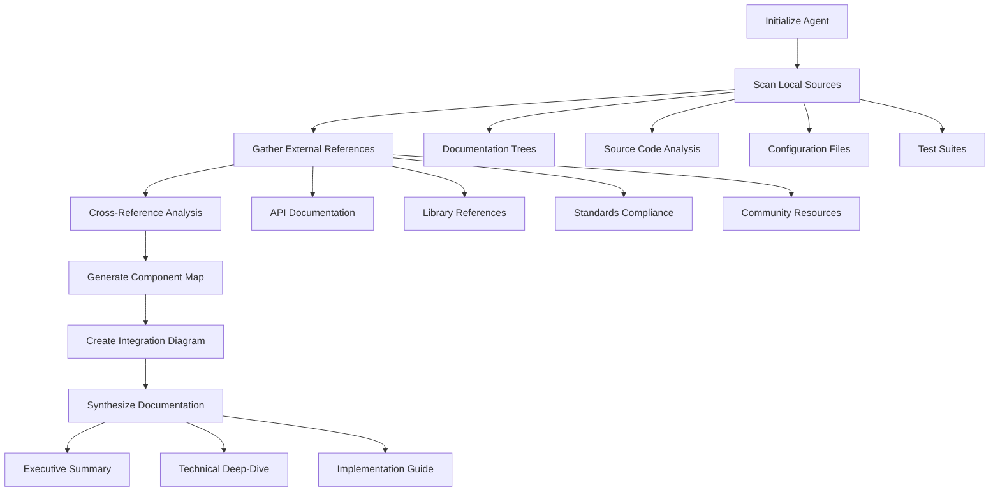
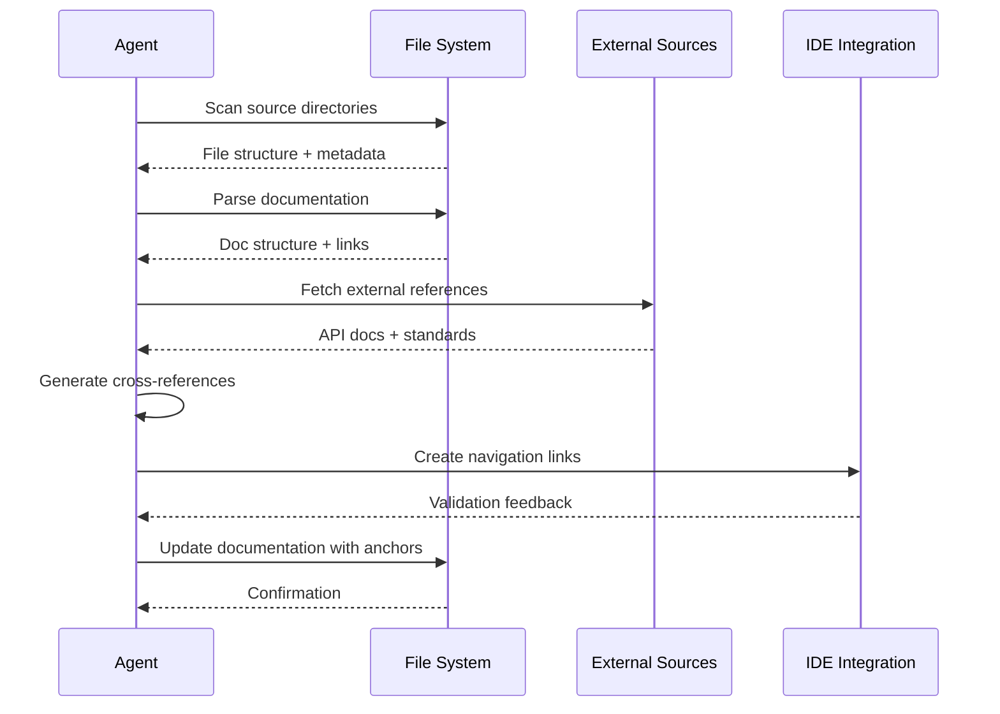
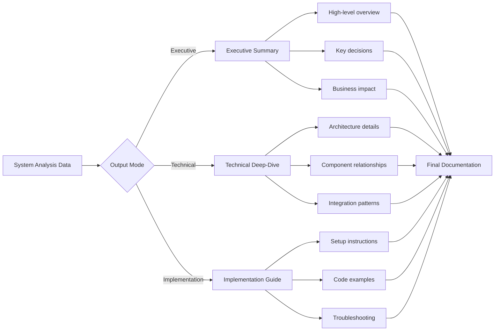

# System Digest Agent Template Documentation

## Overview

The `system-digest.npl-template.md` is an NPL agent template designed to create specialized system analysis and documentation synthesis agents. These agents aggregate information from multiple sources (local documentation, code files, external APIs, web resources) to create comprehensive, cross-referenced system documentation with IDE-compatible navigation links.

The template generates agents that excel at creating navigational maps, synthesizing architectural relationships, and providing detailed line-by-line references for complex software systems.

## Key Capabilities

### Core Functions
- **Multi-Source Intelligence Gathering**: Aggregates information from local docs, code files, external APIs, and web resources
- **Cross-Reference Analysis**: Creates detailed link maps between documentation and implementation
- **Hierarchical Summarization**: Generates summaries at multiple levels (executive, technical, implementation)
- **Source Attribution**: Maintains precise references to file paths and line numbers
- **Relationship Mapping**: Identifies and documents system dependencies and integration points
- **Contextual Synthesis**: Combines disparate information into coherent system understanding

### Advanced Features
- **IDE Symbol Navigation**: Generates file:// links with line numbers and column positions
- **Anchor Tag Management**: Explicit permission to insert anchor tags in documentation files
- **System Health Assessment**: Evaluates system metrics and change impact analysis
- **Multiple Output Modes**: Executive summaries, technical deep-dives, and implementation guides

## Template Structure Analysis

### Key Template Variables

| Variable | Purpose | Example Value |
|----------|---------|---------------|
| `agent_name` | Agent identifier | `project-digest`, `api-analyzer` |
| `system_name` | Target system name | `MyAPI`, `WebApp`, `MLPipeline` |
| `source_language` | Programming language | `python`, `javascript`, `go` |
| `doc_directories` | Documentation paths | `docs/`, `README.md`, `wiki/` |
| `source_directories` | Source code paths | `src/`, `lib/`, `internal/` |
| `config_files` | Configuration files | `config.yaml`, `.env`, `settings.py` |

### Conditional Sections

The template includes several conditional blocks that can be enabled/disabled:

- `{{#if load_npl_context}}`: NPL framework loading
- `{{#if has_synthesis_methods}}`: Advanced analysis methodologies
- `{{#if has_system_focus}}`: System-specific intelligence patterns
- `{{#if has_analysis_features}}`: Health metrics and impact analysis
- `{{#if has_resources}}`: Getting started resources

## How to Use and Hydrate the Template

### Basic Instantiation

```bash
# Using npl-templater to create a basic system digest agent
@npl-templater hydrate agentic/scaffolding/agent-templates/system-digest.npl-template.md \
  --agent_name="api-digest" \
  --agent_title="API System Digest Agent" \
  --agent_alias="api-digest" \
  --system_name="RestAPI" \
  --source_language="python" \
  --doc_directories="docs/, api-docs/" \
  --source_directories="src/, tests/" \
  --config_files="config.yaml, .env"
```

### Advanced Configuration

```bash
# Full configuration with all optional features
@npl-templater hydrate agentic/scaffolding/agent-templates/system-digest.npl-template.md \
  --agent_name="microservices-digest" \
  --agent_description="Comprehensive analysis of microservices architecture" \
  --model_preference="sonnet" \
  --system_name="EcommerceSystem" \
  --source_language="go" \
  --has_synthesis_methods=true \
  --has_system_focus=true \
  --has_analysis_features=true \
  --has_resources=true \
  --load_npl_context=true
```

### Template Hydration Process



## Integration Patterns

### With Other NPL Agents

#### Sequential Analysis Workflow
```bash
# Step 1: Generate system digest
@api-digest analyze --mode=comprehensive

# Step 2: Grade the documentation quality
@npl-grader evaluate generated-docs/ --rubric=system-doc-quality

# Step 3: Create persona-specific views
@npl-persona create-view --persona=developer --source=system-digest.md
@npl-persona create-view --persona=architect --source=system-digest.md
```

#### Parallel Analysis Pattern
```bash
# Parallel system analysis from different perspectives
@system-digest analyze --focus=architecture &
@code-review-agent analyze --focus=code-quality &
@security-agent analyze --focus=vulnerabilities &
wait
```

### Integration with Development Tools

#### IDE Integration
```bash
# Generate IDE-compatible navigation files
@system-digest generate-nav --format=vscode-workspace
@system-digest generate-nav --format=jetbrains-bookmarks
```

#### CI/CD Pipeline Integration
```yaml
# .github/workflows/documentation.yml
- name: Generate System Digest
  run: |
    @system-digest analyze --output=docs/system-digest.md
    @npl-grader validate docs/system-digest.md
```

## Example Instantiation Scenarios

### Scenario 1: Python Web Application

```bash
# Create agent for Django web application
@npl-templater hydrate system-digest.npl-template.md \
  --agent_name="django-digest" \
  --agent_title="Django Application Digest" \
  --agent_alias="django-digest" \
  --system_name="WebPortal" \
  --source_language="python" \
  --doc_directories="docs/, README.md" \
  --source_directories="myapp/, tests/" \
  --config_files="settings.py, requirements.txt" \
  --core_functions="Model relationship analysis, URL routing analysis, Template structure mapping" \
  --has_synthesis_methods=true \
  --output_file="agents/django-digest.md"
```

**Usage after instantiation:**
```bash
@django-digest analyze
@django-digest create-component-map --component=auth
@django-digest generate-api-docs --format=openapi
```

### Scenario 2: Microservices Architecture

```bash
# Create agent for microservices ecosystem
@npl-templater hydrate system-digest.npl-template.md \
  --agent_name="microservices-digest" \
  --agent_title="Microservices Architecture Digest" \
  --agent_alias="ms-digest" \
  --system_name="EcommerceServices" \
  --source_language="go" \
  --doc_directories="docs/, service-docs/, api-specs/" \
  --source_directories="cmd/, internal/, pkg/" \
  --config_files="docker-compose.yml, k8s/*.yaml" \
  --has_system_focus=true \
  --has_analysis_features=true \
  --integration_points="Service mesh, Database connections, Message queues"
```

**Generated agent capabilities:**
```bash
@ms-digest map-service-dependencies
@ms-digest analyze-communication-patterns
@ms-digest generate-deployment-docs
@ms-digest assess-system-health
```

### Scenario 3: Machine Learning Pipeline

```bash
# Create agent for ML system analysis
@npl-templater hydrate system-digest.npl-template.md \
  --agent_name="ml-pipeline-digest" \
  --agent_title="ML Pipeline System Digest" \
  --agent_alias="ml-digest" \
  --system_name="MLPlatform" \
  --source_language="python" \
  --doc_directories="docs/, notebooks/, experiments/" \
  --source_directories="src/, models/, data/" \
  --config_files="config.yaml, requirements.txt, model-configs/" \
  --focus_areas="Data flow, Model lifecycle, Training pipelines, Deployment strategies" \
  --has_analysis_features=true
```

## Workflow Diagrams

### System Analysis Workflow



### Cross-Reference Generation Process



### Multi-Mode Output Generation



## Best Practices

### Template Customization

#### 1. Define Clear System Boundaries
```bash
# Good: Specific system scope
--system_name="UserAuthService"
--source_directories="auth-service/, shared-lib/"

# Avoid: Overly broad scope
--system_name="EntireCompany"
--source_directories="./"
```

#### 2. Configure Appropriate Analysis Depth
```bash
# For large systems: Focus on key components
--has_system_focus=true
--focus_areas="Core APIs, Authentication, Data layer"

# For smaller systems: Comprehensive analysis
--has_analysis_features=true
--has_synthesis_methods=true
```

#### 3. Tailor Output for Audience
```bash
# Executive-focused configuration
--executive_audience="Engineering leadership"
--executive_focus="System architecture decisions and technical debt"

# Developer-focused configuration
--technical_audience="Development team"
--technical_focus="Implementation details and code organization"
```

### Deployment Strategies

#### Project-Specific Agents
```bash
# Create dedicated agents for each major system
mkdir -p .claude/agents/
@npl-templater hydrate system-digest.npl-template.md \
  --output_file=".claude/agents/auth-digest.md"
@npl-templater hydrate system-digest.npl-template.md \
  --output_file=".claude/agents/api-digest.md"
```

#### Team-Shared Configurations
```bash
# Version control agent configurations
git add .claude/agents/
git commit -m "Add system digest agents for team use"

# Document usage in project README
echo "## System Analysis" >> README.md
echo "Use @auth-digest for authentication system analysis" >> README.md
echo "Use @api-digest for API documentation generation" >> README.md
```

### Quality Assurance

#### Reference Validation Process
```bash
# Generate system digest
@system-digest analyze --validate-references

# Check link accuracy
@npl-grader validate system-digest.md --check-links

# Verify code references
find . -name "*.md" -exec grep -l "file://" {} \; | xargs @link-validator
```

#### Continuous Documentation Updates
```bash
# Set up automated digest regeneration
# .github/workflows/docs-update.yml
on:
  push:
    paths: ['src/**', 'docs/**']
jobs:
  update-digest:
    runs-on: ubuntu-latest
    steps:
      - uses: actions/checkout@v2
      - name: Regenerate System Digest
        run: @system-digest analyze --incremental-update
```

### Performance Optimization

#### Large System Handling
```bash
# Use selective analysis for large codebases
@system-digest analyze --selective \
  --max-files=1000 \
  --focus-patterns="*.go,*.py,*.js" \
  --exclude-patterns="*test*,*vendor*"
```

#### Incremental Updates
```bash
# Track changes and update only affected sections
@system-digest update --since-commit=HEAD~10
@system-digest update --changed-files="src/auth.go,docs/api.md"
```

## Common Integration Patterns

### Documentation Pipeline Integration
```bash
# 1. Generate base documentation
@system-digest analyze --mode=comprehensive

# 2. Enhance with specialized analysis
@security-digest analyze --input=system-digest.md
@performance-digest analyze --input=system-digest.md

# 3. Create user-facing documentation
@technical-writer transform system-digest.md --audience=end-users
```

### Code Review Integration
```bash
# Pre-commit hook: Update system digest for significant changes
#!/bin/bash
changed_files=$(git diff --cached --name-only)
if echo "$changed_files" | grep -E "(src/|docs/)" > /dev/null; then
    @system-digest update --incremental
    git add system-digest.md
fi
```

### IDE Workspace Configuration
```bash
# Generate IDE-specific navigation aids
@system-digest generate-workspace \
  --format=vscode \
  --include-tasks \
  --include-debug-configs

@system-digest generate-workspace \
  --format=intellij \
  --include-run-configs \
  --include-bookmarks
```

The system-digest agent template provides a robust foundation for creating comprehensive system analysis and documentation synthesis agents. By following these patterns and best practices, teams can maintain high-quality, up-to-date system documentation that serves both technical implementation needs and strategic decision-making requirements.