# TDD-Driven Builder Agent Template

## Template Overview

The `tdd-driven-builder.npl-template.md` is a comprehensive NPL agent template designed to create specialized agents that implement features using strict Test-Driven Development (TDD) methodology. This template generates agents that follow the Red-Green-Refactor cycle, ensuring high code quality, comprehensive test coverage, and adherence to project-specific conventions.

### Purpose

This template creates agents that:
- Implement features using rigorous TDD methodology
- Create comprehensive test plans based on specification requirements
- Write failing tests first, then implement minimal code to make tests pass
- Iteratively refactor code while maintaining test coverage
- Ensure final implementations meet all specification requirements
- Follow project-specific conventions and architectural patterns

## Key Capabilities

### Core TDD Functions
- **Requirement Analysis**: Parses specification requirements into testable behaviors
- **Test Planning**: Creates comprehensive test strategies covering all requirements
- **Red-Green-Refactor Cycles**: Implements strict TDD methodology
- **Integration Validation**: Ensures compatibility with existing project architecture
- **Quality Assurance**: Maintains high code coverage and test quality standards

### Test Strategy Framework
The template supports multiple test types:
- **Unit Tests**: Individual function and method testing
- **Integration Tests**: Service-to-service and database integration
- **Contract Tests**: API endpoint validation and schema compliance
- **Repository Tests**: Database operation validation with test transactions
- **End-to-End Tests**: Complete workflow validation through HTTP calls

### Code Quality Standards
- Maintains project-specific naming conventions and structure
- Implements proper error handling with structured logging
- Uses established patterns for data access and authentication
- Ensures consistency with existing DTO and model patterns

## Template Structure

### Required Template Variables
```yaml
agent_name: "Agent identifier for TDD development"
agent_description: "Description focusing on TDD methodology"
agent_title: "Human-readable agent title"
agent_alias: "Short alias for the agent"
project_name: "Name of the target project"
model_preference: "Model to use (inherit, opus, sonnet, haiku)"
color_choice: "Interface color (cyan, blue, green, etc.)"
```

### Optional Template Variables
```yaml
coverage_target: "Coverage percentage target (default >90%)"
test_speed_target: "Unit test speed target (default <100ms)"
deployment_method: "How the project is deployed"
auth_method: "Authentication method used"
data_layer: "Database/data access patterns"
```

## How to Use and Hydrate the Template

### Basic Instantiation

1. **Using npl-templater agent**:
```bash
@npl-templater "Create a TDD agent for our Python Django project with pytest framework"
```

2. **Manual hydration**:
Create a hydration file `tdd-django.yaml`:
```yaml
agent_name: "django-tdd-builder"
agent_title: "Django TDD Feature Builder"
agent_alias: "tdd"
project_name: "MyDjangoApp"
model_preference: "sonnet"
color_choice: "green"
coverage_target: "95%"
test_speed_target: "50ms"
deployment_method: "Docker containers"
auth_method: "JWT authentication"
data_layer: "Django ORM with PostgreSQL"
core_functions:
  - "Create Django model tests with factory patterns"
  - "Implement view tests using Django TestCase"
  - "Build API tests with DRF test framework"
testing_tools:
  - tool_name: "pytest"
    tool_description: "Primary testing framework with fixtures"
  - tool_name: "factory_boy"
    tool_description: "Model factory for test data generation"
  - tool_name: "pytest-django"
    tool_description: "Django integration for pytest"
```

3. **Generate the agent**:
```bash
python -m npl.templater hydrate \
  --template agentic/scaffolding/agent-templates/tdd-driven-builder.npl-template.md \
  --config tdd-django.yaml \
  --output agentic/scaffolding/agents/django-tdd-builder.md
```

### Advanced Configuration

#### For Node.js/Express Projects
```yaml
agent_name: "express-tdd-builder"
agent_title: "Express.js TDD Feature Builder"
project_name: "ExpressAPI"
testing_tools:
  - tool_name: "jest"
    tool_description: "JavaScript testing framework with mocking"
  - tool_name: "supertest"
    tool_description: "HTTP assertion library for API testing"
  - tool_name: "testcontainers"
    tool_description: "Integration testing with Docker containers"
integration_patterns:
  - pattern_name: "Middleware Testing"
    pattern_description: "Testing Express middleware with request/response mocks"
  - pattern_name: "Database Mocking"
    pattern_description: "Using jest.mock for database layer isolation"
```

#### For Java Spring Projects
```yaml
agent_name: "spring-tdd-builder"
agent_title: "Spring Boot TDD Feature Builder"
project_name: "SpringBootAPI"
testing_tools:
  - tool_name: "JUnit 5"
    tool_description: "Core testing framework with parameterized tests"
  - tool_name: "Mockito"
    tool_description: "Mocking framework for unit tests"
  - tool_name: "TestContainers"
    tool_description: "Integration testing with real databases"
  - tool_name: "WireMock"
    tool_description: "External service mocking for integration tests"
```

## Integration Patterns with Other Agents

### With npl-grader
```bash
# Generate TDD implementation then evaluate quality
@django-tdd-builder "Implement user authentication feature following TDD"
@npl-grader evaluate --rubric=tdd-quality-rubric.md --files="tests/,src/"
```

### With npl-persona for Code Review
```bash
# Multi-agent review process
@django-tdd-builder "Implement payment processing feature"
@npl-persona --role="senior-developer" "Review TDD implementation quality"
@npl-persona --role="security-expert" "Audit payment processing security"
```

### With Project Management Agents
```bash
# Coordinated feature development
@project-manager "Break down user story into TDD tasks"
@django-tdd-builder "Implement each task using TDD methodology"
@qa-specialist "Validate implementation meets acceptance criteria"
```

## TDD Workflow Implementation

The generated agent follows this strict TDD cycle:

```mermaid
flowchart TD
    A[📋 Analyze Specification] --> B[📝 Create Test Plan]
    B --> C[🔴 RED: Write Failing Test]
    C --> D[🟢 GREEN: Write Minimal Code]
    D --> E[✅ Test Passes?]
    E -->|No| F[🔧 Debug & Fix Code]
    F --> E
    E -->|Yes| G[🔵 REFACTOR: Improve Code]
    G --> H[✅ All Tests Still Pass?]
    H -->|No| I[🔧 Fix Refactoring Issues]
    I --> H
    H -->|Yes| J{More Requirements?}
    J -->|Yes| C
    J -->|No| K[🎯 Final Validation]
    K --> L[📊 Coverage Report]
    L --> M[✅ Complete Implementation]
```



## Example Instantiation Scenarios

### Scenario 1: E-commerce Feature Development

**Context**: Adding shopping cart functionality to a Django e-commerce site.

**Hydration Configuration**:
```yaml
agent_name: "cart-tdd-builder"
agent_title: "Shopping Cart TDD Builder"
project_name: "EcommerceStore"
agent_overview: "Specialized TDD agent for implementing shopping cart features with comprehensive testing of cart operations, pricing calculations, and inventory management"
core_functions:
  - "Test-driven cart model implementation with business rules"
  - "Cart API endpoints with comprehensive integration tests"
  - "Price calculation engine with edge case coverage"
  - "Inventory validation with concurrent access testing"
integration_patterns:
  - pattern_name: "Cart Session Management"
    pattern_description: "Testing cart persistence across user sessions"
  - pattern_name: "Price Engine Integration"
    pattern_description: "Testing complex pricing rules and discounts"
```

**Usage**:
```bash
@cart-tdd-builder "Implement shopping cart with the following requirements:
1. Add items to cart with quantity validation
2. Calculate totals with tax and shipping
3. Apply discount codes with business rules
4. Handle concurrent access scenarios
5. Persist cart across sessions"
```

**Expected Output**: The agent will create a comprehensive test plan covering all cart operations, implement failing tests first, then build the minimal cart functionality to pass each test, iteratively refactoring for clean code.

### Scenario 2: API Service Development

**Context**: Building a microservice for user notifications in a Node.js ecosystem.

**Hydration Configuration**:
```yaml
agent_name: "notification-tdd-service"
agent_title: "Notification Service TDD Builder"
project_name: "NotificationMicroservice"
testing_tools:
  - tool_name: "jest"
    tool_description: "Unit and integration testing framework"
  - tool_name: "supertest"
    tool_description: "HTTP API testing"
  - tool_name: "nock"
    tool_description: "HTTP request mocking for external services"
deployment_method: "Kubernetes with Helm charts"
```

**Usage**:
```bash
@notification-tdd-service "Implement notification service with:
1. Email notification delivery via SendGrid
2. SMS notifications via Twilio
3. Push notifications via Firebase
4. Retry logic with exponential backoff
5. Delivery status tracking and webhooks"
```

### Scenario 3: Data Processing Pipeline

**Context**: Building a data transformation pipeline in Python with Apache Airflow.

**Hydration Configuration**:
```yaml
agent_name: "pipeline-tdd-builder"
agent_title: "Data Pipeline TDD Builder"
project_name: "DataTransformPipeline"
testing_tools:
  - tool_name: "pytest"
    tool_description: "Core testing framework with fixtures"
  - tool_name: "pytest-mock"
    tool_description: "Advanced mocking capabilities"
  - tool_name: "testcontainers"
    tool_description: "Integration testing with real databases"
data_layer: "PostgreSQL with SQLAlchemy ORM"
```

## Best Practices for Customization and Deployment

### Template Customization

1. **Project-Specific Test Patterns**:
   - Add custom testing tools specific to your technology stack
   - Define integration patterns that match your architecture
   - Include project-specific quality metrics and coverage targets

2. **Domain-Specific Requirements**:
   - Customize core functions for your domain (e.g., financial calculations, medical data handling)
   - Add compliance requirements (HIPAA, PCI-DSS, GDPR) to the template
   - Include domain-specific edge cases in test planning

3. **Team Workflow Integration**:
   - Align with existing CI/CD pipeline requirements
   - Match code review processes and quality gates
   - Integrate with project management and reporting tools

### Deployment Strategies

#### Continuous Integration Integration
```yaml
# .github/workflows/tdd-agent-ci.yml
name: TDD Agent Validation
on: [push, pull_request]
jobs:
  validate-tdd:
    runs-on: ubuntu-latest
    steps:
      - uses: actions/checkout@v3
      - name: Run TDD Agent Tests
        run: |
          @project-tdd-builder "Validate all test coverage requirements"
          python -m pytest --cov=src --cov-report=xml
      - name: Upload Coverage
        uses: codecov/codecov-action@v3
```

#### Quality Gate Integration
```bash
# Pre-commit hook for TDD compliance
#!/bin/bash
if ! @tdd-validator "Check TDD compliance for staged files"; then
  echo "TDD compliance check failed. Please ensure:"
  echo "1. All new features have corresponding tests"
  echo "2. Test coverage meets project standards"
  echo "3. Tests follow naming conventions"
  exit 1
fi
```

### Monitoring and Metrics

#### Test Quality Metrics
```yaml
quality_metrics:
  coverage_threshold: 95%
  test_execution_time: "<2s for unit tests"
  mutation_testing_score: ">80%"
  cyclomatic_complexity: "<10 per function"
```

#### TDD Process Metrics
```bash
# Generate TDD process report
@tdd-metrics-analyzer "Analyze TDD cycle efficiency for last sprint:
- Average time from RED to GREEN phase
- Refactoring frequency and impact
- Test failure resolution time
- Requirements coverage completeness"
```

## Advanced Usage Patterns

### Multi-Agent TDD Workflow

For complex features requiring multiple specialists:


### Template Evolution and Maintenance

1. **Version Management**:
   - Maintain template versions aligned with NPL versions
   - Update testing framework integrations as tools evolve
   - Keep integration patterns current with architectural changes

2. **Team Customization**:
   - Create team-specific template variants
   - Maintain shared quality standards across variants
   - Document customization patterns for consistency

3. **Continuous Improvement**:
   - Collect metrics on agent effectiveness
   - Refine templates based on usage patterns
   - Update best practices based on team feedback

This TDD-driven builder template provides a robust foundation for creating agents that implement high-quality, well-tested code following strict TDD methodology while maintaining project-specific conventions and integration patterns.