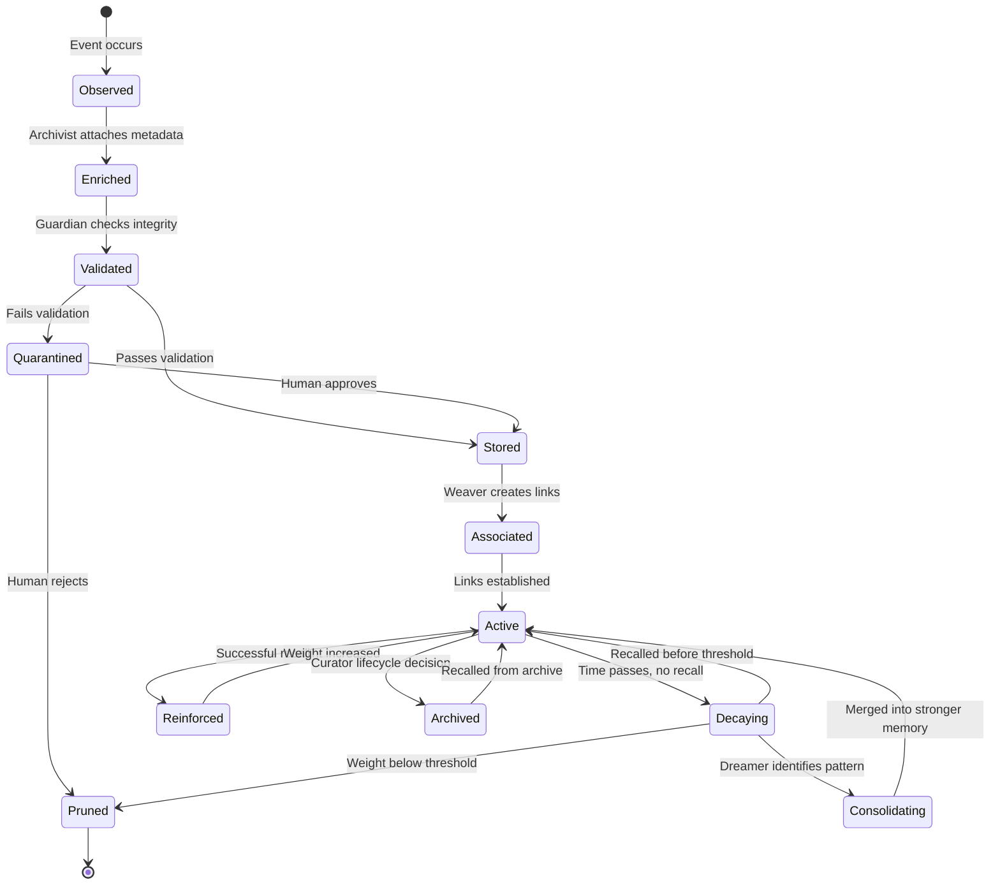
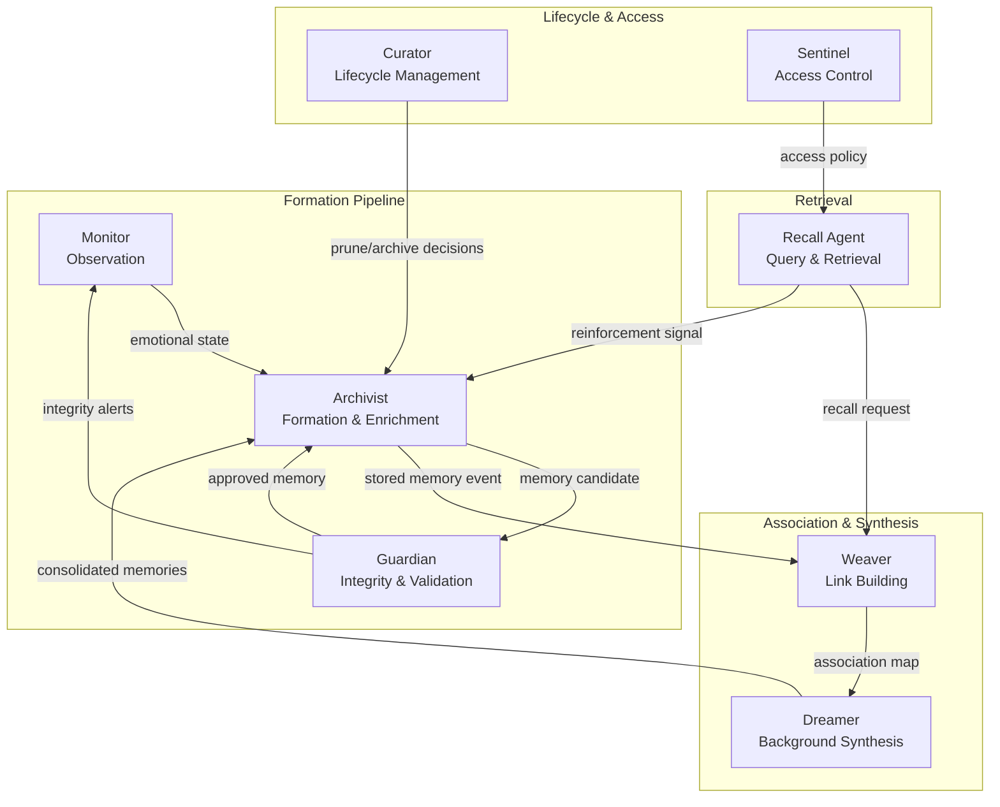
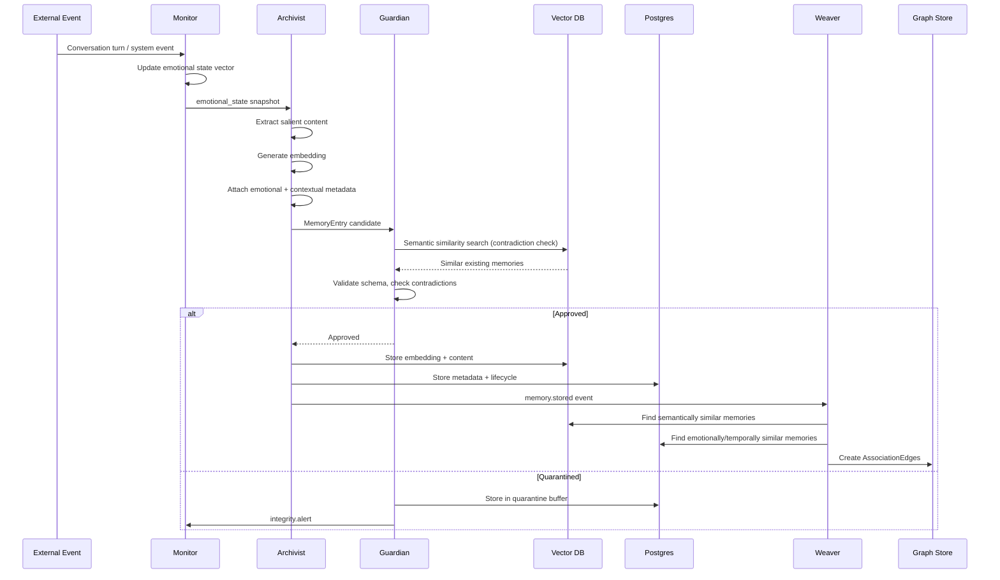
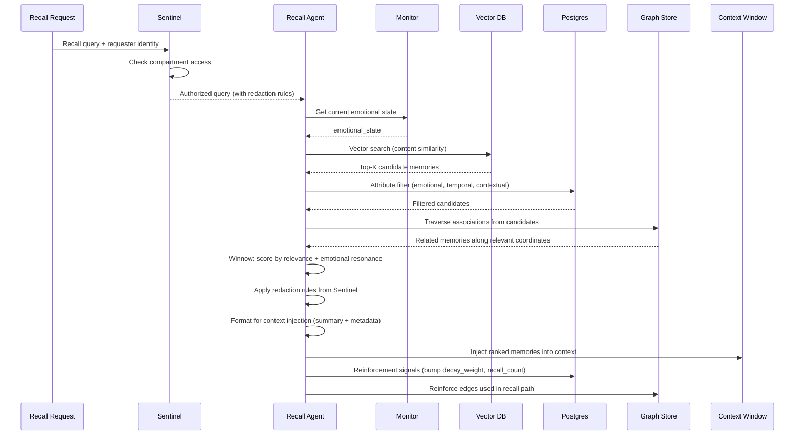
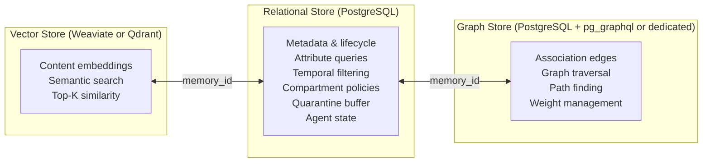
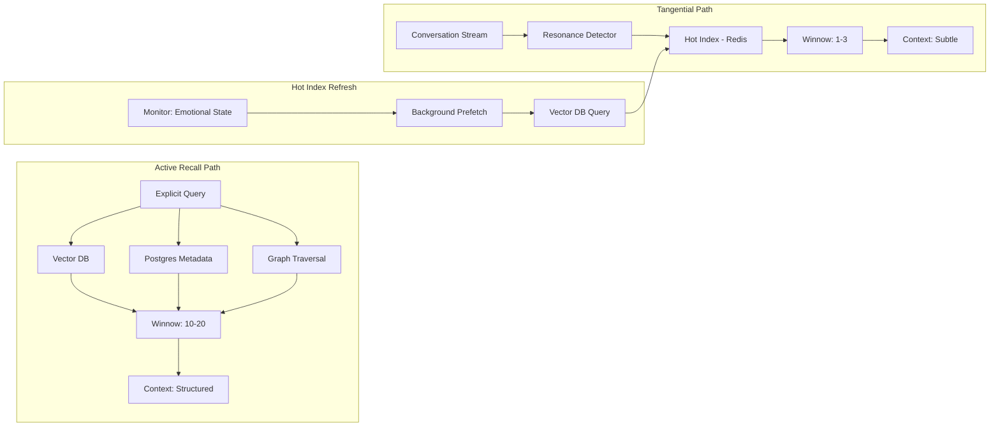
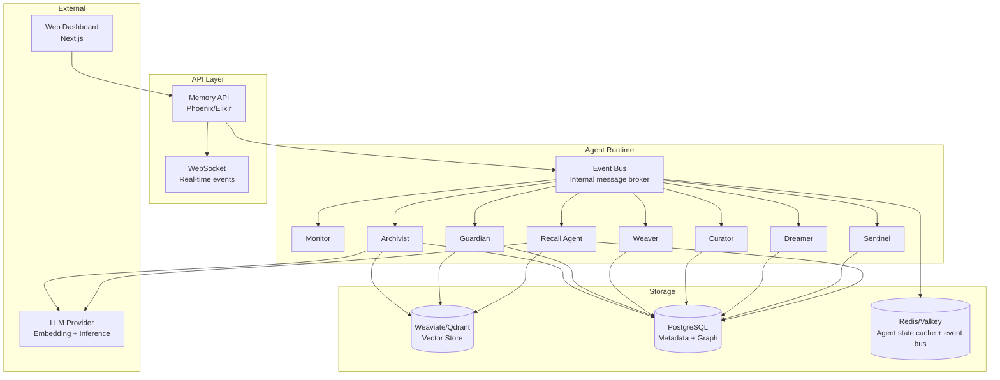

# Architecture: The Robot Remembers

## 1. Design Philosophy

The Robot Remembers is **not a RAG system**. It is an associative memory fabric modeled after biological memory: memories are not flat documents to be vector-searched but living nodes in a weighted graph, each carrying the emotional and contextual texture of the moment they were formed.

The core insight: **two memories are related not only when their content is similar, but when they were formed under similar emotional states, in similar contexts, by similar collaborators, at similar times of year**. A memory of debugging a Postgres deadlock at 2 AM while frustrated may surface when the agent is again frustrated at 2 AM, even if the current problem is an unrelated DNS issue. This is how human memory works — and it is what makes recall feel intelligent rather than mechanical.

### Design Principles

1. **Emotional context is first-class data.** Every memory carries mood valence, arousal, dominance, and simulated hormonal state. These are not decorations; they are retrieval coordinates.
2. **Associations are weighted and dynamic.** Links between memories strengthen through successful recall (reinforcement) and weaken through disuse (decay). The graph reshapes itself through use.
3. **Memories decay unless reinforced.** Short-term memories fade on a configurable decay curve. Consolidation — the Dreamer's background synthesis process — is the mechanism by which transient observations become durable knowledge.
4. **Eight specialized agents operate the system.** No single monolithic process. Each agent has a narrow responsibility, an emotional disposition, and tension relationships with other agents. The system's behavior emerges from their interactions.
5. **The context window is a resource to be managed.** Memories are injected into an LLM's context window in a compact, prioritized format. The system decides what to inject, how much, and in what order — the LLM never sees the full memory store.

---

## 2. Memory Model

### 2.1 Memory Entry Structure

A Memory Entry is the atomic unit of the system. Every memory is a node in the association graph.

```yaml
MemoryEntry:
  # Identity
  id: uuid
  version: int                    # Incremented on merge/edit
  created_at: datetime
  updated_at: datetime
  source_agent: string            # Which agent or external system created this

  # Content
  content: text                   # The memory itself — natural language
  content_type: enum              # episodic | semantic | procedural
  summary: text                   # Compressed version for context injection
  embedding: vector[float]        # Dense vector from embedding model

  # Emotional Metadata (v1 schema)
  emotional_metadata:
    mood:
      valence: float              # -1.0 (negative) to 1.0 (positive)
      arousal: float              # 0.0 (calm) to 1.0 (excited)
      dominance: float            # 0.0 (submissive) to 1.0 (dominant)
    hormones:
      cortisol: float             # 0.0–1.0, stress/urgency
      dopamine: float             # 0.0–1.0, reward/satisfaction
      oxytocin: float             # 0.0–1.0, trust/bonding
      serotonin: float            # 0.0–1.0, stability/contentment
    frustration_index: float      # 0.0–1.0, computed from recent history
    confidence: enum              # high | medium | low
    schema_version: int           # Currently 1

  # Contextual Metadata
  contextual_metadata:
    temporal:
      timestamp_utc: datetime
      local_time: datetime
      time_of_day: enum           # morning | afternoon | evening | night
      day_of_week: string
      season: enum                # spring | summer | autumn | winter
      holiday_proximity: map      # { "christmas": 2, "new_year": 9 }
    session:
      topic: string
      domain: string              # e.g., "debugging", "design", "ops"
      conversation_length: int    # turns at time of capture
      turn_number: int
    modality: enum                # chat | voice | api | api_batch | background
    collaborators: list[string]   # Agent/user IDs present at formation
    environment: map              # Freeform k/v (project, repo, tool, etc.)

  # Lifecycle
  lifecycle:
    state: enum                   # active | consolidating | archived | quarantined | pruned
    decay_weight: float           # 0.0–1.0, current strength (starts at 1.0)
    last_recalled_at: datetime
    recall_count: int
    reinforcement_count: int
    denforcement_count: int
    consolidation_ids: list[uuid] # Memories this was consolidated from
    pruned_at: datetime?

  # Access Control
  compartment: string             # Partition key for access control
  classification: enum            # open | restricted | sealed
  owner_agent: string             # Which agent "owns" this memory
```

### 2.2 Association Edge

Edges in the association graph connect two Memory Entries. Each edge carries its own weight and metadata describing *why* the association exists.

```yaml
AssociationEdge:
  id: uuid
  source_memory_id: uuid
  target_memory_id: uuid
  weight: float                   # 0.0–1.0, current association strength
  edge_type: enum                 # semantic | emotional | temporal | causal | co-occurrence | synthetic
  created_at: datetime
  updated_at: datetime
  created_by: string              # Agent that created this link
  reinforcement_count: int
  denforcement_count: int
  metadata:
    reason: text                  # Why this link was created
    emotional_similarity: float   # Cosine similarity of emotional vectors
    temporal_proximity: float     # Closeness in time (normalized)
```

---

## 3. Memory Lifecycle



### Phase Descriptions

| Phase | Agent | Description |
|-------|-------|-------------|
| **Observed** | Monitor | An event, conversation turn, or external input is detected as potentially memory-worthy |
| **Enriched** | Archivist | Emotional metadata (mood, hormones, frustration), contextual metadata (time, session, collaborators), and content embedding are attached |
| **Validated** | Guardian | Contradiction detection against existing memories, schema compliance check, injection/poisoning pattern scan |
| **Stored** | Archivist | Written to vector DB (embedding + content) and relational store (metadata + lifecycle) |
| **Associated** | Weaver | Links created to semantically, emotionally, temporally, or causally related memories. Initial edge weights set. |
| **Active** | — | Memory is available for recall. Decay clock is running. |
| **Decaying** | Curator | `decay_weight` has dropped below a configurable threshold. Memory is a candidate for pruning or consolidation. |
| **Consolidating** | Dreamer | Background synthesis: merging multiple related weak memories into a single stronger one, or strengthening a memory by discovering new associations |
| **Reinforced** | Recall Agent | A memory was successfully recalled and used. Its `decay_weight` is boosted. Its association edges that participated in the recall path are also reinforced. |
| **Archived** | Curator | Memory is moved to cold storage. Still retrievable but not included in default recall sweeps. |
| **Pruned** | Curator | Memory is permanently removed (or soft-deleted with tombstone). |

---

## 4. Agent Architecture

### 4.1 The Eight Synthetic Agents



### 4.2 Agent Detail

#### 1. Monitor (Observation)
- **Archetype:** Sensory nervous system
- **Responsibility:** Tracks the current emotional state of the agent system. Maintains running values for mood, hormone levels, stress, and environmental context. Does not store memories — it provides the emotional baseline that the Archivist reads when enriching a new memory.
- **Inputs:** Conversation stream, system events, agent self-reports
- **Outputs:** Current emotional state vector, environmental context snapshot
- **Key tension:** Must be accurate without being invasive. Over-monitoring creates noise; under-monitoring causes emotional metadata gaps.

#### 2. Archivist (Formation)
- **Archetype:** Sensory cortex
- **Responsibility:** Extracts memory-worthy moments from the event stream, attaches emotional and contextual metadata from the Monitor's state, generates content embeddings, and submits to the Guardian for validation. After validation, writes to storage and emits formation events.
- **Inputs:** Event stream, Monitor's emotional state, Guardian's validation response
- **Outputs:** Enriched MemoryEntry objects, formation events (consumed by Weaver)
- **Key tension:** Capture breadth vs. signal quality. Under stress, degrades to coarser-grained capture to maintain throughput.

#### 3. Guardian (Integrity)
- **Archetype:** Immune system
- **Responsibility:** Validates every incoming memory for schema compliance, detects contradictions against existing memories via semantic similarity search, scans for injection/poisoning patterns, and maintains a quarantine buffer for suspicious entries.
- **Inputs:** Memory candidates from Archivist
- **Outputs:** Approved/rejected/quarantined decisions, integrity alerts, contradiction reports
- **Key tension:** Security vs. throughput. Too strict and the system forgets important things; too loose and it ingests corrupted data.

#### 4. Weaver (Association)
- **Archetype:** Hippocampus
- **Responsibility:** When a new memory is stored, the Weaver searches for related memories across multiple dimensions (semantic similarity, emotional similarity, temporal proximity, shared collaborators, shared domain) and creates weighted AssociationEdge links. Also periodically re-evaluates existing edges.
- **Inputs:** Memory formation events, existing memory store
- **Outputs:** AssociationEdge objects, association map updates
- **Key tension:** Link density vs. noise. Too many links make recall slow and unfocused; too few make the graph sparse and miss valid associations.

#### 5. Curator (Lifecycle)
- **Archetype:** Prefrontal cortex (executive function)
- **Responsibility:** Manages the lifecycle state of memories. Runs periodic sweeps to identify decaying memories (below weight threshold), decides whether to archive, prune, or flag for consolidation. Enforces storage quotas and retention policies.
- **Inputs:** Memory lifecycle state, storage metrics, retention policy config
- **Outputs:** Archive/prune/consolidate decisions
- **Key tension:** Conservation vs. cleanliness. Premature pruning destroys memories the Dreamer might have consolidated; hoarding everything wastes storage and pollutes recall.

#### 6. Dreamer (Synthesis)
- **Archetype:** REM sleep / default mode network
- **Responsibility:** Runs background consolidation processes. Identifies clusters of related weak memories and merges them into stronger composite memories. Discovers latent patterns (e.g., "every December, debugging sessions run long"). Generates speculative associations that the Weaver can validate.
- **Inputs:** Decaying memory candidates from Curator, association graph, temporal patterns
- **Outputs:** Consolidated memories (sent back to Archivist for re-storage), speculative association proposals
- **Key tension:** Speculation vs. accuracy. The Dreamer's synthetic associations can look like contradictions to the Guardian. Must clearly mark speculative outputs.

#### 7. Sentinel (Access Control)
- **Archetype:** Blood-brain barrier
- **Responsibility:** Manages memory compartments — access-controlled partitions that restrict which agents, users, or API consumers can read or write specific memories. Enforces classification levels (open, restricted, sealed). Handles redaction when a recall crosses compartment boundaries.
- **Inputs:** Recall requests with requester identity, compartment policy config
- **Outputs:** Access grants/denials, redacted memory views
- **Key tension:** Security vs. recall completeness. Overly strict compartments create artificial gaps in the association graph; overly loose ones leak sensitive information.

#### 8. Recall Agent (Retrieval)
- **Archetype:** Conscious recall / working memory
- **Responsibility:** Handles incoming recall requests. Performs multi-stage retrieval: vector search for content similarity, attribute-based filtering, association graph traversal to find related memories along relevant coordinates, winnowing to the most relevant subset, and formatting for context injection.
- **Inputs:** Recall query (text + optional emotional/contextual filters), current agent emotional state
- **Outputs:** Ranked list of memories formatted for context injection, reinforcement signals for successfully recalled memories
- **Key tension:** Recall depth vs. latency. Deep graph traversal finds better associations but takes longer. Must balance within the context window's token budget.

### 4.3 Inter-Agent Communication

Agents communicate via an internal event bus. Events are typed and schema-validated.

```yaml
EventTypes:
  # Formation pipeline
  - memory.observed           # Monitor → Archivist
  - memory.enriched           # Archivist → Guardian
  - memory.validated          # Guardian → Archivist (approved)
  - memory.rejected           # Guardian → Archivist (blocked)
  - memory.quarantined        # Guardian → quarantine buffer
  - memory.stored             # Archivist → Weaver, Curator

  # Association
  - association.created       # Weaver → graph store
  - association.proposed      # Dreamer → Weaver (speculative)
  - association.validated     # Weaver → graph store (confirmed speculative)

  # Lifecycle
  - memory.decaying           # Curator → Dreamer (consolidation candidate)
  - memory.consolidated       # Dreamer → Archivist (re-store)
  - memory.archived           # Curator → storage
  - memory.pruned             # Curator → storage (tombstone)

  # Retrieval
  - recall.requested          # External → Recall Agent
  - recall.completed          # Recall Agent → external
  - memory.reinforced         # Recall Agent → Archivist (weight boost)
  - memory.denforced          # External → Archivist (weight reduction)

  # Integrity
  - integrity.alert           # Guardian → Monitor
  - integrity.contradiction   # Guardian → human operator
```

---

## 5. Data Flow

### 5.1 Memory Formation Flow



### 5.2 Recall Flow



---

## 6. Storage Architecture

The system uses a three-layer storage architecture. Each layer serves a different query pattern.



### 6.1 Vector Store (Weaviate or Qdrant)

Stores the dense embedding vector and the raw content text for each memory. Provides fast approximate nearest-neighbor search for content similarity. The vector store is the first stage of recall — it finds the initial candidate set.

**Schema:**
```
Collection: memories
  - id: uuid (matches Postgres)
  - content: text
  - summary: text
  - embedding: vector[1536]  # or model-appropriate dimension
  - content_type: keyword
  - compartment: keyword
  - created_at: datetime
```

### 6.2 Relational Store (PostgreSQL)

The system of record for all metadata, lifecycle state, agent state, compartment policies, quarantine, and audit logs. PostgreSQL is chosen for its maturity, JSONB support (for flexible metadata), and strong transactional guarantees.

**Key tables:**
- `memories` — Full metadata, lifecycle state, emotional/contextual metadata (JSONB)
- `memory_quarantine` — Quarantined entries pending review
- `agent_state` — Current emotional state per agent
- `compartments` — Access control policies
- `recall_log` — Audit trail of recall requests and results
- `consolidation_log` — Dreamer's merge history

### 6.3 Graph Store

Association edges and graph traversal. Two options:

1. **PostgreSQL with recursive CTEs + adjacency list** — Simpler deployment, good enough for moderate graph sizes (< 1M edges). Use `association_edges` table with `source_id`, `target_id`, `weight`, `edge_type`.
2. **Dedicated graph DB (e.g., Neo4j, Apache AGE extension)** — Better for large-scale traversal and complex path queries. Consider if graph exceeds 1M edges.

Initial implementation uses PostgreSQL adjacency list. Migration path to dedicated graph DB is documented but not required at launch.

**Association edges table:**
```sql
CREATE TABLE association_edges (
    id UUID PRIMARY KEY DEFAULT gen_random_uuid(),
    source_memory_id UUID REFERENCES memories(id),
    target_memory_id UUID REFERENCES memories(id),
    weight FLOAT NOT NULL DEFAULT 0.5,
    edge_type VARCHAR(20) NOT NULL,
    created_by VARCHAR(50) NOT NULL,
    created_at TIMESTAMPTZ NOT NULL DEFAULT NOW(),
    updated_at TIMESTAMPTZ NOT NULL DEFAULT NOW(),
    reinforcement_count INT NOT NULL DEFAULT 0,
    denforcement_count INT NOT NULL DEFAULT 0,
    metadata JSONB,
    UNIQUE (source_memory_id, target_memory_id, edge_type)
);

CREATE INDEX idx_assoc_source ON association_edges(source_memory_id);
CREATE INDEX idx_assoc_target ON association_edges(target_memory_id);
CREATE INDEX idx_assoc_weight ON association_edges(weight) WHERE weight > 0.1;
```

---

## 7. API Surface

### 7.1 Memory Write Operations

| Endpoint | Method | Description |
|----------|--------|-------------|
| `POST /api/v1/memories` | Create | Submit a new memory for enrichment and storage |
| `POST /api/v1/memories/batch` | Create | Batch ingest multiple memories |
| `PUT /api/v1/memories/:id` | Update | Edit content or metadata of an existing memory |
| `POST /api/v1/memories/:id/reinforce` | Action | Boost a memory's decay weight and associated edges |
| `POST /api/v1/memories/:id/denforce` | Action | Weaken a memory's decay weight |
| `DELETE /api/v1/memories/:id` | Delete | Request pruning (goes through Guardian) |
| `POST /api/v1/memories/:id/merge` | Action | Request consolidation of two or more memories |

### 7.2 Memory Recall Operations

| Endpoint | Method | Description |
|----------|--------|-------------|
| `POST /api/v1/recall` | Query | Primary recall: text query + optional emotional/contextual filters |
| `POST /api/v1/recall/by-association` | Query | Start from a memory ID, traverse associations |
| `POST /api/v1/recall/by-emotion` | Query | Recall by emotional state similarity |
| `GET /api/v1/memories/:id` | Read | Get a single memory with full metadata |
| `GET /api/v1/memories/:id/associations` | Read | Get all edges for a memory |
| `GET /api/v1/memories/:id/path/:target_id` | Read | Find association paths between two memories |

### 7.3 Agent State Operations

| Endpoint | Method | Description |
|----------|--------|-------------|
| `GET /api/v1/agents` | Read | List all agents with current state |
| `GET /api/v1/agents/:id` | Read | Get agent detail with emotional state |
| `GET /api/v1/agents/:id/state` | Read | Current emotional state vector |
| `PUT /api/v1/agents/:id/state` | Update | Manually adjust agent state (admin) |
| `GET /api/v1/agents/:id/logs` | Read | Recent agent activity log |

### 7.4 Admin Operations

| Endpoint | Method | Description |
|----------|--------|-------------|
| `GET /api/v1/admin/health` | Read | System health summary |
| `GET /api/v1/admin/metrics` | Read | Memory count, edge count, storage usage, agent states |
| `GET /api/v1/admin/quarantine` | Read | List quarantined memories |
| `POST /api/v1/admin/quarantine/:id/approve` | Action | Approve a quarantined memory |
| `POST /api/v1/admin/quarantine/:id/reject` | Action | Reject a quarantined memory |
| `GET /api/v1/admin/compartments` | Read | List compartments and policies |
| `POST /api/v1/admin/compartments` | Create | Create a new compartment |
| `PUT /api/v1/admin/decay-config` | Update | Update global decay curve parameters |
| `PUT /api/v1/admin/weight-config` | Update | Update global weight parameters |

### 7.5 Recall Request Body

```json
{
  "query": "that time we debugged the Postgres deadlock",
  "max_results": 10,
  "emotional_filter": {
    "match_current_mood": true,
    "mood_override": {
      "valence": -0.5,
      "arousal": 0.8
    }
  },
  "contextual_filter": {
    "domain": "debugging",
    "time_of_day": "night",
    "season": "winter",
    "collaborators": ["agent-123"]
  },
  "traversal": {
    "max_depth": 3,
    "min_edge_weight": 0.2,
    "edge_types": ["semantic", "emotional", "temporal"]
  },
  "format": "context_injection"
}
```

---

## 8. Context Window Injection

When memories are recalled for use by an LLM, they must be formatted and injected into the context window efficiently. The context window is a finite resource — every token spent on memory is a token not available for reasoning.

### 8.1 Injection Format

```xml
<memories recalled="5" total_candidates="23" query="postgres deadlock">
  <memory id="m-abc123" relevance="0.92" emotional_resonance="0.87"
          mood="frustrated(-0.6)" formed="2025-12-23T02:34Z" domain="debugging">
    Spent 2 hours debugging a Postgres deadlock caused by concurrent
    migrations. Root cause: advisory locks held across transactions.
    Resolution: sequential migration runner with lock timeout.
    [Links: m-def456 (similar frustration, weight 0.8),
            m-ghi789 (same collaborator, weight 0.6)]
  </memory>
  <!-- ... -->
</memories>
```

### 8.2 Retrieval Modes: Active Recall vs Tangential Insertion

The system operates in two fundamentally different retrieval modes. The mode determines search depth, latency budget, winnowing thresholds, and injection formatting.

#### Active Recall

Triggered when the agent (or operator) explicitly asks: "What do I know about X?" The system treats this as a deliberate, effortful search.

| Parameter | Value |
|-----------|-------|
| **Trigger** | Explicit recall request (API call or agent self-query) |
| **Latency budget** | < 2 seconds |
| **Search depth** | Deep — full multi-path traversal (semantic + emotional + temporal + relational) |
| **Association radius** | Wide — follow edges up to 3 hops, lower weight threshold |
| **Candidate pool** | Large — Top-K up to 50 |
| **Winnowed results** | 10–20 memories |
| **Dreamer involvement** | May invoke real-time synthesis if initial results are sparse |
| **Injection format** | Structured, detailed — full content for top memories, summaries for the rest |
| **Analogy** | Trying to remember someone's name — effortful, focused, recursive |

#### Tangential Insertion

Triggered passively during ongoing conversation. The system monitors the conversation stream and injects relevant memories when emotional/contextual resonance exceeds a threshold — without being asked.

| Parameter | Value |
|-----------|-------|
| **Trigger** | Background resonance detection on conversation stream |
| **Latency budget** | < 100ms (must not disrupt conversational flow) |
| **Search depth** | Shallow — pre-computed hot index + single-hop associations |
| **Association radius** | Narrow — only direct, high-weight edges |
| **Candidate pool** | Small — Top-K up to 10 |
| **Winnowed results** | 1–3 memories (only strong matches surface) |
| **Dreamer involvement** | Never (too slow) |
| **Injection format** | Subtle, parenthetical — brief context notes, not full memories |
| **Analogy** | A song plays and you suddenly remember a summer vacation — effortless, serendipitous |

#### Hot Index for Tangential Insertion

Tangential insertion cannot afford the full retrieval pipeline on every conversational turn. Instead, the system maintains a **hot index** — a pre-computed cache of memories most likely to be relevant given the current emotional state and recent context:

1. The Monitor continuously broadcasts the agent's current emotional state
2. A background process pre-fetches memories with high emotional resonance for the current state
3. These are held in a fast in-memory index (Redis/Valkey), refreshed every N turns or on significant emotional state change
4. Tangential insertion queries this hot index, not the full vector/graph store
5. Only when a hot-index hit scores above the tangential threshold is it injected



### 8.3 Injection Strategy

1. **Budget allocation:** The system is configured with a max token budget for injected memories (e.g., 2000 tokens for active recall, 200 tokens for tangential insertion). The Recall Agent packs memories into this budget by relevance rank, using summaries for lower-ranked memories and full content for top-ranked ones.
2. **Emotional priming:** If the current emotional state strongly matches a memory's emotional metadata, that memory gets a relevance boost (emotional resonance). This can promote a memory above a content-similar but emotionally mismatched one.
3. **Recency bias:** Recently reinforced memories get a small boost to represent the agent's "working memory."
4. **Association context:** Each memory includes a brief note about its strongest associations, giving the LLM a hint about the graph structure without injecting the full association set.
5. **Mode-appropriate formatting:** Active recall uses structured XML with full metadata. Tangential insertion uses brief inline notes that blend with conversational context.

---

## 9. Weight Dynamics

### 9.1 Decay Function

Memories decay over time unless reinforced. The decay function is exponential with a configurable half-life:

```
decay_weight(t) = initial_weight * e^(-lambda * t)

where:
  lambda = ln(2) / half_life
  t = time since last reinforcement (hours)
  half_life = configurable per memory type:
    episodic: 168 hours (1 week)
    semantic: 720 hours (30 days)
    procedural: 2160 hours (90 days)
```

### 9.2 Reinforcement

When a memory is successfully recalled and used:

```
new_weight = min(1.0, current_weight + reinforcement_boost)

reinforcement_boost = base_boost * (1 + emotional_resonance_bonus)

where:
  base_boost = 0.15 (configurable)
  emotional_resonance_bonus = 0.0–0.5 based on mood match
```

Association edges used in the recall path also receive reinforcement:

```
new_edge_weight = min(1.0, current_edge_weight + edge_boost)
edge_boost = 0.1 * recall_relevance_score
```

### 9.3 Denforcement

When a memory is explicitly marked as unhelpful or incorrect:

```
new_weight = max(0.0, current_weight - denforcement_penalty)
denforcement_penalty = 0.2 (configurable)
```

### 9.4 Hebbian-like Learning

The principle: **memories that fire together wire together.** When two memories are recalled in the same recall session (regardless of whether the query targeted both), the edge between them is strengthened:

```
co_recall_boost = 0.05 * min(relevance_a, relevance_b)
```

If no edge exists, the Weaver creates one with `edge_type: co-occurrence` and initial weight `co_recall_boost`.

### 9.5 Pruning Threshold

Memories with `decay_weight < 0.05` for more than `grace_period` (configurable, default 48 hours) are candidates for pruning. The Curator checks:

1. Is this memory part of an active consolidation by the Dreamer? If yes, defer.
2. Does this memory have high-weight edges to active memories? If yes, defer (it may be structurally important even if rarely recalled directly).
3. Otherwise, prune (soft-delete with tombstone).

---

## 10. Emotional Model

The emotional metadata system uses a simplified model inspired by dimensional emotion theory (Russell's circumplex model) augmented with simulated hormonal signals.

### 10.1 Dimensional Axes

| Dimension | Range | Description |
|-----------|-------|-------------|
| **Valence** | -1.0 to 1.0 | Negative (frustrated, angry, sad) to positive (happy, satisfied, excited) |
| **Arousal** | 0.0 to 1.0 | Low (calm, bored, sleepy) to high (alert, agitated, energized) |
| **Dominance** | 0.0 to 1.0 | Low (helpless, overwhelmed) to high (in control, confident) |

### 10.2 Simulated Hormones

These are not biologically accurate models. They are simplified signals that provide additional recall dimensions beyond the three emotion axes.

| Hormone | Models | High value means | Low value means |
|---------|--------|------------------|-----------------|
| **Cortisol** | Stress/urgency | Under pressure, time-critical, alarmed | Relaxed, no urgency |
| **Dopamine** | Reward/satisfaction | Just solved something, breakthrough moment | Stuck, unrewarded effort |
| **Oxytocin** | Trust/bonding | Collaborative, high trust session | Solo work, adversarial interaction |
| **Serotonin** | Stability/contentment | Steady state, things are going well | Disrupted, unstable, things keep breaking |

### 10.3 Emotional Resonance in Recall

When the Recall Agent performs retrieval, it computes emotional resonance between the current agent state and each candidate memory's emotional metadata:

```
emotional_resonance = 1 - (cosine_distance(
    [current.valence, current.arousal, current.dominance,
     current.cortisol, current.dopamine, current.oxytocin, current.serotonin],
    [memory.valence, memory.arousal, memory.dominance,
     memory.cortisol, memory.dopamine, memory.oxytocin, memory.serotonin]
) / 2)
```

High emotional resonance boosts a memory's relevance score during winnowing. This is the mechanism by which "being frustrated at 2 AM" recalls other "frustrated at 2 AM" memories, even if their content is unrelated.

---

## 11. Deployment Architecture



### Technology Choices

| Component | Technology | Rationale |
|-----------|-----------|-----------|
| API server | Phoenix (Elixir) | Matches stack template; excellent for real-time WebSocket events; OTP supervision trees for agent processes |
| Web dashboard | Next.js 15 | Matches incubator template; App Router for route structure |
| Vector DB | Weaviate or Qdrant | Already in k8 infrastructure (tier 5); purpose-built for ANN search |
| Relational DB | PostgreSQL | Shared cluster already available (tier 1); JSONB for flexible metadata |
| Cache / event bus | Redis or Valkey | Shared cluster available (tier 1); pub/sub for inter-agent events |
| Embedding model | OpenAI text-embedding-3-small or local (via vLLM) | vLLM already deployed (tier 5) for local inference |
