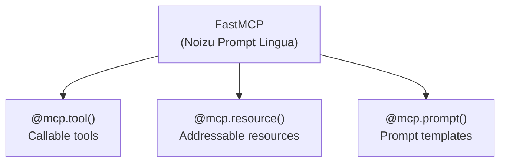
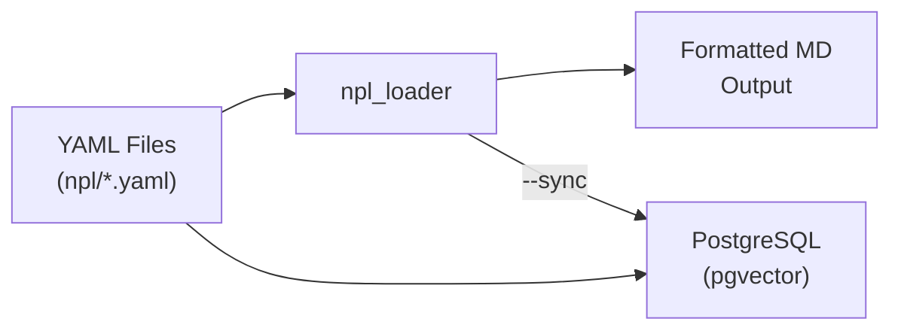
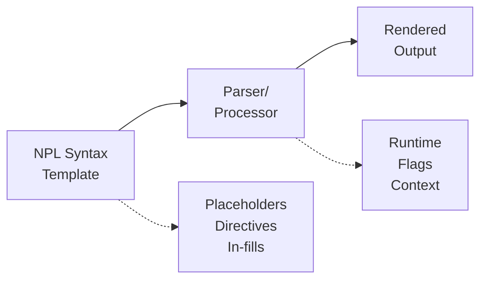
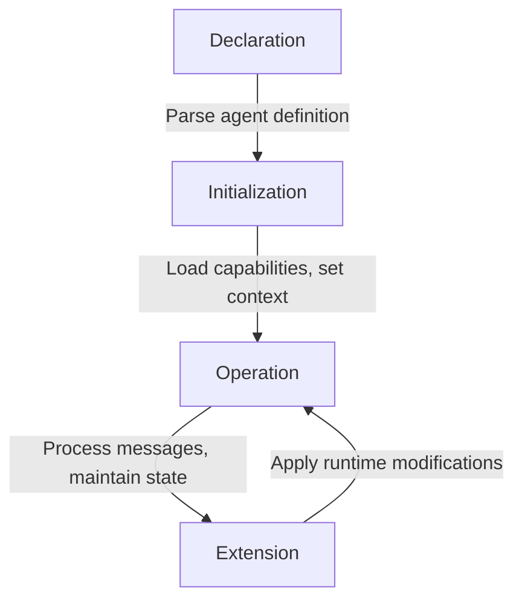
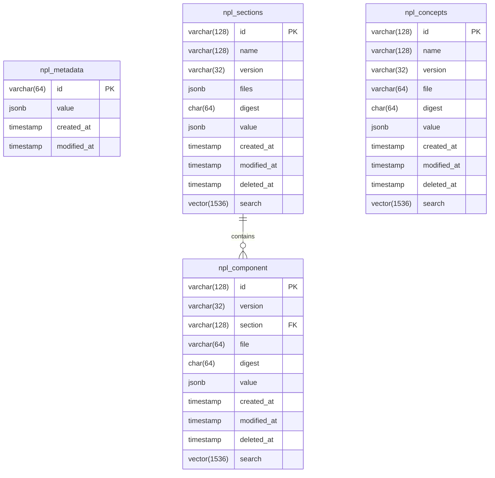

# Project Architecture

This document describes the architectural design of the Noizu Prompt Lingua (NPL) project.

## Overview

NPL is a modular framework for advanced prompt engineering and agent simulation. It provides:

1. **A Specification Language** - YAML-based definitions for prompt construction
2. **An MCP Server** - Model Context Protocol integration for AI tooling
3. **CLI Tools** - Utilities for loading and processing NPL definitions
4. **Database Storage** - PostgreSQL with pgvector for semantic search

## Core Components

### 1. NPL Specification (`npl/`)

The heart of the project - a comprehensive prompt engineering framework defined entirely in YAML:

#### Core Concepts

| Concept | Purpose |
|---------|---------|
| **npl-declaration** | Framework version markers establishing operational context |
| **agent** | Simulated entities with defined behaviors and response patterns |
| **intuition-pump** | Structured reasoning techniques (CoT, reflection, critique) |
| **syntax-element** | Foundational formatting conventions and placeholders |
| **directive** | Specialized instruction patterns for behavior control |
| **prompt-prefix** | Response mode indicators (emoji-based) |

#### YAML Schema Structure

NPL components follow a consistent schema:

```yaml
name: component-name
brief: One-line description
description: Multi-paragraph explanation
purpose: Why this exists and when to use it
labels: [scope, function, domain...]
require: [section.component, ...]  # Cross-file dependencies
references: [section.component, ...]  # For instructional content
components:           # For compound definitions
  - name: sub-element
    syntax:
      - name: variant
        syntax: "pattern"
    labels: [...]
    require: [syntax.placeholder, ...]
    examples:
      - name: example-id
        brief: Description
        priority: 0|1|2
        example: |
          Raw example text
        thread:
          - role: system|user|assistant
            message: content
```

#### Syntax Elements

The syntax system provides building blocks for prompt construction:

- **Placeholders**: `{term}`, `<term>`, `{}` - Value substitution points
- **In-fill**: `[...]`, `[...|qualifier]` - Content generation markers
- **Qualifiers**: `|qualifier` - Constraint/context modifiers
- **Size Indicators**: `:3sentences`, `:2-5items` - Output size control
- **Attention**: `🎯 instruction` - Critical priority markers
- **Literals**: `⟬text⟭` - Exact text reproduction

#### Directives

Specialized control patterns using `⟪emoji: instruction⟫` syntax:

- `⟪▦: columns | content⟫` - Table formatting
- `⟪⏳: condition⟫` - Temporal control
- `⟪⇐: template | context⟫` - Template integration
- `⟪🚀: behavior⟫` - Interactive elements
- `⟪🆔: entity⟫` - Identifier management

#### Special Sections

Block-level constructs with semantic boundaries:

```
⌜agent-name|type|NPL@version⌝
  [agent definition]
⌞agent-name⌟

⌜🔒 secure-prompt ⌟
  [high-precedence instructions]
⌟

⌜🏳️ runtime-flags ⌟
  [behavior modifiers]
⌟
```

### 2. MCP Server (`npl_mcp/`)

A FastMCP-based server providing Model Context Protocol integration:



**Transport**: Server-Sent Events (SSE) for real-time communication

**Current Implementation**:
- `hello_world` tool - Basic greeting functionality
- `greeting://{name}` resource - Personalized greeting resources
- `hello_prompt` - Simple prompt template

The server is designed to be extended with NPL-aware tools for:
- Loading NPL definitions
- Processing prompt templates
- Managing agent configurations

### 3. NPL Loader (`tools/`)

Python tooling for processing NPL definitions:



**CLI Command**: `npl-loader`
- Default: Output formatted markdown from database
- `--sync`: Sync YAML files to database
- `--from-yaml`: Output from YAML files directly
- `--list`: List all YAML files with digests

**Database Configuration** (environment variables):
- `NPL_DB_HOST`, `NPL_DB_PORT`, `NPL_DB_NAME`
- `NPL_DB_USER`, `NPL_DB_PASSWORD`

## Data Flow

### Prompt Processing



### Agent Lifecycle



## Planning & Reasoning

NPL includes structured reasoning patterns (intuition pumps):

| Pattern | Purpose |
|---------|---------|
| `npl-intent` | Document planned approach |
| `npl-cot` | Chain-of-thought decomposition |
| `npl-reflection` | Self-assessment and learning |
| `npl-critique` | Quality evaluation |
| `npl-panel` | Multi-perspective analysis |
| `npl-rubric` | Standardized assessment criteria |

## Taxonomy System

NPL uses a label taxonomy for classifying components:

**Categories**:
- **scope**: inline, block, wrapper
- **function**: variable, generation, modifier, emphasis, escape, meta, definition, container, logic
- **domain**: algorithm, analysis, audio, code, creative, data, dialogue, documentation, formal, language, template, visual
- **priority**: critical, high, normal, low
- **processing**: constraint, guidance, transformation, extraction, classification
- **structure**: framework, configuration, reusable, demonstration

## Extension Points

### Adding New Directives

1. Define directive in `npl/directives.yaml`
2. Add examples with priority levels (0=basic, 1=intermediate, 2=advanced)
3. Include thread examples showing usage patterns
4. Sync to database with `npl-loader --sync`

### Creating New Agents

1. Use agent declaration syntax
2. Specify type: `service`, `tool`, or `person`
3. Define behavioral specifications
4. Register communication aliases

### Adding MCP Tools

1. Add decorated function in `npl_mcp/server.py`
2. Use `@mcp.tool()`, `@mcp.resource()`, or `@mcp.prompt()`
3. Document with proper type hints and docstrings

## Dependencies

- **Python**: >=3.12
- **mcp[cli]**: >=1.25.0 (MCP server framework)
- **pyyaml**: >=6.0 (YAML processing)
- **psycopg2-binary**: >=2.9.9 (PostgreSQL adapter)

## Infrastructure

- **TimescaleDB**: 2.24.0-pg17 (PostgreSQL with time-series and pgvector)
- **Redis**: 8.4.0 (caching and message queue)

## Database Schema

### Entity Relationship Diagram



### Table Descriptions

| Table | Purpose |
|-------|---------|
| **npl_metadata** | Key-value store for configuration (e.g., `section-order`, `convention-definitions`) |
| **npl_sections** | Section-level definitions (syntax, directives, etc.) |
| **npl_component** | Individual components within sections |
| **npl_concepts** | Core NPL concepts from `npl.yaml` |

### Vector Search

All content tables include a `search` column of type `vector(1536)` for semantic similarity search using pgvector with IVFFlat indexing.
