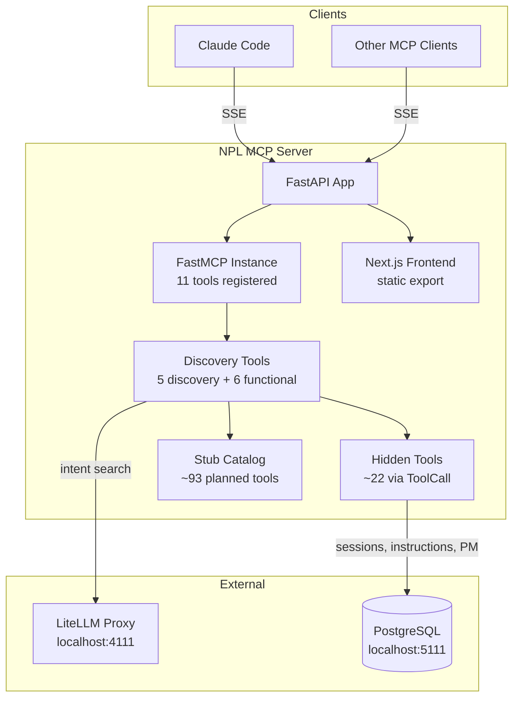

# Project Architecture

## Overview

NPL MCP is a Model Context Protocol (MCP) server built on FastMCP 2.x. Rather than exposing all ~126 tools directly (which overwhelms clients), it uses a **meta tool pattern**: 11 tools are visible at startup (5 discovery + 1 NPL spec + 2 session + 3 instruction). An additional ~22 implemented tools are hidden but callable via `ToolCall`, plus ~93 stub tools for planned features.

The server combines FastMCP for MCP protocol handling, FastAPI for HTTP routing and a Next.js frontend, LiteLLM proxy for LLM-powered features (intent search, image descriptions), and PostgreSQL for persistent storage of sessions, instructions, projects, personas, stories, and secrets.

## System Diagram

```mermaid
graph TB
    subgraph Clients
        CC[Claude Code]
        Other[Other MCP Clients]
    end

    subgraph "NPL MCP Server"
        API[FastAPI App]
        MCP[FastMCP Instance<br/>11 tools registered]
        Meta[Discovery Tools<br/>5 discovery + 6 functional]
        Hidden[Hidden Tools<br/>~22 via ToolCall]
        Stubs[Stub Catalog<br/>~93 planned tools]
        FE[Next.js Frontend<br/>static export]
    end

    subgraph External
        LLM[LiteLLM Proxy<br/>localhost:4111]
        DB[(PostgreSQL<br/>localhost:5111)]
    end

    CC -->|SSE| API
    Other -->|SSE| API
    API --> MCP
    MCP --> Meta
    Meta --> Hidden
    Meta --> Stubs
    Meta -->|intent search| LLM
    Hidden -->|sessions, instructions, PM| DB
    API --> FE
```

## Core Components

| Component | Location | Purpose |
|-----------|----------|---------|
| Launcher | `src/npl_mcp/launcher.py` | `create_app()` + `create_asgi_app()`, CLI, Uvicorn |
| Meta Tools | `src/npl_mcp/meta_tools/` | ToolSummary, ToolSearch, ToolDefinition, ToolHelp, ToolCall |
| NPL Spec | `src/npl_mcp/convention_formatter.py` | NPLSpec tool — generate NPL definitions from convention YAMLs |
| Markdown Tools | `src/npl_mcp/markdown/` | Converter, viewer, filters, image descriptions |
| NPL Parser | `src/npl_mcp/npl/` | YAML loader, syntax parser, reference resolver |
| PM Tools | `src/npl_mcp/pm_tools/` | PRD/story/persona access (file-based + DB-backed CRUD) |
| Instructions | `src/npl_mcp/instructions/` | Versioned instruction documents with embeddings |
| Tool Sessions | `src/npl_mcp/tool_sessions/` | Session tracking by (project, agent, task) triple |
| Browser Tools | `src/npl_mcp/browser/` | ToMarkdown, Ping, Download, Screenshot, Rest, Secret |
| Storage | `src/npl_mcp/storage/` | PostgreSQL async connection pool (asyncpg) |
| Frontend | `frontend/` | Next.js + Tailwind web UI |
| Minimal Server | `src/mcp.py` | Standalone hello-world for quick experiments |

## Meta Tool Pattern

**11 MCP-visible tools** are registered at startup. All ~126 catalog tools are discoverable via meta tools and callable via `ToolCall`.

### Three-Tier Tool Registration

| Tier | Count | Visibility | Description |
|------|-------|------------|-------------|
| MCP-Visible | 11 | In `tools/list` | Direct `@mcp.tool()` registration |
| Hidden/Discoverable | ~22 | Via ToolCall only | Registered via `register_discoverable()` |
| Stubs | ~93 | Discoverable, not callable | Static definitions for planned features |

### Discovery Tools (5)

| Tool | Purpose |
|------|---------|
| **ToolSummary** | Browse catalog: exposed tools, category drill-down, `#Tool` lookup |
| **ToolSearch** | Search by text (substring) or intent (LLM-powered semantic) |
| **ToolDefinition** | Get full definitions for one or more catalog tools by name |
| **ToolHelp** | Get LLM-driven instructions on how to use a tool for a specific task |
| **ToolCall** | Call any catalog tool by name (hidden or stub) |

### Functional Tools (6 MCP-visible)

| Tool | Purpose |
|------|---------|
| **NPLSpec** | Generate NPL definitions from convention YAML files |
| **ToolSession.Generate** | Create/lookup session by (project, agent, task) |
| **ToolSession** | Retrieve session info by UUID |
| **Instructions** | Retrieve versioned instruction documents |
| **Instructions.Create** | Create new instruction with v1 |
| **Instructions.List** | Search instructions by text/intent/tags |

Five browser utility tools are highlighted in ToolSummary's default view: **ToMarkdown**, **Ping**, **Download**, **Screenshot**, **Rest**.

→ *See [arch/meta-tools.md](arch/meta-tools.md) for full details, catalog structure, and LLM configuration*

## Technology Stack

| Layer | Technology | Purpose |
|-------|------------|---------|
| Protocol | MCP (Model Context Protocol) | AI assistant communication standard |
| Framework | FastMCP 2.x | MCP server with dynamic tool management |
| HTTP | FastAPI | ASGI framework, frontend serving |
| Server | Uvicorn | ASGI server with reload support |
| Transport | SSE (Server-Sent Events) | MCP client streaming |
| Database | PostgreSQL (asyncpg) | Persistent storage (localhost:5111) |
| Migrations | Liquibase | YAML-based schema changelogs |
| LLM Proxy | LiteLLM | Intent search, image descriptions (localhost:4111) |
| Frontend | Next.js + Tailwind | Static-exported web UI |

## Request Flow

1. MCP client connects to `/sse` endpoint via Server-Sent Events
2. FastAPI routes the connection to the mounted FastMCP SSE app
3. FastMCP dispatches tool calls to ToolSummary or ToolSearch
4. Meta tools query the static catalog and optionally the LLM proxy
5. Results return via SSE stream

## Module Architecture

| Module | Status | Tools | Description |
|--------|--------|-------|-------------|
| `meta_tools/` | Active | 5 registered | Discovery layer + catalog builder + stub catalog |
| `convention_formatter.py` | Active | 1 registered | NPLSpec — NPL definition generation |
| `markdown/` | Active | 0 (library) | Converter, viewer, caching, filters |
| `npl/` | Active | 0 (library) | NPL YAML loading, syntax parsing |
| `pm_tools/` | Active | 13 hidden | File-based + DB-backed PRD/story/persona CRUD |
| `instructions/` | Active | 3 registered + 3 hidden | Versioned instructions with vector embeddings |
| `tool_sessions/` | Active | 2 registered | Session tracking by (project, agent, task) |
| `browser/` | Active | 5 hidden + 28 stubs | ToMarkdown, Ping, Download, Screenshot, Rest + stubs |
| `storage/` | Active | 0 (library) | PostgreSQL async connection pool (asyncpg) |
| `artifacts/` | Stub | 5 (in catalog) | Versioned artifact management |
| `chat/` | Stub | 8 (in catalog) | Event-sourced chat rooms |
| `tasks/` | Stub | 13 (in catalog) | Task queue management |
| `executors/` | Stub | 11 (in catalog) | Agent lifecycle management |
| `sessions/` | Stub | 4 (in catalog) | Session lifecycle |
| `scripts/` | Stub | 5 (in catalog) | Shell script wrappers |

## Entry Points

| Entry Point | Command | Description |
|-------------|---------|-------------|
| Recommended | `uv run npl-mcp` | Full server with CLI options |
| Console script | `npl-mcp` | Full server (requires package installed) |
| Module | `uv run -m npl_mcp` | Same as console script via module |
| Minimal | `uv run src/mcp.py` | Hello-world server only |

## Key Design Decisions

- **Three-tier tool registration**: MCP-visible (11) for core functionality, hidden (22) callable via ToolCall, stubs (93) for planned features
- **FastMCP 2.x**: MCP server framework with SSE transport
- **LiteLLM proxy**: Routes LLM calls through a local proxy for model flexibility and key management
- **Dynamic catalog builder**: Merges MCP-registered, hidden, and stub tools into a unified ~126-tool catalog
- **PostgreSQL for state**: Sessions, instructions, projects, personas, stories, and secrets all DB-backed
- **Next.js static export**: Frontend builds to `web/static/` and is served by FastAPI middleware

## Agent Orchestration

The project implements a TDD-driven workflow system with 5 specialized agents that transform feature ideas into tested code:

1. **npl-idea-to-spec** → Personas + user stories
2. **npl-prd-editor** → PRD documents
3. **npl-tdd-tester** → Test suites
4. **npl-tdd-coder** → Implementation (runs until tests pass)
5. **npl-tdd-debugger** → Root cause analysis on failures

→ *See [arch/agent-orchestration.summary.md](arch/agent-orchestration.summary.md) for details*

## Configuration

| Flag / Env Var | Default | Description |
|----------------|---------|-------------|
| `--host` | 127.0.0.1 | Server bind address |
| `--port` | 8765 | Server port |
| `--status` | - | Check if server is running |
| `--no-frontend` | - | Skip frontend build |
| `--reload` | - | Auto-reload on file changes |
| `NPL_LITELLM_URL` | `http://localhost:4111/v1` | LiteLLM proxy URL |
| `NPL_LITELLM_KEY` | `sk-litellm-master-key-12345` | LiteLLM API key |
| `NPL_LITELLM_MODEL` | `groq/openai/gpt-oss-120b` | Default model for intent search |

## Infrastructure

| Service | Port | Purpose |
|---------|------|---------|
| NPL MCP Server | 8765 | MCP SSE + web UI |
| LiteLLM Proxy | 4111 | LLM routing |
| PostgreSQL | 5111 | Database (`npl`) |

Services defined in `docker-compose.yaml` (PostgreSQL) with init scripts in `docker/postgres-init/`. Schema managed by Liquibase changelogs in `liquibase/`.
