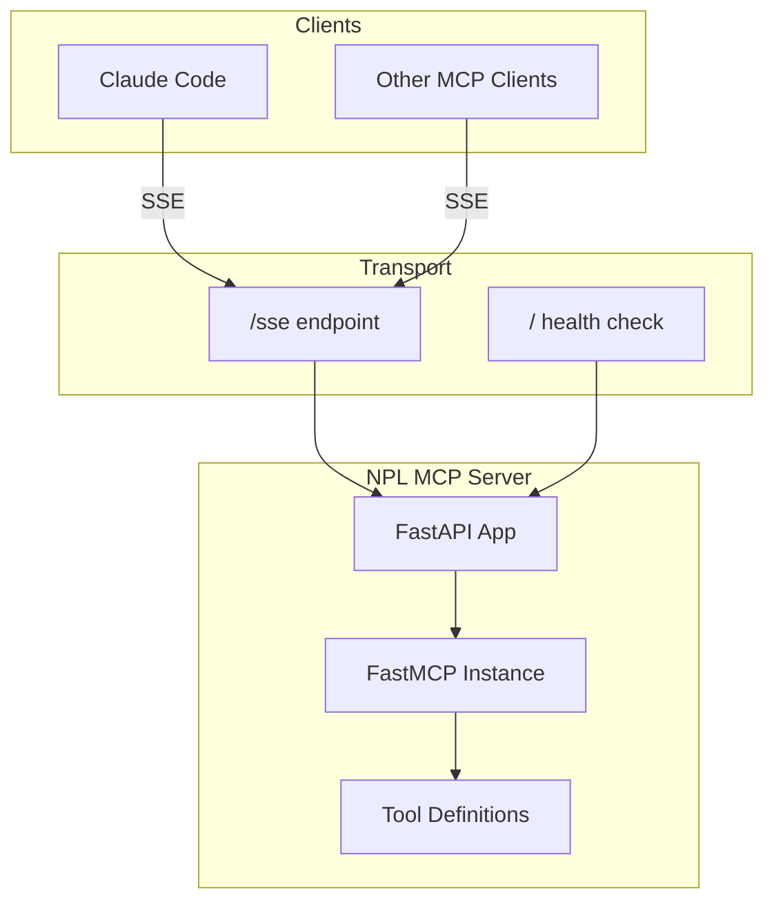

# Project Architecture

## Overview

NPL MCP is a Model Context Protocol (MCP) server built on FastMCP. It exposes tools to AI assistants (like Claude) via Server-Sent Events (SSE). The project provides two server variants: a minimal hello-world example for prototyping and a full-featured launcher with CLI management capabilities.

The architecture follows a simple layered approach: FastMCP handles tool registration and MCP protocol details, FastAPI provides HTTP routing, and Uvicorn serves as the ASGI server.

## System Diagram

```mermaid
graph TB
    subgraph Clients
        CC[Claude Code]
        Other[Other MCP Clients]
    end

    subgraph "NPL MCP Server"
        API[FastAPI App]
        MCP[FastMCP Instance]
        Tools[Tool Definitions]
    end

    subgraph Transport
        SSE["/sse endpoint"]
        Health["/ health check"]
    end

    CC -->|SSE| SSE
    Other -->|SSE| SSE
    SSE --> API
    API --> MCP
    MCP --> Tools
    Health --> API
```

## Core Components

| Component | Location | Purpose |
|-----------|----------|---------|
| FastMCP Instance | `src/npl_mcp/launcher.py` | Tool registration and MCP protocol handling |
| FastAPI App | `src/npl_mcp/launcher.py` | HTTP routing, health checks, SSE mount |
| Minimal Server | `src/mcp.py` | Standalone hello-world for quick experiments |
| CLI Launcher | `src/npl_mcp/launcher.py` | Server start/stop, status checks, port config |

## Request Flow

1. MCP client connects to `/sse` endpoint via Server-Sent Events
2. FastAPI routes the connection to the mounted FastMCP app
3. FastMCP handles the MCP protocol, dispatching tool calls
4. Tool functions execute and return results via SSE stream

## Technology Stack

| Layer | Technology | Purpose |
|-------|------------|---------|
| Protocol | MCP (Model Context Protocol) | AI assistant communication standard |
| Framework | FastMCP | MCP server implementation |
| HTTP | FastAPI | ASGI web framework |
| Server | Uvicorn | ASGI server |
| Transport | SSE (Server-Sent Events) | Bidirectional streaming |

## Entry Points

| Entry Point | Command | Description |
|-------------|---------|-------------|
| Console script | `npl-mcp` | Full server with CLI options |
| Module | `python -m npl_mcp` | Same as console script |
| Direct | `python src/mcp.py` | Minimal hello-world server |

## Available Tools

| Tool | Description |
|------|-------------|
| `hello-world` | Returns a greeting message |
| `echo` | Echoes back provided text (full server only) |

## Key Design Decisions

- **FastMCP over raw MCP SDK**: Simplifies tool registration with decorators
- **SSE transport**: Enables real-time bidirectional communication without WebSockets complexity
- **Two server variants**: Minimal for learning/testing, full for production use
- **FastAPI wrapper**: Allows adding custom endpoints (health checks) alongside MCP

## Agent Orchestration

The project implements a TDD-driven workflow system that coordinates multiple specialized agents (idea-to-spec, prd-editor, tdd-tester, tdd-coder, tdd-debugger) to transform feature ideas into tested, production-ready code. Each agent operates autonomously within a defined phase, with a controller orchestrating the overall workflow from discovery through implementation.

→ *See [arch/agent-orchestration.md](arch/agent-orchestration.md) for details*

## Configuration

| Flag | Default | Description |
|------|---------|-------------|
| `--host` | 127.0.0.1 | Server bind address |
| `--port` | 8765 | Server port |
| `--status` | - | Check if server is running |
