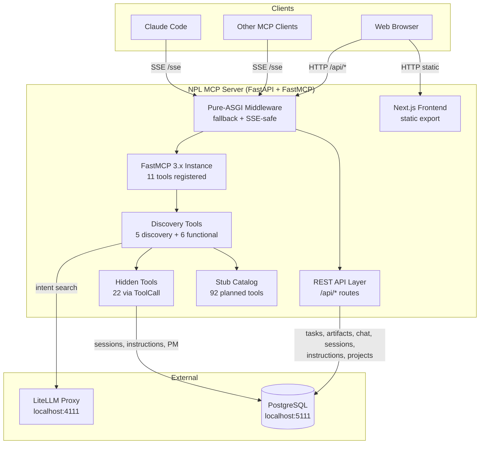

# Project Architecture

## Overview

NPL MCP is a Model Context Protocol (MCP) server built on FastMCP 3.x. Rather than exposing all ~125 tools directly (which overwhelms clients), it uses a **meta tool pattern**: 11 tools are visible at startup (5 discovery + 1 NPL spec + 2 session + 3 instruction). An additional 22 implemented tools are hidden but callable via `ToolCall`, plus 92 stub tools for planned features. Every MCP-visible tool carries hierarchical `tags` and NPL-specific `meta` (`npl_category`, `npl_discoverable`) so 3.x-native clients can group and filter tools natively.

The server combines FastMCP for MCP protocol handling, FastAPI for HTTP routing and a Next.js frontend, LiteLLM proxy for LLM-powered features (intent search, image descriptions), and PostgreSQL for persistent storage of sessions, instructions, projects, personas, stories, and secrets.

## System Diagram

```mermaid
graph TB
    subgraph Clients
        CC[Claude Code]
        Other[Other MCP Clients]
        Browser[Web Browser]
    end

    subgraph "NPL MCP Server (FastAPI + FastMCP)"
        MW[Pure-ASGI Middleware<br/>fallback + SSE-safe]
        MCP[FastMCP 3.x Instance<br/>11 tools registered]
        REST[REST API Layer<br/>/api/* routes]
        Meta[Discovery Tools<br/>5 discovery + 6 functional]
        Hidden[Hidden Tools<br/>22 via ToolCall]
        Stubs[Stub Catalog<br/>92 planned tools]
        FE[Next.js Frontend<br/>static export]
    end

    subgraph External
        LLM[LiteLLM Proxy<br/>localhost:4111]
        DB[(PostgreSQL<br/>localhost:5111)]
    end

    CC -->|SSE /sse| MW
    Other -->|SSE /sse| MW
    Browser -->|HTTP /api/*| MW
    Browser -->|HTTP static| FE
    MW --> MCP
    MW --> REST
    MCP --> Meta
    Meta --> Hidden
    Meta --> Stubs
    Meta -->|intent search| LLM
    Hidden -->|sessions, instructions, PM| DB
    REST -->|tasks, artifacts, chat, sessions,<br/>instructions, projects| DB
```

## Core Components

| Component | Location | Purpose |
|-----------|----------|---------|
| Launcher | `src/npl_mcp/launcher.py` | `create_app()` + `create_asgi_app()`, CLI, Uvicorn |
| REST API Router | `src/npl_mcp/api/router.py` | All `/api/*` HTTP endpoints (CRUD for tasks, artifacts, chat, sessions, instructions, projects, metrics, orchestration) |
| Meta Tools | `src/npl_mcp/meta_tools/` | Discovery tools (ToolSummary, ToolSearch, ToolDefinition, ToolHelp, ToolCall) + catalog builder + `mcp_discoverable` helper + stub catalog |
| NPL Spec | `src/npl_mcp/convention_formatter.py` | NPLSpec tool — generate NPL definitions from convention YAMLs |
| Markdown Tools | `src/npl_mcp/markdown/` | Converter, viewer, filters, image descriptions |
| NPL Parser | `src/npl_mcp/npl/` | YAML loader, syntax parser, reference resolver |
| PM Tools | `src/npl_mcp/pm_tools/` | PRD/story/persona access (file-based + DB-backed CRUD) |
| Instructions | `src/npl_mcp/instructions/` | Versioned instruction documents with embeddings |
| Tool Sessions | `src/npl_mcp/tool_sessions/` | Session tracking by (project, agent, task) triple |
| Artifacts | `src/npl_mcp/artifacts/` | Versioned artifact CRUD + revision history |
| Chat | `src/npl_mcp/chat/` | Chat rooms + messages (REST CRUD, npl_chat_rooms/messages) |
| Work Sessions | `src/npl_mcp/sessions/` | Generic work-session lifecycle (npl_generic_sessions) |
| Tasks | `src/npl_mcp/tasks/` | Task CRUD with status transitions (npl_tasks) |
| Browser Tools | `src/npl_mcp/browser/` | ToMarkdown, Ping, Download, Screenshot, Rest, Secret |
| Storage | `src/npl_mcp/storage/` | PostgreSQL async connection pool (asyncpg) |
| Frontend | `frontend/` | Next.js + Tailwind web UI with hybrid REST/mock API facade |
| Minimal Server | `src/mcp.py` | Standalone hello-world for quick experiments |

## Meta Tool Pattern

**11 MCP-visible tools** are registered at startup. All ~125 catalog tools are discoverable via meta tools and callable via `ToolCall`.

### Three-Tier Tool Registration

| Tier | Count | Visibility | Description |
|------|-------|------------|-------------|
| MCP-Visible | 11 | In `tools/list` | Registered via `@mcp_discoverable(mcp, ...)` (combines `@mcp.tool` + `@discoverable`, auto-populates tags/meta) |
| Hidden/Discoverable | 22 | Via `ToolCall` only | Registered via `register_discoverable()`; tags auto-derived from category |
| Stubs | 92 | In catalog, not callable | Static definitions for planned features; tags derived at catalog-build time |

`ToolCall` returns one of four statuses: the dispatched result, `"mcp"` (tool is in FastMCP — call via MCP protocol directly), `"stub"` (no implementation), or `"error"` (not found / invocation failed).

### Discovery Tools (5)

| Tool | Purpose |
|------|---------|
| **ToolSummary** | Browse catalog: exposed tools, category drill-down, `#Tool` lookup |
| **ToolSearch** | Search by text (substring) or intent (LLM-powered semantic) |
| **ToolDefinition** | Get full definitions for one or more catalog tools by name |
| **ToolHelp** | Get LLM-driven instructions on how to use a tool for a specific task |
| **ToolCall** | Call any catalog tool by name (hidden or stub) |

### Functional Tools (6 MCP-visible)

| Tool | Purpose |
|------|---------|
| **NPLSpec** | Generate NPL definitions from convention YAML files |
| **ToolSession.Generate** | Create/lookup session by (project, agent, task) |
| **ToolSession** | Retrieve session info by UUID |
| **Instructions** | Retrieve versioned instruction documents |
| **Instructions.Create** | Create new instruction with v1 |
| **Instructions.List** | Search instructions by text/intent/tags |

→ *See [arch/meta-tools.md](arch/meta-tools.md) for full details, catalog structure, and LLM configuration*

## Technology Stack

| Layer | Technology | Purpose |
|-------|------------|---------|
| Protocol | MCP (Model Context Protocol) | AI assistant communication standard |
| Framework | FastMCP 3.x (`>=3.0.0,<4.0.0`) | MCP server with provider-based tool management |
| HTTP | FastAPI | ASGI framework, frontend serving |
| Server | Uvicorn | ASGI server with reload support |
| Middleware | Pure ASGI (`FrontendFallbackMiddleware`) | File fallback on 404; SSE-safe (does not buffer bodies) |
| Transport | SSE (Server-Sent Events) | MCP client streaming |
| Database | PostgreSQL (asyncpg) | Persistent storage (localhost:5111) |
| Migrations | Liquibase | YAML-based schema changelogs |
| LLM Proxy | LiteLLM | Intent search, image descriptions (localhost:4111) |
| Frontend | Next.js + Tailwind | Static-exported web UI |

## Request Flow

1. MCP client connects to `/sse` endpoint via Server-Sent Events
2. FastAPI's pure-ASGI `FrontendFallbackMiddleware` passes the request through untouched (only buffers GET responses headed for a 404 file fallback)
3. The FastMCP SSE sub-app (mounted at `/sse`) handles the MCP handshake and tool dispatch
4. `await mcp.list_tools()` / `mcp.get_tool(name)` are served by FastMCP's `LocalProvider`; our catalog builder consumes `list_tools()` during `build_catalog()`
5. Meta tools query the unified catalog (MCP + hidden + stubs) and optionally the LLM proxy
6. Results return via SSE stream

## Module Architecture

| Module | Status | MCP Tools | REST Endpoints | Description |
|--------|--------|-----------|----------------|-------------|
| `meta_tools/` | Active | 5 registered | — | Discovery layer + catalog builder + stub catalog |
| `convention_formatter.py` | Active | 1 registered | — | NPLSpec — NPL definition generation |
| `markdown/` | Active | 0 (library) | `POST /api/browser/to-markdown` | Converter, viewer, caching, filters |
| `npl/` | Active | 0 (library) | `GET /api/npl/elements`, `GET /api/npl/coverage` | NPL YAML loading, syntax parsing |
| `pm_tools/` | Active | 13 hidden + 8 stubs | `GET /api/projects*`, `POST /api/projects` | DB-backed project/persona/story CRUD |
| `instructions/` | Active | 3 registered + 3 hidden | `GET/POST /api/instructions*` | Versioned instructions with vector embeddings |
| `tool_sessions/` | Active | 2 registered | `GET /api/sessions*` | Session tracking by (project, agent, task) |
| `artifacts/` | Active | — | `GET/POST /api/artifacts*` | Versioned artifact CRUD + revision history |
| `chat/` | Active | — | `GET/POST /api/chat/rooms*` | Chat rooms + messages (npl_chat_rooms/messages) |
| `sessions/` | Active | — | `GET/POST /api/work-sessions*` | Generic work-session lifecycle |
| `tasks/` | Active | — | `GET/POST/PATCH /api/tasks*` | Task CRUD with status transitions |
| `browser/` | Active | 6 hidden + 32 stubs | — | ToMarkdown, Ping, Download, Screenshot, Rest, Secret |
| `storage/` | Active | 0 (library) | — | PostgreSQL async connection pool (asyncpg) |
| `executors/` | Stub | 11 (in catalog) | — | Agent lifecycle management |
| `scripts/` | Stub | 5 (in catalog) | — | Shell script wrappers |

## Frontend Architecture

The Next.js frontend (`frontend/`) uses a **pluggable API facade** pattern. All pages import from `lib/api/client.ts` — a stable surface that delegates to an implementation module:

| Impl | File | When used |
|------|------|-----------|
| `hybrid` | `impl/hybrid.ts` | **Active** — REST for live endpoints, mock for unimplemented |
| `rest` | `impl/rest.ts` | Full REST (swap import to go all-live) |
| `mock` | `impl/mock.ts` | All mock data (no backend required) |

The hybrid impl currently routes: tasks, artifacts, sessions, instructions, projects, chat, agents, tools, skills, docs → REST. NPL load/spec → mock (MCP-only, no REST equivalent).

Key frontend primitives added in Waves A–P: full design token system (violet-indigo palette, 5 surface tiers, Geist fonts), 30+ primitive components, composites (FilterBar, DetailHeader, TabBar), toast notification system, and QuickCreateModal (global ✨ New flow accessible from any page).

## Entry Points

| Entry Point | Command | Description |
|-------------|---------|-------------|
| Recommended | `uv run npl-mcp` | Full server with CLI options |
| Console script | `npl-mcp` | Full server (requires package installed) |
| Module | `uv run -m npl_mcp` | Same as console script via module |
| Minimal | `uv run src/mcp.py` | Hello-world server only |

## Key Design Decisions

- **Three-tier tool registration**: MCP-visible (11) for core functionality, hidden (22) callable via ToolCall, stubs (92) for planned features
- **FastMCP 3.x**: Upgraded from 2.x. Uses `list_tools()`/`get_tool()` public API; keeps a custom catalog layer rather than adopting `AggregateProvider` — our three-tier merge (MCP + hidden + stubs) and hierarchical categories have no native equivalent in 3.x's flat tag system and version-based merge
- **Hidden-but-callable preserved as custom code**: 3.x's `enabled=False` makes tools both invisible *and* uncallable via `mcp.call_tool()`. Our `@discoverable` + `_DISCOVERABLE_TOOLS` registry provides the hidden-yet-callable semantic 3.x cannot express natively
- **3.x-native metadata populated alongside**: Every MCP-registered tool carries `tags` (derived from category hierarchy) and `meta` (`npl_category`, `npl_discoverable`), so 3.x-native clients can filter/group without reading our catalog structures
- **`mcp_discoverable` helper**: Single decorator replaces the `@mcp.tool + @discoverable` stack; auto-derives tags/meta from NPL category
- **Pure-ASGI fallback middleware**: `BaseHTTPMiddleware` buffered response bodies and crashed SSE (empty 202s on `/sse/messages/`). Replaced with a pure ASGI middleware that only intercepts 404 GETs and leaves streaming responses untouched
- **LiteLLM proxy**: Routes LLM calls through a local proxy for model flexibility and key management
- **Dynamic catalog builder**: Merges MCP-registered, hidden, and stub tools into a unified 125-tool catalog
- **PostgreSQL for state**: Sessions, instructions, projects, personas, stories, artifacts, tasks, chat, and secrets all DB-backed; schema managed by Liquibase (13 changesets)
- **Next.js static export**: Frontend builds to `web/static/` and is served by the FastAPI fallback middleware
- **Frontend API facade**: `lib/api/client.ts` is a stable interface; switching from mock → REST requires changing a single import. The `hybrid` impl mixes live REST and mock per domain, enabling incremental feature rollout
- **REST API parallel to MCP**: The `/api/*` router serves the web UI directly (CRUD for tasks, artifacts, chat, etc.); MCP SSE serves AI clients. Same PostgreSQL backend, different access paths

## Agent Orchestration

The project implements a TDD-driven workflow system with 5 specialized agents that transform feature ideas into tested code, plus utility agents:

1. **npl-idea-to-spec** → Personas + user stories
2. **npl-prd-editor** → PRD documents
3. **npl-tdd-tester** → Test suites
4. **npl-tdd-coder** → Implementation (runs until tests pass)
5. **npl-tdd-debugger** → Root cause analysis on failures
6. **npl-winnower** → Response winnowing and quality filtering
7. **npl-tasker-*** → Task execution agents (haiku/fast/sonnet/opus/ultra)

→ *See [arch/agent-orchestration.summary.md](arch/agent-orchestration.summary.md) for details*
→ *See [winnower-design.md](winnower-design.md) for winnower agent spec*

## Configuration

| Flag / Env Var | Default | Description |
|----------------|---------|-------------|
| `--host` | 127.0.0.1 | Server bind address |
| `--port` | 8765 | Server port |
| `--status` | - | Check if server is running |
| `--no-frontend` | - | Skip frontend build |
| `--reload` | - | Auto-reload on file changes |
| `NPL_LITELLM_URL` | `http://localhost:4111/v1` | LiteLLM proxy URL |
| `NPL_LITELLM_KEY` | `sk-litellm-master-key-12345` | LiteLLM API key |
| `NPL_LITELLM_MODEL` | `groq/openai/gpt-oss-120b` | Default model for intent search |

## Infrastructure

| Service | Port | Purpose |
|---------|------|---------|
| NPL MCP Server | 8765 | MCP SSE + web UI |
| LiteLLM Proxy | 4111 | LLM routing |
| PostgreSQL | 5111 | Database (`npl`) |

Services defined in `docker-compose.yaml` (PostgreSQL) with init scripts in `docker/postgres-init/`. Schema managed by Liquibase changelogs in `liquibase/`.
