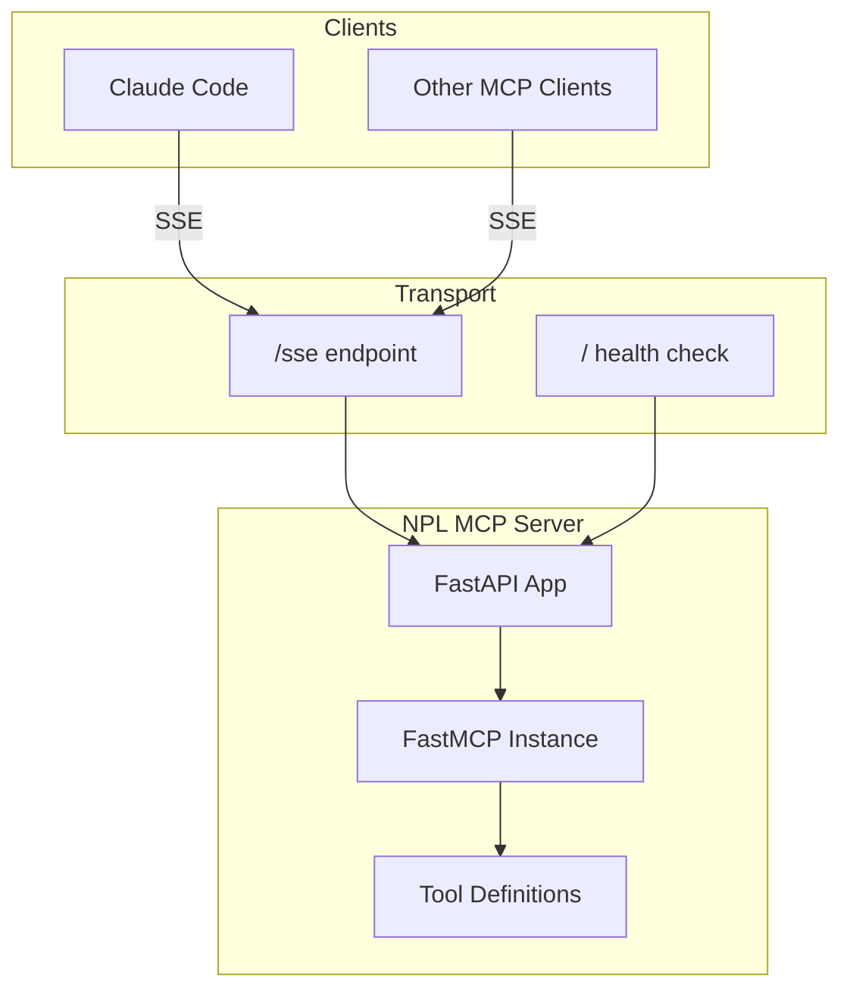

# Project Architecture

## Overview

NPL MCP is a Model Context Protocol (MCP) server built on FastMCP. It exposes tools to AI assistants (like Claude) via Server-Sent Events (SSE). The project provides two server variants:

1. **Minimal Server** (`src/mcp.py`) - Hello-world example for prototyping
2. **Full Server** (`src/npl_mcp/launcher.py`) - Production server with CLI management

The architecture follows a simple layered approach: FastMCP handles tool registration and MCP protocol details, FastAPI provides HTTP routing and health checks, and Uvicorn serves as the ASGI server.

## System Diagram

```mermaid
graph TB
    subgraph Clients
        CC[Claude Code]
        Other[Other MCP Clients]
    end

    subgraph "NPL MCP Server"
        API[FastAPI App]
        MCP[FastMCP Instance]
        Tools[Tool Definitions]
    end

    subgraph Transport
        SSE["/sse endpoint"]
        Health["/ health check"]
    end

    CC -->|SSE| SSE
    Other -->|SSE| SSE
    SSE --> API
    API --> MCP
    MCP --> Tools
    Health --> API
```

## Core Components

| Component | Location | Purpose |
|-----------|----------|---------|
| Minimal Server | `src/mcp.py` | Standalone hello-world for quick experiments |
| Full Server | `src/npl_mcp/launcher.py` | FastMCP + FastAPI + CLI options (status, port/host config) |
| Console Script | `pyproject.toml` | Defines `npl-mcp` entry point → `npl_mcp.launcher:main` |
| Module Entry | `src/npl_mcp/__main__.py` | Enables `python -m npl_mcp` invocation |

## Request Flow

1. MCP client connects to `/sse` endpoint via Server-Sent Events
2. FastAPI routes the connection to the mounted FastMCP app
3. FastMCP handles the MCP protocol, dispatching tool calls
4. Tool functions execute and return results via SSE stream

## Technology Stack

| Layer | Technology | Purpose |
|-------|------------|---------|
| Protocol | MCP (Model Context Protocol) | AI assistant communication standard |
| Framework | FastMCP | MCP server implementation |
| HTTP | FastAPI | ASGI web framework |
| Server | Uvicorn | ASGI server |
| Transport | SSE (Server-Sent Events) | Bidirectional streaming |

## Entry Points

| Entry Point | Command | Description |
|-------------|---------|-------------|
| Recommended | `uv run npl-mcp` | Full server with CLI options (uses uv) |
| Console script | `npl-mcp` | Full server (requires package installed) |
| Module | `uv run -m npl_mcp` | Same as console script via module |
| Direct minimal | `uv run src/mcp.py` | Minimal hello-world server |
| Python direct | `python src/mcp.py` | Minimal server without uv |

## Available Tools

| Tool | Description |
|------|-------------|
| `hello-world` | Returns a greeting message |
| `echo` | Echoes back provided text (full server only) |

→ *See [claude/tools.summary.md](claude/tools.summary.md) for Claude Code built-in tools reference*

## Requirements & Specifications

Features are expressed through **user stories** organized around specific personas, which generate **PRD documents** that guide the TDD implementation workflow.

### Personas

The system defines personas across three categories:

**Core User Personas** (7 primary personas):
- P-001: AI Agent (autonomous programmatic automation)
- P-002: Product Manager (non-technical dashboards)
- P-003: Vibe Coder (rapid prototyping developer)
- P-004: Project Manager (agent coordination and task tracking)
- P-005: Dave the Fellow Developer (code review and quality)
- P-006: Control Agent (orchestration and workflow management)
- P-007: Sub-Agent (task execution and reliability)

**Specialized Agents** (16+ agents organized by domain):
- Core Agents: NPL Author, NPL FIM, NPL Grader, NPL QA, NPL Persona, NPL PRD Manager, etc.
- Infrastructure Agents: Build Manager, Code Reviewer, Prototyper
- Quality Assurance: Tester, Validator, Benchmarker, Integrator
- User Experience: Accessibility, Onboarding, Performance
- Research: Claude Optimizer, Performance Monitor, Cognitive Load Assessor
- Project Management: Coordinator, Risk Monitor, Technical Reality Checker
- Marketing: Community, Conversion, Marketing Copy, Positioning

→ *See [personas/](personas/) for detailed persona definitions, [personas/index.yaml](personas/index.yaml) for relationship metadata*

### User Stories

37 user stories organized into 7 PRD priority groups:

| Group | Count | Scope |
|-------|-------|-------|
| NPL Load | 4 | Loading prompt conventions and NPL components |
| Chat/Collaboration | 7 | Real-time messaging and collaboration features |
| Artifacts/Reviews | 5 | Versioned artifacts and review workflows |
| Task Queue | 7 | Task management and queue operations |
| Browser/Screenshots | 7 | Browser automation and visual testing |
| Agent Coordination | 3 | Monitoring and coordinating AI agents |
| Human-Agent Collaboration | 4 | Developer-AI pair programming and interaction |

→ *See [user-stories.md](user-stories.md) for overview, [user-stories/](user-stories/) for individual stories*

### Product Requirement Documents

PRDs transform user stories into actionable specifications with functional/non-functional requirements, API specifications, and testing strategies.

→ *See [prd.md](prd.md) for detailed format, [prd.summary.md](prd.summary.md) for overview*

## Key Design Decisions

- **FastMCP over raw MCP SDK**: Simplifies tool registration with decorators
- **SSE transport**: Enables real-time bidirectional communication without WebSockets complexity
- **Two server variants**: Minimal for learning/testing, full for production use
- **FastAPI wrapper**: Allows adding custom endpoints (health checks) alongside MCP

## Agent Orchestration

The project implements a TDD-driven workflow system that coordinates multiple specialized agents (idea-to-spec, prd-editor, tdd-tester, tdd-coder, tdd-debugger) to transform feature ideas into tested, production-ready code. Each agent operates autonomously within a defined phase, with a controller orchestrating the overall workflow from discovery through implementation.

The workflow processes feature ideas through:
1. **Persona Definitions** (`docs/personas/`) - Establish user perspectives
2. **User Stories** (`docs/user-stories/`) - Capture feature requirements
3. **PRDs** (`.prd/`) - Detailed specifications (per PRD spec)
4. **Tests** (`tests/`) - Test-driven development
5. **Implementation** (`src/`) - Production code

→ *See [arch/agent-orchestration.summary.md](arch/agent-orchestration.summary.md) for details*

## Configuration

| Flag | Default | Description |
|------|---------|-------------|
| `--host` | 127.0.0.1 | Server bind address |
| `--port` | 8765 | Server port |
| `--status` | - | Check if server is running |
