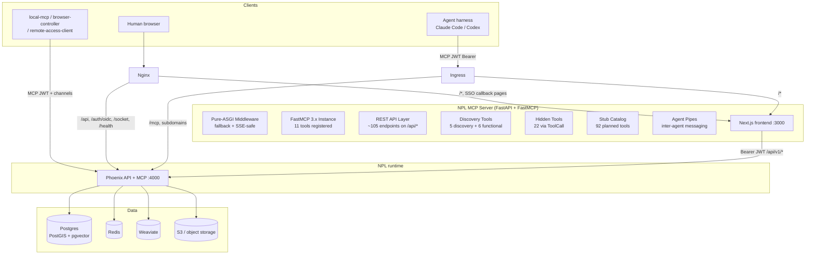
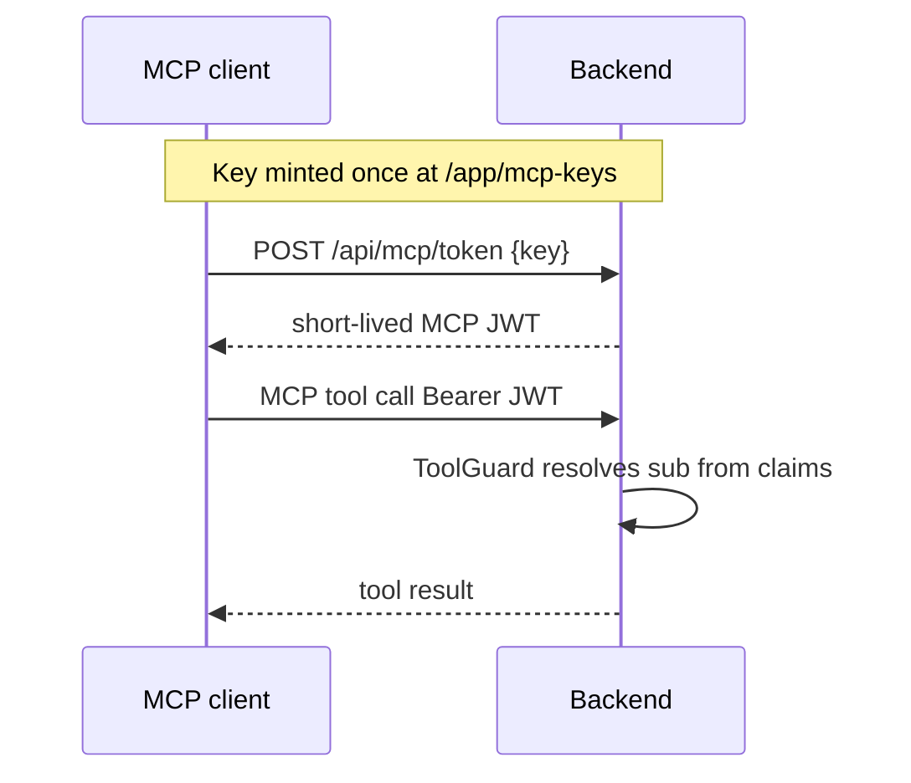

# Architecture — NoizuPromptLingo (NPL / tobor)

Multi-tenant collaboration platform for AI coding-agent harnesses and the humans supervising them. Agents get durable org/project-scoped infrastructure (sessions, tickets, chat, wiki, memory, versioned prompts) via **MCP** (`tobor-*` servers). Humans use a Next.js web app for the same domains. This codebase *is* tobor — monorepo Claude sessions that call `tobor-sessions` / `tobor-organizations` hit this product.

Elixir/Next.js rewrite of a deprecated Python build (see `FEATURE-PARITY-AUDIT.md`). “Prompt Lingua” specifically names the NPL convention engine (`/api/v1/npl/*`, `priv/conventions/`); most surface area is general agent/human work coordination.

The server combines FastMCP for MCP protocol handling, FastAPI for HTTP routing (~105 REST endpoints) and a Next.js frontend, LiteLLM proxy for LLM-powered features (intent search, image descriptions), and PostgreSQL for persistent storage of sessions, instructions, projects, personas, stories, artifacts, pipes, and secrets. A companion `npl_persona` CLI package provides offline persona simulation, journal management, and team coordination. An `orchestration/` module provides sequential pipeline execution with quality gates and a pattern registry, driving the TDD workflow pipeline and UI-triggered orchestration runs.

Three runtime containers (nginx → Phoenix backend + Next.js frontend) share external Postgres (PostGIS + pgvector) and Redis. The backend owns all product domains under `lib/noizu_prompt_lingua/domains/` and exposes **20+ MCP servers** on host-scoped paths (`sessions.<host>/mcp`, `tickets.<host>/mcp`, …) plus a host-less root aggregator at `/mcp`. Each MCP server implements the same five discovery tools (`ToolSummary`, `ToolSearch`, `ToolDefinition`, `ToolCall`, `ToolHelp`); semantic search is Weaviate-backed.

**Tenancy spine:** Organization → Project → Session. Sessions group rooms, artifacts, and tickets for a unit of work. Membership is coarse (`owner|admin|lead|member|viewer`); fine-grained access uses PBAC v2 (groups, JSON policies, scoped memberships, custom roles) with a policy simulator.

**Two auth paths (deliberately separate):**

| Actor | Flow |
|-------|------|
| **Humans** | Authentik OIDC → SSO code exchange → Guardian access/refresh JWT. Password/magic-link routes exist in UI but are disabled server-side; registration is invite-token gated. |
| **Agents / MCP** | User mints long-lived `McpApiKey` (shown once) → `POST /api/mcp/token` (or `/api/v1/auth/mcp/token`) → short-lived MCP JWT as Bearer. Identity for tool calls is resolved **server-side** from JWT claims (`MCP.ToolGuard` / `MCP.Resolve`), never from caller-supplied actor args. |

## System diagram

```mermaid
graph TB
  subgraph Clients
    Browser[Human browser]
    Harness[Agent harness<br/>Claude Code / Codex]
    LocalTools[local-mcp / browser-controller<br/>/ remote-access-client]
  end

    subgraph "NPL MCP Server (FastAPI + FastMCP)"
        MW[Pure-ASGI Middleware<br/>fallback + SSE-safe]
        MCP[FastMCP 3.x Instance<br/>11 tools registered]
        REST[REST API Layer<br/>~105 endpoints on /api/*]
        Meta[Discovery Tools<br/>5 discovery + 6 functional]
        Hidden[Hidden Tools<br/>22 via ToolCall]
        Stubs[Stub Catalog<br/>92 planned tools]
        Pipes[Agent Pipes<br/>inter-agent messaging]
        FE[Next.js Frontend<br/>static export]
    end

  subgraph "NPL runtime"
    FE[Next.js frontend :3000]
    BE[Phoenix API + MCP :4000]
  end

  subgraph Data
    PG[(Postgres<br/>PostGIS + pgvector)]
    Redis[(Redis)]
    WV[(Weaviate)]
    S3[(S3 / object storage)]
  end

  Browser --> Nginx
  Harness -->|MCP JWT Bearer| Ingress
  LocalTools -->|MCP JWT + channels| BE
  Nginx -->|"/api, /auth/oidc, /socket, /health"| BE
  Nginx -->|"/*, SSO callback pages"| FE
  Ingress -->|/mcp, subdomains| BE
  Ingress -->|/*| FE
  BE --> PG
  BE --> Redis
  BE --> WV
  BE --> S3
  FE -->|Bearer JWT /api/v1/*| BE
```

```mermaid
graph LR
  subgraph Tenancy
    Org[Organization] --> Proj[Project]
    Org --> Sess[Session]
    Proj --> Sess
  end

| Component | Location | Purpose |
|-----------|----------|---------|
| Launcher | `src/npl_mcp/launcher.py` | `create_app()` + `create_asgi_app()`, CLI, Uvicorn |
| REST API Router | `src/npl_mcp/api/router.py` | All `/api/*` HTTP endpoints (CRUD for tasks, artifacts, chat, sessions, instructions, projects, metrics, orchestration) |
| Meta Tools | `src/npl_mcp/meta_tools/` | Discovery tools (ToolSummary, ToolSearch, ToolDefinition, ToolHelp, ToolCall) + catalog builder + `mcp_discoverable` helper + stub catalog |
| NPL Spec | `src/npl_mcp/convention_formatter.py` | NPLSpec tool — generate NPL definitions from convention YAMLs |
| Markdown Tools | `src/npl_mcp/markdown/` | Converter, viewer, filters, image descriptions |
| NPL Parser | `src/npl_mcp/npl/` | YAML loader, syntax parser, reference resolver |
| PM Tools | `src/npl_mcp/pm_tools/` | PRD/story/persona access (file-based + DB-backed CRUD) |
| Instructions | `src/npl_mcp/instructions/` | Versioned instruction documents with embeddings |
| Tool Sessions | `src/npl_mcp/tool_sessions/` | Session tracking by (project, agent, task) triple |
| Artifacts | `src/npl_mcp/artifacts/` | Versioned artifact CRUD + revision history |
| Chat | `src/npl_mcp/chat/` | Chat rooms + messages (REST CRUD, npl_chat_rooms/messages) |
| Work Sessions | `src/npl_mcp/sessions/` | Generic work-session lifecycle (npl_generic_sessions) |
| Tasks | `src/npl_mcp/tasks/` | Task CRUD with status transitions (npl_tasks) |
| Browser Tools | `src/npl_mcp/browser/` | ToMarkdown, Ping, Download, Screenshot, Rest, Secret, Capture, Checkpoint, Diff, Interact, Report |
| Agents | `src/npl_mcp/agents/` | Agent catalog — parses `agents/*.md` frontmatter, list/get API |
| Pipes | `src/npl_mcp/pipes/` | Agent input/output pipes — inter-agent structured YAML messaging |
| Skills | `src/npl_mcp/skills/` | Skill file validation and quality scoring |
| Orchestration | `src/npl_mcp/orchestration/` | Multi-agent pipeline execution — pattern registry, sequential stages, quality gates, TDD pipeline |
| Structured Logging | `src/npl_mcp/structured_logging.py` | JSONL structured logging with severity numbers and extra attribute extraction |
| NPL Docs Regen | `src/npl_mcp/docs_regen.py` | Regenerate `npl/npl-full.md` from `conventions/` (CLI: `npl-docs-regen`) |
| Storage | `src/npl_mcp/storage/` | PostgreSQL async connection pool (asyncpg) |
| Frontend | `frontend/` | Next.js + Tailwind web UI with hybrid REST/mock API facade; Cypress E2E test suite |
| Persona CLI | `src/npl_persona/` | Offline persona simulation, journal, knowledge, teams, templates |
| Minimal Server | `src/mcp.py` | Standalone hello-world for quick experiments |

## Core components

| Component | Role |
|-----------|------|
| **nginx** | Local reverse proxy: `/api/*`, `/auth/*` (except SPA auth pages), `/socket`, `/health` → backend; rest → frontend |
| **backend** (`:noizu_prompt_lingua`) | Phoenix 1.8 JSON API, MCP fleet, channels, Oban jobs, domain contexts |
| **frontend** (`npl-frontend`) | Next.js App Router — public, `/app/*` dashboard, `/app/[orgId]/*` org surfaces, `/app/admin/*` |
| **Liquibase** (`backend/db/`) | Canonical schema changelogs `000`–`073+`; runs as migrate container/Job before app |
| **MCP catalog** (`MCPServers`) | Single source of truth for subdomain MCP servers + custom-scope packaging |
| **PBAC / Authz** | Groups, policies, scoped memberships; `ToolGuard` shadow/enforce on MCP tools |
| **NPL engine** (`npl/`, `tools/npl_*`) | Convention load/spec generation from YAML corpus |
| **pm_core** (`noizu_labs_pm`) | Optional shared PM data layer when `PM_CORE_DATABASE_URL` is set |
| **local-mcp** | Downloadable stdio MCP: local git/rg/file tools (never leaves machine) |
| **browser-controller** | Local Playwright driven by cloud `Browser.*` MCP via Phoenix channel relay |
| **remote-access-client** | frpc wrapper claiming named tunnels (`*.remote-access.noizu.com`) |
| **helm/start-app** | Scaffold-style chart (compose-aligned deploy shape) |
| **helm/npl-mcp** | Production chart for tobor.locker (MCP paths, multi-host ingress) |
| **agents/ / commands/** | NPL agent personas and slash-command prompts for coding harnesses (not runtime) |
| **design/theme/** | Theme treatises + YAML (brutalist, editorial, minimal, nocturne, …) |

### Backend domain map (high level)

| Domain path | Responsibility |
|-------------|----------------|
| `domains/tickets` | Tickets, boards/stages/iterations, type & field defs (tri-scoped), links |
| `domains/chat` | Rooms, messages, threads, pins, events, notifications |
| `domains/wiki` | Spaces, pages, comments, attachments, reactions |
| `domains/artifacts` | Versioned typed content + revisions |
| `domains/review` | Reviews, pixel-anchored overlays, verdict/compile/attach |
| `domains/personas` | Agent identities: bio, journal, knowledge base |
| `domains/memory` | Episodic/semantic/procedural memory, emotion vectors, associations, quarantine |
| `domains/instructions` | Versioned slug-addressable prompt templates |
| `domains/assets` | Creative asset pipeline (generate → review → publish) |
| `domains/campaigns` / `market` / `customers` | Marketing suite (ads, landing pages, research, ICPs) |
| `domains/github` | Repo/token integration, PRs/issues |
| `domains/browser` | Relay to local Playwright controller |
| `domains/mock_mcp` | LLM-generated mock MCP servers at `mockmcp.<host>/mcp/:slug/mcp` |
| `domains/notifications` / `pubsub` | Inbox, presence, org channels |
| `domains/unicode_codex` | Glyph/control-code reference (global/org/project layers) |
| `domains/remote_access` | Named reverse tunnels |
| `mcp/` + `entities/` | Core tenancy MCP (orgs/projects/sessions/clients), API keys, resolve/guard |
| `schema/` | Ecto schemas mirroring Liquibase tables |

### MCP servers (catalog)

Required: **root**, **sessions**, **organizations**. Optional subdomain servers: projects, tickets, assets, artifacts, chat, review, wiki, github, personas, instructions, memory, markdown, notifications, pubsub, browser, customers, market, campaigns, unicode. Custom include-scopes served at `/custom/:slug/mcp`. Packaging modes: `default` | `core_custom` | `all_in_one`.

### Frontend surfaces

| Area | Routes (illustrative) |
|------|------------------------|
| Public / auth | `/`, `/login`, `/auth/sso-callback`, `/auth/register` |
| User app | `/app`, `/app/organizations`, `/app/mcp-keys`, `/app/profile` |
| Org product | `/app/[orgId]/{sessions,tickets,boards,chat,wiki,artifacts,reviews,personas,memory,instructions,assets,projects,github,mock-mcp,…}` |
| Admin | `/app/admin/{users,orgs,llm-models,mcp-custom-scopes,github,authz,media-providers}` |

Realtime: Phoenix channels (`/socket`) for org/browser; frontend uses `phoenix` JS client.

## Request & auth flows

| Module | Status | MCP Tools | REST Endpoints | Description |
|--------|--------|-----------|----------------|-------------|
| `meta_tools/` | Active | 5 registered | `GET /api/catalog*` | Discovery layer + catalog builder + stub catalog |
| `convention_formatter.py` | Active | 1 registered | `POST /api/npl/spec` | NPLSpec — NPL definition generation |
| `markdown/` | Active | 0 (library) | `POST /api/browser/to-markdown` | Converter, viewer, caching, filters |
| `npl/` | Active | 0 (library) | `GET /api/npl/elements`, `GET /api/npl/coverage` | NPL YAML loading, syntax parsing |
| `pm_tools/` | Active | 13 hidden + 8 stubs | `GET /api/projects*`, `POST /api/projects` | DB-backed project/persona/story CRUD |
| `instructions/` | Active | 3 registered + 3 hidden | `GET/POST /api/instructions*` | Versioned instructions with vector embeddings |
| `tool_sessions/` | Active | 2 registered | `GET /api/sessions*` | Session tracking by (project, agent, task) |
| `artifacts/` | Active | — | `GET/POST /api/artifacts*` | Versioned artifact CRUD + revision history + binary upload |
| `chat/` | Active | — | `GET/POST /api/chat/rooms*` | Chat rooms + messages (npl_chat_rooms/messages) |
| `sessions/` | Active | — | `GET/POST /api/work-sessions*` | Generic work-session lifecycle |
| `tasks/` | Active | — | `GET/POST/PATCH /api/tasks*` | Task CRUD with status transitions |
| `browser/` | Active | 6 hidden + 32 stubs | — | ToMarkdown, Ping, Download, Screenshot, Rest, Secret, Capture, Checkpoint, Diff, Interact, Report |
| `agents/` | Active | — | `GET /api/agents*` | Agent catalog — parses agent markdown frontmatter |
| `pipes/` | Active | — | `POST /api/pipes/*` | Inter-agent structured YAML messaging (input/output) |
| `skills/` | Active | — | `POST /api/skills/validate`, `POST /api/skills/evaluate` | Skill file validation + quality scoring |
| `orchestration/` | Active | — | `GET/POST /api/orchestration/*` (agents, runs, trigger, patterns) | Sequential pipeline execution with quality gates, pattern registry, TDD pipeline |
| `storage/` | Active | 0 (library) | — | PostgreSQL async connection pool (asyncpg) |
| `structured_logging.py` | Active | 0 (library) | — | JSONL structured logging for service diagnostics |
| `executors/` | Stub | 11 (in catalog) | — | Agent lifecycle management |
| `scripts/` | Stub | 5 (in catalog) | — | Shell script wrappers |

  H->>FE: Open app
  FE->>BE: GET /auth/oidc
  BE->>A: OIDC authorize
  A-->>H: Login
  H->>BE: Callback
  BE->>FE: Redirect /auth/sso-callback + SSO code
  FE->>BE: Exchange → Guardian JWT pair
  FE->>BE: API calls with Bearer access token
```

```mermaid
sequenceDiagram
  participant Agent as MCP client
  participant BE as Backend

  Note over Agent,BE: Key minted once at /app/mcp-keys
  Agent->>BE: POST /api/mcp/token {key}
  BE-->>Agent: short-lived MCP JWT
  Agent->>BE: MCP tool call Bearer JWT
  BE->>BE: ToolGuard resolves sub from claims
  BE-->>Agent: tool result
```

## Schema & jobs

- **Liquibase** is canonical (`backend/db/changelog/`): extensions, scaffold auth/org base, then NPL domains (PBAC, sessions, tickets, chat, memory, campaigns, MCP scopes, …).
- **Ecto** schemas under `schema/`; migrator may run in non-release boots; release path relies on Liquibase Job/container.
- **Oban** workers: cleanup, memory embeddings/reinforcement/link jobs.
- **Redis**: cache, presence, mock-mcp/ephemeral state.
- **Weaviate**: MCP tool semantic search / mock-mcp store.
- **S3 (ex_aws)**: media/binary artifact storage.

**Cypress E2E**: The `frontend/cypress/` directory provides an end-to-end test suite (e2e/, fixtures/, support/) configured via `cypress.config.ts`. Makefile targets `cy-open` and `cy-run` drive interactive and headless execution against the live app.

## Entry Points

| Entry Point | Command | Description |
|-------------|---------|-------------|
| Recommended | `uv run npl-mcp` | Full server with CLI options |
| Console script | `npl-mcp` | Full server (requires package installed) |
| Module | `uv run -m npl_mcp` | Same as console script via module |
| Minimal | `uv run src/mcp.py` | Hello-world server only |
| Docs regen | `uv run npl-docs-regen` | Regenerate `npl/npl-full.md` from `conventions/` |
| TM Language | `uv run npl-tmlanguage` | Generate NPL TextMate grammar |
| Git tools | `git-dump`, `git-tree` | Repo dump/tree CLI utilities |
| Markdown tools | `2md`, `md-view`, `view-md` | Markdown conversion and viewing CLIs |

| Mode | How |
|------|-----|
| Local prod-like | `make init` → `make build` → `make run` (nginx host port; NPL mapped **8095** in Makefile) |
| Local dev | `make run-dev` — source mounts, Phoenix reloader, Next HMR, Liquibase service first |
| Sandbox | Single container (Node + Elixir + Samba) for remote edit mounts |
| Kubernetes | `helm/npl-mcp` (tobor.locker): path/host routing for `/mcp`, subdomains, frontend; images `ops.noizu.com/npl-mcp/*`; secrets via Infisical |

- **Three-tier tool registration**: MCP-visible (58) for core functionality, hidden (22) callable via ToolCall, stubs (~45) for planned features
- **FastMCP 3.x**: Upgraded from 2.x. Uses `list_tools()`/`get_tool()` public API; keeps a custom catalog layer rather than adopting `AggregateProvider` — our three-tier merge (MCP + hidden + stubs) and hierarchical categories have no native equivalent in 3.x's flat tag system and version-based merge
- **Hidden-but-callable preserved as custom code**: 3.x's `enabled=False` makes tools both invisible *and* uncallable via `mcp.call_tool()`. Our `@discoverable` + `_DISCOVERABLE_TOOLS` registry provides the hidden-yet-callable semantic 3.x cannot express natively
- **3.x-native metadata populated alongside**: Every MCP-registered tool carries `tags` (derived from category hierarchy) and `meta` (`npl_category`, `npl_discoverable`), so 3.x-native clients can filter/group without reading our catalog structures
- **`mcp_discoverable` helper**: Single decorator replaces the `@mcp.tool + @discoverable` stack; auto-derives tags/meta from NPL category
- **Pure-ASGI fallback middleware**: `BaseHTTPMiddleware` buffered response bodies and crashed SSE (empty 202s on `/sse/messages/`). Replaced with a pure ASGI middleware that only intercepts 404 GETs and leaves streaming responses untouched
- **LiteLLM proxy**: Routes LLM calls through a local proxy for model flexibility and key management
- **Dynamic catalog builder**: Merges MCP-registered, hidden, and stub tools into a unified 125-tool catalog
- **PostgreSQL for state**: Sessions, instructions, projects, personas, stories, artifacts, tasks, chat, pipes, secrets, metrics, and tasker tracking all DB-backed; schema managed by Liquibase (18 changesets)
- **Orchestration pipeline**: `orchestration/` provides a pattern registry (starting with `PipelinePattern`), sequential stage execution with `QualityGate` retry logic, and a pre-built TDD pipeline. REST endpoints at `/api/orchestration/*` expose patterns, trigger runs, and list history
- **Structured JSONL logging**: `structured_logging.py` provides a `JsonFormatter` with severity numbers, extra attribute pass-through, and configurable output stream for diagnostic log capture
- **Next.js static export**: Frontend builds to `web/static/` and is served by the FastAPI fallback middleware
- **Frontend API facade**: `lib/api/client.ts` is a stable interface; switching from mock → REST requires changing a single import. The `hybrid` impl mixes live REST and mock per domain, enabling incremental feature rollout
- **REST API parallel to MCP**: The `/api/*` router (68 endpoints) serves the web UI directly; MCP SSE serves AI clients. Same PostgreSQL backend, different access paths
- **Agent pipes**: Inter-agent structured YAML messaging with upsert semantics, group targeting, and time-based polling
- **NPL convention system**: YAML-based source of truth with layered pipeline (parse → resolve → layout) and expression DSL for selective loading

## Technology stack

| Layer | Choice |
|-------|--------|
| Frontend | Next.js 16, React 19, Tailwind v4, `@noizu/styleguide`, next-intl, Playwright e2e |
| Backend | Elixir ~1.15+, Phoenix 1.8, Bandit, Guardian, Ueberauth/OIDC, Oban, Hammer |
| MCP | `noizu_mcp`, multi-server host routing, custom gateways |
| Data | PostgreSQL (PostGIS, pgvector), Redis (Redix), Weaviate (`noizu_weaviate`) |
| AI | GenAI, optional media providers / LLM model catalog |
| Schema | Liquibase YAML + Ecto |
| Observability | OpenTelemetry (Phoenix, Ecto, Bandit, frontend RUM via `/otel`) |
| Proxy / deploy | nginx, Docker Compose, Helm, registry `ops.noizu.com`, Infisical secrets |
| Companion Node pkgs | local-mcp, browser-controller (Playwright), remote-access-client (frpc) |

## Key design decisions

| Category | Agents | Purpose |
|----------|--------|---------|
| TDD Pipeline | idea-to-spec, prd-editor, tdd-tester, tdd-coder, tdd-debugger | Feature specification through implementation |
| Taskers | tasker, tasker-haiku/fast/sonnet/opus/ultra | Task execution at various cost/capability levels |
| Authoring | author, marketing-writer, technical-writer | Content generation and NPL prompt authoring |
| Analysis | winnower, gopher-scout, thinker, grader | Code exploration, reasoning, validation |
| Persona | persona, persona-manager | Character simulation and persona management |
| Coordination | project-coordinator, prd-manager | Task orchestration and PRD lifecycle |
| Domain | sql-architect, build-master, cpp-modernizer, perf-profiler, threat-modeler | Specialized domain expertise |
| Other | fim, templater, nimps, nb | Visualization, template management, notebook |

Additional specialist agents (24+) live in `agents/additional-agents/` and template scaffolds in `agents/skeleton/`.

Inter-agent communication uses the `pipes/` module for structured YAML messaging. The `npl_persona` CLI package provides offline persona simulation with journals, knowledge bases, and team coordination. The `orchestration/` module implements the TDD workflow as a `PipelinePattern` with quality gates, and exposes `/api/orchestration/trigger` for UI-driven pipeline runs.

→ *See [arch/agent-orchestration.summary.md](arch/agent-orchestration.summary.md) for details*
→ *See [winnower-design.md](winnower-design.md) for winnower agent spec*

## Configuration

| Flag / Env Var | Default | Description |
|----------------|---------|-------------|
| `--host` | 127.0.0.1 | Server bind address |
| `--port` | 8765 | Server port |
| `--status` | - | Check if server is running |
| `--no-frontend` | - | Skip frontend build |
| `--reload` | - | Auto-reload on file changes |
| `NPL_LITELLM_URL` | `http://localhost:4111/v1` | LiteLLM proxy URL |
| `NPL_LITELLM_KEY` | `sk-litellm-master-key-12345` | LiteLLM API key |
| `NPL_LITELLM_MODEL` | `groq/openai/gpt-oss-120b` | Default model for intent search |

## Infrastructure

| Service | Port | Purpose |
|---------|------|---------|
| NPL MCP Server | 8765 | MCP SSE + web UI |
| LiteLLM Proxy | 4111 | LLM routing |
| PostgreSQL | 5111 | Database (`npl`) |

Services defined in `docker-compose.yaml` (PostgreSQL) with init scripts in `docker/postgres-init/`. Schema managed by Liquibase changelogs in `liquibase/` (18 changesets).

**Container deployment**: A multi-stage `Dockerfile` builds the frontend (Node 22), installs Python deps via uv, and assembles a `python:3.13-slim` runtime image. A Helm chart in `charts/npl-mcp/` packages the container for Kubernetes deployment with configurable values and schema validation.

**Build automation**: `Makefile` provides `install`, `serve`, `serve-dev`, `test`, `lint`, `fmt`, `docs-regen`, `fe-build`, `cy-open`, `cy-run` targets for local development and CI.
