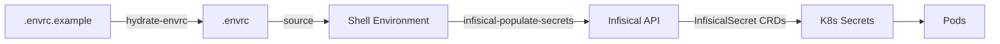

# secrets-tools Architecture

## Overview

CLI toolkit for bootstrapping and populating secrets in Kubernetes deployments backed by Infisical. Two scripts handle the full lifecycle: generating local `.envrc` files from annotated templates, and pushing resolved secrets into Infisical's folder-organized secret store via its REST API.

## System Diagram

```mermaid
graph LR
    A[.envrc.example] -->|hydrate-envrc| B[.envrc]
    B -->|source| C[Shell Environment]
    C -->|infisical-populate-secrets| D[Infisical API]
    D -->|InfisicalSecret CRDs| E[K8s Secrets]
    E --> F[Pods]
```

## Core Components

| Component | Purpose |
|-----------|---------|
| `bin/hydrate-envrc` | Generates `.envrc` from `.envrc.example` templates with auto-generated passwords, hex keys, and cross-variable inheritance |
| `bin/infisical-populate-secrets` | Authenticates with Infisical via universal auth and pushes secrets into folder-organized paths; supports prod seeding and prod-to-staging cloning |
| `Makefile` | Installs both scripts to `~/.local/bin` |

## Data Flow

Secrets flow through three stages: template hydration, environment loading, and API population. `hydrate-envrc` performs a two-pass parse to resolve forward references between variables. `infisical-populate-secrets` uses parallel `curl` calls (batched with `wait`) for throughput.

-> *See [arch/data-flow.md](arch/data-flow.md) for details*

## Secret Organization

Infisical secrets are organized into 18 folder paths (`/mysqldb`, `/wordpress`, `/backend`, `/redis`, `/timescaledb`, `/pgbouncer`, etc.) mirroring the K8s service topology. Many secrets are shared across folders via variable aliasing (e.g., `APP_BACKEND_DB_PASSWORD` appears in both `/timescaledb` and `/backend`).

-> *See [arch/secret-topology.md](arch/secret-topology.md) for details*

## Key Decisions

- **Two-script pipeline over single tool**: Separates local credential generation (offline, auditable) from remote population (authenticated, idempotent)
- **Infisical REST API over CLI**: Enables parallel writes and fine-grained error handling per secret
- **Folder-per-service in Infisical**: Maps 1:1 to K8s namespaces/services for InfisicalSecret CRD targeting
- **Env var override pattern**: Every secret defaults to auto-generate but accepts an env var override, supporting both fresh installs and migrations from existing infrastructure

## Technology Stack

| Layer | Technology |
|-------|------------|
| Runtime | Bash (set -euo pipefail) |
| Crypto | OpenSSL (rand), Python secrets (Django keys) |
| API | curl against Infisical v1/v2/v3 REST endpoints |
| Secret Backend | Infisical (self-hosted) |
| Target | Kubernetes via InfisicalSecret CRDs |
