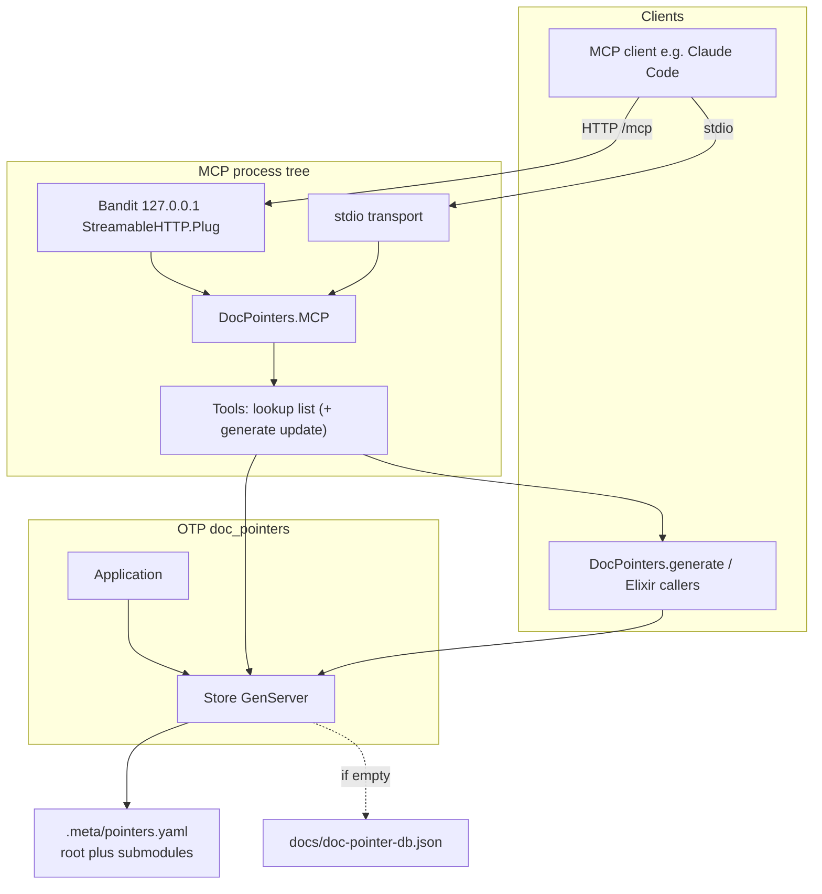
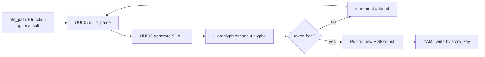
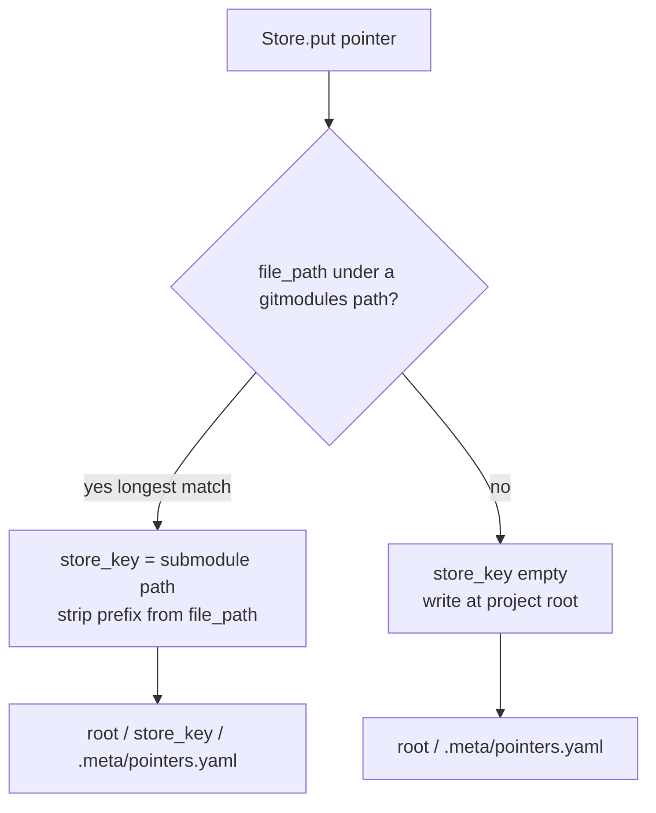

# Architecture — doc-pointers

Elixir Mix app (`:doc_pointers`) that mints **UUIDv5-derived 4-character hieroglyph
tokens** as durable, code-stable cross-document references. Dual surface: programmatic
API (`DocPointers.generate/3,4`) and an MCP tool server (stdio preferred; optional
loopback Streamable HTTP via Bandit).

Portfolio path: `Portfolio/Apps/Developer/doc-pointers`. Layout companion:
[`PROJ-LAYOUT.md`](PROJ-LAYOUT.md). Quick reference: [`PROJ-ARCH.summary.md`](PROJ-ARCH.summary.md).

---

## System overview

Doc-pointers solve “how do I cite a specific function or locus across docs without
brittle line numbers?” Each pointer pairs a full **UUIDv5** (stable identity, keyed in
storage) with a short **4-glyph token** drawn from Egyptian, Meroitic, and Anatolian
Unicode blocks. Tokens appear in prose as markers `⟦TOKEN⟧` or declaration lines
`⟦TOKEN⟧ Name :: Description`.

Generation is deterministic: name = `doc-pointers:{file}::{function}[:salt][:attempt]`,
hashed under a fixed custom UUIDv5 namespace. If the derived 4-glyph token collides with
an existing one, the attempt suffix increments (up to 10 000 tries). Persistence is a
YAML map at `{root}/.meta/pointers.yaml`, keyed by UUID, with a secondary in-memory
token index. When the configured root has `.gitmodules`, file paths under a submodule
are stripped of that prefix and written into that submodule’s own `.meta/pointers.yaml`.

OTP boots a single `DocPointers.Store` GenServer. `mix doc_pointers.mcp.stdio`
supervises `DocPointers.MCP` with `transport: :stdio`. Optional
`mix doc_pointers.mcp.server` binds Bandit to **127.0.0.1:4242**. Default listed
tools are lookup/list; generate/update require `--write` or `confirm=true`.

---

## Core components

| Component | Module / path | Role |
|-----------|---------------|------|
| Public API | `DocPointers` | `generate/3,4` — UUID5 → hieroglyph, collision-retry, `Store.put` |
| OTP app | `DocPointers.Application` | Supervises Store; root from `DOC_POINTERS_ROOT` / app env / cwd |
| UUIDv5 | `DocPointers.UUID5` | Custom namespace, name builders, encode/decode string |
| Hieroglyph | `DocPointers.Hieroglyph` | 128-bit UUID → 4-glyph token; `marker/1`, `declaration/3` |
| Model | `DocPointers.Pointer` | Struct + YAML map codec (`to_map` / `from_map`) |
| Store | `DocPointers.Store` | GenServer: load/save YAML, token index, submodule split, legacy JSON import |
| MCP server | `DocPointers.MCP` | `Noizu.MCP.Server` registry (`doc_pointers` v0.1.0) |
| Tools | `mcp/tools/*` | lookup · list (default); generate · update (`--write` / confirm) |
| stdio entry | `Mix.Tasks.DocPointers.Mcp.Stdio` | `{DocPointers.MCP, transport: :stdio}` |
| HTTP entry | `Mix.Tasks.DocPointers.Mcp.Server` | Bandit + Streamable HTTP Plug on `127.0.0.1:/mcp` |

---

## High-level diagrams

### Runtime & request flow

```mermaid
flowchart TB
  subgraph clients [Clients]
    API["DocPointers.generate / Elixir callers"]
    MCPClient["MCP client e.g. Claude Code"]
  end

  subgraph otp [OTP doc_pointers]
    App[Application]
    Store["Store GenServer"]
    App --> Store
  end

  subgraph mcp_runtime [MCP process tree]
    MCP["DocPointers.MCP"]
    Bandit["Bandit 127.0.0.1 StreamableHTTP.Plug"]
    Stdio["stdio transport"]
    Tools["Tools: lookup list (+ generate update)"]
    MCP --> Tools
    Bandit --> MCP
    Stdio --> MCP
  end

  API --> Store
  Tools --> Store
  Tools --> API
  MCPClient -->|"HTTP /mcp"| Bandit
  MCPClient -->|stdio| Stdio

  Store --> YAML[".meta/pointers.yaml<br/>root plus submodules"]
  Store -.->|if empty| Legacy["docs/doc-pointer-db.json"]
```

### Token mint pipeline

```mermaid
flowchart LR
  A["file_path + function<br/>optional salt"] --> B["UUID5.build_name"]
  B --> C["UUID5.generate SHA-1"]
  C --> D["Hieroglyph.encode 4 glyphs"]
  D --> E{"token free?"}
  E -->|no| F["increment attempt"] --> B
  E -->|yes| G["Pointer.new + Store.put"]
  G --> H["YAML write by store_key"]
```

### Submodule store resolution

```mermaid
flowchart TD
  Put["Store.put pointer"] --> Resolve{"file_path under a gitmodules path?"}
  Resolve -->|yes longest match| Sub["store_key = submodule path<br/>strip prefix from file_path"]
  Resolve -->|no| Root["store_key empty<br/>write at project root"]
  Sub --> Write["root / store_key / .meta/pointers.yaml"]
  Root --> WriteRoot["root / .meta/pointers.yaml"]
```

---

## Key design decisions

| Decision | Rationale |
|----------|-----------|
| UUIDv5 + fixed custom namespace | Deterministic IDs from annotation names; reproducible across machines |
| 4-glyph hieroglyph tokens | Short, distinctive, low collision rate over large Unicode ranges (~token_size⁴) |
| Collision via attempt suffix | Keeps tokens unique without changing the semantic name |
| UUID primary key, token secondary | Full UUID for storage identity; short token for human/doc use |
| YAML per root/submodule under `.meta/` | Git-friendly; each submodule can own its pointer file |
| Longest-path submodule match | Nested paths resolve to the most specific store |
| Legacy JSON import once | Bootstraps from monorepo `docs/doc-pointer-db.json` when YAML empty |
| Dual API + MCP | Library embed and agent tooling share the same Store |
| Single named Store GenServer | Simple consistency; root switchable via `set_root/1` |

---

## Data model

`%DocPointers.Pointer{}` (enforced: `uuid`, `token`, `function`, `description`):

| Field | Notes |
|-------|--------|
| `uuid` | Hyphenated UUIDv5 string (YAML map key) |
| `token` | 4 Unicode codepoints |
| `file_path`, `class`, `line` | Optional source locus |
| `function`, `description` | Required annotation |
| `created_at`, `updated_at` | ISO-8601 UTC |

On-disk shape: `%{"pointers" => %{uuid => map_without_uuid}}`. In-memory Store also holds
`token_index` (token → uuid) and `store_membership` (uuid → store_key).

---

## MCP tool surface

| Tool | Mutates? | Behavior |
|------|----------|----------|
| `doc-pointer/lookup` | no | By token, uuid, file_path, and/or function_name |
| `doc-pointer/list` | no | Paginated list; filter `file_prefix`, `class` (limit ≤ 500) |
| `doc-pointer/generate` | yes (`--write` or `confirm`) | Mint unique token; return uuid, token, marker, declaration |
| `doc-pointer/update` | yes (`--write` or `confirm`) | Metadata only (description, class, line, file_path) by uuid or token |

Generate logic is duplicated in the MCP tool and `DocPointers.generate/4` (same
collision algorithm); both write through `Store`.

---

## Technology stack

| Layer | Choice |
|-------|--------|
| Language / OTP | Elixir `~> 1.18`, Application + one_for_one Supervisor |
| MCP framework | `noizu_mcp` `~> 0.1.3` (`Noizu.MCP.Server`, Streamable HTTP Plug) |
| HTTP | `bandit` `~> 1.6`, `plug` `~> 1.16` |
| Persistence | `yaml_elixir` (read), `ymlr` (write), `jason` (legacy JSON) |
| Crypto | Erlang `:crypto` (SHA-1 for UUIDv5) |
| Config | `DOC_POINTERS_ROOT`, `DOC_POINTERS_PORT`, `DOC_POINTERS_MCP_WRITES`; Mix flags `--root`, `--port`, `--write` |

**Run MCP:** `mix doc_pointers.mcp.stdio` (preferred)  
**HTTP:** `mix doc_pointers.mcp.server` → `http://127.0.0.1:4242/mcp`  
**Register:** `claude mcp add doc-pointers -- mix doc_pointers.mcp.stdio`

---

## Boundaries & non-goals

- **In scope:** mint/lookup/list/update pointers; YAML (and one-shot legacy JSON) storage;
  submodule-aware write routing; MCP + library API.
- **Out of scope:** scanning source trees for markers, CI enforcement of pointers in code,
  multi-node Store clustering, auth on the MCP HTTP endpoint (loopback-only; prefer stdio).
- **Not packaged here:** target-project `.meta/` files, `_build/` / `deps/`.

See [`PROJ-LAYOUT.md`](PROJ-LAYOUT.md) for directory tree and setup details.
