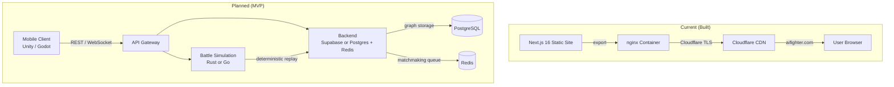
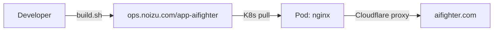

# Project Architecture

## Overview

AI Fighter is a mobile game where players design neural-network decision graphs to control fighters in async PvP combat. The project is in **concept/design brief** stage with a live waitlist landing site. The planned production architecture spans a mobile game client, server-side battle simulation engine, and a web presence layer — only the web layer is currently built.

## System Diagram

```mermaid
graph TB
    subgraph Current ["Current (Built)"]
        W[Next.js 16 Static Site] -->|export| N[nginx Container]
        N -->|Cloudflare TLS| CF[Cloudflare CDN]
        CF -->|aifighter.com| U[User Browser]
    end

    subgraph Planned ["Planned (MVP)"]
        MC[Mobile Client<br/>Unity / Godot] -->|REST / WebSocket| API[API Gateway]
        API --> BE[Backend<br/>Supabase or Postgres + Redis]
        API --> SIM[Battle Simulation<br/>Rust or Go]
        SIM -->|deterministic replay| BE
        BE -->|graph storage| DB[(PostgreSQL)]
        BE -->|matchmaking queue| RD[(Redis)]
    end
```

## Core Components

| Component | Status | Purpose |
|-----------|--------|---------|
| Landing site (`web/`) | **Built** | Waitlist capture, static Next.js 16 export served by nginx |
| Fighter Studio | Planned | Visual node-graph editor for designing fighter AI |
| Training Gym | Planned | Sparring simulation with behavioral analytics |
| Arena | Planned | Async PvP matchmaking, ELO ranking, replay system |
| Laboratory | Planned | Community build-sharing, leaderboards, replay theater |
| Battle engine | Planned | Server-side deterministic fight simulation |

## Web Layer (Landing Site)

Static site built with Next.js 16 (App Router, `output: "export"`), React 19, and Tailwind CSS 4. Dockerized as a multi-stage build: Node 22 compiles to static HTML, then served by nginx with gzip, SPA fallback, and security headers. Image pushed to `ops.noizu.com/app-aifighter`.

→ *See [arch/web-layer.md](arch/web-layer.md) for details*

## Game Architecture (Planned)

The MVP targets five subsystems: graph editor client, training simulation, async battle engine, matchmaking/ELO service, and replay storage. Battles resolve server-side from JSON graph definitions to prevent client-side cheating. The graph format is the canonical representation of fighter intelligence.

→ *See [arch/game-architecture.md](arch/game-architecture.md) for details*

## Design System

"Neural Neon" theme — dark background (#0A0A0F), electric mint primary (#00FFAA), hot pink secondary (#FF3366). Typography: Monument Extended for display, Inter for UI, JetBrains Mono for data. Glassmorphism overlays, neural-pathway motifs, neon glow on interactive elements.

→ *See [arch/design-system.md](arch/design-system.md) for details*

## Deployment

```mermaid
graph LR
    D[Developer] -->|build.sh| R[ops.noizu.com/app-aifighter]
    R -->|K8s pull| P[Pod: nginx]
    P -->|Cloudflare proxy| I[aifighter.com]
```

Static export deployed as a Docker container (nginx:alpine) to the Noizu K8s cluster. Cloudflare handles TLS termination, CDN caching, and DDoS protection. No backend services required for the current landing page.

## Key Decisions

| Decision | Rationale |
|----------|-----------|
| Static export (no SSR) | Landing/waitlist has no dynamic content; simplifies hosting to nginx |
| Server-side battle sim | Deterministic resolution prevents client cheating in async PvP |
| JSON graph format | Portable, versionable, shareable fighter definitions |
| Unity/Godot for client | Custom node-graph editor needs native rendering; mobile export required |
| Async-first PvP | Eliminates latency issues; enables "submit and watch replay" mobile UX |

## Technology Stack

| Layer | Technology | Version |
|-------|-----------|---------|
| Web framework | Next.js (static export) | 16.1.6 |
| UI library | React | 19.2.3 |
| CSS | Tailwind CSS | 4.x |
| Runtime | Node.js | 22 (build only) |
| Web server | nginx | alpine |
| Container | Docker | multi-stage |
| Orchestration | Kubernetes | Noizu cluster |
| CDN/TLS | Cloudflare | — |
