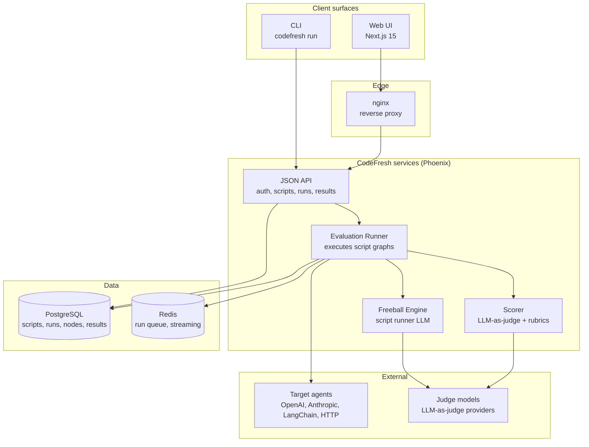

# Project Architecture — codefre.sh

## Overview

**CodeFresh** (domain: `codefre.sh`, NOIZUAI-24) is a **behavioral testing framework for AI agents**. Users define conversation scripts as directed graphs — each node carries a prompt, expectations, and branches — then run those scripts against any agent API. When the agent deviates from all declared branches, the **Freeball Protocol** hands control to a secondary LLM that improvises follow-up prompts and generates tentative expectations on the fly, keeping the evaluation coherent instead of aborting the run.

**Status:** Active backend implementation. Stages 0–4 backend shipped, Stages 5–6 in flight.

Currently shipped (157+ tests green against live TimescaleDB):
- **Stage 0 Foundations** — 51 migrations, Accounts + Organizations + invites + API tokens + audit_events, Oban queues (`default`, `runner`, `scheduled`, `webhook`), OpenTelemetry instrumentation on Phoenix+Bandit+Ecto, OpenAPI spec via `open_api_spex`, Cypress smoke scaffold, GH Actions (backend/frontend/story-status workflows), auth-UI `AuthCard` component
- **Stage 1 Prompts** — head/version schemas, template engine with `{{var}}` + `` control flow, tool-defs validation, library listing w/ usage_count, sandbox (render-only; LLM execution deferred to Stage 4)
- **Stage 2a Rubrics** — head/version + weighted criteria + ladder/enum scales, `Rubrics.Scoring.weighted_average` + `confidence_band`, marketplace cross-org deep-copy import
- **Stage 2b Personas** — head/version + expectation overlays + starter library (6 tones: broken-english/hostile/confused-novice/adversarial/over-specific/context-switch) + run-attach
- **Stage 3 Scripts+Graph** — head/version/nodes/edges/expectations, YAML codec with canonical round-trip + SHA-256 checksum dedup, publish with graph validation (root + expectations + edge integrity), YAML import/export
- **Stage 4 Agents** — 6 adapters (OpenAI, Anthropic, LangChain, HTTP, Bedrock, Vertex) behind an `Adapter` behaviour, health_check dispatch, cost governance fields (per-run ceiling + warn/halt thresholds), streaming preference

Backend patterns:
- UUID primary keys (`binary_id`), `@foreign_key_type :binary_id` on every schema
- Head/version copy-on-write: every versioned entity pairs a head row with immutable version rows, checksum-based publish dedup returns `{:ok, :noop, existing}` on identical content
- Tenant isolation via `Organizations.authorize(user, org_id, role)` gating; cross-org lookups return 404 (never 403 — avoids confirming resource existence across tenants)
- `data-cy`/`data-cy-id` attributes across addressable elements per `docs/cypress-attributes.md`

**Primary positioning:** Playwright/Cypress for AI agents — not observability (Arize, LangSmith), not single-turn prompt compare (Promptfoo), not assertion-style unit eval (DeepEval).

## System Diagram

```mermaid
graph TB
    subgraph "Client surfaces"
        CLI["CLI<br/>codefresh run"]
        UI["Web UI<br/>Next.js 15"]
    end

    subgraph "Edge"
        Nginx["nginx<br/>reverse proxy"]
    end

    subgraph "CodeFresh services (Phoenix)"
        API["JSON API<br/>auth, scripts, runs, results"]
        Runner["Evaluation Runner<br/>executes script graphs"]
        Freeball["Freeball Engine<br/>script runner LLM"]
        Scorer["Scorer<br/>LLM-as-judge + rubrics"]
    end

    subgraph "Data"
        PG[("PostgreSQL<br/>scripts, runs, nodes, results")]
        Redis[("Redis<br/>run queue, streaming")]
    end

    subgraph "External"
        Agents["Target agents<br/>OpenAI, Anthropic, LangChain, HTTP"]
        Judge["Judge models<br/>LLM-as-judge providers"]
    end

    CLI --> API
    UI --> Nginx --> API
    API --> PG
    API --> Runner
    Runner --> Redis
    Runner --> Agents
    Runner --> Freeball
    Runner --> Scorer
    Freeball --> Judge
    Scorer --> Judge
    Runner --> PG
```

## Core Components

| Component | Purpose | Location (target) |
|---|---|---|
| **Script Editor** | Visual graph editor for conversation trees; YAML/JSON import/export | `app/frontend/src/app/scripts/` |
| **Agent Connector** | HTTP adapter + native integrations (OpenAI, Anthropic, LangChain) with auth config | `app/backend/lib/codefresh/agents/` |
| **Evaluation Runner** | Executes scripts against connected agents; parallel persona fan-out; streaming | `app/backend/lib/codefresh/runner/` |
| **Freeball Engine** | Script runner LLM that handles off-script deviations, generates tentative nodes | `app/backend/lib/codefresh/freeball/` |
| **Scorer** | LLM-as-judge + rubric blending for fuzzy expectation matching | `app/backend/lib/codefresh/scorer/` |
| **Results Dashboard** | Graph visualization, per-node scoring, aggregate metrics, diff view | `app/frontend/src/app/runs/` |
| **CLI** | `codefresh run` for CI/CD pipelines; JUnit output; threshold gates | `cli/` (Elixir escript) |
| **Persona Library** | Tag-based lens layering (broken-english, hostile, confused-novice, adversarial, etc.) | `app/backend/lib/codefresh/personas/` |
| **Datasets** | Versioned eval datasets with entries and flagged captures | `app/backend/lib/codefresh/datasets/` |
| **Autoflag Engine** | Rule-based auto-flagging with Oban workers | `app/backend/lib/codefresh/autoflag/` |
| **Review Queue** | Branch promotion workflow for freeball nodes → permanent script versions | `app/backend/lib/codefresh/review/` |
| **Webhooks** | Event delivery with DLQ via Redis | `app/backend/lib/codefresh/webhooks/` |
| **OTel Ingest** | OTLP-shaped span/log ingest with sampling policies; TimescaleDB hypertables | `app/backend/lib/codefresh/otel/` |
| **Client SDKs** | Python, Elixir, TypeScript API clients (all v0.1.0 stubs) | `sdks/` |
| **Marketing Site** | Public landing page with waitlist, interactive graph demo, mermaid diagrams | `web/` (Next.js 16) |

## Data Model

The data layer uses a **copy-on-write versioning pattern**: each authored entity (prompts, scripts, personas, rubrics, agents, datasets, dashboards) has a head table and an immutable version table; runs pin exact version IDs for reproducibility. Scripts are normalized as `script_nodes` + `script_edges` rather than JSONB blobs. Freeball nodes from the Freeball Protocol live alongside authored nodes with an explicit review/promotion workflow (via the Review Queue) that produces new script versions. OpenTelemetry spans and logs from agents under test are ingested via OTLP-shaped tables correlated by `trace_id`. Datasets hold curated eval entries with flagged-capture support. Webhooks track delivery attempts with a Redis-backed DLQ. Enterprise features include SSO configuration. 54 migrations as of current build.

→ *See [arch/data-model.md](arch/data-model.md) for the full ERD, per-column detail, invariants, migration sequencing, and open design questions.*

→ *User-workflow validation of this schema lives in [personas/](personas/) — seven persona specs whose needs map onto the schema via a requirements table per persona.*

## Evaluation Flow

A `Run` walks the script graph in conversation order. At each step:

1. Runner sends the current node's `prompt` (mutated by persona tone) to the target agent.
2. Agent response is matched against every declared `branch.condition` — the matcher returns a confidence per branch.
3. If max branch confidence ≥ threshold (default 0.5) → traverse to that child node.
4. Otherwise → **Freeball Protocol** triggers: the script runner agent improvises the next prompt, generates tentative expectations, and the run continues on a tentative path.
5. Every step emits a score against the node's expectations (weighted sum of per-expectation scoring methods).
6. Final run score aggregates step scores; CI gate is `score ≥ threshold`.

→ *See [arch/freeball-protocol.md](arch/freeball-protocol.md) for the freeball state machine, runner scoring, and promotion lifecycle.*

## Infrastructure

Built on the `start-app` scaffold: three Docker containers (Next.js frontend, Phoenix backend, nginx proxy) sharing the incubator's `lets-go_default` network with external Postgres and Redis. Project identity (slug `codefresh`, Elixir module `Codefresh`) is encoded in the scaffolded code. Authentication is JWT via Guardian; design system is YAML-driven via `@the-robot-lives/styleguide`.

**Kubernetes deployment** via Helm chart (`helm/codefresh/`, Chart v0.1.0, appVersion 1.0.6). Backend and frontend images pushed to `ops.noizu.com` registry. Ingress is nginx-class with Cloudflare-only access; TLS via Infisical sync. Migration job runs as a pre-deploy hook. Secrets sourced from `apps-app-secrets` (DB creds, secret_key_base, Guardian key, Redis URL).

**CI/CD** via GitHub Actions: backend workflow runs `mix format --check-formatted`, `compile --warnings-as-errors`, `test --cover`, `credo --strict`, OpenAPI breaking-change detection, and a full rollback-check (migrate → rollback --all → migrate). Services: TimescaleDB `pg17.9-ts2.25.2-all`, Elixir 1.19.5 / OTP 28.0.

**Separate marketing site** (`web/`) runs Next.js 16 with a waitlist page, interactive graph demo, and mermaid diagrams — independent of the authenticated app.

→ *See [`app/docs/PROJ-ARCH.md`](../app/docs/PROJ-ARCH.md) for container topology, request routing, network, auth, design system, and deploy flow.*

## Technology Stack

| Layer | Choice | Rationale |
|---|---|---|
| Frontend | Next.js 15 + React 19 + Tailwind v4 | Scaffold default; graph editor suits React ecosystem (reactflow, d3) |
| Backend | Elixir 1.19 + Phoenix 1.8 + Bandit | BEAM's concurrency model fits parallel persona fan-out + streaming runs |
| Database | PostgreSQL + pgvector + TimescaleDB | pgvector for small-scale embeddings; TimescaleDB hypertables for time-series (OTel spans/logs, audit events, webhook deliveries) |
| Vector search | Weaviate | Large-scale semantic search (OTel span names, dataset-entry embeddings) — Postgres holds IDs, Weaviate returns matches |
| Cache / Queue | Redis (Redix) | Run queue, live run streaming, rate limits, webhook DLQ, sampling-policy cache |
| Job processing | Oban 2.17 | Background jobs: run workers, scheduler, autoflag, webhooks (queues: `default`, `runner`, `scheduled`, `webhook`) |
| Process registry | Syn 3.3 | Distributed process registry for run coordination |
| Auth | Guardian JWT + bcrypt | Scaffold default; API tokens for programmatic access |
| LLM integration | GenAI ~> 0.3.0 | Unified LLM interface; Noizu Labs Entities for persistence |
| Judge models | Configurable (OpenAI, Anthropic, local) | Per-tier: Haiku-class for freeball generation, Sonnet-class for scoring |
| Graph UI | React components (GraphCanvas, NodeInspector, NodePalette) | Visual script editor with edge modals and node inspection |
| CLI | Elixir escript (`cli/`) | Commands: login, logout, whoami, run, runs, import, export; JUnit XML output |
| Client SDKs | Python (httpx), Elixir (req), TypeScript | All v0.1.0 stubs under `sdks/` |
| Marketing site | Next.js 16 (`web/`) | Separate from app; waitlist, interactive demos |
| API spec | OpenAPI via `open_api_spex` | Contract generation with CI breaking-change detection |

## Key Decisions

- **Graph-based, not linear** — real conversations branch; linear assertion-style eval (DeepEval) misses behavioral failure modes
- **Freeball over fail-fast** — deviations are data, not errors; static eval wastes information by rejecting any off-script response
- **LLM-as-judge + fuzzy rubrics hybrid** — pure semantic matching is unreliable; pure regex is too brittle; hybrid scoring lets authors pick per-expectation
- **Persona lenses as tag layers** — personas multiply test coverage without duplicating scripts; each adds its own expectations on top of the base node
- **Elixir backend** — run fan-out across many personas × many scripts benefits from OTP supervisors + process-per-run isolation
- **Open-core model** — CLI + runner open source (adoption wedge); graph editor, freeball engine, dashboard closed (moat + monetization)
- **Scripts as YAML/JSON** — plain text, diffable, reviewable in PRs; the graph editor is the primary authoring surface but not the storage format

## Monetization Shape

The open-source CLI runs scripts locally and outputs pass/fail/score; this is the adoption wedge. The hosted/paid surface adds:

- Visual graph editor (faster authoring than hand-writing YAML)
- Freeball engine (adaptive evaluation, the novel bit)
- Results dashboard with diff view across runs
- CI/CD integrations with persistent run history

→ *See README "Monetization Angle" for tier sketch ($49-99 Pro / $199-399 Team / Enterprise).*

## Open Questions

| Question | Impact | Working assumption |
|---|---|---|
| What scoring model backs fuzzy expectation matching? | Determines cost-per-run and eval fidelity | Hybrid: LLM-as-judge + rubric weights; per-expectation config |
| Which model powers the freeball runner? | Critical — runner must not be worse than agent under test | Capability-matched: warn if runner < target; default Haiku-for-gen, Sonnet-for-score |
| Runner-side prompt injection defense | Security — agents under test might attack the runner | Runner sees only agent output, never system prompt; sandboxed persona harness |
| Script sharing / marketplace | Growth loop; also attack-surface concern | TBD — community library as phase-2 |
| Open source vs. SaaS split | Revenue model and community trust | Likely: CLI + runner OSS, editor + freeball + dashboard SaaS |

→ *See README "Open Questions" for additional strategic uncertainties.*

## Status & Next Steps

**Shipped (Stages 0–4):** 157+ tests green against live TimescaleDB. Foundations (accounts, orgs, API tokens, audit, Oban, OTel, OpenAPI, Cypress scaffold, GH Actions CI), Prompts (head/version, template engine, tool-defs, library), Rubrics (weighted criteria, ladder/enum scales, scoring, marketplace), Personas (head/version, expectation overlays, starter library, run-attach), Scripts (head/version, nodes/edges/expectations, YAML codec with round-trip + checksum dedup, publish with graph validation, import/export), Agents (6 adapters behind `Adapter` behaviour, health_check, cost governance, streaming). CLI, SDKs, Helm chart, and marketing site scaffolded.

**In flight (Stages 5–6):** Evaluation runner, freeball engine, scorer, scheduled runs, results dashboards.

**Next:**
1. **Stage 5** — Wire up the evaluation runner: execute script graphs against connected agents, parallel persona fan-out, per-step scoring, freeball protocol for off-script deviations
2. **Stage 6** — Results dashboard with graph visualization, diff view, CI gate integration
3. **Hardening** — dataset-driven evals, autoflag rules, webhook reliability, enterprise SSO
4. **CLI + SDK maturity** — move from v0.1.0 stubs to feature-complete clients
