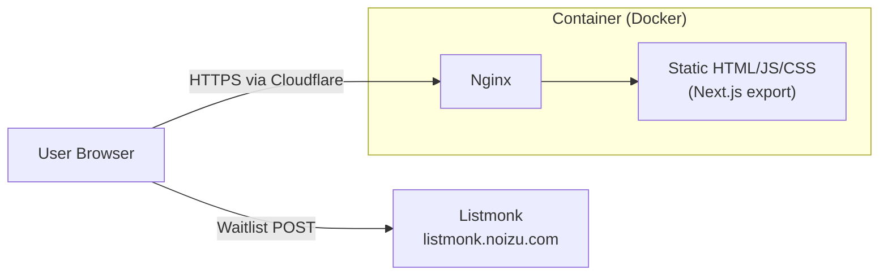
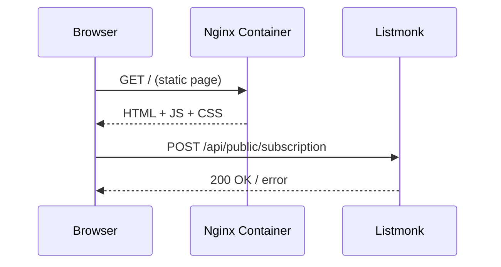

# Project Architecture

## Overview

Gotta.cc is an AI-curated web directory — a browsable, scored catalog of quality websites organized by topic. The current build is a **static landing page with waitlist capture**, serving as a pre-launch validation artifact. The planned full product adds an LLM-powered scoring pipeline, category browser, community submissions, and search.

The architecture is intentionally minimal at this stage: a statically-exported Next.js 16 site served by Nginx in a Docker container, with email capture routed to an external Listmonk instance.

## System Diagram

```mermaid
graph LR
    subgraph "Container (Docker)"
        NG[Nginx]
        SA["Static HTML/JS/CSS<br/>(Next.js export)"]
        NG --> SA
    end

    U[User Browser] -->|HTTPS via Cloudflare| NG
    U -->|Waitlist POST| LM["Listmonk<br/>listmonk.noizu.com"]
```

## Core Components

| Component | Purpose | Technology |
|-----------|---------|------------|
| Landing Page | Product pitch, waitlist capture, design validation | Next.js 16, React 19, Tailwind CSS 4 |
| Waitlist Form | Email subscription via Listmonk public API | Client-side fetch to `listmonk.noizu.com` |
| Container | Static export served by Nginx with gzip + caching | Docker multi-stage (node:22-alpine -> nginx:alpine) |
| Design Assets | Logo variants (mark, combo, mono, reversed, favicon) + 3 visual directions | SVG, HTML mockups |

## Data Flow

All data flow is client-side in the current build. The landing page is statically generated at build time and served as plain HTML/CSS/JS by Nginx. The only dynamic interaction is the waitlist form, which POSTs directly from the browser to the Listmonk API — no backend proxy.

```mermaid
sequenceDiagram
    participant B as Browser
    participant N as Nginx Container
    participant L as Listmonk

    B->>N: GET / (static page)
    N-->>B: HTML + JS + CSS
    B->>L: POST /api/public/subscription
    L-->>B: 200 OK / error
```

## Deployment

The container is built via a two-stage Dockerfile:

1. **Build stage** — `node:22-alpine` runs `npm run build` (Next.js static export)
2. **Serve stage** — `nginx:alpine` serves the `out/` directory with SPA fallback, gzip, and security headers

Intended deployment target is the `*.noizu.com` Kubernetes cluster via Helm, following the incubator's standard Pattern A (local chart). No Helm chart exists yet — the project is pre-deployment.

## Technology Stack

| Layer | Choice |
|-------|--------|
| Framework | Next.js 16 (App Router, static export) |
| UI | React 19, Tailwind CSS 4 |
| Typography | Iowan Old Style (display), system sans (UI), monospace (scores) |
| Build | Node.js 22, TypeScript 5 |
| Container | Docker (multi-stage), Nginx Alpine |
| Email | Listmonk (external, self-hosted at listmonk.noizu.com) |
| DNS/TLS | Cloudflare (planned) |
| Runtime | Node.js 22.22.0 (pinned via `.tool-versions`) |

## Planned Architecture (Post-MVP)

The full product introduces several backend components not yet built:

| Component | Purpose |
|-----------|---------|
| Quality Scoring Pipeline | LLM-powered 5-dimension scoring (originality, human authorship, depth, freshness, design) |
| Category Taxonomy | Hierarchical category tree (~200-500 categories) with browse, search, deep-linking |
| Submission Pipeline | URL submission -> AI crawl -> auto-score -> categorize -> publish/reject |
| Community Layer | Upvotes, flagging, submitter profiles, user-created collections |
| Search | Keyword search across listings, summaries, tags with category/score filters |
| API | Public API for querying directory and quality scores |

These components are described in `README.md` but have no implementation yet. Architecture decisions for the backend (database, API framework, scoring infrastructure) are deferred until the landing page validates market interest.

## Key Decisions

- **Static export over SSR**: No server-side rendering needed for a landing page. Static export simplifies deployment and eliminates Node.js runtime in production.
- **Direct Listmonk integration**: Browser-to-Listmonk POST avoids building a backend proxy for email capture. Listmonk's public subscription API handles this natively.
- **Nginx over Node.js serving**: Static files served by Nginx are faster and use less memory than a Node.js process.
- **Three design directions deferred**: `design/` contains three visual directions (Ink & Paper, Warm Browse, Retro Revival) pending user selection before the design system is locked.
