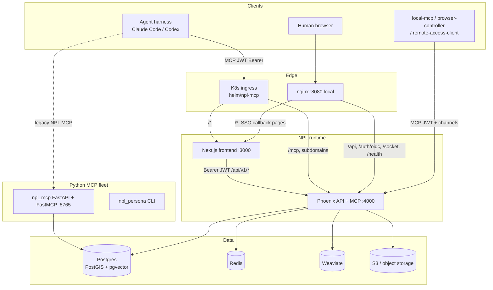
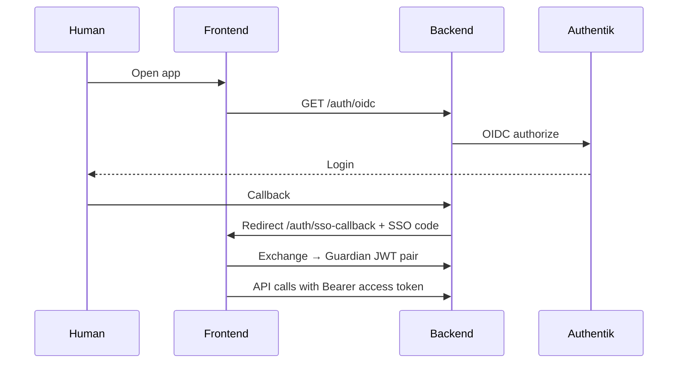
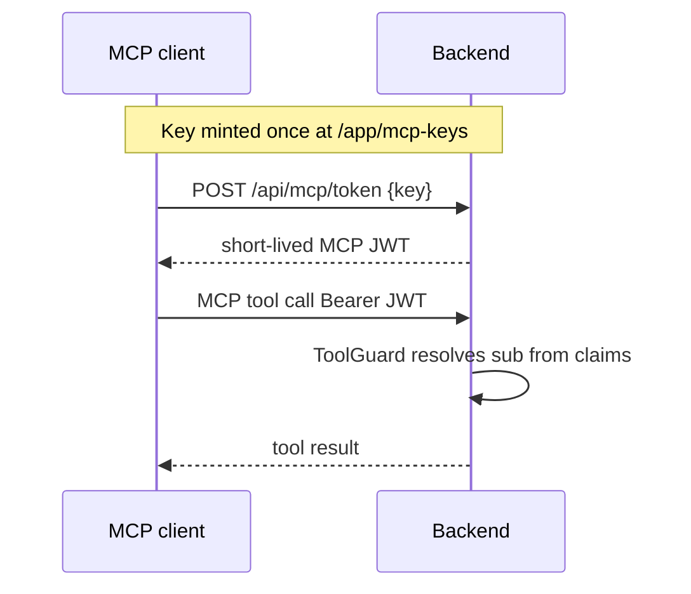

# Architecture — NoizuPromptLingo (NPL / tobor)

Multi-tenant collaboration platform for AI coding-agent harnesses and the humans supervising them. Agents get durable org/project-scoped infrastructure (sessions, tickets, chat, wiki, memory, versioned prompts) via **MCP** (`tobor-*` servers). Humans use a Next.js web app for the same domains. This codebase *is* tobor — monorepo Claude sessions that call `tobor-sessions` / `tobor-organizations` hit this product.

Three runtime containers (nginx → **Phoenix backend** + **Next.js frontend**) share external Postgres (PostGIS + pgvector) and Redis. The backend owns all product domains under `backend/lib/noizu_prompt_lingua/domains/` and exposes **20+ MCP servers** on host-scoped paths (`sessions.<host>/mcp`, `tickets.<host>/mcp`, …) plus a host-less root aggregator at `/mcp`. Each MCP server implements the same five discovery tools (`ToolSummary`, `ToolSearch`, `ToolDefinition`, `ToolCall`, `ToolHelp`); semantic search is Weaviate-backed.

The Elixir/Phoenix stack superseded an earlier Python build, which survives as the **Python MCP fleet** (`src/npl_mcp` — FastMCP + FastAPI, persona CLI, orchestration) documented in [arch/mcp-tools.md](arch/mcp-tools.md) and [arch/rest-api.md](arch/rest-api.md). "Prompt Lingua" names the NPL convention engine (`conventions/*.yaml` → `NPLSpec`/`NPLLoad`, `/api/v1/npl/*`).

**Tenancy spine:** Organization → Project → Session. Sessions group rooms, artifacts, and tickets for a unit of work. Membership is coarse (`owner|admin|lead|member|viewer`); fine-grained access uses PBAC v2 (groups, JSON policies, scoped memberships, custom roles) with a policy simulator.

**Two auth paths (deliberately separate):**

| Actor | Flow |
|-------|------|
| **Humans** | Authentik OIDC → SSO code exchange → Guardian access/refresh JWT. Password/magic-link routes exist in UI but are disabled server-side; registration is invite-token gated. |
| **Agents / MCP** | User mints long-lived `McpApiKey` (shown once) → `POST /api/mcp/token` → short-lived MCP JWT as Bearer. Identity for tool calls is resolved **server-side** from JWT claims (`MCP.ToolGuard` / `MCP.Resolve`), never from caller-supplied actor args. |

## System diagram

```mermaid
graph TB
  subgraph Clients
    Browser[Human browser]
    Harness[Agent harness<br/>Claude Code / Codex]
    LocalTools[local-mcp / browser-controller<br/>/ remote-access-client]
  end

  subgraph Edge
    Nginx[nginx :8080 local]
    Ingress[K8s ingress<br/>helm/npl-mcp]
  end

  subgraph "NPL runtime"
    FE[Next.js frontend :3000]
    BE[Phoenix API + MCP :4000]
  end

  subgraph "Python MCP fleet"
    PY[npl_mcp FastAPI + FastMCP :8765]
    PERSONA[npl_persona CLI]
  end

  subgraph Data
    PG[(Postgres<br/>PostGIS + pgvector)]
    Redis[(Redis)]
    WV[(Weaviate)]
    S3[(S3 / object storage)]
  end

  Browser --> Nginx
  Harness -->|MCP JWT Bearer| Ingress
  LocalTools -->|MCP JWT + channels| BE
  Nginx -->|"/api, /auth/oidc, /socket, /health"| BE
  Nginx -->|"/*, SSO callback pages"| FE
  Ingress -->|/mcp, subdomains| BE
  Ingress -->|/*| FE
  FE -->|Bearer JWT /api/v1/*| BE
  BE --> PG
  BE --> Redis
  BE --> WV
  BE --> S3
  PY --> PG
  Harness -.->|legacy NPL MCP| PY
```

## Core components

| Component | Location | Role |
|-----------|----------|------|
| **nginx** | `nginx/` | Reverse proxy: `/api/*`, `/auth/*`, `/socket`, `/health` → backend; rest → frontend |
| **backend** (`:noizu_prompt_lingua`) | `backend/` | Phoenix 1.8 JSON API, MCP fleet, channels, Oban jobs, domain contexts |
| **frontend** | `frontend/` | Next.js App Router — public, `/app/*` dashboard, `/app/[orgId]/*` org surfaces, `/app/admin/*` |
| **Liquibase** | `backend/db/` | Canonical schema changelogs `000`–`082`; runs as migrate container/Job before app |
| **MCP catalog** (`MCPServers`) | `backend/lib/.../mcp*` | Single source of truth for subdomain MCP servers + custom-scope packaging |
| **PBAC / Authz** | `backend/lib/.../{acl,authz}/` | Groups, policies, scoped memberships; `ToolGuard` shadow/enforce on MCP tools |
| **NPL engine** | `conventions/`, `backend/lib/.../npl/`, `src/npl_mcp/npl/` | Convention load/spec generation from YAML corpus |
| **TRP client** | `backend/lib/.../trp/` | therobotplans (PM source) integration: transport, provisioning, service auth |
| **Python MCP fleet** | `src/npl_mcp/` | FastMCP + FastAPI server (~125-tool catalog, REST, browser tools, orchestration) |
| **pm_core** (`noizu_labs_pm`) | vendored | Optional shared PM data layer (legacy; TRP is the PM source now) |
| **local-mcp** | `local-mcp/` | Downloadable stdio MCP: local git/rg/file tools (never leaves machine) |
| **browser-controller** | `browser-controller/` | Local Playwright driven by cloud `Browser.*` MCP via Phoenix channel relay |
| **remote-access-client** | `remote-access-client/` | frpc wrapper claiming named tunnels (`*.remote-access.noizu.com`) |
| **helm/start-app** | `helm/start-app/` | Scaffold-style chart (compose-aligned deploy shape) |
| **helm/npl-mcp** | `helm/npl-mcp/` | Production chart for tobor.locker (MCP paths, multi-host ingress) |
| **agents/ / commands/** | root | NPL agent personas and slash-command prompts for coding harnesses (not runtime) |
| **design/theme/** | `design/` | Theme treatises + YAML (8 NPL themes) compiled to CSS via `make regen` |

→ *Backend domain map: [arch/](arch/) per-domain notes + [PROJ-LAYOUT.md](PROJ-LAYOUT.md); MCP tool inventory: [arch/mcp-tools.md](arch/mcp-tools.md)*

### MCP servers (catalog)

Required: **root**, **sessions**, **organizations**. Optional subdomain servers: projects, tickets, assets, artifacts, chat, review, wiki, github, personas, instructions, memory, markdown, notifications, pubsub, browser, customers, market, campaigns, unicode. Custom include-scopes served at `/custom/:slug/mcp`. Packaging modes: `default` | `core_custom` | `all_in_one`.

### Frontend surfaces

| Area | Routes (illustrative) |
|------|------------------------|
| Public / auth | `/`, `/login`, `/auth/sso-callback`, `/auth/register` |
| User app | `/app`, `/app/organizations`, `/app/mcp-keys`, `/app/profile` |
| Org product | `/app/[orgId]/{sessions,tickets,boards,chat,wiki,artifacts,reviews,personas,memory,instructions,assets,projects,github,mock-mcp,…}` |
| Admin | `/app/admin/{users,orgs,llm-models,mcp-custom-scopes,github,authz,media-providers}` |

Realtime: Phoenix channels (`/socket`) for org/browser; frontend uses the `phoenix` JS client.

## Request & auth flows

```mermaid
sequenceDiagram
  participant H as Human
  participant FE as Frontend
  participant BE as Backend
  participant A as Authentik

  H->>FE: Open app
  FE->>BE: GET /auth/oidc
  BE->>A: OIDC authorize
  A-->>H: Login
  H->>BE: Callback
  BE->>FE: Redirect /auth/sso-callback + SSO code
  FE->>BE: Exchange → Guardian JWT pair
  FE->>BE: API calls with Bearer access token
```

```mermaid
sequenceDiagram
  participant Agent as MCP client
  participant BE as Backend

  Note over Agent,BE: Key minted once at /app/mcp-keys
  Agent->>BE: POST /api/mcp/token {key}
  BE-->>Agent: short-lived MCP JWT
  Agent->>BE: MCP tool call Bearer JWT
  BE->>BE: ToolGuard resolves sub from claims
  BE-->>Agent: tool result
```

## Schema & jobs

Liquibase is canonical (`backend/db/changelog/`); the Python fleet has its own Liquibase tree (`liquibase/changelogs/`). Ecto schemas under `backend/lib/.../schema/`; release path relies on the Liquibase Job/container. Oban workers handle cleanup and memory jobs. Redis: cache, presence, ephemeral state. Weaviate: MCP tool semantic search. S3 (ex_aws): media/binary artifact storage.

→ *See [PROJ-SCHEMA.md](PROJ-SCHEMA.md) for the full persistence reference*

## Key design decisions

- **Elixir/Phoenix as the platform core**: domain contexts give each product area (tickets, chat, memory, …) a schema+context boundary; MCP servers and REST are thin faces over the same contexts
- **Multi-server MCP on host-scoped paths**: per-domain servers with identical discovery tools; one catalog (`MCPServers`) drives routing, packaging, and custom scopes
- **Liquibase owns the schema**: Ecto migrations deliberately minimal (oban, MCP key/scope bits); `db/changelog` is the single source of DDL
- **Separate human vs agent auth**: OIDC+Guardian for browsers; mints → short-lived MCP JWT for agents; server-side identity resolution via ToolGuard
- **PBAC v2 over role enums**: groups, JSON policies, scoped memberships, custom roles, policy simulator; `ToolGuard` shadow mode precedes enforcement
- **Frontend API facade**: `lib/api/client.ts` is a stable interface; mock → REST swap is a single import; `hybrid` impl mixes per domain
- **NPL convention system**: YAML source of truth, layered pipeline (parse → resolve → layout), expression DSL (NPLLoad) + structured spec generation (NPLSpec); `npl/npl-full.md` is generated, never hand-edited
- **Python fleet kept for tooling**: agent-pipes messaging, orchestration patterns with quality gates, persona CLI — see [arch/agent-orchestration.md](arch/agent-orchestration.md), [arch/agent-pipes.md](arch/agent-pipes.md)
- **TRP as PM source**: PRDs/stories live in therobotplans via shared-key API; local PM tables legacy (changeset 078 dropped cross-DB FKs)

## Technology stack

| Layer | Choice |
|-------|--------|
| Frontend | Next.js 16, React 19, Tailwind v4, `@noizu/styleguide`, next-intl, Cypress + Playwright e2e |
| Backend | Elixir ~1.15+, Phoenix 1.8, Bandit, Guardian, Ueberauth/OIDC, Oban, Hammer |
| Python MCP | FastMCP 3.x, FastAPI, asyncpg, uv (Python 3.13) |
| MCP (backend) | `noizu_mcp`, multi-server host routing, custom gateways |
| Data | PostgreSQL (PostGIS, pgvector), Redis (Redix), Weaviate (`noizu_weaviate`) |
| AI | GenAI, optional media providers / LLM model catalog, LiteLLM proxy (Python fleet) |
| Schema | Liquibase YAML + minimal Ecto |
| Observability | OpenTelemetry (Phoenix, Ecto, Bandit, frontend RUM via `/otel`) |
| Proxy / deploy | nginx, Docker Compose, Helm, registry `ops.noizu.com`, Infisical secrets |
| Companion Node pkgs | local-mcp, browser-controller (Playwright), remote-access-client (frpc) |

## Running

| Mode | How |
|------|-----|
| Local prod-like | `make init` → `make build` → `make run` (nginx host port; NPL mapped 8095 in Makefile) |
| Local dev | `make run-dev` — source mounts, Phoenix reloader, Next HMR, Liquibase service first |
| Python MCP server | `uv run npl-mcp` (port 8765, `--status`, `--no-frontend`, `--reload` flags; LiteLLM via `NPL_LITELLM_URL/KEY/MODEL`) |
| Sandbox | Single container (Node + Elixir + Samba) for remote edit mounts — `make sandbox` |
| Kubernetes | `helm/npl-mcp` (tobor.locker): path/host routing for `/mcp`, subdomains, frontend; secrets via Infisical |

| Service | Port | Purpose |
|---------|------|---------|
| nginx | 8080 (8095 mapped) | Local reverse proxy |
| PostgreSQL | 5111 | Database |
| LiteLLM proxy | 4111 | LLM routing (Python fleet) |
| Python MCP server | 8765 | Legacy NPL MCP + web UI |
