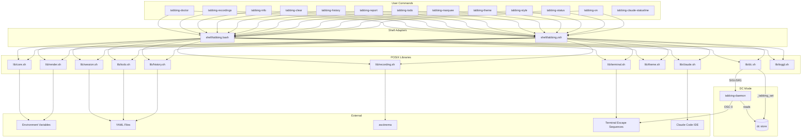

# Project Architecture

## Overview

tabbing-on is a shell utility for managing terminal tab state (title, status, emoji, urgency, color), per-tab todos, history tracking, and terminal recordings. It uses a **layered architecture**: POSIX-compatible shared libraries provide core logic, while shell-specific wrappers (Bash/Zsh) adapt syntax and hook into shell prompt mechanisms.

Two runtime modes: **env mode** (default) stores state in shell environment variables; **dc mode** (direnv-config) stores state in a shared key-value store with a background daemon that owns tab title rendering.

## System Diagram


```mermaid
graph TB
    subgraph "User Commands"
        TO[tabbing-on]
        TS[tabbing-status]
        TST[tabbing-style]
        TTH[tabbing-theme]
        TM[tabbing-marquee]
        TT[tabbing-todo]
        TR[tabbing-report]
        TH[tabbing-history]
        TC[tabbing-clear]
        TI[tabbing-info]
        TRC[tabbing-recordings]
        TD[tabbing-doctor]
        TCS[tabbing-claude-statusline]
    end

    subgraph "Shell Adapters"
        ZSH[shell/tabbing.zsh]
        BASH[shell/tabbing.bash]
    end

    subgraph "POSIX Libraries"
        REND[lib/render.sh]
        CORE[lib/core.sh]
        TERM[lib/terminal.sh]
        HIST[lib/history.sh]
        REC[lib/recording.sh]
        SESS[lib/session.sh]
        TODO[lib/todo.sh]
        THM[lib/theme.sh]
        DC[lib/dc.sh]
        CLAUDE[lib/claude.sh]
        TOGGL[lib/toggl.sh]
    end

    subgraph "DC Mode"
        DAEMON[tabbing-daemon]
        DCSTORE[(dc store)]
    end

    subgraph "External"
        ENV[Environment Variables]
        YAML[YAML Files]
        ASC[asciinema]
        ESC[Terminal Escape Sequences]
        CCIDE[Claude Code IDE]
    end

    TO & TS & TST & TTH & TM & TT & TR & TH & TC & TI & TRC & TD --> ZSH & BASH
    ZSH & BASH --> REND & CORE & TERM & HIST & REC & SESS & TODO & THM & DC & CLAUDE & TOGGL
    REND & CORE --> ENV
    TERM --> ESC
    HIST & TODO --> YAML
    SESS --> YAML
    REC --> ASC
    CLAUDE --> CCIDE
    DC -->|_tabbing_set| DCSTORE
    DC -->|SIGUSR1| DAEMON
    DAEMON -->|reads| DCSTORE
    DAEMON -->|OSC 0| ESC
```

## Core Components

| Component | File | Purpose |
|-----------|------|---------|
| Render | `lib/render.sh` | Render pipeline, color/emoji validation, version string |
| Core | `lib/core.sh` | Color/emoji lists, urgency levels, help, YAML escape |
| Terminal | `lib/terminal.sh` | Terminal emulator detection, escape sequence abstraction |
| History | `lib/history.sh` | Tab ID generation, YAML event logging, search, reporting |
| Recording | `lib/recording.sh` | asciinema recording lifecycle management |
| Session | `lib/session.sh` | Per-session state persistence via `TAB_SESSION`-keyed env files |
| Todo | `lib/todo.sh` | Per-tab todo CRUD with provider pattern |
| Theme | `lib/theme.sh` | Theme loading, listing, custom `.theme` file support |
| DC | `lib/dc.sh` | direnv-config integration: state read/write, timestamps, daemon lifecycle |
| Claude Bridge | `lib/claude.sh` | Claude Code IDE statusline bridge via FIFO + state file |
| Toggl | `lib/toggl.sh` | Toggl Track API integration for time entry lifecycle |
| Daemon | `bin/tabbing-daemon` | Background process: polls dc state, renders title, marquees long status |
| Zsh Adapter | `shell/tabbing.zsh` | Zsh functions, 1-based arrays, precmd hook |
| Bash Adapter | `shell/tabbing.bash` | Bash functions, 0-based arrays, PROMPT_COMMAND hook |
| Init | `bin/tabbing-init` | Outputs shell-appropriate `source` command and `TABBING_ROOT` export |

## Layered Design

1. **POSIX Libraries** (`lib/*.sh`) -- Pure POSIX sh. No bash/zsh-isms. Prefixed `_tabbing_*`. Provide all data logic, terminal I/O, and persistence.

2. **Shell Adapters** (`shell/tabbing.{bash,zsh}`) -- Source `render.sh` + `dc.sh` at init. Define user-facing functions (`tabbing-on`, `tabbing-status`, etc.) that run in the current shell so `TAB_*` env vars persist. All state mutations go through `_tabbing_set` which handles both env mode (export) and dc mode (write-through to dc store).

3. **CLI Commands** (`bin/*`) -- Thin wrappers that source `_tabbing-wrapper` (loads all libs) then call the adapter function. Run in a subprocess; useful for heavy operations (history, todos, reports) but cannot modify the parent shell's env vars.

4. **Bootstrap** (`bin/tabbing-init`) -- POSIX `/bin/sh` script that resolves `TABBING_ROOT` and emits `source` + config check code for eval.

5. **Daemon** (`bin/tabbing-daemon`) -- DC mode only. Background process that polls `dc tab last_update` at 200ms intervals, reloads state on change, and renders the tab title. Marquees status text that exceeds the 20-char clip length. Responds to SIGUSR1 for instant refresh.

## Installation

`make install` copies files to XDG-standard locations:

| Source | Destination |
|--------|-------------|
| `bin/*` | `~/.local/bin/` |
| `lib/*.sh` | `~/.local/share/tabbing-on/lib/` |
| `shell/*.{bash,zsh}` | `~/.local/share/tabbing-on/shell/` |

`tabbing-init` resolves `TABBING_ROOT` by checking `../lib/render.sh` relative to itself (source tree) then falling back to `~/.local/share/tabbing-on/` (installed). All bin scripts use the same resolution logic.

## State Management

### Env Mode (default)

Runtime state lives in exported environment variables scoped to the shell session:

| Variable | Scope | Set By |
|----------|-------|--------|
| `TAB_TITLE`, `TAB_STATUS`, `TAB_HIGHLIGHT`, `TAB_URGENCY`, `TAB_EMOJI`, `TAB_THEME` | Session | `_tabbing_set` |
| `TAB_ID` | Session | Auto-generated on first use |
| `TAB_TERMINAL` | Session | Auto-detected at init |
| `TAB_SESSION` | Session | Session fingerprint for state file scoping |

### DC Mode (`TABBING_ON_DC_MODE=1`)

State is stored in a direnv-config key-value store under the `tab` namespace. `_tabbing_set` writes through to both the env var and `dc set tab <key> <value>`, then bumps `dc tab last_update` (millisecond epoch) and sends SIGUSR1 to the daemon.

```
dc tab state:
  title         # Tab title
  status        # Status text
  highlight     # Color name
  urgency       # 0-5
  emoji         # Named emoji
  theme         # Theme name
  last_update   # ms epoch — single value the daemon checks for changes
```

The daemon (`tabbing-daemon`) polls `last_update` at 200ms. On change, it reloads all values and re-renders the tab title. When status exceeds 20 characters, the daemon scrolls it as a marquee using the 200ms tick as the animation frame.

### Persistent State

YAML files under `$XDG_STATE_HOME/tabbing/` (default `~/.local/state/tabbing/`):

```
~/.local/state/tabbing/
├── history/{TAB_ID}.yaml              # Timestamped event log
├── todos/{TAB_ID}.yaml                # Todo items with status
├── recordings/{TAB_ID}/*.cast         # asciinema recordings
├── sessions/{TAB_SESSION}.env         # Persisted env state for CLI wrappers
├── claude-{TAB_SESSION}.pipe          # Named pipe (FIFO) for Claude bridge IPC
├── claude-{TAB_SESSION}.state         # Flat key=value state read by statusline
└── claude-bridge-{TAB_SESSION}.pid    # PID of background bridge reader process
```

## Terminal Abstraction

`lib/terminal.sh` detects the terminal emulator via environment variable probing and provides abstracted functions:

- **Title** (`_tabbing_send_title`): Universal OSC 0 escape -- works on all terminals
- **Tab color** (`_tabbing_send_tab_color`): iTerm2 OSC 6, Kitty remote control, no-op elsewhere
- **Badge** (`_tabbing_send_badge`): iTerm2 OSC 1337 only
- **Themes** (`_tabbing_send_theme`): OSC 4/10/11/12 for full palette recoloring

Detection priority: iTerm2 > Ghostty > Kitty > WezTerm > Apple Terminal > Windows Terminal > Alacritty > Konsole > GNOME Terminal > tmux > xterm > unknown.

## Key Design Decisions

- **POSIX library layer**: Maximizes portability; only shell adapters use bash/zsh features
- **`_tabbing_set` as single mutation path**: All state changes go through one function that handles env export + dc write-through + timestamp bump + daemon notification. Adapters never use raw `export` for dc-tracked state
- **Environment variables for state**: Natural fit for shell tools in env mode -- state persists across commands within a session without file I/O
- **DC mode for cross-process state**: When paired with direnv-config, state is directory-scoped and survives across shell sessions. The daemon renders the title so no prompt hook is needed
- **Daemon uses SIGUSR1 for instant refresh**: `_tabbing_set` sends SIGUSR1 to interrupt the daemon's sleep, giving immediate visual feedback. The 200ms poll is a fallback for marquee animation and missed signals
- **`last_update` as change sentinel**: The daemon checks a single ms-epoch value instead of diffing all fields. Only reloads when the timestamp changes
- **YAML persistence**: Human-readable, no external dependencies (parsed via `sed`/`awk`)
- **Per-tab isolation**: Each tab gets a unique ID and independent history/todos/recordings
- **No external dependencies**: Everything works with standard POSIX utilities; `dc` (direnv-config) and `asciinema` are optional
- **Claude bridge via FIFO**: Named pipe decouples render pipeline from IDE statusline
