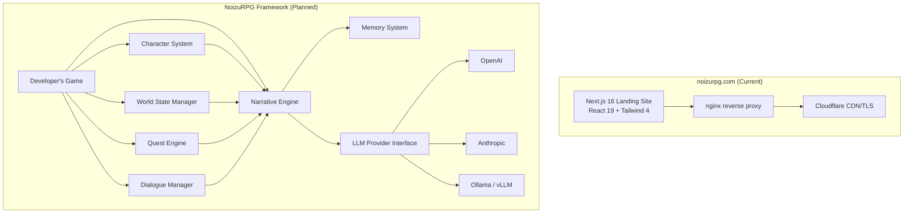

# Project Architecture

## Overview

NoizuRPG is a **composable Python framework** for building AI-powered role-playing games where LLMs are first-class primitives. It provides six independent, LLM-agnostic building blocks — Character System, World State Manager, Narrative Engine, Quest Engine, Dialogue Manager, and Memory System — that developers compose into custom game architectures.

The project currently consists of a **Next.js 16 marketing/documentation site** (`web/`) and **design direction explorations** (`design/`). The Python framework itself is in pre-development (concept validated, implementation not started).

## System Diagram

```mermaid
graph TB
    subgraph "noizurpg.com (Current)"
        WEB[Next.js 16 Landing Site<br/>React 19 + Tailwind 4]
        WEB --> NGINX[nginx reverse proxy]
        NGINX --> CF[Cloudflare CDN/TLS]
    end

    subgraph "NoizuRPG Framework (Planned)"
        GAME[Developer's Game] --> CS[Character System]
        GAME --> WS[World State Manager]
        GAME --> NE[Narrative Engine]
        GAME --> QE[Quest Engine]
        GAME --> DM[Dialogue Manager]

        CS --> NE
        WS --> NE
        NE --> MEM[Memory System]
        QE --> NE
        DM --> NE

        NE --> LLM[LLM Provider Interface]
        LLM --> OPENAI[OpenAI]
        LLM --> ANTHROPIC[Anthropic]
        LLM --> OLLAMA[Ollama / vLLM]
    end
```

## Core Components

| Component | Purpose | Status |
|-----------|---------|--------|
| **Landing Site** (`web/`) | Next.js 16 marketing site with waitlist form | Implemented |
| **Design System** (`design/`) | Three visual direction explorations (Workshop, Wonder, Grimoire) + logo suite | Implemented |
| **Character System** | Stats, inventory, relationships, knowledge tracking | Planned (v0.1) |
| **World State Manager** | Locations, factions, timeline, world rules | Planned (v0.1) |
| **Narrative Engine** | Context assembly, LLM calls, event parsing, validation | Planned (v0.1) |
| **Quest Engine** | Quest templates, procedural generation, state machines | Planned (v0.2) |
| **Dialogue Manager** | NPC voice profiles, knowledge boundaries, disposition | Planned (v0.2) |
| **Memory System** | Event journal, compression, retrieval, session persistence | Planned (v0.1) |
| **LLM Provider Interface** | Unified async interface for OpenAI, Anthropic, Ollama | Planned (v0.1) |

## Web Architecture

The landing site is a static-export-capable Next.js 16 application using the App Router pattern. It serves as the project's public face with a waitlist capture form.

-> *See [arch/web.md](arch/web.md) for details*

## Framework Architecture

The Python framework follows a **composable component** architecture where each subsystem is independent, communicates through typed `GameEvent` objects, and delegates all LLM interaction through a unified `ModelProvider` interface. State is structured data (Pydantic models), not embedded in LLM context.

-> *See [arch/framework.md](arch/framework.md) for details*

## Data Flow

Player actions enter the Narrative Engine, which assembles relevant state from Character, World, and Memory systems into a token-budgeted prompt. The LLM generates prose + structured events. Events are validated against world rules, then applied to update state and feed back into the Memory System.

-> *See [arch/data-flow.md](arch/data-flow.md) for details*

## Infrastructure

The web component deploys as a Docker container behind nginx + Cloudflare. The Python framework publishes to PyPI. Default storage is SQLite (zero-config); PostgreSQL and Redis are supported for production deployments.

-> *See [arch/infrastructure.md](arch/infrastructure.md) for details*

## Key Decisions

| Decision | Rationale |
|----------|-----------|
| **Python-first** | Target audience (indie game devs, ML engineers) lives in Python; TypeScript SDK planned post-v1.0 |
| **Components are independent** | Developers use only what they need; avoids monolithic coupling |
| **LLM-agnostic via ModelProvider** | No vendor lock-in; enables local dev with Ollama, production with commercial APIs |
| **Events as ground truth** | LLMs generate prose but don't own state; typed events are validated before state mutation |
| **Token-budgeted context** | RPGs are infinite-context systems; the ContextBuilder selects relevant state per-call, never dumps everything |
| **Open-source core (MIT) + commercial services** | Framework is free; revenue from Cloud Playground, Managed Memory, Managed Models |

-> *See [arch/decisions.md](arch/decisions.md) for ADRs*
