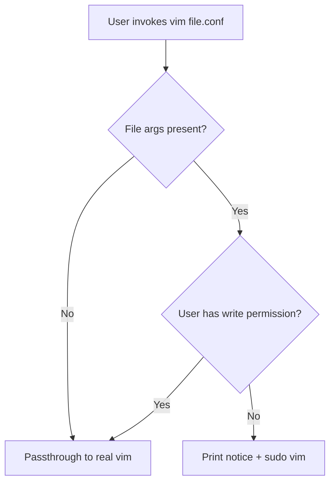

# Architecture — auto-sudo

## Overview

auto-sudo is a collection of **zsh function shims** that transparently elevate commands with `sudo` when the current user lacks write permission to target files or directories. Each shim wraps a standard command (e.g., `vim`) and is sourced into the user's shell profile.

## Design

```mermaid
flowchart TD
    A[User invokes vim file.conf] --> B{File args present?}
    B -- No --> C[Passthrough to real vim]
    B -- Yes --> D{User has write permission?}
    D -- Yes --> C
    D -- No --> E[Print notice + sudo vim]
```

## Components

| Component | Purpose |
|-----------|---------|
| `vim.zsh` | Zsh function that wraps `vim` with write-permission detection |

## Key Design Decisions

- **Zsh function over alias/script**: Functions can shadow commands in the current shell without spawning a subprocess; `command vim` bypasses the shim to call the real binary.
- **Check files, not flags**: Only positional file arguments are inspected — flags (`-x`, `+x`) are skipped to avoid false positives on option values.
- **Existing vs. new files**: Existing files check `-w` on the file itself; new files check `-w` on the parent directory.
- **Visual feedback**: A colored `⚡ auto-sudo vim` banner prints before elevation so the user knows sudo is in effect.

## Extensibility

The same pattern can be applied to other commands (e.g., `nano`, `less`, `cat`) by duplicating the function structure and changing the wrapped command name.
