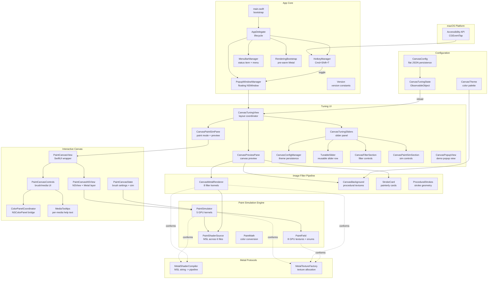

# Project Architecture

## Overview

KopiGajj is a macOS **GPU-accelerated paint simulation and canvas render engine** built as a background app (`.accessory` activation policy) with a global hotkey-activated floating window. It uses Swift 5.9 + SwiftUI for the UI layer and Metal compute shaders (runtime-compiled from Swift string literals) for physically-based paint simulation and artistic post-processing. The app runs as a Swift Package Manager executable targeting macOS 14.0+.

Currently at **Stage 0.5** — the paint simulation engine, image filter pipeline, and tuning UI are implemented. The app provides an interactive canvas with 5 media types (oil, watercolor, acrylic, pastel, highlighter), 16 brush tips (media-specific: 5 general + 3 watercolor + 3 pastel + 2 blending + 3 highlighter), and 8 artistic filters.

## System Diagram

```mermaid
graph TB
    subgraph "macOS Platform"
        AX[Accessibility API<br/>CGEventTap]
    end

    subgraph "App Core"
        MAIN[main.swift<br/>bootstrap]
        AD[AppDelegate<br/>lifecycle]
        HK[HotkeyManager<br/>Cmd+Shift+T]
        PWM[PopupWindowManager<br/>floating NSWindow]
        MB[MenuBarManager<br/>status item + menu]
        RB[RenderingBootstrap<br/>pre-warm Metal]
        VER[Version<br/>version constants]
    end

    subgraph "Metal Protocols"
        MSC[MetalShaderCompiler<br/>MSL string -> pipeline]
        MTF[MetalTextureFactory<br/>texture allocation]
    end

    subgraph "Paint Simulation Engine"
        PS[PaintSimulator<br/>5 GPU kernels]
        PF[PaintField<br/>8 GPU textures + enums]
        PSS[PaintShaderSource<br/>MSL across 6 files]
        PM[PaintMath<br/>color conversion]
    end

    subgraph "Image Filter Pipeline"
        MR[CanvasMetalRenderer<br/>8 filter kernels]
        BG[CanvasBackground<br/>procedural textures]
        SC[StrokeCard<br/>painterly cards]
        PRO[ProceduralStrokes<br/>stroke geometry]
    end

    subgraph "Interactive Canvas"
        PCV[PaintCanvasView<br/>SwiftUI wrapper]
        PCNV[PaintCanvasNSView<br/>NSView + Metal layer]
        PCC[PaintCanvasControls<br/>brush/media UI]
        PCS[PaintCanvasState<br/>brush settings + sim]
        CPC[ColorPanelCoordinator<br/>NSColorPanel bridge]
        MTT[MediaTooltips<br/>per-media help text]
    end

    subgraph "Tuning UI"
        TV[CanvasTuningView<br/>layout coordinator]
        TS[CanvasTuningSliders<br/>slider panel]
        PP[CanvasPreviewPane<br/>canvas preview]
        PSP[CanvasPaintSimPane<br/>paint mode + preview]
        CCM[CanvasConfigManager<br/>theme persistence]
        TUS[TunableSlider<br/>reusable slider row]
        CFS[CanvasFilterSection<br/>filter controls]
        CPSS[CanvasPaintSimSection<br/>sim controls]
        CPV[CanvasPopupView<br/>demo popup view]
    end

    subgraph "Configuration"
        CC[CanvasConfig<br/>flat JSON persistence]
        CT[CanvasTheme<br/>color palette]
        CTS[CanvasTuningState<br/>ObservableObject]
    end

    AX --> HK
    MAIN --> AD
    AD --> HK
    AD --> PWM
    AD --> MB
    AD --> RB
    HK -->|toggle| PWM
    PWM --> TV
    PS -.->|conforms| MSC
    PS -.->|conforms| MTF
    MR -.->|conforms| MSC
    MR -.->|conforms| MTF
    PF -.->|conforms| MTF
    PS --> PF
    PS --> PSS
    TV --> PP
    TV --> TS
    TV --> PSP
    PSP --> PCV
    PCV --> PCNV
    PCV --> PCC
    PCC --> CPC
    PCC --> MTT
    PCNV --> PS
    PCS --> PS
    PP --> BG
    PP --> SC
    PP --> MR
    MR --> PSS
    TS --> CCM
    TS --> TUS
    TS --> CFS
    TS --> CPSS
    CC --> CTS
    CTS -->|reload| TV
    CT --> BG
```

## Core Components

| Component | Purpose |
|-----------|---------|
| `main.swift` + `AppDelegate` | App bootstrap, lifecycle, activation policy |
| `MenuBarManager` | NSStatusItem + dropdown menu (Show/About/Quit) |
| `RenderingBootstrap` | One-shot pre-warm of Metal pipelines + canvas textures at launch |
| `Version` | Centralized version constants (read by `build-app.sh`) |
| `HotkeyManager` | Global Cmd+Shift+T via CGEventTap (requires Accessibility) |
| `PopupWindowManager` | Floating NSWindow creation and toggle |
| `MetalShaderCompiler` | Protocol: compiles MSL source strings into `MTLComputePipelineState` |
| `MetalTextureFactory` | Protocol: creates `MTLTexture` with common configurations |
| `PaintSimulator` | Orchestrates 5 GPU compute kernels for paint simulation |
| `PaintField` | Owns 8 GPU textures + `BrushMode`/`BrushTip` enums (5 media, 16 tips) |
| `PaintShaderSource` | Metal shader source as Swift string literals (enum split across 6 files: Header, BrushStroke, CanvasInit, Filters, FlowDry, Render) |
| `PaintMath` | CPU-side color space conversion (reflectance to absorption) |
| `CanvasMetalRenderer` | 8 artistic image filter kernels (Kuwahara, Oil Paint, etc.) |
| `CanvasBackground` | Procedural canvas texture (thread weave + impasto marks) |
| `StrokeCard` | Painterly card rendering with bristle edges |
| `ProceduralStrokes` | Generates stroke geometry for card overlays |
| `PaintCanvasView` | SwiftUI wrapper for interactive painting |
| `PaintCanvasNSView` | NSView hosting Metal layer for direct GPU rendering |
| `PaintCanvasControls` | Brush/media selection UI |
| `ColorPanelCoordinator` | Singleton bridging NSColorPanel target/action to SwiftUI state |
| `MediaTooltips` | Per-media tooltip descriptions for brush controls |
| `PaintCanvasState` | ObservableObject: brush settings, sim controls, time simulation |
| `CanvasConfig` | Codable config with flat JSON encoding (~30+ params) |
| `CanvasTuningState` | ObservableObject wrapping CanvasConfig as single source of truth |
| `CanvasTuningView` | Layout coordinator: preview pane + slider panel |
| `CanvasPreviewPane` | Left pane: live canvas preview |
| `CanvasTuningSliders` | Right pane: all tuning sliders grouped by sub-config |
| `CanvasPaintSimPane` | Interactive paint mode with multi-render-mode preview |
| `CanvasConfigManager` | Theme picker + save/load/delete to `~/.config/kopigajj/themes/` |
| `TunableSlider` | Reusable slider row with baseline comparison + info popover |
| `CanvasFilterSection` | Filter controls sub-view extracted from tuning sliders |
| `CanvasPaintSimSection` | Paint simulation controls sub-view extracted from tuning sliders |
| `CanvasPopupView` | Demo popup view showcasing canvas render engine |

## Render Pipeline

Two independent Metal compute pipelines: paint simulation (5 kernels) and image filters (8 kernels). The paint simulation uses an absorption color model with a three-layer architecture (canvas, solid, wet), supporting 5 media types and 16 brush tips. Total frame time: ~1-3ms on Apple Silicon.

-> *See [arch/render-pipeline.md](arch/render-pipeline.md) for layer stack, kernel inventory, texture layout, and color model*

## Data Flow

Hotkey press -> CGEventTap intercept -> PopupWindowManager toggle -> CanvasTuningView render. Config changes flow through `CanvasTuningState` and persist to `~/.config/kopigajj/themes/` as flat JSON. Stroke history persists to `~/.config/kopigajj/paint-state/`.

-> *See [arch/data-flow.md](arch/data-flow.md) for pipeline diagrams*

## Technology Stack

| Layer | Technology |
|-------|-----------|
| Language | Swift 5.9+ |
| UI | SwiftUI (macOS 14.0+) |
| GPU | Metal Shading Language (runtime-compiled from Swift string literals) |
| Build | Swift Package Manager |
| Platform APIs | CGEventTap (global hotkey) |
| Persistence | JSON config files (`~/.config/kopigajj/`) |
| Min macOS | 14.0 Sonoma |

## Key Decisions

- **SPM executable, not Xcode project** — faster iteration; no `.xcodeproj` overhead
- **Runtime shader compilation** — all MSL lives as Swift string literals in the `PaintShaderSource` enum (split across 6 files: Header, BrushStroke, CanvasInit, Filters, FlowDry, Render), compiled via `MTLDevice.makeLibrary(source:)`. Eliminates Metal toolchain dependency in SPM builds; `Package.swift` excludes any `.metal` files
- **Absorption color model** — paint stores absorption values (0=transparent, higher=more opaque) rather than reflectance RGB. Physically correct for subtractive pigment mixing. Final rendering converts via Beer-Lambert (`exp(-absorption * concentration)`)
- **Metal protocols for reuse** — `MetalShaderCompiler` and `MetalTextureFactory` extract common Metal boilerplate. Both `PaintSimulator` and `CanvasMetalRenderer` conform to these
- **CGEventTap over NSEvent.addGlobalMonitor** — can block the hotkey from reaching other apps
- **Procedural textures over AI-generated assets** — canvas background generated at init and cached
- **`.accessory` activation policy** — no dock icon; menu bar only
- **Flat JSON config encoding** — despite nested Swift structs, JSON keys are flat for backward compatibility with saved themes

## Testing

Test target declared in `Package.swift` with 9 test files covering: struct layout verification (`BrushPoint` 56-byte contract), `CanvasConfig` Codable round-trip, enum stability contracts, color math, Metal shader compilation, `PaintCanvasState` behavior, `PaintField` texture management, paint pipeline integration, and regression tests. Helper fixtures in `Tests/KopiGajjTests/Helpers/`.

## References

- [Render Pipeline](arch/render-pipeline.md) — layer stack, kernels, textures, color model
- [Data Flow](arch/data-flow.md) — event and config pipeline diagrams
- [Medium Behaviour](medium-behaviour.md) — physical paint media reference for shader implementation
