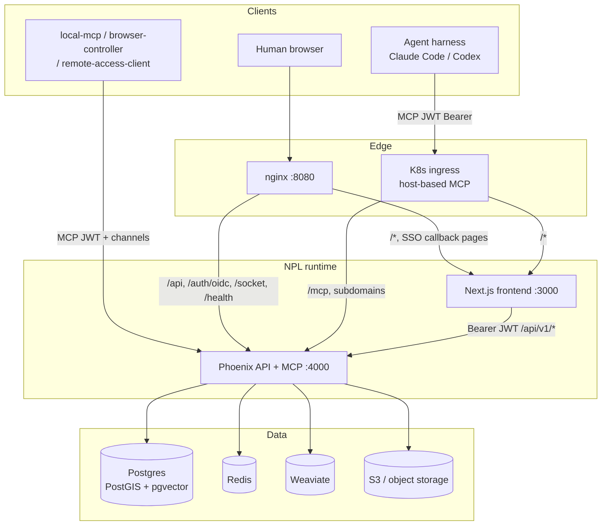
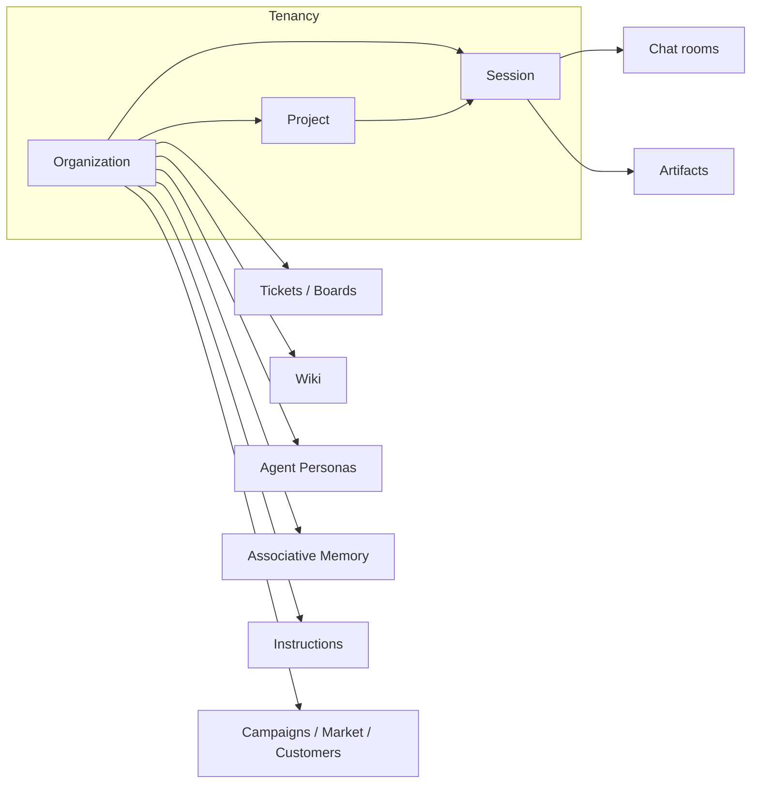
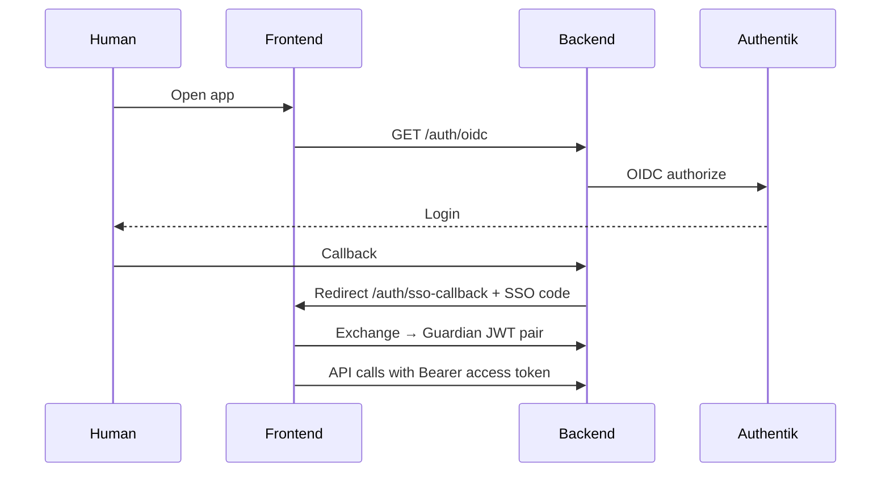
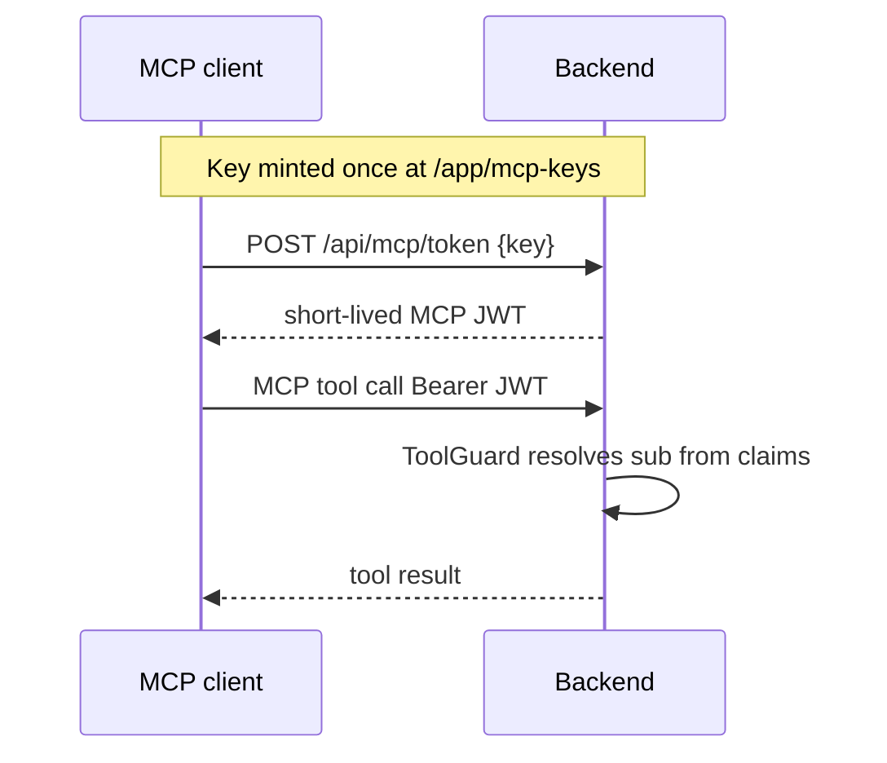

# Architecture — NoizuPromptLingo (NPL / tobor)

Multi-tenant collaboration platform for AI coding-agent harnesses and the humans supervising them. Agents get durable org/project-scoped infrastructure (sessions, tickets, chat, wiki, memory, versioned prompts) via **MCP** (`tobor-*` servers). Humans use a Next.js web app for the same domains. This codebase *is* tobor — monorepo Claude sessions that call `tobor-sessions` / `tobor-organizations` hit this product.

Elixir/Next.js rewrite of a deprecated Python build (see `FEATURE-PARITY-AUDIT.md`). “Prompt Lingua” specifically names the NPL convention engine (`/api/v1/npl/*`, `priv/conventions/`); most surface area is general agent/human work coordination.

## System overview

Three runtime containers (nginx → Phoenix backend + Next.js frontend) share external Postgres (PostGIS + pgvector) and Redis. The backend owns all product domains under `lib/noizu_prompt_lingua/domains/` and exposes **20+ MCP servers** on host-scoped paths (`sessions.<host>/mcp`, `tickets.<host>/mcp`, …) plus a host-less root aggregator at `/mcp`. Each MCP server implements the same five discovery tools (`ToolSummary`, `ToolSearch`, `ToolDefinition`, `ToolCall`, `ToolHelp`); semantic search is Weaviate-backed.

**Tenancy spine:** Organization → Project → Session. Sessions group rooms, artifacts, and tickets for a unit of work. Membership is coarse (`owner|admin|lead|member|viewer`); fine-grained access uses PBAC v2 (groups, JSON policies, scoped memberships, custom roles) with a policy simulator.

**Two auth paths (deliberately separate):**

| Actor | Flow |
|-------|------|
| **Humans** | Authentik OIDC → SSO code exchange → Guardian access/refresh JWT. Password/magic-link routes exist in UI but are disabled server-side; registration is invite-token gated. |
| **Agents / MCP** | User mints long-lived `McpApiKey` (shown once) → `POST /api/mcp/token` (or `/api/v1/auth/mcp/token`) → short-lived MCP JWT as Bearer. Identity for tool calls is resolved **server-side** from JWT claims (`MCP.ToolGuard` / `MCP.Resolve`), never from caller-supplied actor args. |

## System diagram

```mermaid
graph TB
  subgraph Clients
    Browser[Human browser]
    Harness[Agent harness<br/>Claude Code / Codex]
    LocalTools[local-mcp / browser-controller<br/>/ remote-access-client]
  end

  subgraph Edge
    Nginx[nginx :8080]
    Ingress[K8s ingress<br/>host-based MCP]
  end

  subgraph "NPL runtime"
    FE[Next.js frontend :3000]
    BE[Phoenix API + MCP :4000]
  end

  subgraph Data
    PG[(Postgres<br/>PostGIS + pgvector)]
    Redis[(Redis)]
    WV[(Weaviate)]
    S3[(S3 / object storage)]
  end

  Browser --> Nginx
  Harness -->|MCP JWT Bearer| Ingress
  LocalTools -->|MCP JWT + channels| BE
  Nginx -->|"/api, /auth/oidc, /socket, /health"| BE
  Nginx -->|"/*, SSO callback pages"| FE
  Ingress -->|/mcp, subdomains| BE
  Ingress -->|/*| FE
  BE --> PG
  BE --> Redis
  BE --> WV
  BE --> S3
  FE -->|Bearer JWT /api/v1/*| BE
```

```mermaid
graph LR
  subgraph Tenancy
    Org[Organization] --> Proj[Project]
    Org --> Sess[Session]
    Proj --> Sess
  end

  Sess --> Chat[Chat rooms]
  Sess --> Art[Artifacts]
  Org --> Tickets[Tickets / Boards]
  Org --> Wiki[Wiki]
  Org --> Persona[Agent Personas]
  Org --> Mem[Associative Memory]
  Org --> Instr[Instructions]
  Org --> Mkt[Campaigns / Market / Customers]
```

## Core components

| Component | Role |
|-----------|------|
| **nginx** | Local reverse proxy: `/api/*`, `/auth/*` (except SPA auth pages), `/socket`, `/health` → backend; rest → frontend |
| **backend** (`:noizu_prompt_lingua`) | Phoenix 1.8 JSON API, MCP fleet, channels, Oban jobs, domain contexts |
| **frontend** (`npl-frontend`) | Next.js App Router — public, `/app/*` dashboard, `/app/[orgId]/*` org surfaces, `/app/admin/*` |
| **Liquibase** (`backend/db/`) | Canonical schema changelogs `000`–`073+`; runs as migrate container/Job before app |
| **MCP catalog** (`MCPServers`) | Single source of truth for subdomain MCP servers + custom-scope packaging |
| **PBAC / Authz** | Groups, policies, scoped memberships; `ToolGuard` shadow/enforce on MCP tools |
| **NPL engine** (`npl/`, `tools/npl_*`) | Convention load/spec generation from YAML corpus |
| **pm_core** (`noizu_labs_pm`) | Optional shared PM data layer when `PM_CORE_DATABASE_URL` is set |
| **local-mcp** | Downloadable stdio MCP: local git/rg/file tools (never leaves machine) |
| **browser-controller** | Local Playwright driven by cloud `Browser.*` MCP via Phoenix channel relay |
| **remote-access-client** | frpc wrapper claiming named tunnels (`*.remote-access.noizu.com`) |
| **helm/start-app** | Scaffold-style chart (compose-aligned deploy shape) |
| **helm/npl-mcp** | Production chart for tobor.locker (MCP paths, multi-host ingress) |
| **agents/ / commands/** | NPL agent personas and slash-command prompts for coding harnesses (not runtime) |
| **design/theme/** | Theme treatises + YAML (brutalist, editorial, minimal, nocturne, …) |

### Backend domain map (high level)

| Domain path | Responsibility |
|-------------|----------------|
| `domains/tickets` | Tickets, boards/stages/iterations, type & field defs (tri-scoped), links |
| `domains/chat` | Rooms, messages, threads, pins, events, notifications |
| `domains/wiki` | Spaces, pages, comments, attachments, reactions |
| `domains/artifacts` | Versioned typed content + revisions |
| `domains/review` | Reviews, pixel-anchored overlays, verdict/compile/attach |
| `domains/personas` | Agent identities: bio, journal, knowledge base |
| `domains/memory` | Episodic/semantic/procedural memory, emotion vectors, associations, quarantine |
| `domains/instructions` | Versioned slug-addressable prompt templates |
| `domains/assets` | Creative asset pipeline (generate → review → publish) |
| `domains/campaigns` / `market` / `customers` | Marketing suite (ads, landing pages, research, ICPs) |
| `domains/github` | Repo/token integration, PRs/issues |
| `domains/browser` | Relay to local Playwright controller |
| `domains/mock_mcp` | LLM-generated mock MCP servers at `mockmcp.<host>/mcp/:slug/mcp` |
| `domains/notifications` / `pubsub` | Inbox, presence, org channels |
| `domains/unicode_codex` | Glyph/control-code reference (global/org/project layers) |
| `domains/remote_access` | Named reverse tunnels |
| `mcp/` + `entities/` | Core tenancy MCP (orgs/projects/sessions/clients), API keys, resolve/guard |
| `schema/` | Ecto schemas mirroring Liquibase tables |

### MCP servers (catalog)

Required: **root**, **sessions**, **organizations**. Optional subdomain servers: projects, tickets, assets, artifacts, chat, review, wiki, github, personas, instructions, memory, markdown, notifications, pubsub, browser, customers, market, campaigns, unicode. Custom include-scopes served at `/custom/:slug/mcp`. Packaging modes: `default` | `core_custom` | `all_in_one`.

### Frontend surfaces

| Area | Routes (illustrative) |
|------|------------------------|
| Public / auth | `/`, `/login`, `/auth/sso-callback`, `/auth/register` |
| User app | `/app`, `/app/organizations`, `/app/mcp-keys`, `/app/profile` |
| Org product | `/app/[orgId]/{sessions,tickets,boards,chat,wiki,artifacts,reviews,personas,memory,instructions,assets,projects,github,mock-mcp,…}` |
| Admin | `/app/admin/{users,orgs,llm-models,mcp-custom-scopes,github,authz,media-providers}` |

Realtime: Phoenix channels (`/socket`) for org/browser; frontend uses `phoenix` JS client.

## Request & auth flows

```mermaid
sequenceDiagram
  participant H as Human
  participant FE as Frontend
  participant BE as Backend
  participant A as Authentik

  H->>FE: Open app
  FE->>BE: GET /auth/oidc
  BE->>A: OIDC authorize
  A-->>H: Login
  H->>BE: Callback
  BE->>FE: Redirect /auth/sso-callback + SSO code
  FE->>BE: Exchange → Guardian JWT pair
  FE->>BE: API calls with Bearer access token
```

```mermaid
sequenceDiagram
  participant Agent as MCP client
  participant BE as Backend

  Note over Agent,BE: Key minted once at /app/mcp-keys
  Agent->>BE: POST /api/mcp/token {key}
  BE-->>Agent: short-lived MCP JWT
  Agent->>BE: MCP tool call Bearer JWT
  BE->>BE: ToolGuard resolves sub from claims
  BE-->>Agent: tool result
```

## Schema & jobs

- **Liquibase** is canonical (`backend/db/changelog/`): extensions, scaffold auth/org base, then NPL domains (PBAC, sessions, tickets, chat, memory, campaigns, MCP scopes, …).
- **Ecto** schemas under `schema/`; migrator may run in non-release boots; release path relies on Liquibase Job/container.
- **Oban** workers: cleanup, memory embeddings/reinforcement/link jobs.
- **Redis**: cache, presence, mock-mcp/ephemeral state.
- **Weaviate**: MCP tool semantic search / mock-mcp store.
- **S3 (ex_aws)**: media/binary artifact storage.

Detailed table map: `docs/PROJ-SCHEMA.md`. Layout: `docs/PROJ-LAYOUT.md`.

## Deployment

| Mode | How |
|------|-----|
| Local prod-like | `make init` → `make build` → `make run` (nginx host port; NPL mapped **8095** in Makefile) |
| Local dev | `make run-dev` — source mounts, Phoenix reloader, Next HMR, Liquibase service first |
| Sandbox | Single container (Node + Elixir + Samba) for remote edit mounts |
| Kubernetes | `helm/npl-mcp` (tobor.locker): path/host routing for `/mcp`, subdomains, frontend; images `ops.noizu.com/npl-mcp/*`; secrets via Infisical |

Compose joins external Docker network `lets-go_default` for shared Postgres/Redis (slug `npl`, Redis DB `15`).

## Technology stack

| Layer | Choice |
|-------|--------|
| Frontend | Next.js 16, React 19, Tailwind v4, `@noizu/styleguide`, next-intl, Playwright e2e |
| Backend | Elixir ~1.15+, Phoenix 1.8, Bandit, Guardian, Ueberauth/OIDC, Oban, Hammer |
| MCP | `noizu_mcp`, multi-server host routing, custom gateways |
| Data | PostgreSQL (PostGIS, pgvector), Redis (Redix), Weaviate (`noizu_weaviate`) |
| AI | GenAI, optional media providers / LLM model catalog |
| Schema | Liquibase YAML + Ecto |
| Observability | OpenTelemetry (Phoenix, Ecto, Bandit, frontend RUM via `/otel`) |
| Proxy / deploy | nginx, Docker Compose, Helm, registry `ops.noizu.com`, Infisical secrets |
| Companion Node pkgs | local-mcp, browser-controller (Playwright), remote-access-client (frpc) |

## Key design decisions

1. **MCP-first product surface** — domains dual-expose REST (web) and MCP (agents); discovery tools avoid hard-coded tool lists in clients.
2. **Subdomain MCP isolation** — one server per domain keeps client configs small; root aggregates; custom scopes package subsets for least privilege.
3. **Server-side actor identity** — closes spoofing via tool args; `ToolGuard` rolls out shadow → enforce.
4. **Layered authz** — simple membership ladder for routes; PBAC for policies/simulation; MCP authz metadata per tool.
5. **Humans ≠ agents for auth** — OIDC for people; API-key→MCP JWT for harnesses; no password login in production path.
6. **Dual-track schema** — Liquibase for shared/canonical history; Ecto for app types and runtime access.
7. **Local side-cars for cloud-unsafe ops** — browser automation and reverse tunnels stay on the user’s machine; cloud only orchestrates.
8. **Scaffold heritage, product fork** — originally hydrated from `start-app`; identity/Makefile maps still resemble portfolio apps, but domain code and `helm/npl-mcp` are NPL-specific. Nested `backend/docs` / `frontend/docs` PROJ-ARCH files may still describe scaffold remnants — prefer this file + README for product architecture.

## References

| Doc | Contents |
|-----|----------|
| [README.md](../README.md) | Product overview, features, runbook |
| [FEATURE-PARITY-AUDIT.md](FEATURE-PARITY-AUDIT.md) | Parity vs deprecated Python NPL |
| [PROJ-LAYOUT.md](PROJ-LAYOUT.md) | Directory / module layout |
| [PROJ-SCHEMA.md](PROJ-SCHEMA.md) | Database schema |
| [REMOTE-ACCESS-TUNNEL-DESIGN.md](REMOTE-ACCESS-TUNNEL-DESIGN.md) | Tunnel design detail |
| `backend/lib/.../mcp_servers.ex` | Live MCP server catalog |
| `backend/lib/.../router.ex` | Authoritative HTTP/MCP routes |
| `agents/`, `commands/` | Harness agent & command definitions |
