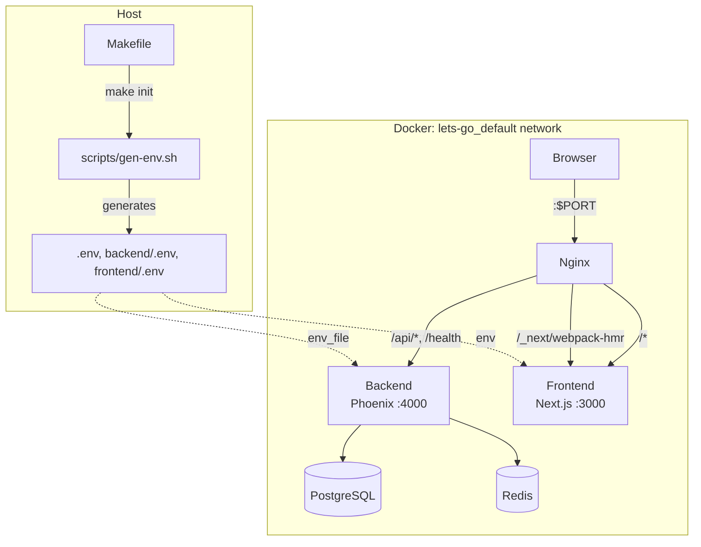
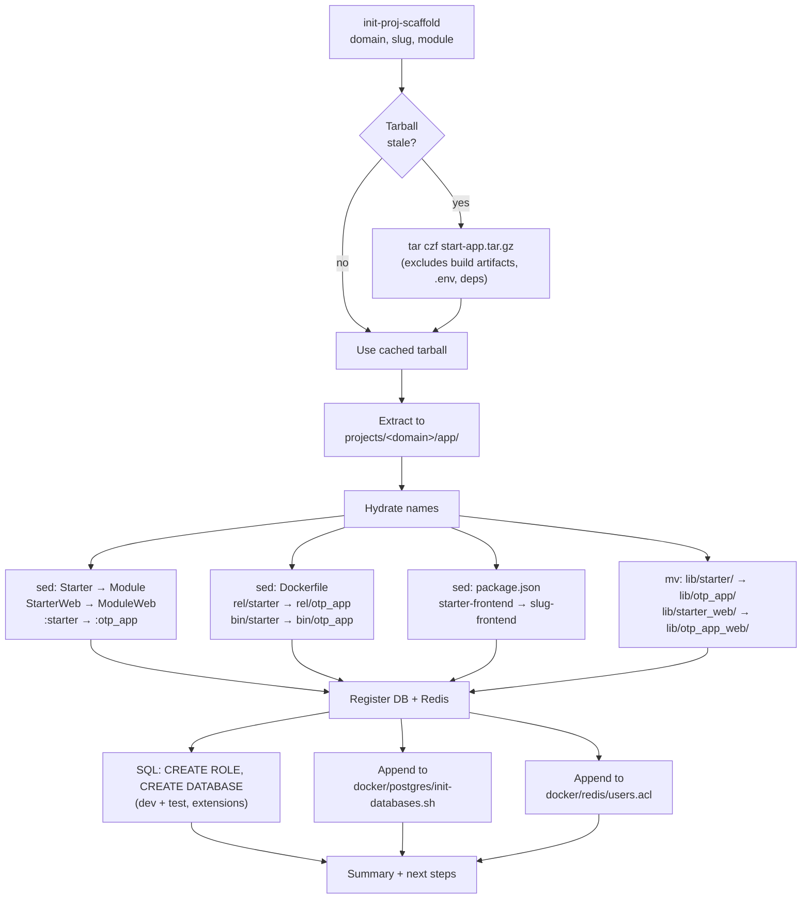
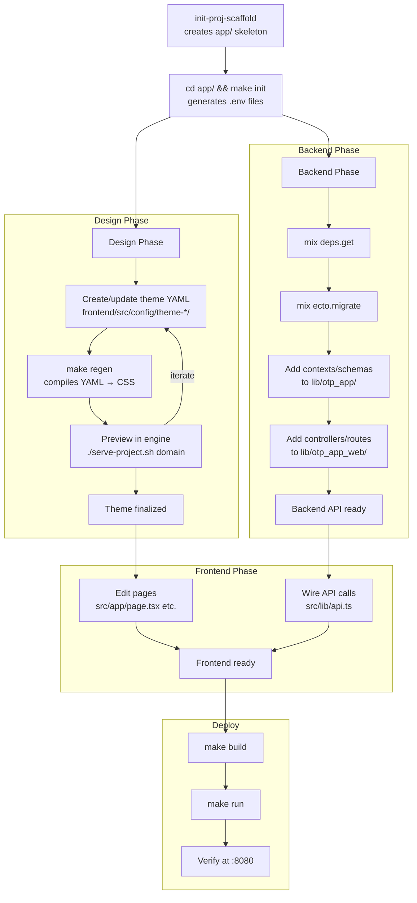

# Architecture — start-app

Reusable starter template for portfolio projects. Three Docker containers — **Next.js frontend**, **Phoenix API backend**, **nginx reverse proxy** — sharing a common Docker network with external Postgres and Redis. Designed to be scaffolded into `projects/{domain}/app/`, where the Makefile auto-derives project identity from the parent directory name (the domain).

## System Diagram


```mermaid
graph TB
    subgraph "Host"
        Make[Makefile] -->|make init| GenEnv[scripts/gen-env.sh]
        GenEnv -->|generates| EnvFiles[".env, backend/.env, frontend/.env"]
    end

    subgraph "Docker: lets-go_default network"
        Client[Browser] -->|":$PORT"| Nginx

        Nginx -->|"/api/*, /health"| Backend["Backend<br/>Phoenix :4000"]
        Nginx -->|"/*"| Frontend["Frontend<br/>Next.js :3000"]
        Nginx -->|"/_next/webpack-hmr"| Frontend

        Backend --> PG[(PostgreSQL)]
        Backend --> Redis[(Redis)]
    end

    EnvFiles -.->|env_file| Backend
    EnvFiles -.->|env| Frontend
```

## Core Components

| Component | Purpose |
|-----------|---------|
| **nginx** | Reverse proxy — routes `/api/*` to backend, everything else to frontend |
| **backend** | Phoenix 1.8 JSON API — JWT auth, Postgres (PostGIS/pgvector), Redis |
| **frontend** | Next.js 15 App Router — YAML-driven design system, auth UI, styleguide viewer |
| **Makefile** | Build orchestration — image builds, lifecycle commands, project identity derivation |
| **docker-compose.yaml** | Production service definitions — connects to external `lets-go_default` network |
| **docker-compose.dev.yaml** | Dev overrides — volume mounts, hot reload, Liquibase migrations |
| **helm/start-app/** | Publishable Helm chart for Kubernetes deployment |
| **scripts/gen-env.sh** | Secret generation — creates `.env` files with unique keys per project |

## Request Routing

Nginx listens on the host-mapped `$PORT` (default 8080) and dispatches:

| Pattern | Destination | Notes |
|---------|-------------|-------|
| `/api/*` | backend:4000 | Phoenix JSON API |
| `/health` | backend:4000 | Health check endpoint |
| `/_next/webpack-hmr` | frontend:3000 | WebSocket upgrade for HMR |
| `/*` | frontend:3000 | Next.js pages and static assets |

Backend and frontend resolve at request time (not startup) to tolerate slow container boots.

## Network Architecture

All three containers join the **external** `lets-go_default` Docker network. Shared infrastructure (Postgres, Redis) runs on this same network, managed outside this project. Each portfolio project gets its own database, Redis DB number, and slug — isolated but sharing the same infrastructure.

## Project Identity System

The Makefile contains lookup maps that derive project-specific values from the domain name:

| Derived Value | Source | Example (`bladeofeternity.com`) |
|---------------|--------|---------------------------------|
| `PROJECT_SLUG` | `SLUG_MAP` | `boe` |
| `DB_NAME` | directory name → underscores | `bladeofeternity_com_dev` |
| `REDIS_DB` | `REDIS_DB_MAP` | `0` |
| Image tags | `$REGISTRY/$PROJECT_DIR/{service}:$TAG` | `ops.noizu.com/bladeofeternity.com/backend:latest` |

**Directory detection:** When the Makefile is inside `app/` (the scaffold convention), `PROJECT_DIR` resolves from the parent directory — e.g., `projects/bladeofeternity.com/app/` → `bladeofeternity.com`. When the template directory is named `start-app` (not a real project), it falls back to slug `starter` and Redis DB `0`.

## Authentication & SSO

JWT-based, split across both services, with pluggable SSO providers:

- **Backend**: Guardian issues access (1h) + refresh (7d) tokens. Endpoints at `/api/v1/auth/*`. SSO via Ueberauth — supports OIDC, Google, Facebook, GitHub, LinkedIn, and SAML. SSO auto-creates users or requires invite (`sso_require_invite` config).
- **Frontend**: `AuthProvider` context stores tokens in `localStorage`, `api.ts` auto-attaches Bearer header. SSO callback at `/auth/sso-callback`. Password reset at `/forgot-password`.
- **MCP clients (tobor.locker)**: Migrating from custom API-key → long-lived JWT mint to **OAuth 2.1** (AS embedded in this app) so Claude.ai / ChatGPT Custom Connectors can connect via DCR + PKCE. Phase 0 ships JWKS + dual token verification; full program is Phases 0–4.

→ *MCP OAuth design: monorepo `docs/arch/mcp-oauth-authz-design.md` (Phases 0–4 Accepted)*

→ *See [backend/docs/PROJ-ARCH.md](../backend/docs/PROJ-ARCH.md) and [frontend/docs/PROJ-ARCH.md](../frontend/docs/PROJ-ARCH.md) for per-service details*

## Analytics

Pluggable analytics via a provider abstraction layer:

- **Runtime config injection**: `docker-entrypoint.sh` generates `/__env.js` from K8s env vars → `window.__ENV` → `getRuntimeConfig()`. No rebuild needed to change analytics keys.
- **Provider pattern**: `frontend/src/lib/analytics/` defines a unified interface with pluggable backends (Google Analytics, PostHog). `AnalyticsProvider` component auto-tracks page views.
- **Helm integration**: `values.yaml` exposes `analytics.ga.measurementId` and `analytics.posthog.key` — flows through ConfigMap → env → runtime injection.
- **Cookie consent gating**: `frontend/src/lib/consent/` stores category-level consent. GA/PostHog scripts and events are blocked until the `analytics` category is approved. Users can reject optional categories, accept all, save custom choices, and reopen settings from the navbar.
- **Compliance baseline**: The starter provides a practical default for non-essential analytics consent, but project owners still need accurate privacy/cookie policy copy for their deployed project and jurisdiction.

## Design System

YAML theme configs in `frontend/src/config/theme-style-guide/` define the full visual language. At build time, the `@noizu/styleguide` package compiles them into generated CSS. Tailwind v4 bridges the CSS variables via `@theme`.

→ *See [frontend/docs/arch/design-system.md](../frontend/docs/arch/design-system.md) for details*

## Schema Management

Dual-track migration system:

- **Ecto migrations** (`priv/repo/migrations/`) — standard Elixir migration files, run via `mix ecto.migrate`
- **Liquibase** (`backend/db/`) — YAML changelogs (000–010) defining the canonical schema. Runs as a dedicated container (`migrations` service in dev compose, `migrate-job` in Helm). Covers extensions, enums, seed helpers, versioned entities, auth providers, media, users, credentials/sessions, organizations, and invite tokens.

Liquibase runs before the backend starts (via `depends_on: condition: service_completed_successfully` in dev, pre-install Job hook in Helm).

## Deployment

### Docker (Local / Docker Compose)

Multi-stage Dockerfiles for each service:

| Service | Base | Output |
|---------|------|--------|
| Backend | `elixir:1.19.5-otp-28-slim` | OTP release, runs as `nobody` |
| Frontend | `node:22-alpine` | Standalone Next.js server |
| Nginx | `nginx:alpine` | Static config, reverse proxy |

`make build-push` builds multi-arch (`amd64` + `arm64`) images and pushes to the project registry.

**Dev mode**: `docker-compose.dev.yaml` overrides mount source volumes, run dev servers (mix/npm), and use named volumes for build caches. Liquibase migrations run first as a separate service.

### Kubernetes (Helm)

Publishable Helm chart at `helm/start-app/`:

| Template | Purpose |
|----------|---------|
| `deployment.yaml` | Backend + frontend containers in a single pod |
| `service.yaml` | ClusterIP service |
| `ingress.yaml` | NGINX ingress with Cloudflare-only whitelist |
| `tls-secret.yaml` | TLS cert from Infisical |
| `migrate-job.yaml` | Pre-install/upgrade Job running Ecto migrations |
| `configmap.yaml` | Runtime config (analytics keys, SSO settings, mail config) |

Secrets come from Infisical-synced K8s Secrets. The chart supports OIDC, SAML, OAuth providers, SendGrid mail, and analytics — all configurable via `values.yaml`.

## Technology Stack

| Layer | Choice |
|-------|--------|
| Frontend | Next.js 15, React 19, Tailwind v4 |
| Backend | Elixir 1.19, Phoenix 1.8, Bandit |
| Database | PostgreSQL (PostGIS, pgvector) |
| Cache | Redis (Redix) |
| Auth | Guardian JWT + bcrypt, Ueberauth SSO (OIDC/SAML/OAuth) |
| Analytics | Google Analytics, PostHog (pluggable provider pattern) |
| Schema Mgmt | Liquibase (YAML changelogs) + Ecto migrations |
| Proxy | Nginx |
| Container | Docker, docker-compose (prod + dev) |
| Orchestration | Kubernetes via Helm chart |
| Registry | `ops.noizu.com` (self-hosted) |
| Secrets | Infisical Operator → K8s Secrets |
| Build | Make + shell scripts |

## Scaffold Flow — `init-proj-scaffold`

The `bin/init-proj-scaffold` script automates the full lifecycle of creating a new project from this template. It is the primary entry point for both human operators and AI agents.

### Usage

```bash
init-proj-scaffold <project_dir> <slug> <elixir_module>
# Example: init-proj-scaffold derobot.is derobot Derobot
```

`bin/` is on PATH via `.envrc`, so the command is callable without a path prefix. The project root directory (`projects/{domain}/`) is expected to already exist with design artifacts (README.md, design/, docs/). The script creates the `app/` subdirectory inside it.

### Scaffold Pipeline


```mermaid
graph TD
    A["init-proj-scaffold<br/>domain, slug, module"] --> B{Tarball<br/>stale?}
    B -->|yes| C["tar czf start-app.tar.gz<br/>(excludes build artifacts, .env, deps)"]
    B -->|no| D[Use cached tarball]
    C --> D
    D --> E["Extract to<br/>projects/&lt;domain&gt;/app/"]
    E --> F["Hydrate names"]

    F --> F1["sed: Starter → Module<br/>StarterWeb → ModuleWeb<br/>:starter → :otp_app"]
    F --> F2["sed: Dockerfile<br/>rel/starter → rel/otp_app<br/>bin/starter → bin/otp_app"]
    F --> F3["sed: package.json<br/>starter-frontend → slug-frontend"]
    F --> F4["mv: lib/starter/ → lib/otp_app/<br/>lib/starter_web/ → lib/otp_app_web/"]

    F1 --> G["Register DB + Redis"]
    F2 --> G
    F3 --> G
    F4 --> G

    G --> G1["SQL: CREATE ROLE, CREATE DATABASE<br/>(dev + test, extensions)"]
    G --> G2["Append to<br/>docker/postgres/init-databases.sh"]
    G --> G3["Append to<br/>docker/redis/users.acl"]

    G1 --> H["Summary + next steps"]
    G2 --> H
    G3 --> H
```

### Name Derivation

The script takes three inputs and derives everything else:

| Input | Example |
|-------|---------|
| `project_dir` | `derobot.is` |
| `slug` | `derobot` |
| `elixir_module` | `Derobot` |

| Derived | Rule | Result |
|---------|------|--------|
| `otp_app` | PascalCase → snake_case | `derobot` |
| `otp_app_web` | `{otp_app}_web` | `derobot_web` |
| `web_module` | `{module}Web` | `DerobotWeb` |
| `db_name` | dir with `.`/`-` → `_` + `_dev` | `derobot_is_dev` |
| `db_name_test` | same but `_test` | `derobot_is_test` |
| `frontend_name` | `{slug}-frontend` | `derobot-frontend` |

### Hydration Rules (ordered longest-first)

| Target Files | From | To |
|---|---|---|
| `*.ex`, `*.exs` | `StarterWeb` | `{module}Web` |
| `*.ex`, `*.exs` | `Starter` | `{module}` |
| `*.ex`, `*.exs` | `:starter` | `:{otp_app}` |
| `*.ex`, `*.exs` | `"starter"` | `"{otp_app}"` |
| `*.ex`, `*.exs` | `starter_dev` | `{slug}_dev` |
| `Dockerfile` | `rel/starter`, `bin/starter` | `rel/{otp_app}`, `bin/{otp_app}` |
| `package.json` | `starter-frontend` | `{slug}-frontend` |

### Infrastructure Registration

The script modifies two shared files and optionally runs SQL against a live database:

| File | Change |
|------|--------|
| `docker/postgres/init-databases.sh` | Appends `dev` + `test` entries to `PROJECTS` array |
| `docker/redis/users.acl` | Appends `user {slug} on >{slug}_dev ~{slug}:* &* +@all` |
| Live Postgres (if running) | `CREATE ROLE`, `CREATE DATABASE` (×2), extensions (timescaledb, age) |

This ensures DB/Redis are available immediately and will also be created on future clean `docker compose up` events.

## Agent Workflow — Post-Scaffold Setup

After `init-proj-scaffold` creates the app skeleton inside `projects/{domain}/app/`, an AI agent (or human) follows this sequence to bring the project to a running state with a customized design:


```mermaid
graph TD
    SCAFFOLD["init-proj-scaffold<br/>creates app/ skeleton"] --> INIT["cd app/ && make init<br/>generates .env files"]
    INIT --> DESIGN["Design Phase"]
    INIT --> BACKEND["Backend Phase"]

    subgraph "Design Phase"
        DESIGN --> D1["Create/update theme YAML<br/>frontend/src/config/theme-*/"]
        D1 --> D2["make regen<br/>compiles YAML → CSS"]
        D2 --> D3["Preview in engine<br/>./serve-project.sh domain"]
        D3 -->|iterate| D1
        D3 --> D4["Theme finalized"]
    end

    subgraph "Backend Phase"
        BACKEND --> B1["mix deps.get"]
        B1 --> B2["mix ecto.migrate"]
        B2 --> B3["Add contexts/schemas<br/>to lib/otp_app/"]
        B3 --> B4["Add controllers/routes<br/>to lib/otp_app_web/"]
        B4 --> B5["Backend API ready"]
    end

    subgraph "Frontend Phase"
        D4 --> F1["Edit pages<br/>src/app/page.tsx etc."]
        B5 --> F2["Wire API calls<br/>src/lib/api.ts"]
        F1 --> F3["Frontend ready"]
        F2 --> F3
    end

    subgraph "Deploy"
        F3 --> DEP1["make build"]
        DEP1 --> DEP2["make run"]
        DEP2 --> DEP3["Verify at :8080"]
    end
```

### Phase 1: Design System Setup

The scaffold includes a base `theme-style-guide/` config. An agent customizes it:

1. **Theme YAML directory** — `app/frontend/src/config/theme-{slug}/` contains YAML files that define the visual language: colors, typography, spacing, borders, shadows, semantic tokens.

2. **Regenerate CSS** — `cd app && make regen` runs the `@noizu/styleguide` CSS generator. This compiles all theme YAML into `app/frontend/src/app/design-system.generated.css`.

3. **Preview in engine** — From the repo root, `./serve-project.sh {domain}` symlinks the project's themes into the styleguide-engine and starts a dev server with the full interactive style guide viewer.

4. **Iterate** — Modify YAML, re-run `make regen`, refresh the engine. The engine shows 20+ showcases (typography, colors, spacing, buttons, cards, forms, etc.) so the agent can validate the design system before touching any page code.

5. **Update sitemap page** — Edit `app/frontend/src/app/sitemap/page.tsx` to reflect the project's actual information architecture (from `design/SITEMAP.md`). Mermaid.js renders the diagrams.

### Phase 2: Backend Customization

The scaffold includes user auth (Guardian JWT), accounts context, and health check. An agent extends it:

1. **Add contexts** — New business logic goes in `lib/{otp_app}/` as Ecto schemas + context modules (e.g., `lib/{otp_app}/products.ex`).

2. **Add migrations** — `mix ecto.gen.migration add_products` creates timestamped migrations in `priv/repo/migrations/`.

3. **Add controllers** — API endpoints go in `lib/{otp_app}_web/controllers/`. The router (`lib/{otp_app}_web/router.ex`) already has authenticated and public pipeline scopes.

4. **Add seeds** — `priv/repo/seeds/dev-seeds.exs` for development data.

### Phase 3: Frontend Customization

1. **Edit pages** — `src/app/page.tsx` (landing), `src/app/styleguide/page.tsx` (viewer). The styleguide page imports components from `@noizu/styleguide`.

2. **Wire API calls** — `src/lib/api.ts` provides a configured fetch wrapper with auth token injection. Add new API functions here.

3. **Add pages** — New routes as `src/app/{route}/page.tsx` (Next.js App Router convention).

### Phase 4: Docker Build & Run

```bash
make build    # Builds backend, frontend, nginx images
make run      # docker compose up -d → nginx on :8080
make logs     # Tail all container logs
```

### File System After Full Setup

```
projects/{domain}/
├── README.md                     # project identity, value prop, status
├── design/                       # style guides, SITEMAP.md (created before scaffold)
├── docs/                         # project documentation
└── app/                          # ← scaffold output (init-proj-scaffold)
    ├── Makefile
    ├── docker-compose.yaml
    ├── docker-compose.dev.yaml       # dev overrides (volume mounts, hot reload)
    ├── .env                          # generated by make init
    ├── scripts/gen-env.sh
    ├── frontend/
    │   ├── .env                      # generated
    │   ├── package.json              # {slug}-frontend
    │   ├── postcss.config.mjs        # Tailwind v4 via @tailwindcss/postcss
    │   ├── src/
    │   │   ├── app/
    │   │   │   ├── globals.css       # @import tailwindcss + design-system.generated.css
    │   │   │   ├── design-system.generated.css  # compiled from YAML themes
    │   │   │   ├── layout.tsx
    │   │   │   ├── page.tsx          # landing page
    │   │   │   ├── styleguide/page.tsx
    │   │   │   ├── auth/sso-callback/  # SSO OAuth callback handler
    │   │   │   ├── forgot-password/    # Password reset flow
    │   │   │   └── sitemap/page.tsx
    │   │   ├── config/
    │   │   │   ├── theme-style-guide/  # base theme YAML (always present)
    │   │   │   └── theme-{slug}/      # project-specific theme YAML (added by agent)
    │   │   ├── components/
    │   │   │   └── analytics-provider.tsx  # page view tracking
    │   │   ├── lib/
    │   │   │   ├── api.ts                 # fetch wrapper with auth
    │   │   │   ├── runtime-config.ts      # window.__ENV config reader
    │   │   │   └── analytics/             # pluggable analytics providers
    │   │   └── scripts/generate-css.ts
    │   ├── docker-entrypoint.sh           # injects runtime config as /__env.js
    │   └── node_modules/@noizu/styleguide/
    ├── backend/
    │   ├── .env                      # generated
    │   ├── mix.exs                   # app: :{otp_app}
    │   ├── config/
    │   │   ├── config.exs            # :{otp_app}, {Module}.*
    │   │   ├── dev.exs
    │   │   ├── runtime.exs
    │   │   └── test.exs
    │   ├── lib/
    │   │   ├── {otp_app}.ex          # root module
    │   │   ├── {otp_app}_web.ex      # web module
    │   │   ├── {otp_app}/            # contexts (accounts, auth/sso, etc.)
    │   │   ├── {otp_app}_web/        # controllers (auth, sso), router, endpoint
    │   │   └── supports/types.ex
    │   ├── priv/repo/
    │   │   ├── migrations/
    │   │   └── seeds/
    │   ├── db/                       # Liquibase schema management
    │   │   ├── changelog/            #   YAML changesets (000–010)
    │   │   ├── liquibase.properties
    │   │   └── Dockerfile            #   migration runner image
    │   └── Dockerfile                # rel/{otp_app}, bin/{otp_app}
    └── nginx/
        ├── nginx.conf
        └── Dockerfile
```

## Key Decisions

- **Three-container split**: Frontend and backend deploy independently; nginx decouples routing from app logic
- **External shared network**: All portfolio projects share Postgres/Redis infra, isolated by DB name and Redis DB number
- **Directory-name-driven identity**: Makefile derives project name from the parent directory when inside `app/` — no config files to edit
- **No docker-compose build**: Images built via `make build` (buildx), compose only runs pre-built images
- **Secret generation at init time**: `make init` creates all `.env` files with random keys — no checked-in secrets
- **Single-command scaffolding**: `init-proj-scaffold` handles tarball, hydration, file renames, and DB/Redis registration in one step — no manual find-and-replace
- **Tarball caching**: The template tarball auto-rebuilds only when source files are newer, avoiding redundant work
- **Idempotent registration**: DB and Redis entries are checked before appending — safe to re-run
- **Dual-track schema management**: Liquibase for canonical schema (versioned YAML changelogs), Ecto for app-level migrations — Liquibase runs first as a separate container
- **Publishable Helm chart**: Generic chart in `helm/start-app/` can be published to OCI registry; wrapper charts in `helm/apps/` add env-specific values
- **Runtime config injection**: Frontend reads analytics/API config from `window.__ENV` (injected at container start), not baked into the build — one image works in all environments
- **Pluggable SSO**: Ueberauth-based with provider discovery endpoint — OIDC, SAML, and social OAuth all configured via env vars, not code changes
