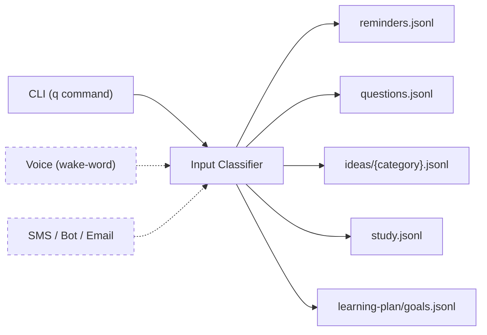

# Project Architecture

## Overview

Queue-populator is a multi-channel input router that classifies free-text user input (questions, reminders, ideas, study items) and appends structured JSONL entries to the appropriate queue file under `~/personal-development/queue/`. It is designed as a local CLI-first tool with future voice and messaging channels.

## System Diagram


```mermaid
graph LR
    CLI["CLI (q command)"] --> Classifier
    Voice["Voice (wake-word)"] -.-> Classifier
    SMS["SMS / Bot / Email"] -.-> Classifier

    Classifier["Input Classifier"] --> R["reminders.jsonl"]
    Classifier --> Q["questions.jsonl"]
    Classifier --> I["ideas/{category}.jsonl"]
    Classifier --> S["study.jsonl"]
    Classifier --> G["learning-plan/goals.jsonl"]

    style Voice stroke-dasharray: 5 5
    style SMS stroke-dasharray: 5 5
```

*Dashed borders indicate planned but unimplemented channels.*

## Core Components

| Component | Purpose |
|-----------|---------|
| CLI entry point | `q "..."` command — parses input, invokes classifier |
| Input classifier | Determines input type (question, reminder, idea, study item, flashcard) |
| Router | Maps classified type to target `.jsonl` file path |
| Writer | Appends structured JSONL entry to the resolved file |

## Data Flow

1. User submits free text via a channel (CLI, voice, etc.)
2. Classifier determines input type — mechanism TBD (LLM, rule-based, or hybrid)
3. Router resolves the target `.jsonl` file based on type and optional category
4. Writer appends a timestamped JSONL record with `processed: false`

## Persistence

All state is **filesystem-based** — no database or message broker. Queue files live under `~/personal-development/queue/` as append-only JSONL. Downstream consumers (not part of this project) read and mark entries as processed.

## Entry Schema

```jsonl
{"ts": "ISO-8601", "type": "reminder|question|idea|study|flashcard", "text": "...", "source": "cli|voice|sms", "processed": false}
```

## Key Decisions

- **Why JSONL**: Append-only, human-readable, no schema migration overhead for a personal tool
- **Why filesystem over DB**: Simplicity — single-user local tool with no concurrency concerns
- **Classifier strategy**: Not yet decided — LLM classification vs. keyword heuristics vs. hybrid

## Status

**Not started.** No implementation exists. This document captures intended design from the project README.
