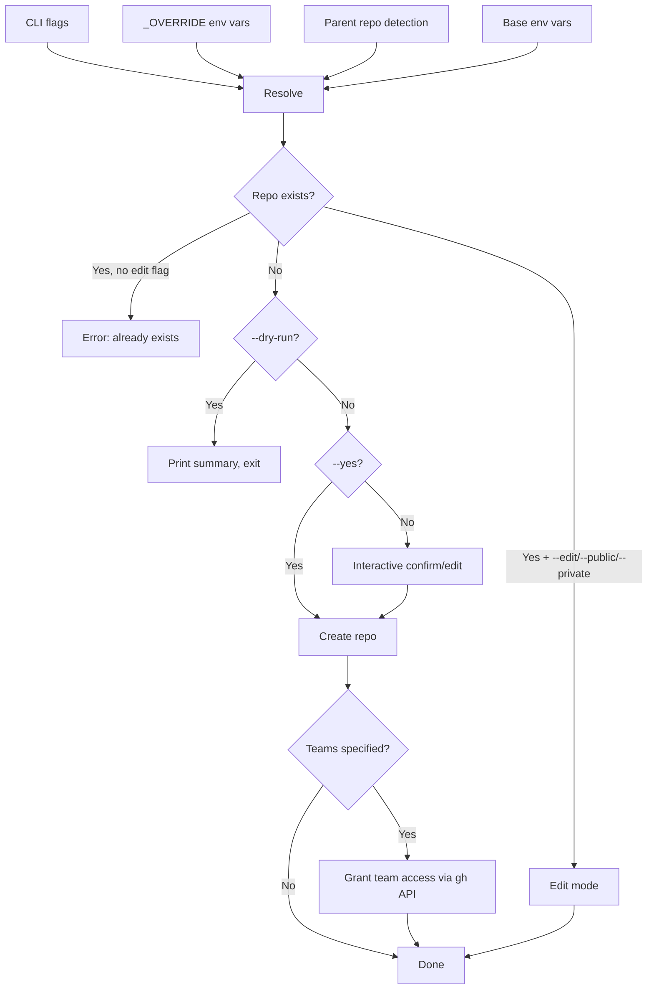

# Project Architecture

## Overview

`make-repo` is a single-file Bash CLI that wraps the GitHub CLI (`gh`) to create and edit GitHub repositories with sensible defaults, interactive confirmation, and automatic context inheritance from parent repos.

## Flow

```mermaid
graph TD
    A[CLI flags] --> E[Resolve]
    B[_OVERRIDE env vars] --> E
    C[Parent repo detection] --> E
    D[Base env vars] --> E
    E --> F{Repo exists?}
    F -->|Yes + --edit/--public/--private| G[Edit mode]
    F -->|Yes, no edit flag| H[Error: already exists]
    F -->|No| I{--dry-run?}
    I -->|Yes| J[Print summary, exit]
    I -->|No| K{--yes?}
    K -->|No| L[Interactive confirm/edit]
    K -->|Yes| M[Create repo]
    L --> M
    M --> N{Teams specified?}
    N -->|Yes| O[Grant team access via gh API]
    N -->|No| P[Done]
    O --> P
    G --> P
```

## Core Components

| Component | Purpose |
|-----------|---------|
| CLI parser | Flag parsing with `case/esac` loop |
| Parent detector | Walks git tree upward to inherit org/visibility from containing repo or submodule parent |
| Value resolver | 5-tier precedence: CLI > `_OVERRIDE` env > parent repo > base env > defaults |
| Interactive prompt | Numbered-field menu for reviewing and editing all settings before create/edit |
| Repo creator | `gh repo create` with `--source=. --push` |
| Team granter | `gh api PUT` to `/orgs/{org}/teams/{team}/repos/{repo}` |
| Edit mode | Fetches current settings from GitHub, applies only changed fields |

## Key Design Decisions

- **Single-file, no dependencies beyond `gh`** — portability; add to PATH and go
- **Parent repo inheritance** — submodule and subdirectory contexts auto-inherit org and visibility, reducing flags needed in monorepo workflows
- **Interactive by default, scriptable with `--yes`** — safety for humans, automation for CI
- **`_OVERRIDE` env tier** — lets `.envrc` files pin values that beat parent detection without requiring CLI flags

## Technology

| Tool | Role |
|------|------|
| Bash | Script runtime |
| `gh` CLI | GitHub API (repo CRUD, team access, auth) |
| `git` | Local repo init, remote detection |
