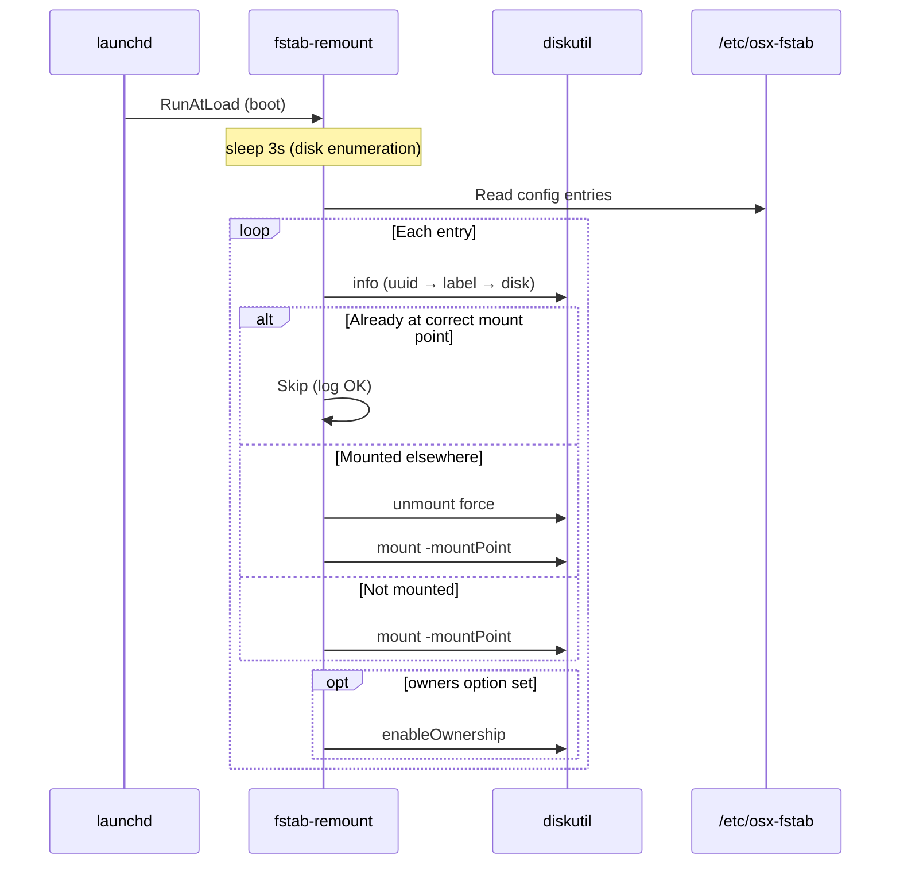
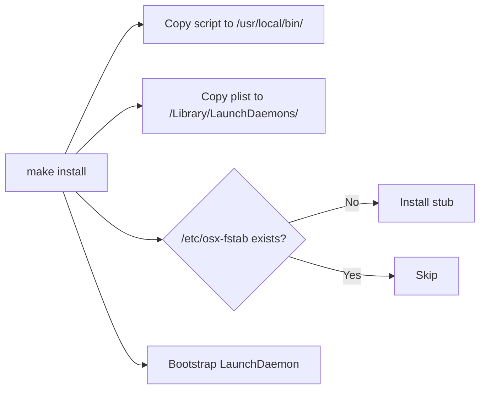

# fstab-mounter — Architecture

## Overview

A macOS LaunchDaemon that provides Linux-style `/etc/fstab` behavior for APFS volumes. It reads a config file (`/etc/osx-fstab`) at boot and ensures each declared volume is mounted at its specified path — relocating volumes already mounted elsewhere and enabling ownership when requested.

macOS does not natively support persistent custom mount points for APFS volumes across reboots. This utility fills that gap with a single-shot boot-time script driven by a declarative config file.

## System Diagram


```mermaid
sequenceDiagram
    participant launchd
    participant fstab-remount
    participant diskutil
    participant osx-fstab as /etc/osx-fstab

    launchd->>fstab-remount: RunAtLoad (boot)
    Note over fstab-remount: sleep 3s (disk enumeration)
    fstab-remount->>osx-fstab: Read config entries
    loop Each entry
        fstab-remount->>diskutil: info (uuid → label → disk)
        alt Already at correct mount point
            fstab-remount->>fstab-remount: Skip (log OK)
        else Mounted elsewhere
            fstab-remount->>diskutil: unmount force
            fstab-remount->>diskutil: mount -mountPoint
        else Not mounted
            fstab-remount->>diskutil: mount -mountPoint
        end
        opt owners option set
            fstab-remount->>diskutil: enableOwnership
        end
    end
```

## Components

| Component | File | Purpose |
|-----------|------|---------|
| Mount script | `fstab-remount` | Bash script — parses config, resolves volumes, mounts |
| LaunchDaemon plist | `com.keithbrings.fstab-remount.plist` | Runs script once at boot, logs to `/var/log/fstab-remount.log` |
| Config stub | `osx-fstab.stub` | Template installed to `/etc/osx-fstab` on first `make install` |
| Installer | `Makefile` | `install` / `uninstall` / `status` / `logs` targets |

## Config Format (`/etc/osx-fstab`)

```
uuid=<UUID>  label=<Label>  disk=<device>  <mountpoint>  <fstype>  <options>  0  0
```

- **Identifiers**: `uuid`, `label`, `disk` — tried in that order; use `-` for unavailable
- **Options**: `rw`, `auto`, `noauto` (skip), `owners` (enable ownership)
- **Comments**: Lines starting with `#` are ignored

## Volume Resolution Strategy

The script resolves each config entry using a **fallback chain**: UUID → label → disk identifier. The first identifier that `diskutil info` recognizes is used for all subsequent operations (status check, unmount, mount). This handles:

- UUID changes after volume re-creation
- Label-based matching when UUID is unknown
- Direct device paths as last resort

## Installation Flow


```mermaid
graph LR
    A[make install] --> B[Copy script to /usr/local/bin/]
    A --> C[Copy plist to /Library/LaunchDaemons/]
    A --> D{/etc/osx-fstab exists?}
    D -- No --> E[Install stub]
    D -- Yes --> F[Skip]
    A --> G[Bootstrap LaunchDaemon]
```

## Key Design Decisions

| Decision | Rationale |
|----------|-----------|
| LaunchDaemon, not LaunchAgent | Must run as root before user login to mount system-level paths |
| 3-second boot delay | External disks need time to enumerate after boot |
| Force unmount on relocation | Ensures deterministic mount points even if macOS auto-mounted elsewhere |
| No dependency on Homebrew/third-party | Uses only `diskutil`, `bash`, `mkdir` — ships with macOS |

## Logging

All output goes to `/var/log/fstab-remount.log` (configured in the plist). Log prefixes:

| Prefix | Meaning |
|--------|---------|
| `OK` | Volume already at correct mount point, or newly mounted |
| `MOVE` | Volume relocated from wrong mount point |
| `MOUNT` | Volume mounted from unmounted state |
| `FAIL` | Mount or unmount failed |
| `OWN` | Ownership enabled on volume |
| `WARN` | Ownership enable failed |
