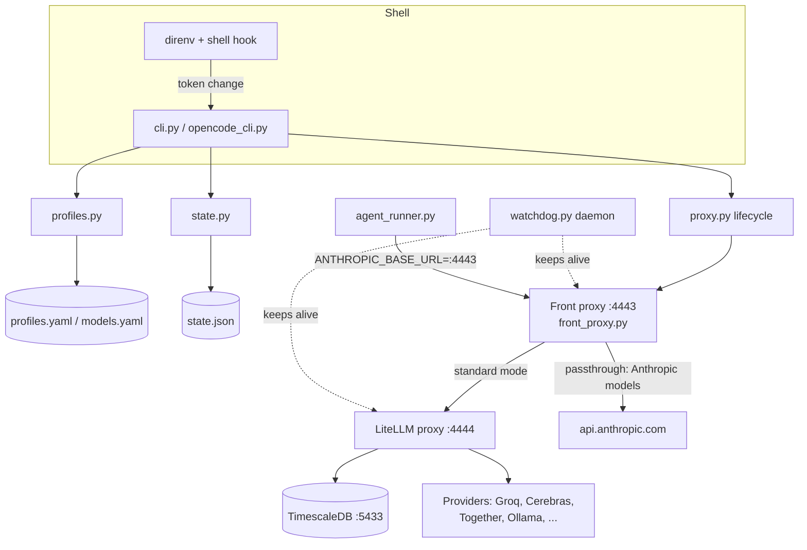

# Project Architecture

run-claude provides directory-aware model routing for Claude Code and OpenCode via a self-healing local LLM gateway. When you `cd` into a directory declaring a profile, the required models are registered with a running LiteLLM proxy and environment variables are set so Claude Code (or OpenCode, via the shared agent runner) route through it. The system uses a two-layer configuration: **model definitions** (standalone LiteLLM configs in `run_claude/models.yaml`) and **profiles** (lightweight references mapping opus/sonnet/haiku tiers to model definitions in the root `profiles.yaml`).

Runtime traffic passes through a two-proxy chain: an always-on **front proxy** on `:4443` (routing, auth swapping, error logging) forwards to the **LiteLLM proxy** on `:4444` (model routing, provider calls, request logging to TimescaleDB). A detached **watchdog** daemon keeps both alive.

## High-Level Architecture

```mermaid
graph TB
    subgraph Shell
        H[direnv + shell hook] -->|token change| CLI
    end
    CLI[cli.py / opencode_cli.py] --> P[profiles.py]
    CLI --> S[state.py]
    CLI --> PX[proxy.py lifecycle]
    P --> Y[(profiles.yaml / models.yaml)]
    S --> J[(state.json)]
    PX --> FP[Front proxy :4443<br/>front_proxy.py]
    FP -->|standard mode| LL[LiteLLM proxy :4444]
    FP -->|passthrough: Anthropic models| ANT[api.anthropic.com]
    LL --> DB[(TimescaleDB :5433)]
    LL --> PR[Providers: Groq, Cerebras,<br/>Together, Ollama, ...]
    W[watchdog.py daemon] -.keeps alive.-> FP
    W -.keeps alive.-> LL
    AR[agent_runner.py] -->|ANTHROPIC_BASE_URL=:4443| FP
```

## Core Components

| Component | File | Purpose |
|-----------|------|---------|
| CLI | `cli.py` | Command dispatch: enter/leave/janitor/set-folder/status/env/proxy/db/profiles/models/with/install/secrets |
| OpenCode CLI | `opencode_cli.py` | `run-open-code` entry point; re-exports shared command handlers for OpenCode |
| Agent runner | `agent_runner.py` | Shared launch logic for Claude/OpenCode: builds env (ANTHROPIC_BASE_URL → :4443, tier model vars), runs agent |
| Profiles | `profiles.py` | Multi-file YAML loading with fallthrough; tier-to-model mapping |
| State | `state.py` | JSON persistence: tokens, refcounts, leases, PIDs, stop marker |
| Proxy lifecycle | `proxy.py` | Start/stop LiteLLM subprocess, health checks, model register/delete via HTTP API |
| Front proxy | `front_proxy.py` | Always-on reverse proxy `:4443 → :4444`; auth swapping; passthrough mode |
| Watchdog | `watchdog.py` | Detached self-healing daemon; restarts either proxy unless intentionally stopped |
| LiteLLM launcher | `litellm_proxy.py` | `run-litellm-proxy` entry: prisma schema patching, then execs litellm |
| Secrets/config | `config.py` | `.secrets` YAML (mode 0600), `.env` generation, `os.environ/VAR` hydration |
| Hooks | `hooks/` | Lifecycle hook chain (PRE_REQUEST, POST_RESPONSE, PRE/POST_TOOL_CALL) with error isolation |
| Provider compat | `callbacks/provider_compat.py` | LiteLLM callback stripping unsupported fields/thinking blocks for strict providers (Groq, Cerebras, Together, Anyscale); runs inside the proxy process |

## Front Proxy & Passthrough Mode

The front proxy (`:4443`) is the stable endpoint agents point at. In **standard mode** everything forwards to LiteLLM with the master key. In **passthrough mode** (claude-plan profile) Anthropic models forward to `api.anthropic.com` with the caller's original OAuth auth — preserving Claude subscription-plan usage — while non-Anthropic models swap auth to the LiteLLM master key and route through the local proxy. Non-2xx upstream responses are logged to a dedicated error log.

## Self-Healing Watchdog

`watchdog.py` runs as a detached (setsid) daemon polling both proxies every ~5s and restarting whichever is down or unhealthy. Intentional stops write a `stop.marker` sentinel in the state dir so the watchdog does not undo `run-claude proxy stop`; crashes and internal recovery stops never write it. The watchdog itself is respawned idempotently by `proxy start` and the shell-hook `enter` path.

## Data Flows

The primary flows are **directory enter** (direnv triggers → load profile → ensure proxies + watchdog → register models → set env vars), **directory leave** (decrement refcounts → set leases for cleanup), **janitor cleanup** (expire leases → delete unused models), and **profile resolution** (multi-file fallthrough with env hydration).

→ *See [arch/data-flows.md](arch/data-flows.md) for mermaid flow diagrams*

## Design Patterns

Key patterns: stable token generation (SHA256 hash of directory path), refcount with 15-min lease (prevents model thrashing), `os.environ/VAR` hydration, multi-file config fallback with `model: null` disable, first-run initialization marker, stop-marker sentinel distinguishing intentional stops from crashes, health check with recovery, and hook chain with error isolation.

→ *See [arch/design-patterns.md](arch/design-patterns.md) for details and code examples*

## Infrastructure

Front proxy on `127.0.0.1:4443`, LiteLLM proxy on `127.0.0.1:4444`, backed by TimescaleDB (Docker, port `5433`). XDG-compliant paths: config at `~/.config/run-claude/`, state at `~/.local/state/run-claude/` (state.json, PID files, logs, generated `litellm_config.yaml`). LiteLLM uses Prisma ORM (pinned 0.11.0) for its model registry and request logging. Database extensions: `vector` (embeddings), `pg_trgm` (trigram search).

→ *See [arch/infrastructure.md](arch/infrastructure.md) for network diagram, env vars, process lifecycle, and security details*

## Ecosystem Fit (Noizu monorepo)

run-claude lives at `utilities/agent/run-claude` in the Noizu Infra monorepo but is deliberately **not** part of the shell-utility toolchain: it does not source `share/k8-lib`, is not installed by `make install-utilities`, and has no `.infra-config.yaml` build target. It is a self-contained Python package (hatchling + uv) installed via its own `make install` (`uv tool install .`), exposing `run-claude`, `run-open-code`, and `run-litellm-proxy` console scripts. Its role in the ecosystem is developer-workstation model routing for the agent fleets that operate on this repo — profiles for Groq, Cerebras, Ollama-local, and mixed-provider setups let Claude Code / OpenCode sessions run against alternate providers per directory. LiteLLM upstream is pinned as a git submodule under `repos/litellm`.

## Key Decisions

- **Two-proxy chain**: front proxy gives a stable agent-facing endpoint and an auth/transform layer independent of LiteLLM restarts; enables OAuth passthrough for Anthropic subscription plans.
- **Watchdog over supervisor/systemd**: zero external service manager dependency; idempotent respawn from normal CLI paths keeps it self-healing.
- **Refcount + lease over immediate teardown**: rapid `cd` between projects would otherwise thrash model registration.
- **uv tool install over install-utilities**: Python package with a lockfile and venv needs real packaging, not the k8-lib symlink flow used by shell utilities.

## External Dependencies

| Package | Purpose |
|---------|---------|
| `litellm[proxy]` + extras | LLM proxy framework (also pinned as source submodule) |
| `httpx` | HTTP client for proxy API calls and front-proxy forwarding |
| `pyyaml` | YAML parsing for profiles, models, secrets |
| `prisma == 0.11.0` | ORM used by LiteLLM proxy (schema patched at launch) |
| `psycopg2-binary` | PostgreSQL driver for TimescaleDB |
