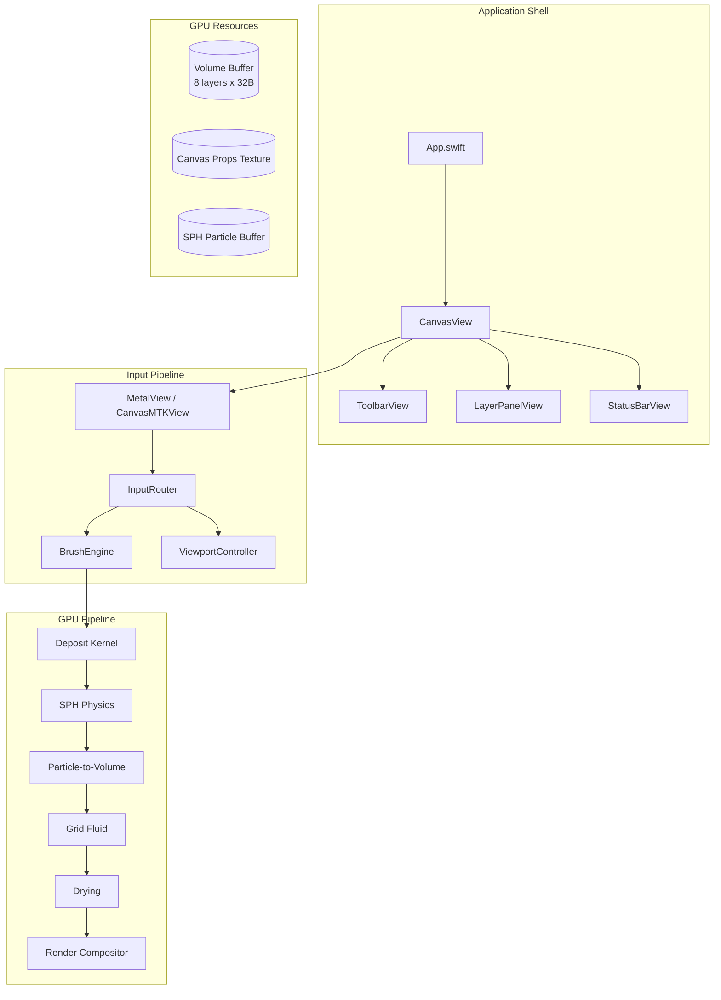
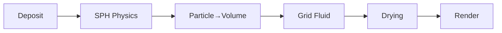

# Project Architecture

## Overview

TheRobotPaints is a native macOS paint simulator built on Apple Metal. It models realistic paint media (watercolor, oil, acrylic, charcoal, pastel) using a hybrid particle-in-cell architecture: an Eulerian grid of per-pixel layer stacks for structure and rendering, with Lagrangian SPH particles for fluid dynamics. All simulation and rendering runs on the GPU via compute shaders at 60 FPS.

## Tech Stack

| Aspect | Choice |
|--------|--------|
| Platform | macOS 14+, Apple Silicon primary |
| Language | Swift 6 + Metal Shading Language |
| Build | Swift Package Manager (not Xcode project) |
| Shader source | Swift string literals, runtime-compiled via `MTLDevice.makeLibrary(source:)` |
| Concurrency | `@unchecked Sendable` classes (Metal objects are not actor-safe) |
| UI | SwiftUI (toolbar, panels, status bar) + `NSViewRepresentable` wrapping `MTKView` |
| Color model | Absorption (Beer-Lambert), not additive RGB |

## System Diagram

```mermaid
graph TB
    subgraph Application Shell
        A[App.swift] --> B[CanvasView]
        B --> C[ToolbarView]
        B --> D[LayerPanelView]
        B --> E[StatusBarView]
    end

    subgraph Input Pipeline
        B --> F[MetalView / CanvasMTKView]
        F --> G[InputRouter]
        G --> G1[BrushEngine]
        G --> G2[ViewportController]
    end

    subgraph GPU Pipeline
        G1 --> H[Deposit Kernel]
        H --> I[SPH Physics]
        I --> J[Particle-to-Volume]
        J --> K[Grid Fluid]
        K --> L[Drying]
        L --> M[Render Compositor]
    end

    subgraph GPU Resources
        N[(Volume Buffer<br/>8 layers x 32B)]
        O[(Canvas Props Texture)]
        P[(SPH Particle Buffer)]
    end
```

## Core Components

| Component | Module | Purpose |
|-----------|--------|---------|
| MetalEngine | `Rendering/` | Singleton: device, queue, shader compiler, texture factory |
| Renderer | `Rendering/` | MTKViewDelegate, frame orchestration, kernel dispatch |
| BrushEngine | `Input/` | Catmull-Rom interpolation, pressure mapping, stroke lifecycle |
| InputRouter | `Input/` | Event dispatch by active tool with modifier overrides |
| ViewportController | `Input/` | Zoom, pan, rotate state + Retina-correct drawable-pixel-to-canvas transform |
| SimulationPipeline | `Simulation/` | Orchestrates SPH + grid fluid + drying dispatch |
| LayerManager | `State/` | 8-layer visibility, active selection, per-layer metadata |
| ColorEngine | `State/` | Beer-Lambert absorption color picker + reverse mapping |
| PaintUndoManager | `State/` | Stroke-granularity region snapshots for undo/redo |
| MediaRegistry | `Extensions/` | 5 built-in media types via MediaTypeDefinition protocol |
| PaintingFileManager | `FileIO/` | .trp native save/load + PNG export |

## Data Model

8 `VolumeLayer` structs per pixel (32 bytes each, all FP16). Key fields: `color_rgb` = pigment concentration, `color_o` = water height, `depth` = dried pigment deposit, `wetness` = paper saturation, `viscosity` = pressure (computed from water height). Stored in a single `MTLBuffer` with layer-major layout. Canvas material properties in a separate `rgba16Float` texture. SPH particles (48B each) in a double-buffered particle system with spatial hash (8B cells). `BrushParams` carries `isEraser` and `isWaterOnly` flags for tool-specific deposit behavior.

-> *See [arch/data-model.md](arch/data-model.md) for struct layouts and memory estimates*

## GPU Kernels (13 total)

| Kernel | Dispatch | Purpose |
|--------|----------|---------|
| canvasInit | 2D, once | Procedural canvas weave texture |
| volumeInit | 2D, once | Zero-fill all volume layers |
| deposit | 1D, per-BrushPoint | Basic brush stamp (dry media) |
| depositWithParticles | 1D, per-BrushPoint | Brush stamp + SPH particle spawning (wet media) |
| sphBuildHash | 1D, per-particle | Build spatial hash cell counts |
| sphComputeForces | 1D, per-particle | Poly6/Spiky/Viscosity force computation + advection |
| particleToVolume | 1D, per-particle | Splat particle state back to volume grid |
| gridFluid | 2D, per-pixel | Semi-Lagrangian advection + Jacobi diffusion |
| drying | 2D, per-pixel | Medium-specific wetness decay + edge darkening |
| instantDry | 2D, per-pixel | Immediate full-canvas dry |
| render | 2D, per-drawable-pixel | Beer-Lambert absorption compositor with impasto lighting |
| debugWetness | 2D, per-drawable-pixel | Blue→red wetness heatmap overlay |
| debugDepth | 2D, per-drawable-pixel | Grayscale depth heightmap overlay |

## Simulation Pipeline

```mermaid
flowchart LR
    A[Deposit] --> B[SPH Physics]
    B --> C[Particle→Volume]
    C --> D[Grid Fluid]
    D --> E[Drying]
    E --> F[Render]
```

6 phases per frame. SPH phases (B, C) only run when particles exist. Grid fluid + drying only run when wet paint exists (dirty-flag skip). Deposit sets `substance_type` per media and applies cross-media rejection via a 5x5 adhesion matrix.

## Input Architecture

`InputRouter` dispatches NSEvents by active tool (brush, eraser, water, pan, zoom, eyedropper). Space+drag overrides to pan, Alt+click to eyedropper. All stroke tools (brush, eraser, water) convert view coordinates to Retina-correct drawable pixels via `viewToDrawablePixel` before passing to `ViewportController.screenToCanvas(drawablePixel:)`. `BrushEngine` performs Catmull-Rom interpolation (sliding window of 4 points, 10% diameter spacing) with auto-detected pressure source (tablet hardware, mouse speed-based at 1500 px/s max, or trackpad force). Zoom uses clamped delta (±0.5 max) and fires `onZoomChanged` callback for UI sync.

## Cross-Media Rejection

5x5 adhesion matrix controls deposition strength when painting over dried media. Oil goes over everything; watercolor rejects dried oil; charcoal has low adhesion on glossy surfaces.

## Key Design Decisions

- **Struct buffer over texture-per-property** -- simpler multi-layer management
- **MSL as Swift strings** -- SPM can't compile `.metal`; compile-check tests preserve safety
- **Compute-only rendering** -- no rasterization needed for 2D layer compositing
- **Layer-major buffer layout** -- contiguous per-layer access for simulation kernels
- **Stroke-granularity undo** -- region snapshot before each stroke, ~10 MB/stroke typical
- **Protocol-based media types** -- MediaTypeDefinition enables future custom media
- **Speed-based mouse pressure** -- inverse speed mapping with exponential smoothing
- **Beer-Lambert render compositor** -- round-trip absorption model (exponent ×2) replaces alpha blending for physically accurate pigment mixing
- **Drawable-pixel coordinate pipeline** -- all input goes through `viewToDrawablePixel` for Retina-correct mapping before canvas transform

-> *See [arch/decisions.md](arch/decisions.md) for full ADRs*
