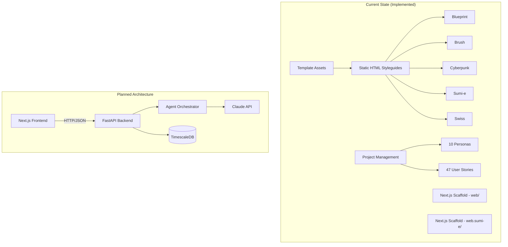

# Project Architecture

## Overview

**therobotmakes.com** hosts **noizu.ink**, a guided pipeline that takes ideas from rough sketch to deployed product. The repository contains static HTML design explorations (5 themed style guides) and bare Next.js scaffolds — the project is in **pre-development / concept** stage.

The system targets a 4-phase pipeline: Sketch (Plan) -> Draft (Design) -> Ink (Build) -> Publish (Ship). Current work focuses on design exploration and project management artifacts (personas, user stories).

-> *See [README.md](../README.md) for full product specification*

## System Diagram


```mermaid
graph TB
    subgraph Current["Current State (Implemented)"]
        SG[Static HTML Styleguides] --> T1[Blueprint]
        SG --> T2[Brush]
        SG --> T3[Cyberpunk]
        SG --> T4[Sumi-e]
        SG --> T5[Swiss]

        TM[Template Assets] --> SG
        WEB[Next.js Scaffold - web/]
        WSUMI[Next.js Scaffold - web.sumi-e/]
        PM[Project Management] --> PER[10 Personas]
        PM --> US[47 User Stories]
    end

    subgraph Planned["Planned Architecture"]
        FE[Next.js Frontend] -->|HTTP/JSON| BE[FastAPI Backend]
        BE --> AO[Agent Orchestrator]
        AO --> LLM[Claude API]
        BE --> DB[(TimescaleDB)]
    end
```

## Core Components

| Component | Status | Purpose |
|-----------|--------|---------|
| **Static HTML Styleguides** | Built | 5 themed component showcases (blueprint, brush, cyberpunk, sumi-e, swiss) |
| **Template Assets** | Built | Shared CSS/JS for styleguide rendering (hui.css, sg.css, sg.js) |
| **Root Styleguide HTMLs** | Built | Self-contained single-file theme previews (v1 and v2 per theme) |
| **Next.js Scaffolds** | Scaffold only | Two bare apps (web/, web.sumi-e/) with layout + page + globals.css |
| **Project Management** | Built | 10 personas and 47 user stories (INK-001 through INK-047) |
| **FastAPI Backend** | Planned | Step engine, API endpoints, agent orchestration |
| **Agent Orchestrator** | Planned | Elixir/OTP runtime for Ink phase agents |
| **TimescaleDB** | Planned | Project state persistence |

## Theme System

Five design directions are explored as **standalone HTML/CSS showcases**, each in its own directory with per-component HTML pages and a shared `style.css`. These are static prototypes, not integrated into the Next.js apps.

-> *See [arch/theme-system.md](arch/theme-system.md) for theme structure details*

## UX Architecture

### Phase-Based Pipeline (Target)

The target UX follows 4 phases with 12 steps. Currently only static design explorations exist:

- **Sketch/Draft Phases**: Light, paper-white backgrounds (editorial feel)
- **Ink Phase**: Dark, ink-dark backgrounds (agents at work)
- **Theme Selection**: Global theme toggle planned but not yet implemented

### Component Layering (Target)

```
Theme Layer (5 variants)
  +-- Base Style Guide Components
        +-- Shared Section Components
              +-- Layout Components
                    +-- App Router Pages
```

This hierarchy is the target design. The current Next.js apps contain no custom components.

-> *See [arch/component-hierarchy.md](arch/component-hierarchy.md) for target hierarchy*

## Technology Stack

### Current (Static + Scaffold)
- **Static Themes**: Plain HTML + CSS (5 directories, no build step)
- **Framework**: Next.js 15 (App Router) - scaffold only, no custom pages
- **Language**: TypeScript
- **Runtime**: Node.js 22.22.0 (via .tool-versions)
- **Containerization**: Dockerfile + nginx.conf per web app

### Planned (Full Stack)
- **Backend**: FastAPI (Python)
- **Database**: TimescaleDB (extends Postgres)
- **Agent Runtime**: Elixir/OTP
- **LLM Provider**: Claude API (Anthropic)
- **Sandbox**: Docker containers per project
- **Deployment**: Vercel (frontend), self-hosted (backend)

-> *See [arch/backend-integration.md](arch/backend-integration.md) for planned backend architecture*

## Design Principles

| Principle | Application |
|-----------|-------------|
| Editorial First | Serif headings, generous leading, typographic hierarchy |
| Minimal Tech | Mono font for code/AI output, clean functional surfaces |
| Bounded Context | Each pipeline step has clear boundaries and resumable state |
| User Control | Users approve/reject at every phase boundary |
| Token Economy | Structured inputs, cacheable prompts, minimal chat history |

## Key Decisions

**Why 5 static HTML themes before React components?**
- Validates design direction without build complexity
- Shareable without hosting (just open the HTML file)
- Serves as portfolio/marketing material during pre-dev

**Why Next.js App Router?**
- File-based routing maps naturally to pipeline phases/steps
- Server Components reduce client JS
- Vercel deployment alignment with target users

**Why CSS Modules (planned) over Tailwind?**
- Explicit theme isolation per CSS file
- No runtime JS for styling
- Easy handoff to designers familiar with CSS

-> *See [arch/decisions.md](arch/decisions.md) for full ADRs*
