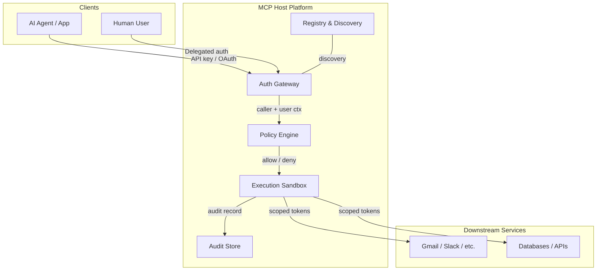

# Project Architecture

> MCP Host — unified MCP hosting platform (justmcp.it | mcpjumpst.art | safemcp.com)

## Overview

MCP Host is a multi-surface platform for deploying, scaffolding, and securing MCP (Model Context Protocol) servers. It enforces a dual-principal authorization model where every tool invocation is gated by the intersection of caller permissions and user permissions — neither principal can escalate beyond their own grants. The platform is currently in concept/pre-development stage with a Next.js frontend scaffold and YAML-driven design system in place.

## System Diagram

```mermaid
graph TB
    subgraph Clients
        AGENT[AI Agent / App]
        HUMAN[Human User]
    end

    subgraph "MCP Host Platform"
        GW[Auth Gateway]
        PE[Policy Engine]
        REG[Registry & Discovery]
        SB[Execution Sandbox]
        AUDIT[Audit Store]
    end

    subgraph "Downstream Services"
        DS1[Gmail / Slack / etc.]
        DS2[Databases / APIs]
    end

    AGENT -->|API key / OAuth| GW
    HUMAN -->|Delegated auth| GW
    GW -->|caller + user ctx| PE
    PE -->|allow / deny| SB
    SB -->|scoped tokens| DS1
    SB -->|scoped tokens| DS2
    SB -->|audit record| AUDIT
    REG ---|discovery| GW
```

## Three Product Surfaces

| Surface | Domain | Purpose |
|---------|--------|---------|
| **JustMCP.it** | justmcp.it | One-click MCP deployment with monitoring and analytics |
| **MCP Jumpstart** | mcpjumpst.art | Project scaffolding — select language, use case, generate deployable project |
| **SafeMCP** | safemcp.com | Security control plane — policies, audit logs, simulation |

All three share a unified auth system and global navigation. Users sign in once and switch between surfaces via a platform switcher.

## Core Components

| Component | Purpose |
|-----------|---------|
| Auth Gateway | Identifies caller (API key/OAuth/mTLS) and user (delegated token); issues scoped session |
| Policy Engine | Evaluates `caller_policy(tool, args) AND user_policy(tool, args)` at six scope levels |
| Execution Sandbox | Isolated runtime with network policy, resource caps, filesystem isolation |
| Registry | Searchable catalog of public MCP servers/tools with health scoring and trust verification |
| Audit Store | Immutable append-only log of every tool invocation with compliance export |

## Security Model

Dual-principal authorization: every request carries a **caller** (AI agent/app) and a **user** (human). Access is the intersection of both principals' permissions. MCP Host never stores downstream credentials — it acts as an OAuth delegate with scoped, narrowed tokens.

-> *See [arch/security.md](arch/security.md) for details*

## Data Flow

Requests arrive at the Auth Gateway, which resolves caller and user identity. The Policy Engine evaluates the request against six hierarchical scope levels (global, org, server, tool, caller, user) innermost-first. Allowed requests execute in sandboxed environments with auditable resource access.

-> *See [arch/data-flow.md](arch/data-flow.md) for details*

## Frontend Architecture

Next.js 15 (App Router) with a YAML-driven design system. Four themes (Bold, Enterprise, Minimal, Nocturne) defined in `design/theme/` are compiled to CSS via `@the-robot-lives/styleguide`. Tailwind CSS 4 for utility styles. Monaco Editor for policy YAML editing.

-> *See [arch/frontend.md](arch/frontend.md) for details*

## Tech Stack (Planned)

| Layer | Technology |
|-------|-----------|
| Frontend | Next.js 15 (App Router), Tailwind CSS 4, `@the-robot-lives/styleguide` |
| Backend API | Phoenix 1.8 (Elixir) |
| Policy Engine | OPA (Open Policy Agent) or Cedar |
| Auth | OAuth 2.1 / OIDC, Guardian (JWT), RFC 8693 token exchange |
| Database | PostgreSQL (Ecto) |
| Cache / Pub-Sub | Redis |
| Sandbox Runtime | Firecracker microVMs or gVisor containers |
| Registry Search | PostgreSQL + Meilisearch |
| Audit Store | Append-only PostgreSQL + optional S3 export |
| Deployment | Kubernetes (Helm), Docker |

## Roadmap

| Phase | Focus | Key Deliverables |
|-------|-------|-----------------|
| 0 — Foundation | Core platform | Auth gateway, policy engine, single-tool hosting, audit logging |
| 1 — Registry | Discovery | Global search, categories, health checks, publisher verification |
| 2 — Sandbox | Isolation | Network policies, resource limits, filesystem isolation |
| 3 — Scale | Multi-tenancy | Org management, billing, SLA tiers, self-hosted Helm chart |
| 4 — Ecosystem | Integrations | Marketplace, revenue sharing, compliance certifications |

## Key Decisions

- **Dual-principal auth over single-principal**: Prevents privilege escalation when AI agents act on behalf of humans
- **Phoenix/Elixir backend**: Concurrency model suits high-volume tool invocations and WebSocket transports
- **OPA/Cedar for policy**: Declarative policy evaluation with audit trail; avoids custom policy DSL
- **Firecracker/gVisor sandboxing**: Strong isolation without full VM overhead for per-invocation execution

-> *See [arch/decisions.md](arch/decisions.md) for ADRs*
