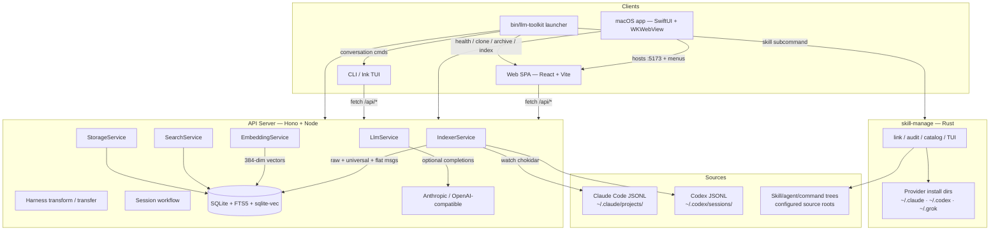

# Project Architecture

## Overview

**llm-toolkit** (product name *Claude Assist*) is a local-first developer tool for searching, browsing, editing, and extracting reusable artifacts from AI coding-agent conversation logs. It is evolving into **agent-watch-dog** — multi-harness session continuity across Claude Code, Codex, and future harnesses (Gemini / OpenCode / Aider stubbed). Harness JSONL transcripts are indexed into SQLite (FTS5 + optional sqlite-vec embeddings) and served through a REST API, browser SPA, Ink TUI, and a native macOS host that embeds the SPA.

The repo also embeds **skill-manage**, a Rust CLI/TUI that enables/disables provider skills, agents, and slash commands via managed symlinks. The bash launcher (`bin/llm-toolkit`) starts API + web (zellij-aware when available), proxies `llm-toolkit skill …` to the skill-manage binary, and dispatches conversation CLI commands to the TypeScript Ink entrypoint.

It lives at `Portfolio/Apps/AI/llm-toolkit` in the Noizu Infra monorepo as a self-contained pnpm + Rust project — no `share/k8-lib` or `.infra-config.yaml` deploy metadata. `make install` installs pnpm deps, builds skill-manage, installs shell completions, and symlinks `bin/llm-toolkit` into `~/.local/bin`.

## System Diagram

```mermaid
graph TB
    subgraph Sources
        CC["Claude Code JSONL<br/>~/.claude/projects/"]
        CX["Codex JSONL<br/>~/.codex/sessions/"]
        SK["Skill/agent/command trees<br/>configured source roots"]
    end

    subgraph API["API Server — Hono + Node"]
        IDX[IndexerService]
        EMB[EmbeddingService]
        SRH[SearchService]
        STO[StorageService]
        LLM[LlmService]
        XFR[Harness transform / transfer]
        SESS[Session workflow]
        IDX -->|raw + universal + flat msgs| DB[(SQLite + FTS5 + sqlite-vec)]
        EMB -->|384-dim vectors| DB
        SRH --> DB
        STO --> DB
        LLM -->|optional completions| EXT["Anthropic / OpenAI-compatible"]
        IDX -->|watch chokidar| CC
        IDX --> CX
    end

    subgraph Clients
        WEB["Web SPA — React + Vite"]
        MAC["macOS app — SwiftUI + WKWebView"]
        CLI["CLI / Ink TUI"]
        BIN["bin/llm-toolkit launcher"]
    end

    subgraph SkillManage["skill-manage — Rust"]
        SM[link / audit / catalog / TUI]
        SM --> SK
        SM --> DEST["Provider install dirs<br/>~/.claude · ~/.codex · ~/.grok"]
    end

    WEB -->|fetch /api/*| API
    MAC -->|hosts :5173 + menus| WEB
    MAC -->|health / clone / archive / index| API
    CLI -->|fetch /api/*| API
    BIN --> WEB
    BIN --> API
    BIN -->|skill subcommand| SkillManage
    BIN -->|conversation cmds| CLI
```

## Core Components

| Component | Package | Purpose |
|-----------|---------|---------|
| StorageService | api | SQLite WAL store: harness-aware schema, FTS5, sqlite-vec, migrations |
| IndexerService | api | Scans sources, retains raw events, derives universal + flat messages, optional work-item extraction, chokidar watch |
| EmbeddingService | api | Local embeddings via `all-MiniLM-L6-v2` (384-dim) through `@huggingface/transformers` |
| SearchService | api | FTS5 full-text + semantic (cosine / sqlite-vec) search |
| LlmService | api | Multi-provider completions: Anthropic SDK + OpenAI-compatible (OpenAI, LiteLLM/`inference.noizu.com`, Groq, Cerebras, DeepSeek, ZAI) |
| Editor / Operations | api | Non-destructive versioned edits; clone, rehome, archive, tag |
| Converter / Exporter | api | Extract agents/skills/commands/runbooks; export datasets (OpenAI, Anthropic, raw JSONL) |
| Harness transform | api | Claude/Codex `Universal → Harness` export payloads; import prefers indexer normalizer |
| Harness transfer | api | Cross-harness transfer façade — still pending for all targets (incl. Claude/Codex write-back) |
| Session workflow | api | Continue / transfer continuation payloads + memory-hook stubs |
| Hono routes | api | conversations, search, datasets, prompts, projects, tags, config, index, llm, health |
| Web UI | web | React SPA — Explore (search/browse), thread, edit, convert, continue, projects, datasets, prompts, tags, settings, Safety Watch stub, style guide |
| macOS host | apps/macos | SwiftUI + WKWebView frame around the SPA; native menus/sidebar; starts or attaches to local API/web |
| CLI | cli | One-shots (`recent`, `search`, `list`, `show`, `index`, …) + full-screen Ink interactive TUI |
| Shared | shared | Types (`UniversalMessage`, `AgentHarness`, …), JSONL parsers, `ensureApi()` launcher |
| skill-manage | skill-manage/ | Rust symlink manager for skills/agents/commands across providers |
| bin/llm-toolkit | root | Launcher: zellij API+web layout, skill proxy, CLI dispatch |

## Data Flow

Harness transcripts are discovered by IndexerService, stored as **raw events**, normalized into **universal messages**, flattened into search **messages**, and optionally embedded. Clients talk only to the local REST API (`localhost:3100`), except `llm-toolkit recent`, which reads SQLite directly for a fast, no-server path. File watching enables incremental re-index. skill-manage is a separate local filesystem tool (no conversation SQLite).

-> *See [arch/data-flow.md](arch/data-flow.md) for details*

## Storage

Single SQLite DB at `~/.llm-toolkit/llm-toolkit.db` (`LLM_TOOLKIT_DATA_DIR`; legacy `CLAUDE_ASSIST_*` env aliases still accepted). WAL mode; sqlite-vec optional with graceful degradation. Tables cover conversations/messages, universal + raw layers, work items, edits, datasets, prompts, project/tag metadata, settings, FTS5, and vec0.

-> *See [arch/storage.md](arch/storage.md) for details*

## Multi-Harness (agent-watch-dog)

Each transcript producer is a **harness** with importer/exporter boundaries around canonical `UniversalMessage`. Raw events are always retained. Claude and Codex importers are live; Gemini / OpenCode / Aider / other are stubbed. Transform-layer exporters exist for Claude and Codex; the transfer façade and memory hooks remain planned/stubbed (transfer returns pending warnings even for Claude/Codex until write-back + compatibility tests land).

-> *See [arch/agent-watch-dog.md](arch/agent-watch-dog.md) for details*

## skill-manage

Embedded Rust crate: discovers skills/agents/commands from configured source roots, classifies install status per provider, and enables/disables via symlinks only (non-destructive; `--replace` backs up real paths). YAML catalog supports tags, work-type bundles, and editor profiles. Invoked as `llm-toolkit skill …` or standalone after `make compile`.

-> *Nested docs: [skill-manage/docs/PROJ-ARCH.md](../skill-manage/docs/PROJ-ARCH.md)*

## Infrastructure / Runtime

| Concern | Notes |
|---------|--------|
| Deploy | Local developer tool — not a k8s/Helm service |
| Install | `make install` → deps, skill-manage release build, completions, `~/.local/bin/llm-toolkit` |
| API port | `3100` (`PORT` / `LLM_TOOLKIT_API_PORT`) |
| Web port | `5173` (Vite; `LLM_TOOLKIT_WEB_PORT`) |
| Data dir | `~/.llm-toolkit` (DB + config) |
| Default index sources | Claude `~/.claude/projects`, Codex `~/.codex/sessions` |
| CORS | Web origin `http://localhost:5173` only |
| Bind | Localhost API; no auth — single-user local use |

## Key Design Decisions

- **Local-first** — Core search/index needs no external services; LLM features optional
- **JSONL as source of truth** — DB is a derived index; edits create versions, never mutate source transcripts
- **Raw before universal** — Preserve provider-native events for re-parse, audit, and replay
- **Universal transfer path** — Never direct provider-to-provider conversion
- **Hono + sqlite-vec** — Lightweight HTTP; single-file DB philosophy (vec degrades if extension missing)
- **pnpm workspaces + embedded Rust** — Shared TS types across clients; skill linking stays a fast native binary
- **Launcher-centric UX** — One PATH entry for web, TUI, API, and skill management

## Technology Stack

| Layer | Technology |
|-------|------------|
| Runtime | Node.js (tsx) |
| API | Hono + @hono/node-server |
| Database | better-sqlite3 + sqlite-vec |
| Embeddings | @huggingface/transformers (`all-MiniLM-L6-v2`) |
| LLM | @anthropic-ai/sdk + openai (compatible endpoints) |
| Watch | chokidar |
| Web | React 18, Vite 6, React Router 7, Tailwind 3.4 |
| Markdown | react-markdown, remark-gfm, rehype-katex, Mermaid, syntax highlighter |
| CLI | Ink 5 (React for terminals) |
| skill-manage | Rust (clap + ratatui) |
| Packages | pnpm workspaces (`packages/*`) |
| Language | TypeScript (strict) + Rust |
| Launcher | bash (`bin/llm-toolkit`, zellij-aware) |

## Layout

Directory tree and package layout: [PROJ-LAYOUT.md](PROJ-LAYOUT.md) · per-package: [layout/api.md](layout/api.md), [layout/cli.md](layout/cli.md), [layout/web.md](layout/web.md), [layout/shared.md](layout/shared.md).
