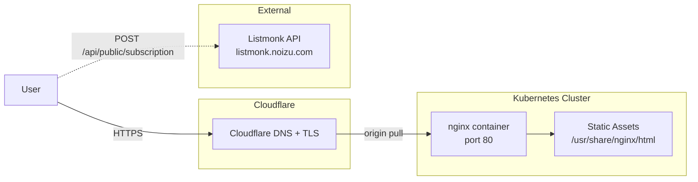

# Project Architecture

## Overview

JailbreakingSite is a statically-exported Next.js 16 landing page for an LLM security platform — positioning itself as "MITRE ATT&CK meets HackTheBox for jailbreaking." The current deployment is a pre-launch waitlist page served as static HTML behind nginx. The product vision encompasses three layers — an attack catalog, a defensive testing suite, and CTF-style training labs — but only the marketing landing page is implemented today.

The architecture is intentionally minimal: a single-page static export with no backend, no database, and no authentication. The only external integration is a Listmonk subscription API for waitlist signups.

## System Diagram

```mermaid
graph LR
    subgraph Cloudflare
        CF[Cloudflare DNS + TLS]
    end

    subgraph K8s["Kubernetes Cluster"]
        NG[nginx container<br/>port 80]
        SA[Static Assets<br/>/usr/share/nginx/html]
    end

    subgraph External
        LM[Listmonk API<br/>listmonk.noizu.com]
    end

    User -->|HTTPS| CF
    CF -->|origin pull| NG
    NG --> SA
    User -.->|POST /api/public/subscription| LM
```

## Core Components

| Component | Purpose |
|-----------|---------|
| `web/` | Next.js 16 app — static export landing page |
| `web/src/app/page.tsx` | Single-page landing with Nav, Hero, Pillars, Demos, FAQ, CTA sections |
| `web/src/app/waitlist-form.tsx` | Client component — email signup via Listmonk API |
| `web/Dockerfile` | Multi-stage build: Node builder → nginx static server |
| `web/nginx.conf` | SPA routing, gzip, security headers, static asset caching |
| `STYLE-GUIDE.md` | "SecOps Terminal" design system — dark-first, severity-mapped colors |
| `design/` | Static HTML mockups for design exploration (clean-room, red-alert variants) |

## Build & Deploy Pipeline

Static export via `next build` (output mode: `export`) produces flat HTML/CSS/JS in `out/`. Docker multi-stage build copies this into an nginx:alpine image. Pushed to `ops.noizu.com/app-jailbreakingsite` registry.

→ *See [arch/build-deploy.md](arch/build-deploy.md) for details*

## Design System

Custom "SecOps Terminal" aesthetic — dark background, monospace typography (JetBrains Mono), severity-mapped color palette (critical red, warning amber, info blue). Tailwind CSS v4 with CSS custom properties for theming. Designed for security professionals who expect data-dense, terminal-like interfaces.

→ *See [arch/design-system.md](arch/design-system.md) for details*

## External Integrations

| Integration | Protocol | Purpose |
|-------------|----------|---------|
| Listmonk | HTTPS POST (public API) | Waitlist email subscription |
| Cloudflare | DNS + TLS + origin pull | CDN, SSL termination, DDoS protection |
| ops.noizu.com | Docker registry | Container image storage |

## Key Decisions

- **Why static export**: No server-side logic needed for a waitlist page. Static HTML is fastest to serve, simplest to deploy, and cheapest to host. Enables nginx-only container with no Node runtime.
- **Why nginx over Next.js server**: Smaller image, lower resource usage, better caching control. The `output: "export"` config makes this natural.
- **Why Listmonk over SaaS**: Self-hosted on existing infrastructure. No vendor lock-in, no per-subscriber costs, full data ownership.
- **Why no API backend**: Pre-launch phase — the only dynamic behavior is client-side form submission to an external Listmonk instance. Backend services will be added when Catalog/Defender/Academy features are built.

## Future Architecture (Planned)

The product roadmap adds three major subsystems not yet implemented:

| Layer | Function | Likely Stack Impact |
|-------|----------|---------------------|
| **Catalog** | Searchable jailbreak technique database with classification schema | Requires backend API + database |
| **Defender** | Automated LLM endpoint security scanning | Requires job runner, API integrations |
| **Academy** | CTF-style sandboxed training environments | Requires container orchestration, auth |

These will require migrating from static export to a full-stack deployment.
