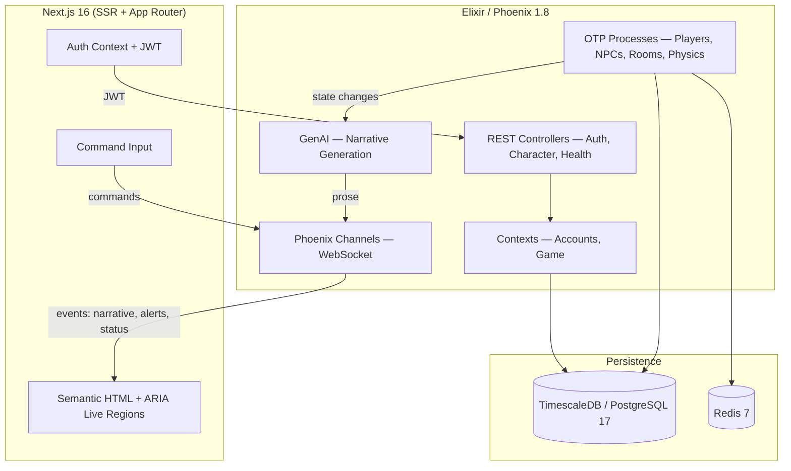

# Project Architecture

## Overview

Blade of Eternity is an accessibility-first text RPG where screen readers are the primary rendering engine. The system is a full-stack web application: a Next.js 16 frontend delivers semantic HTML over SSR so screen readers receive complete content on first paint, while an Elixir/Phoenix 1.8 backend manages game state, real-time events, and AI-driven narrative generation through OTP process isolation.

The architecture is organized around three core pipelines: **input** (keyboard commands via a persistent text input), **simulation** (Elixir processes modeling physics, NPCs, and world state), and **output** (structured prose rendered into ARIA live regions that screen readers announce naturally).

## System Diagram

```mermaid
graph TB
    subgraph Client ["Next.js 16 (SSR + App Router)"]
        UI[Semantic HTML + ARIA Live Regions]
        CMD[Command Input]
        AUTH[Auth Context + JWT]
    end

    subgraph Server ["Elixir / Phoenix 1.8"]
        WS[Phoenix Channels — WebSocket]
        API[REST Controllers — Auth, Character, Health]
        CTX[Contexts — Accounts, Game]
        OTP[OTP Processes — Players, NPCs, Rooms, Physics]
        AI[GenAI — Narrative Generation]
    end

    subgraph Data ["Persistence"]
        PG[(TimescaleDB / PostgreSQL 17)]
        RD[(Redis 7)]
    end

    CMD -->|commands| WS
    WS -->|events: narrative, alerts, status| UI
    AUTH -->|JWT| API
    API --> CTX
    CTX --> PG
    OTP -->|state changes| AI
    AI -->|prose| WS
    OTP --> PG
    OTP --> RD
```

## Core Components

| Component | Purpose |
|-----------|---------|
| **Next.js Frontend** | SSR semantic HTML, ARIA live region rendering, keyboard-driven command interface |
| **Phoenix API** | REST endpoints for auth (Guardian/JWT), character management, health checks |
| **Phoenix Channels** | Real-time bidirectional events — combat, chat, world updates pushed to client |
| **OTP Process Tree** | Isolated processes per player, NPC, room, and physics object — fault-tolerant game simulation |
| **GenAI Pipeline** | Narrative generation from physics/world state — translates simulation data to prose |
| **TimescaleDB** | Game state persistence, player data, world state (PostgreSQL 17 with TimescaleDB + Apache AGE) |
| **Redis** | Session cache, pub/sub for cross-node events, rate limiting |

## Accessibility Architecture

The screen reader is the game engine. Three ARIA live region channels handle all output:

| Channel | ARIA Config | Purpose |
|---------|-------------|---------|
| Narrative | `polite`, `role="log"` | Story, descriptions, NPC dialogue, action outcomes |
| Alerts | `assertive`, `role="alert"` | Damage taken, death, connection loss (< 5% of events) |
| Status | `polite`, `role="status"` | HP changes, buffs/debuffs, time-of-day |

Focus always returns to the command input after resolved actions. Navigation uses landmarks and headings (max h3 depth).

-> *See [arch/accessibility.md](arch/accessibility.md) for details*

## Data Flow

Commands enter through the persistent text input, route via Phoenix Channels to the appropriate OTP process (player, room, combat), which updates simulation state. State changes emit structured events consumed by the GenAI narrator, which produces prose. The prose is pushed back through Channels to the client, where it appends to the appropriate ARIA live region.

-> *See [arch/data-flow.md](arch/data-flow.md) for details*

## AI and Narrative

GenAI (via the `genai` Elixir library) drives procedural narrative: room descriptions that vary with context, NPC dialogue responding to world state, combat prose translating physics outcomes into readable action, and emergent world events triggered by aggregate player behavior.

-> *See [arch/ai-narrative.md](arch/ai-narrative.md) for details*

## Physics Engine

A custom Elixir-based spatial simulation models positions, forces, collisions, materials, and environment. The key constraint: physics are never exposed as numbers — raw simulation data is consumed by the AI narrator and output as structured prose.

-> *See [arch/physics-engine.md](arch/physics-engine.md) for details*

## Infrastructure

| Layer | Technology | Version |
|-------|-----------|---------|
| Frontend | Next.js (App Router) + React + Tailwind CSS | 16.1 / 19.2 / 4 |
| Backend | Elixir + Phoenix + Ecto | 1.15+ / 1.8 / 3.13 |
| Auth | Guardian + bcrypt | JWT-based |
| Database | TimescaleDB (PostgreSQL 17 + AGE) | pg17.9-ts2.25.2 |
| Cache | Redis | 7-alpine |
| AI | GenAI (Noizu) | 0.2.4 |
| Entity Framework | noizu_labs_entities | 0.2.2 |
| Testing | Cypress + Cucumber (BDD) | 15.11 |
| Dev Orchestration | Docker Compose | — |

-> *See [arch/infrastructure.md](arch/infrastructure.md) for details*

## Key Decisions

- **Why screen-reader-first**: The game's native medium is text — building for screen readers first means the core experience is prose, not a visual shell with accessibility bolted on
- **Why Elixir/OTP**: Each game entity (player, NPC, room, physics object) as an isolated process gives fault tolerance and natural concurrency — a crashing room doesn't take down other players
- **Why SSR (Next.js App Router)**: Screen readers receive complete semantic HTML on first paint, no client-side hydration delay for content
- **Why TimescaleDB + AGE**: Time-series for game telemetry/analytics, Apache AGE graph extensions for relationship modeling (NPC memories, faction networks, quest chains)
- **Why GenAI over scripted content**: The original game (~2013-2014) proved that rich prose makes the experience — AI scales that writing to infinite procedural content while maintaining voice consistency

-> *See [arch/decisions.md](arch/decisions.md) for ADRs*

## Game Systems

Combat, economy, crafting, clans, interactive fiction, and world simulation — carried forward from the original live game and evolved for the new architecture.

-> *See [arch/game-systems.md](arch/game-systems.md) for details*
