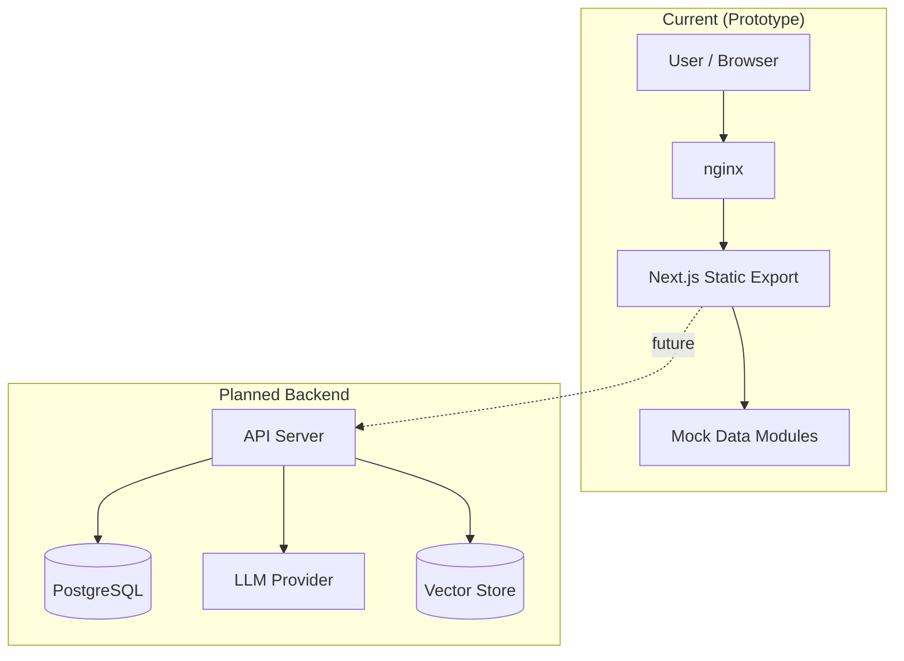
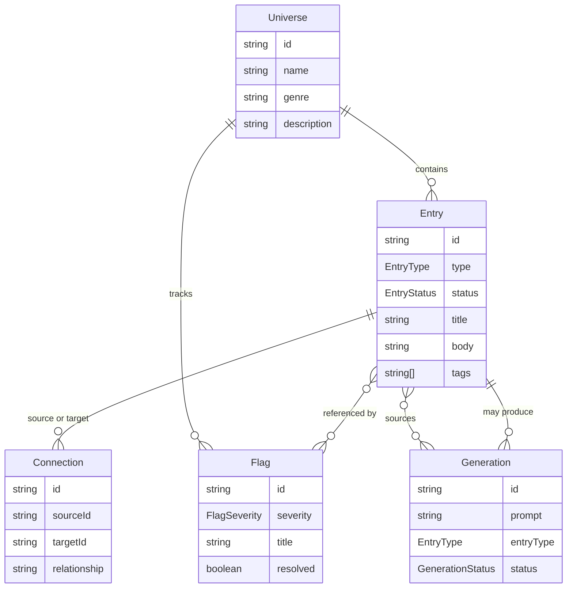

# Project Architecture

TheRobotKnows.com is an AI-powered knowledge base for creative world-building. Users define the seeds of a fictional universe — characters, locations, factions, rules — and the system generates consistent, cross-referenced supplementary material: lore entries, backstories, relationship maps, and timeline events. Everything is interconnected via a knowledge graph with automated consistency checking.

The project is currently a **frontend prototype** — a statically-exported Next.js application with mock data, no backend or AI integration yet.

## System Diagram

```mermaid
graph TB
    subgraph "Current (Prototype)"
        U[User / Browser] --> NG[nginx]
        NG --> SPA[Next.js Static Export]
        SPA --> MD[Mock Data Modules]
    end

    subgraph "Planned Backend"
        API[API Server] --> DB[(PostgreSQL)]
        API --> LLM[LLM Provider]
        API --> VEC[(Vector Store)]
    end

    SPA -.-> |future| API
```

## Core Components

| Component | Purpose | Status |
|-----------|---------|--------|
| Next.js Frontend | App Router SPA — dashboard, universe explorer, entry viewer, graph visualization, generation studio | Implemented (mock data) |
| D3.js Knowledge Graph | Force-directed graph of entries and connections within a universe | Implemented |
| Consistency Engine | Flags contradictions and conflicts across entries | UI implemented, logic mocked |
| Generation Studio | AI-driven lore generation from prompts + source entries | UI implemented, no LLM wiring |
| nginx | Static file server for production container | Configured |

## Domain Model

```mermaid
erDiagram
    Universe ||--o{ Entry : contains
    Universe ||--o{ Flag : tracks
    Entry ||--o{ Connection : "source or target"
    Entry }o--o{ Flag : "referenced by"
    Entry }o--o{ Generation : "sources"
    Generation }o--|| Entry : "may produce"

    Universe {
        string id
        string name
        string genre
        string description
    }
    Entry {
        string id
        EntryType type
        EntryStatus status
        string title
        string body
        string[] tags
    }
    Connection {
        string id
        string sourceId
        string targetId
        string relationship
    }
    Flag {
        string id
        FlagSeverity severity
        string title
        boolean resolved
    }
    Generation {
        string id
        string prompt
        EntryType entryType
        GenerationStatus status
    }
```

→ *See [arch/domain-model.md](arch/domain-model.md) for type enumerations and field details*

## Route Architecture

Two route groups under the App Router:

- `(dashboard)` — top-level pages: universe list, about, new universe
- `(universe)/[universeId]` — universe-scoped pages with sidebar + top-bar + status-bar chrome

→ *See [PROJ-LAYOUT.md](PROJ-LAYOUT.md) for the full route map*

## Visual Design

"Vellum & Ink" editorial aesthetic — warm parchment backgrounds, serif headings (Lora, Source Serif 4), monospace metadata accents (JetBrains Mono), and amber/gold accent tones. The design evokes a scholar's manuscript crossed with a modern knowledge tool.

→ *See `design/direction-a-vellum-ink.md` for the full design direction*

## Deployment

Static export via `next build` → nginx container. Multi-stage Dockerfile: Node 22 builder, nginx:alpine runtime. Gzip compression, immutable cache headers for `_next/static/`, SPA fallback routing.

→ *See [arch/deployment.md](arch/deployment.md) for container and infrastructure details*

## Technology Stack

| Layer | Technology |
|-------|-----------|
| Framework | Next.js 16 (App Router, static export) |
| UI | React 19, Tailwind CSS v4 |
| Graph | D3.js (d3-force, d3-zoom, d3-drag, d3-selection) |
| Icons | Lucide React |
| Typography | Lora, Source Serif 4, Inter, JetBrains Mono (Google Fonts) |
| Runtime | Node.js 22 (build), nginx:alpine (serve) |
| Container | Docker multi-stage build |

## Key Decisions

- **Static export over SSR**: No backend yet; static export keeps deployment simple (nginx only) and allows CDN distribution later
- **Mock data modules over API stubs**: Faster iteration on UI/UX without backend coupling; easy to swap for real API calls later
- **D3.js over a graph library (e.g., Cytoscape)**: Fine-grained control over force simulation and interaction needed for the knowledge graph UX
- **Tailwind v4 over CSS Modules**: Rapid prototyping with utility classes; consistent with incubator conventions
- **Entry type taxonomy** (character, location, event, faction, object, concept, rule): Covers the core world-building primitives without over-specialization

→ *See [arch/decisions.md](arch/decisions.md) for full ADRs*
