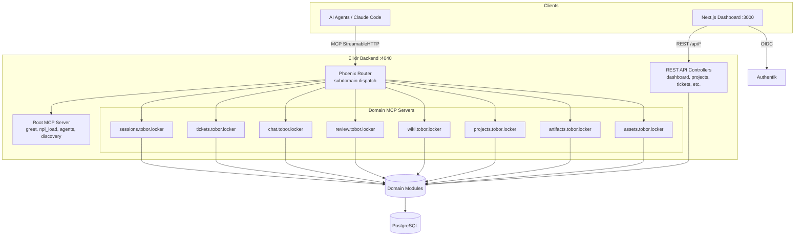

# Project Architecture

## Overview

NoizuPromptLingo (Tobor Locker) is a multi-domain MCP collaboration platform built as a two-tier application: an **Elixir/Phoenix API backend** exposing domain-specific MCP servers via subdomain routing, and a **Next.js 15 dashboard frontend** providing a web UI for project management, tickets, assets, chat, and reviews. The system uses PostgreSQL for persistence, Authentik for OIDC authentication, and deploys on Kubernetes via Helm.

The core architectural pattern is **domain-driven design with MCP-native interfaces**: each bounded context (Sessions, Tickets, Chat, Wiki, etc.) is a self-contained MCP server with its own subdomain, tool catalog, and schema. AI agents interact via MCP protocol; humans interact via the Next.js dashboard or direct MCP tool calls.

## System Diagram

```mermaid
graph TB
    subgraph Clients
        AI[AI Agents / Claude Code]
        WEB[Next.js Dashboard :3000]
    end

    subgraph "Elixir Backend :4040"
        ROOT[Root MCP Server<br/>greet, npl_load, agents, discovery]
        ROUTER[Phoenix Router<br/>subdomain dispatch]
        API[REST API Controllers<br/>dashboard, projects, tickets, etc.]

        subgraph "Domain MCP Servers"
            SESS[sessions.tobor.locker]
            TICK[tickets.tobor.locker]
            CHAT[chat.tobor.locker]
            REV[review.tobor.locker]
            WIKI[wiki.tobor.locker]
            PROJ[projects.tobor.locker]
            ART[artifacts.tobor.locker]
            ASSET[assets.tobor.locker]
        end
    end

    AI -->|MCP StreamableHTTP| ROUTER
    WEB -->|REST /api/*| API
    WEB -->|OIDC| AUTH[Authentik]
    ROUTER --> ROOT
    ROUTER --> SESS & TICK & CHAT & REV & WIKI & PROJ & ART & ASSET
    API --> DOMAINS[(Domain Modules)]
    SESS & TICK & CHAT & REV & WIKI & PROJ & ART & ASSET --> DOMAINS
    DOMAINS --> DB[(PostgreSQL)]
```

## Core Components

| Component | Purpose |
|-----------|---------|
| Root MCP Server | Discovery tools, NPL spec loading, agent orchestration |
| Domain MCP Servers | 8 bounded contexts, each with subdomain routing |
| Phoenix Router | Subdomain-based dispatch to MCP servers + REST API |
| REST API Controllers | JSON endpoints consumed by the Next.js dashboard |
| Next.js Dashboard | Web UI with OIDC auth, project scoping, CRUD pages |
| Mock MCP Gateway | Dynamic MCP server generation from YAML definitions |
| Liquibase | Database schema migrations (not Ecto migrations) |
| Helm Chart | Kubernetes deployment (`npl-mcp`) |

## Domain Architecture

Eight domain MCP servers, each a supervised GenServer with its own tool catalog. Domains share PostgreSQL via Ecto but are otherwise independent.

→ *See [arch/domains.md](arch/domains.md) for details*

## Authentication & Security

Authentik OIDC provider handles user authentication. The Next.js frontend uses NextAuth v5 with JWT tokens. User sync to the backend happens on sign-in via `/api/auth/sync`. MCP API keys provide programmatic access for agents.

→ *See [arch/auth.md](arch/auth.md) for details*

## Data Layer

PostgreSQL with Ecto schemas. Liquibase manages migrations (not `mix ecto.migrate`). 35+ schema modules covering all domains. Project-scoped entities use `project_id` foreign keys.

→ *See [arch/data-layer.md](arch/data-layer.md) for details*

## Deployment

Two Docker images (Elixir backend, Next.js frontend) deployed via a single Helm chart (`npl-mcp`) on Kubernetes. Subdomain routing requires wildcard DNS for `*.tobor.locker`.

→ *See [arch/deployment.md](arch/deployment.md) for details*

## Key Decisions

- **MCP-native domains**: Each bounded context is a first-class MCP server, not just a REST API — AI agents get structured tool interfaces, not raw HTTP
- **Subdomain routing**: Isolates MCP tool namespaces per domain while sharing a single Phoenix endpoint
- **Liquibase over Ecto migrations**: Aligns with the monorepo's Liquibase-based migration infrastructure
- **Authentik OIDC**: Centralized SSO across the Noizu platform; user sync on sign-in avoids polling
- **noizu_mcp library**: Custom MCP server/client library (`~> 0.1.3`) providing the tool DSL and StreamableHTTP transport

## Technology Stack

| Layer | Technology |
|-------|------------|
| Backend | Elixir 1.18+, Phoenix 1.7, OTP 29 |
| Frontend | Next.js 15.3, React 19, NextAuth v5 |
| Database | PostgreSQL, Ecto 3.13, Liquibase |
| MCP | noizu_mcp ~> 0.1.3 (StreamableHTTP) |
| Auth | Authentik OIDC, JOSE JWT |
| Deploy | Docker (Alpine), Helm, Kubernetes |
| Observability | Telemetry, Phoenix LiveDashboard |
