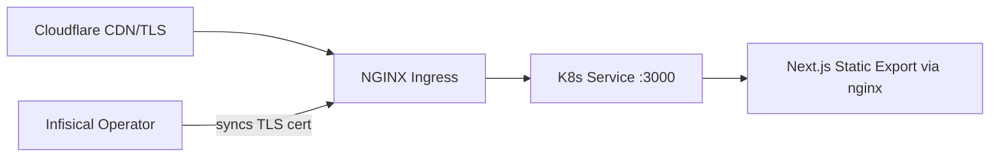
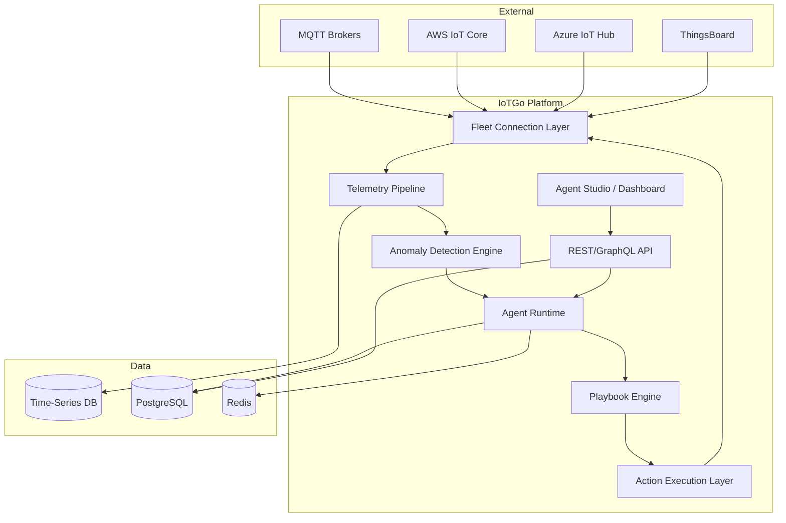

# Project Architecture

## Overview

IoTGo is an **autonomous AI agent layer for IoT fleet management**. It sits on top of existing device infrastructure (AWS IoT, Azure IoT Hub, ThingsBoard) and deploys persistent agents that monitor telemetry, detect anomalies, execute remediation playbooks, and optimize configurations without human intervention.

**Current status:** Pre-development / concept stage. The deployed artifact is a Next.js 16 static landing page with waitlist form. No backend, agent runtime, or telemetry pipeline exists yet.

## System Diagram — Current State

```mermaid
graph LR
    CF[Cloudflare CDN/TLS] --> NG[NGINX Ingress]
    NG --> SVC[K8s Service :3000]
    SVC --> POD[Next.js Static Export via nginx]
    INF[Infisical Operator] -->|syncs TLS cert| NG
```

## System Diagram — Target Architecture

```mermaid
graph TB
    subgraph External
        MQTT[MQTT Brokers]
        AWS[AWS IoT Core]
        AZ[Azure IoT Hub]
        TB[ThingsBoard]
    end

    subgraph IoTGo Platform
        CONN[Fleet Connection Layer]
        TELE[Telemetry Pipeline]
        ANOM[Anomaly Detection Engine]
        AGENT[Agent Runtime]
        PB[Playbook Engine]
        EXEC[Action Execution Layer]
        UI[Agent Studio / Dashboard]
        API[REST/GraphQL API]
    end

    subgraph Data
        TS[(Time-Series DB)]
        PG[(PostgreSQL)]
        REDIS[(Redis)]
    end

    MQTT & AWS & AZ & TB --> CONN
    CONN --> TELE
    TELE --> TS
    TELE --> ANOM
    ANOM --> AGENT
    AGENT --> PB
    PB --> EXEC
    EXEC --> CONN
    AGENT --> PG
    AGENT --> REDIS
    UI --> API
    API --> AGENT
    API --> PG
```

## Core Components

| Component | Purpose | Status |
|-----------|---------|--------|
| Landing Page | Next.js 16 static site with waitlist form | Deployed |
| Helm Chart | K8s deployment (nginx serving static export) | Deployed |
| Fleet Connection Layer | Ingest from MQTT, HTTP, AWS IoT, Azure IoT | Planned |
| Telemetry Pipeline | Stream processing and time-series storage | Planned |
| Anomaly Detection Engine | Unsupervised baseline learning, multivariate scoring | Planned |
| Agent Runtime | Persistent goal-oriented processes bound to fleet segments | Planned |
| Playbook Engine | YAML-defined, versioned, constrained action sequences | Planned |
| Action Execution Layer | Canary deployments, rollback, audit trail | Planned |
| Agent Studio UI | Agent config, reasoning logs, performance dashboard | Planned |

## Deployment

Single-container static site deployed to self-hosted K8s cluster via Helm.

-> *See [arch/deployment.md](arch/deployment.md) for details*

## Security Model

Cloudflare-only access with TLS certificates managed by Infisical Operator. No application-level auth exists yet.

-> *See [arch/security.md](arch/security.md) for details*

## Technology Stack

| Layer | Technology |
|-------|-----------|
| Frontend | Next.js 16, React 19, Tailwind CSS 4, TypeScript 5 |
| Container | Node 22 Alpine (build) -> nginx Alpine (serve static export) |
| Orchestration | Kubernetes, Helm v0.1.0 |
| Ingress | NGINX Ingress Controller, Cloudflare IP whitelist |
| TLS | Infisical Operator -> K8s Secret, Cloudflare origin certs |
| Registry | `ops.noizu.com` private registry |

## Key Design Decisions

- **Static export over SSR** -- Landing page has no dynamic data; static export via nginx is simpler and faster than running a Node.js server in production
- **Cloudflare-only ingress** -- All traffic routed through Cloudflare; direct access blocked via IP whitelist in NGINX annotations
- **Infisical for TLS** -- TLS certs synced from Infisical rather than cert-manager/Let's Encrypt, consistent with the parent infrastructure pattern
- **No backend yet** -- Deliberately deferred; the concept stage focuses on validating the agent thesis before building infrastructure

-> *See [arch/decisions.md](arch/decisions.md) for ADRs*

## Open Architectural Questions

These remain unresolved and will shape the target architecture significantly:

1. **Edge vs. cloud agents** -- Hybrid likely, but latency/compute tradeoffs need validation
2. **Playbook safety guarantees** -- Formal verification vs. simulation sandbox for preventing fleet-bricking playbooks
3. **Multi-tenant fleet isolation** -- Hard isolation requirements for enterprise customers
4. **LLM boundary** -- Where statistical ML ends and generative reasoning begins in the agent decision layer
5. **Integration depth** -- Deep integrations with 3-4 platforms vs. shallow adapters for 20

-> *See [README.md](../README.md) for full context on open questions*
