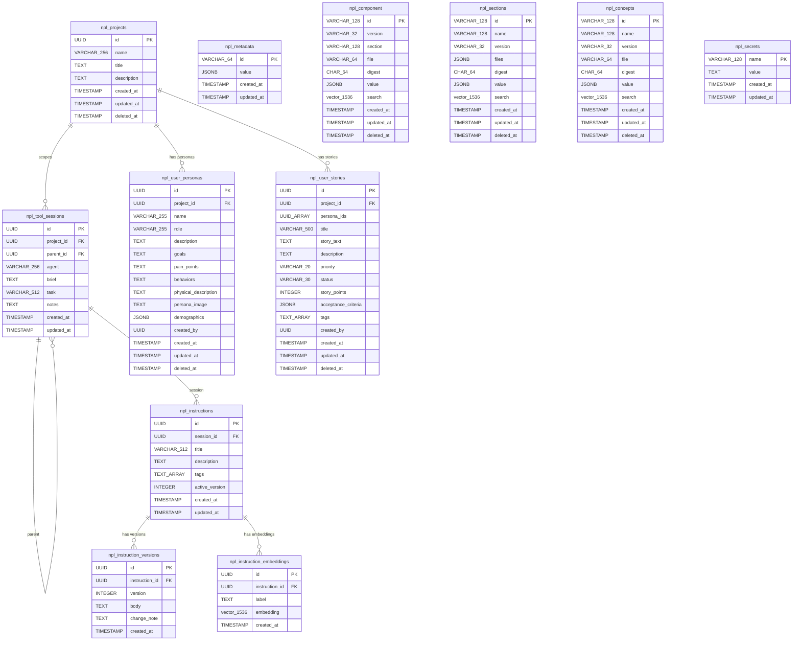
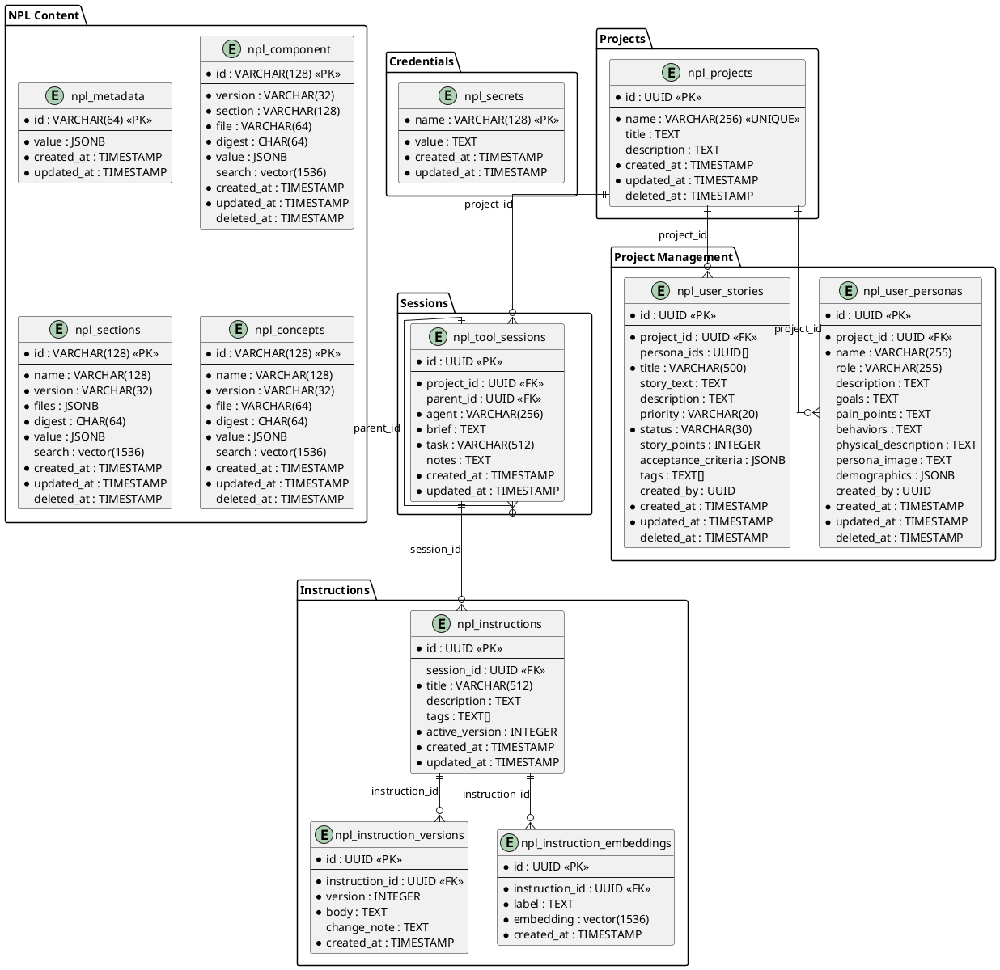

# Project Schema

## Overview

NPL MCP uses PostgreSQL (asyncpg) with Liquibase YAML changelogs for migrations. The schema covers six domains: NPL content storage with vector search, credential management, agent session tracking, versioned instruction documents with multi-facet embeddings, project scoping, and project management (personas/stories).

**Database**: `localhost:5111/npl` | **Driver**: asyncpg | **Migrations**: `liquibase/changelogs/` | **Tables**: 11 | **Changesets**: 16

## Entity Relationship Diagram

### Mermaid



### PlantUML



## Enum Types

### npl_element_type

```sql
CREATE TYPE npl_element_type AS ENUM (
  'concept', 'section', 'component', 'label', 'example', 'syntax'
);
```

> **Note**: Defined in changeset 001 but not currently referenced as a column type in any table.

## NPL Content Domain

Tables for storing parsed NPL language elements with vector embeddings for semantic search. Four tables: `npl_metadata` (key-value config), `npl_component` (components with section grouping), `npl_sections` (section definitions with file lists), `npl_concepts` (core concept definitions). All content tables except metadata have `vector(1536)` columns with ivfflat indexes and soft deletes.

→ *See [schema/npl-content.md](schema/npl-content.md) for full column details and indexes*

## Credentials Domain

### npl_secrets

Named credential store for API keys and tokens.

| Column | Type | Nullable | Default | Description |
|--------|------|----------|---------|-------------|
| name | VARCHAR(128) | No | — | Primary key (credential name) |
| value | TEXT | No | — | Credential value |
| created_at | TIMESTAMP | No | NOW() | Creation time |
| updated_at | TIMESTAMP | No | NOW() | Last modification |

## Projects Domain

### npl_projects

Project container for scoping sessions, personas, and stories. ID is application-generated (UUID5 deterministic), not auto-generated.

| Column | Type | Nullable | Default | Description |
|--------|------|----------|---------|-------------|
| id | UUID | No | — | Primary key (app-generated UUID5) |
| name | VARCHAR(256) | No | — | Project name (unique) |
| title | TEXT | Yes | — | Display title |
| description | TEXT | Yes | — | Project description |
| created_at | TIMESTAMP | No | NOW() | Creation time |
| updated_at | TIMESTAMP | No | NOW() | Last modification |
| deleted_at | TIMESTAMP | Yes | — | Soft delete marker |

**Constraints**: `name` UNIQUE

## Session Domain

### npl_tool_sessions

Agent session tracking scoped to projects, with optional parent hierarchy.

| Column | Type | Nullable | Default | Description |
|--------|------|----------|---------|-------------|
| id | UUID | No | gen_random_uuid() | Primary key |
| project_id | UUID | No | — | FK to npl_projects(id) |
| parent_id | UUID | Yes | — | Self-FK for session hierarchy |
| agent | VARCHAR(256) | No | — | Agent identifier |
| brief | TEXT | No | — | Session purpose |
| task | VARCHAR(512) | No | — | Task identifier |
| notes | TEXT | Yes | — | Appended session notes |
| created_at | TIMESTAMP | No | NOW() | Creation time |
| updated_at | TIMESTAMP | No | NOW() | Last modification |

**Foreign Keys**: `fk_tool_sessions_project` (project_id) REFERENCES npl_projects(id), `fk_tool_sessions_parent` (parent_id) REFERENCES npl_tool_sessions(id)
**Constraints**: `uq_npl_tool_sessions_project_agent_task` UNIQUE (project_id, agent, task)

## Instructions Domain

Versioned instruction documents with active version pointer, optionally linked to a session. Three tables: `npl_instructions` (metadata + active version tracking), `npl_instruction_versions` (versioned bodies), `npl_instruction_embeddings` (multi-facet vector embeddings with HNSW index for semantic search).

→ *See [schema/instructions.md](schema/instructions.md) for full column details and indexes*

## Project Management Domain

Tables for user personas and user stories. Supports the feature implementation workflow (idea-to-spec pipeline). Two tables: `npl_user_personas` (15 columns, rich persona profiles with demographics JSONB) and `npl_user_stories` (15 columns, stories with UUID[] persona_ids via GIN index, acceptance criteria, tags). Both use soft deletes with partial indexes.

→ *See [schema/project-management.md](schema/project-management.md) for full column details and indexes*

## Migration History

| Changeset | File | Description |
|-----------|------|-------------|
| 001 | changeset-001 | `npl_element_type` enum |
| 002 | changeset-001 | `npl_metadata` |
| 003 | changeset-001 | `npl_component` |
| 004 | changeset-001 | `npl_sections` |
| 005 | changeset-001 | `npl_concepts` |
| 006 | changeset-002 | `npl_secrets` |
| 007 | changeset-003 | `npl_tool_sessions` |
| 008 | changeset-004 | `npl_instructions` |
| 009 | changeset-004 | `npl_instruction_versions` |
| 010 | changeset-006 | `npl_projects` |
| 011 | changeset-006 | Seed legacy project |
| 012 | changeset-006 | Alter `npl_tool_sessions` — add project_id, parent_id |
| 013 | changeset-006 | Alter `npl_instructions` — add session_id |
| 014 | changeset-007 | `npl_user_personas` |
| 015 | changeset-007 | `npl_user_stories` |
| 016 | changeset-008 | `npl_instruction_embeddings` (multi-facet vector search, HNSW index) |

## Design Notes

- **Soft deletes**: NPL content tables and project management tables use `deleted_at` rather than hard deletes
- **Vector search**: 1536-dimension embeddings on content tables (ivfflat, cosine, 100 lists) and instruction embeddings (HNSW, cosine)
- **Project scoping**: Sessions are scoped to projects via `project_id` FK; unique constraint is (project_id, agent, task). Instructions optionally linked to sessions via `session_id`
- **Session hierarchy**: `npl_tool_sessions.parent_id` is a self-FK enabling parent-child session trees
- **Timestamps**: All tables use `TIMESTAMP WITHOUT TIME ZONE` with `NOW()` defaults — application manages UTC. All tables use `updated_at` as the modification timestamp column
- **pgvector**: Required extension for `vector(1536)` columns and ivfflat indexes
- **Array columns**: `npl_user_stories.persona_ids` uses `UUID[]` with GIN index for containment queries; `npl_user_stories.tags` and `npl_instructions.tags` use `TEXT[]`
- **Partial indexes**: Project management tables use partial indexes on `deleted_at` (WHERE deleted_at IS NULL)
- **Seed data**: Legacy project (`abde7a0e-fe09-5a67-8e95-dd30da1862a2`, name=`legacy`) seeded by changeset 011 for backfilling pre-scoping sessions
