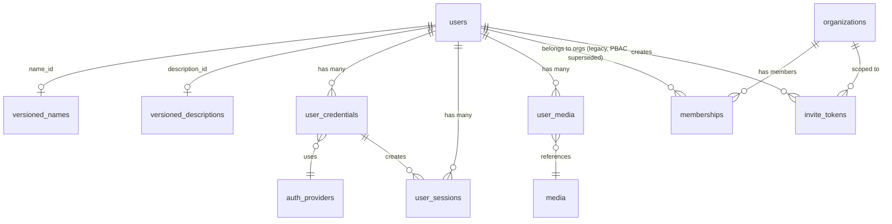
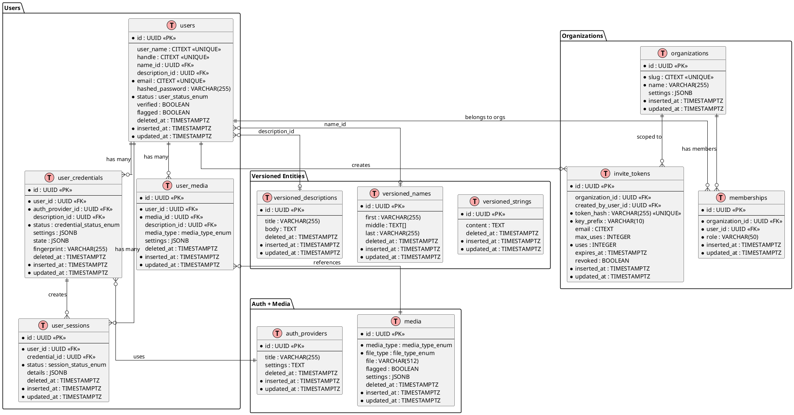

# Project Schema — NoizuPromptLingo (NPL)

Persistence reference for the whole project. NPL has **two separate PostgreSQL schemas** plus auxiliary stores:

| Store | Owner | Migrations | Docs |
|-------|-------|-----------|------|
| Backend DB | Elixir Phoenix API (`:noizu_prompt_lingua`) | `backend/db/changelog/` (Liquibase 000–082) + minimal Ecto migrations | [schema/backend-domains.md](schema/backend-domains.md), [schema/core-identity.md](schema/core-identity.md) |
| Python MCP DB | `src/npl_mcp` (asyncpg) | `liquibase/changelogs/` (changesets 001–019) | [schema/instructions.md](schema/instructions.md), [schema/npl-content.md](schema/npl-content.md), [schema/project-management.md](schema/project-management.md) |
| Redis | Backend cache/PubSub | — | [schema/config-artifacts.md](schema/config-artifacts.md) |
| Weaviate (optional) | Memory embeddings (`NplMemory` class) | — | [schema/config-artifacts.md](schema/config-artifacts.md) |

Non-SQL persistence/config artifacts (env files, runtime config, Helm values, file formats): [schema/config-artifacts.md](schema/config-artifacts.md).

The PM domain tables (`npl_projects`, personas, stories) on the Python side are being superseded by TRP (therobotplans) as the PM source — changeset 078 dropped backend cross-DB FKs; the Python tables remain for legacy tooling.

## Extensions

Both DBs base on: `citext`, `uuid-ossp`, `postgis`, `vector` (pgvector), `cube`, `pg_trgm`, `earthdistance`.

## Enum Types (backend DB)

| Enum | Values |
|------|--------|
| `status_enum` | active, disabled, suspended, deleted, other |
| `user_status_enum` | active, unverified, waitlist, suspended, deleted, other |
| `credential_status_enum` | active, disabled, suspended, deleted, other |
| `session_status_enum` | active, revoked, disabled, suspended, deleted, other |
| `media_type_enum` | image, video, audio, document, other |
| `file_type_enum` | jpg, jpeg, png, gif, webp, svg, bmp, ico, tiff, mp4, avi, mov, webm, mp3, wav, ogg, pdf, doc, other |
| `owner_type_enum` | user, organization, other |
| `credential_type_enum` | login, oauth, smart_link, other |
| `device_type_enum` | web, ios, android, other |
| + memory/PBAC enums | changesets 013, 045 (see [schema/backend-domains.md](schema/backend-domains.md)) |

## ERD — Backend core identity (Mermaid)

```mermaid
erDiagram
    users ||--o| versioned_names : "name_id"
    users ||--o| versioned_descriptions : "description_id"
    users ||--o{ user_credentials : "has many"
    users ||--o{ user_sessions : "has many"
    users ||--o{ user_media : "has many"
    users ||--o{ memberships : "belongs to orgs (legacy, PBAC superseded)"
    users ||--o{ invite_tokens : "creates"

    user_credentials }o--|| auth_providers : "uses"
    user_credentials ||--o{ user_sessions : "creates"
    user_media }o--|| media : "references"
    organizations ||--o{ memberships : "has members"
    organizations ||--o{ invite_tokens : "scoped to"
```

Full column details for these tables: [schema/core-identity.md](schema/core-identity.md). Domain relationships (projects → tickets/boards/chat/personas/memories, org → MCP keys/scopes/oauth clients) are indexed in [schema/backend-domains.md](schema/backend-domains.md).

## ERD — Backend core identity (PlantUML)

```plantuml
@startuml
!define TABLE(name) entity name <<(T,#FFAAAA)>>
skinparam linetype ortho

package "Versioned Entities" {
  TABLE(versioned_strings) {
    * id : UUID <<PK>>
    --
    content : TEXT
    deleted_at : TIMESTAMPTZ
    * inserted_at : TIMESTAMPTZ
    * updated_at : TIMESTAMPTZ
  }
  TABLE(versioned_names) {
    * id : UUID <<PK>>
    --
    first : VARCHAR(255)
    middle : TEXT[]
    last : VARCHAR(255)
    deleted_at : TIMESTAMPTZ
    * inserted_at : TIMESTAMPTZ
    * updated_at : TIMESTAMPTZ
  }
  TABLE(versioned_descriptions) {
    * id : UUID <<PK>>
    --
    title : VARCHAR(255)
    body : TEXT
    deleted_at : TIMESTAMPTZ
    * inserted_at : TIMESTAMPTZ
    * updated_at : TIMESTAMPTZ
  }
}

package "Auth + Media" {
  TABLE(auth_providers) {
    * id : UUID <<PK>>
    --
    title : VARCHAR(255)
    settings : TEXT
    deleted_at : TIMESTAMPTZ
    * inserted_at : TIMESTAMPTZ
    * updated_at : TIMESTAMPTZ
  }
  TABLE(media) {
    * id : UUID <<PK>>
    --
    * media_type : media_type_enum
    * file_type : file_type_enum
    file : VARCHAR(512)
    flagged : BOOLEAN
    settings : JSONB
    deleted_at : TIMESTAMPTZ
    * inserted_at : TIMESTAMPTZ
    * updated_at : TIMESTAMPTZ
  }
}

package "Users" {
  TABLE(users) {
    * id : UUID <<PK>>
    --
    user_name : CITEXT <<UNIQUE>>
    handle : CITEXT <<UNIQUE>>
    name_id : UUID <<FK>>
    description_id : UUID <<FK>>
    * email : CITEXT <<UNIQUE>>
    hashed_password : VARCHAR(255)
    * status : user_status_enum
    verified : BOOLEAN
    flagged : BOOLEAN
    deleted_at : TIMESTAMPTZ
    * inserted_at : TIMESTAMPTZ
    * updated_at : TIMESTAMPTZ
  }
  TABLE(user_media) {
    * id : UUID <<PK>>
    --
    * user_id : UUID <<FK>>
    * media_id : UUID <<FK>>
    description_id : UUID <<FK>>
    media_type : media_type_enum
    settings : JSONB
    deleted_at : TIMESTAMPTZ
    * inserted_at : TIMESTAMPTZ
    * updated_at : TIMESTAMPTZ
  }
  TABLE(user_credentials) {
    * id : UUID <<PK>>
    --
    * user_id : UUID <<FK>>
    * auth_provider_id : UUID <<FK>>
    description_id : UUID <<FK>>
    * status : credential_status_enum
    settings : JSONB
    state : JSONB
    fingerprint : VARCHAR(255)
    deleted_at : TIMESTAMPTZ
    * inserted_at : TIMESTAMPTZ
    * updated_at : TIMESTAMPTZ
  }
  TABLE(user_sessions) {
    * id : UUID <<PK>>
    --
    * user_id : UUID <<FK>>
    credential_id : UUID <<FK>>
    * status : session_status_enum
    details : JSONB
    deleted_at : TIMESTAMPTZ
    * inserted_at : TIMESTAMPTZ
    * updated_at : TIMESTAMPTZ
  }
}

package "Organizations" {
  TABLE(organizations) {
    * id : UUID <<PK>>
    --
    * slug : CITEXT <<UNIQUE>>
    * name : VARCHAR(255)
    settings : JSONB
    * inserted_at : TIMESTAMPTZ
    * updated_at : TIMESTAMPTZ
  }
  TABLE(memberships) {
    * id : UUID <<PK>>
    --
    * organization_id : UUID <<FK>>
    * user_id : UUID <<FK>>
    * role : VARCHAR(50)
    * inserted_at : TIMESTAMPTZ
    * updated_at : TIMESTAMPTZ
  }
  TABLE(invite_tokens) {
    * id : UUID <<PK>>
    --
    organization_id : UUID <<FK>>
    created_by_user_id : UUID <<FK>>
    * token_hash : VARCHAR(255) <<UNIQUE>>
    * key_prefix : VARCHAR(10)
    email : CITEXT
    max_uses : INTEGER
    * uses : INTEGER
    expires_at : TIMESTAMPTZ
    revoked : BOOLEAN
    * inserted_at : TIMESTAMPTZ
    * updated_at : TIMESTAMPTZ
  }
}

users }o--o| versioned_names : "name_id"
users }o--o| versioned_descriptions : "description_id"
users ||--o{ user_credentials : "has many"
users ||--o{ user_sessions : "has many"
users ||--o{ user_media : "has many"
users ||--o{ memberships : "belongs to orgs"
users ||--o{ invite_tokens : "creates"
user_credentials }o--|| auth_providers : "uses"
user_credentials ||--o{ user_sessions : "creates"
user_media }o--|| media : "references"
organizations ||--o{ memberships : "has members"
organizations ||--o{ invite_tokens : "scoped to"
@enduml
```

## Python MCP DB — table inventory

Schema from `liquibase/changelogs/changeset-001…019` (all tables prefixed `npl_`):

| Domain | Tables |
|--------|--------|
| Metadata/NPL content | npl_metadata, npl_component, npl_sections, npl_concepts → [schema/npl-content.md](schema/npl-content.md) |
| Instructions | npl_instructions, npl_instruction_versions, npl_instruction_embeddings → [schema/instructions.md](schema/instructions.md) |
| PM (legacy) | npl_projects, npl_user_personas, npl_user_stories → [schema/project-management.md](schema/project-management.md) |
| Sessions | npl_tool_sessions, npl_generic_sessions, project/session hierarchy (changeset-006, -012) |
| Tasks | npl_tasks, npl_task_queues, npl_taskers, npl_task_events, npl_task_artifacts |
| Artifacts | npl_artifacts, npl_artifact_revisions (+ binary payload, changeset-014) |
| Chat | npl_chat_rooms, npl_chat_room_members, npl_chat_messages, npl_chat_events, npl_chat_notifications |
| Agents | npl_agent_groups, npl_agent_group_members, npl_agent_pipe_entries |
| Ops | npl_secrets, npl_tool_calls, npl_tool_errors, npl_llm_calls, npl_reviews, npl_inline_comments |
| MCP server entities | mcp_prompts, mcp_prompt_versions, mcp_resources, mcp_resource_templates (changeset-019) |

**Conventions**: UUID PKs (`gen_random_uuid()`), `TIMESTAMP`/`TIMESTAMPTZ` with `NOW()` defaults, `updated_at` (never `modified_at`), soft-delete `deleted_at` where applicable. Managed by Liquibase YAML (`liquibase/changelogs/`, config in `liquibase/liquibase.properties`).

## Changeset Reference

### Backend (`backend/db/changelog/`, master: db.changelog-master.yaml)

| Range | Content |
|-------|---------|
| 000–010 | Extensions, enums, seed helper, versioned entities, auth, media, users, orgs, invites → [schema/core-identity.md](schema/core-identity.md) |
| 011–082 | Webhooks, admin flag, PBAC/ACL, projects, sessions, GitHub, artifacts, chat, reviews, tickets, boards, mock-MCP, personas, instructions, agent pipes, remote access, memory, customers, market, campaigns, LLM models, media providers, pubsub, unicode codex, MCP platform, OAuth AS, marketing → [schema/backend-domains.md](schema/backend-domains.md) |

### Python MCP (`liquibase/changelogs/`)

| Changeset | Content |
|-----------|---------|
| 001–002 | initial setup, npl_secrets |
| 003–005 | npl_tool_sessions, instructions (+embeddings 008) |
| 006–007 | projects/session hierarchy, PM tables |
| 009–010 | npl_tool_errors, npl_tasks |
| 011–013 | artifacts, generic sessions, chat |
| 014–018 | artifact binary, agent pipes, taskers, enhanced managers, metrics |
| 019 | MCP entities (prompts/resources/templates) |

## Ecto migrations

`backend/priv/repo/migrations/` — minimal, deliberately (Liquibase owns schema): oban tables, MCP scopes/toolsets/endpoint templates, SSO claim codes, oauth client toolsets, clients, org slug uniqueness. Full list in [schema/config-artifacts.md](schema/config-artifacts.md).
