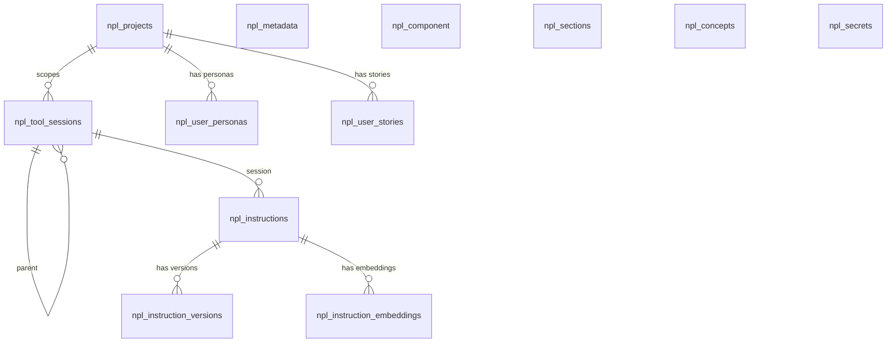

# Project Schema Summary

**Database**: PostgreSQL @ `localhost:5111/npl` | **11 tables** | **1 enum** | **16 changesets** (across 7 files)

## ERD (Simplified)

## Tables

| Table | PK | PK Type | Columns | Domain | Description |
|-------|----|---------|---------|--------|-------------|
| npl_metadata | id | VARCHAR(64) | 4 | NPL Content | Key-value config store (JSONB) |
| npl_component | id | VARCHAR(128) | 10 | NPL Content | Components with vector search |
| npl_sections | id | VARCHAR(128) | 10 | NPL Content | Section definitions with vector search |
| npl_concepts | id | VARCHAR(128) | 10 | NPL Content | Concept definitions with vector search |
| npl_secrets | name | VARCHAR(128) | 4 | Credentials | Named credential store |
| npl_projects | id | UUID | 7 | Projects | Project scoping container |
| npl_tool_sessions | id | UUID | 9 | Sessions | Agent session tracking (project-scoped) |
| npl_instructions | id | UUID | 8 | Instructions | Versioned instruction metadata |
| npl_instruction_versions | id | UUID | 6 | Instructions | Instruction version bodies |
| npl_instruction_embeddings | id | UUID | 5 | Instructions | Multi-facet vector embeddings (HNSW) |
| npl_user_personas | id | UUID | 15 | Project Mgmt | Archetypal user personas |
| npl_user_stories | id | UUID | 15 | Project Mgmt | User stories with acceptance criteria |

## Relationships

| FK | From | To |
|----|------|----|
| fk_tool_sessions_project | npl_tool_sessions.project_id | npl_projects.id |
| fk_tool_sessions_parent | npl_tool_sessions.parent_id | npl_tool_sessions.id |
| fk_instructions_session | npl_instructions.session_id | npl_tool_sessions.id |
| fk_instruction_version_instruction | npl_instruction_versions.instruction_id | npl_instructions.id |
| fk_instruction_embeddings_instruction | npl_instruction_embeddings.instruction_id | npl_instructions.id |
| fk_user_personas_project | npl_user_personas.project_id | npl_projects.id |
| fk_user_stories_project | npl_user_stories.project_id | npl_projects.id |

## Key Features

- **Vector search**: npl_component, npl_sections, npl_concepts have `vector(1536)` with ivfflat indexes; npl_instruction_embeddings uses HNSW index
- **Soft deletes**: NPL content tables and PM tables use `deleted_at` column
- **Project scoping**: Sessions unique on (project_id, agent, task); instructions linked to sessions
- **Session hierarchy**: Self-FK `parent_id` on npl_tool_sessions
- **Multi-facet embeddings**: Instructions have multiple embedding rows per document (one per descriptive phrase)
- **Array columns**: `UUID[]` persona_ids with GIN index; `TEXT[]` tags on stories and instructions
- **Partial indexes**: PM tables index `deleted_at WHERE deleted_at IS NULL`
- **Timestamps**: All `TIMESTAMP WITHOUT TIME ZONE` with standardized `updated_at` column
- **pgvector extension** required

## Enum Types

- **npl_element_type**: concept, section, component, label, example, syntax
