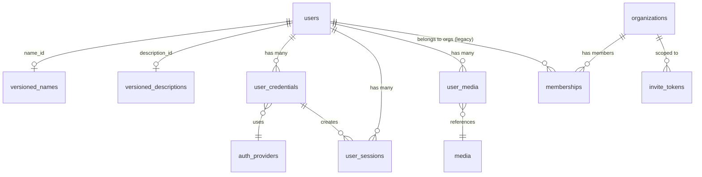

# Database Schema Summary — NoizuPromptLingo

Two separate PostgreSQL schemas + auxiliary stores. Detail: [PROJ-SCHEMA.md](PROJ-SCHEMA.md).

## Stores

| Store | Migrations | Detail |
|-------|-----------|--------|
| Backend DB (Elixir `:noizu_prompt_lingua`) | `backend/db/changelog/` Liquibase 000–082 + minimal Ecto migrations | [schema/backend-domains.md](schema/backend-domains.md), [schema/core-identity.md](schema/core-identity.md) |
| Python MCP DB (`src/npl_mcp`, asyncpg) | `liquibase/changelogs/` changesets 001–019 | [schema/instructions.md](schema/instructions.md), [schema/npl-content.md](schema/npl-content.md), [schema/project-management.md](schema/project-management.md) |
| Redis (cache/PubSub), Weaviate (memory, optional) | — | [schema/config-artifacts.md](schema/config-artifacts.md) |

## Backend DB — domains (changesets 011–082 in parentheses)

Core identity (000–010): users, user_credentials, user_sessions, user_media, media, organizations, memberships (legacy→PBAC), invite_tokens, auth_providers, versioned_strings/names/descriptions, seed_helper_records, webhooks (011)

ACL/PBAC (013–021, 081): group_policies, ad_groups, ad_copies, custom_roles, custom_role_permissions, user_policies
Projects (017, 034): projects; Sessions (025–026, 072, 079): sessions; Artifacts (031): artifacts, artifact_revisions
Chat (032, 052, 054, 067, 068): chat_rooms, chat_messages, chat_members, chat_events, chat_notifications
Reviews (033): reviews, review_overlays; Tickets (035–037, 055): tickets + 7 ticket_* tables; Boards (038): board_iterations, board_stages
Wiki: wiki_spaces, wiki_pages, wiki_attachments, wiki_comments, wiki_reactions
Mock MCP (039, 057–058): mock_mcp_definitions, mock_mcp_llms, mock_mcp_call_logs
Personas (041, 056): personas, persona_journal_entries, persona_knowledge_entries
Memory (045–049): memories, memory_compartments, memory_quarantine, memory_agent_state, memory_recall_log, association_edges; agent_call_signs (050)
Customers (059), Market (060–063): customers + segments/personas, market_reports, competitors, keywords, landing_pages, ad_copies, ad_groups, campaigns, llm_models, media_provider_configs
MCP platform (070a–080): mcp_api_keys, mcp_custom_scopes, mcp_pairing_grants, mcp_tool_vectors, mcp_overviews, mcp_endpoint_templates; OAuth AS (074): oauth_clients, oauth_authorization_codes, oauth_refresh_tokens
GitHub (027–029): github_tokens, github_repos; Remote access (044): remote_access_tunnels
Assets (040): asset_entries, asset_outputs, asset_entry_history; Unicode codex (070): unicode_elements + relations/usages
Cross-cutting (030, 064–066): npl_attachments, npl_comments, npl_reactions, npl_watches, npl_notifications, npl_pubsub_channels/messages/follows

## Python MCP DB — domains

NPL content (npl_metadata, npl_component, npl_sections, npl_concepts); Instructions (npl_instructions, _versions, _embeddings); PM legacy (npl_projects, npl_user_personas, npl_user_stories); Sessions (npl_tool_sessions, npl_generic_sessions); Tasks (npl_tasks, npl_task_queues, npl_taskers, npl_task_events, npl_task_artifacts); Artifacts (npl_artifacts, npl_artifact_revisions); Chat (5 npl_chat_* tables); Agents (npl_agent_groups, _members, npl_agent_pipe_entries); Ops (npl_secrets, npl_tool_calls, npl_tool_errors, npl_llm_calls, npl_reviews, npl_inline_comments); MCP entities (mcp_prompts, mcp_prompt_versions, mcp_resources, mcp_resource_templates)

## Core ERD

```mermaid
erDiagram
    users ||--o| versioned_names : "name_id"
    users ||--o| versioned_descriptions : "description_id"
    users ||--o{ user_credentials : "has many"
    users ||--o{ user_sessions : "has many"
    users ||--o{ user_media : "has many"
    users ||--o{ memberships : "belongs to orgs (legacy)"
    user_credentials }o--|| auth_providers : "uses"
    user_credentials ||--o{ user_sessions : "creates"
    user_media }o--|| media : "references"
    organizations ||--o{ memberships : "has members"
    organizations ||--o{ invite_tokens : "scoped to"
```

## Conventions

UUID PKs · timestamptz + now() defaults · `updated_at` (never modified_at) · soft-delete `deleted_at` · Liquibase owns schema (Ecto migrations minimal: oban, MCP scopes/toolsets, SSO claims, clients) · Extensions: citext, uuid-ossp, postgis, vector, cube, pg_trgm, earthdistance

## Non-SQL artifacts

Env: `.env.example` (PROJECT_SLUG, REGISTRY, DATABASE_URL, REDIS_URL, REDIS_KEY_PREFIX, SECRET_KEY_BASE, GUARDIAN_SECRET_KEY, PHX_HOST, NEXT_PUBLIC_API_URL, PORT) → `.env` files via `make init` (gitignored). Backend runtime config: `backend/config/runtime.exs` (redis, api_key_auth, mock_mcp, embeddings, memory_weaviate). Helm: `helm/npl-mcp`, `helm/start-app` values. File formats: conventions YAML, theme YAML, PM index.yaml, Liquibase changelogs, W8 definitions. → [schema/config-artifacts.md](schema/config-artifacts.md)
