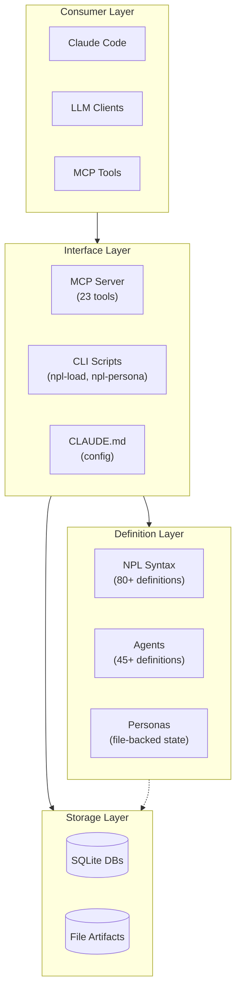

# PROJECT-ARCH: NoizuPromptLingo

A modular prompt engineering framework (NPL - Noizu Prompt Lingua) for advanced AI agent simulation and structured prompting with Claude Code integration.

⟪📐 arch-overview: layered-documentation | markdown-as-code, hierarchical-loading, event-sourced-collaboration⟫

## Quick Reference

⟪🗺️ layers: Consumer → Interface → Definition → Storage⟫

| Layer | Purpose | Key Components |
|:------|:--------|:---------------|
| Consumer | Runtime environments | Claude Code, LLM Clients, MCP Tools |
| Interface | Access patterns | MCP Server (23 tools), CLI Scripts, CLAUDE.md |
| Definition | Language specs | NPL Syntax (80+), Agents (45+), Personas |
| Storage | Persistence | SQLite (MCP, NIMPS, KB), File artifacts |

⟪🔧 services: sqlite-mcp, sqlite-nimps, sqlite-kb, npl-mcp, cli-tools | local pip install⟫

---

## Architecture Overview

→ See: [docs/PROJECT-ARCH/layers.md](PROJECT-ARCH/layers.md)

---

## Architectural Layers

### Consumer Layer
Runtime environments (Claude Code, LLM clients, MCP-compatible tools) that interpret NPL definitions. No NPL source code—all customization through CLAUDE.md injection or MCP invocations.

### Interface Layer
**MCP Server** (23 tools): Script wrappers, artifact management, review system, chat rooms
**CLI Scripts**: `npl-load` (hierarchical loading), `npl-persona` (persona management), `dump-files`, `git-tree`
**CLAUDE.md**: Project configuration with NPL framework injection

### Definition Layer
**NPL Syntax** (`/npl/`): 80+ files covering syntax, directives, fences, pumps, prefixes, special sections
**Agents** (`/core/agents/`, `/core/additional-agents/`): 45+ markdown-based agent specifications
**Personas**: File-backed AI identities with journals, tasks, and knowledge bases

### Storage Layer
SQLite databases (MCP artifacts/chat, NIMPS project management, KB full-text search) plus file-based artifact storage.

→ See: [docs/PROJECT-ARCH/layers.md](PROJECT-ARCH/layers.md)

---

## Domain Model

⟪📂: {domain-model}⟫

### Bounded Contexts

**NPL Framework**
: Core prompt syntax and agent definitions
: Entities: Agents, Directives, Prefixes, Pumps, Fences, Templates, SpecialSections
: Aggregate Root: Agent (name, type, version, capabilities, constraints)

**MCP Tooling**
: Runtime artifact and collaboration management
: Entities: Artifacts, Revisions, Reviews, InlineComments, ChatRooms, ChatEvents, Notifications
: Aggregate Roots: Artifact, Review, ChatRoom

**Personas**
: AI identity management for multi-agent workflows
: Entities: Personas, Teams, Journals, Tasks, KnowledgeBases, Relationships
: Aggregate Roots: Persona, Team

→ See: [docs/PROJECT-ARCH/domain.md](PROJECT-ARCH/domain.md)

---

## Key Patterns

### Markdown-as-Code
Agent definitions and syntax rules are structured markdown interpreted by LLMs as behavioral specifications. Human-readable and machine-parseable.
→ Location: `/npl/`, `/core/agents/`

### Hierarchical Loading
Multi-tier path resolution (environment → project → user → system) with skip-tracking for deduplication.
→ Location: `/core/scripts/npl-load`

### Event-Sourced Chat
All chat interactions stored as immutable typed events (message, reaction, artifact_share, todo_create) with JSON payloads.
→ Location: `/mcp-server/src/npl_mcp/chat/rooms.py`

### Manager/Service Pattern
Domain managers (ArtifactManager, ReviewManager, ChatManager) encapsulate business logic, initialized via FastMCP lifespan.
→ Location: `/mcp-server/src/npl_mcp/artifacts/`, `/chat/`

### Unicode Boundary Markers
Corner brackets (⌜⌝⌞⌟) delineate agent definitions with embedded metadata (name|type|version).
→ Location: `/npl/agent.md`

→ See: [docs/PROJECT-ARCH/patterns.md](PROJECT-ARCH/patterns.md)

---

## Infrastructure

⟪🔧 services: sqlite-mcp, sqlite-nimps, sqlite-kb, npl-mcp, npl-installer, npl-load, npl-persona, dump-files, git-tree⟫

| Service | Type | Config Location |
|:--------|:-----|:----------------|
| SQLite (MCP) | database | `mcp-server/src/npl_mcp/storage/schema.sql` |
| SQLite (NIMPS) | database | `core/schema/nimps.sql` |
| SQLite (KB) | database | `core/schema/nb.sql` |
| npl-mcp | Python pkg | `mcp-server/pyproject.toml` |
| npl-installer | Python pkg (stub) | `installer/pyproject.toml` |

**Deployment**: Local pip install only (no containers, no CI/CD)

→ See: [docs/PROJECT-ARCH/infrastructure.md](PROJECT-ARCH/infrastructure.md)

---

## Technology Stack

| Component | Technology | Version |
|:----------|:-----------|:--------|
| Primary Format | Markdown/NPL | NPL@1.0 |
| Runtime | Python | >=3.10 |
| MCP Framework | FastMCP | >=0.1.0 |
| Database | SQLite/aiosqlite | >=0.19.0 |
| Build System | Hatchling | latest |
| YAML Parsing | PyYAML | >=6.0 |
| Image Processing | Pillow | >=10.0 |

---

## Critical Gaps

🎯 **No CI/CD Pipeline**: Tests exist but are not automated
- Affected: `mcp-server/tests/`
- Mitigation: Manual test execution

🎯 **Installer Stub**: `npl-installer` package returns "Hello, world!"
- Affected: `/installer/`
- Mitigation: Manual installation via pip

🎯 **No Migration System**: Database schemas applied directly, no version tracking
- Affected: All SQLite databases
- Mitigation: Schema recreation on changes

🎯 **No Containerization**: Local-only deployment model
- Affected: Production deployment scenarios
- Mitigation: N/A (design decision for local-first)

---

## Summary

**architecture-strengths**
: Comprehensive agent library (45+ agents across 8 categories); well-structured syntax framework with 80+ definition files; deep Claude Code integration via CLAUDE.md; extensible hierarchical loading with multi-tier path resolution

**known-tradeoffs**
: Local-only deployment limits production use; no migration system requires manual schema updates; stub installer requires manual setup

**evolution-path**
: Complete installer implementation; add CI/CD pipeline; consider containerization for team deployments
