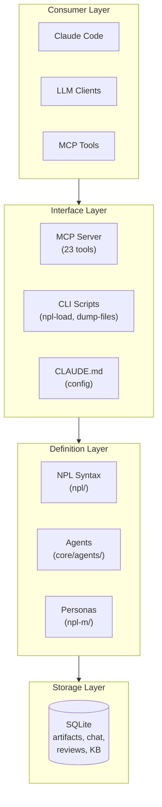

# PROJECT-ARCH: NoizuPromptLingo

A modular prompt engineering framework (NPL - Noizu Prompt Lingua) for advanced AI agent simulation and structured prompting with Claude Code integration.

## Quick Reference

| Layer | Purpose | Key Components |
|:------|:--------|:---------------|
| NPL Core | Syntax definitions | `npl/`, `npl.md` |
| Agents | AI agent definitions | `core/agents/`, `core/additional-agents/` |
| MCP Server | Runtime tooling | `mcp-server/src/npl_mcp/` |
| Scripts | CLI utilities | `core/scripts/` |
| Documentation | Usage guides | `docs/` |

---

## Architecture Overview

**style**: Layered/Documentation-First
**confidence**: high

---

## Architectural Layers

### NPL Core (`/npl/`)
Framework syntax specification including directives, fences, pumps (reasoning patterns), prefixes (response modes), and special sections. Unicode-heavy syntax using boundary markers (`⌜`, `⌝`, `⌞`, `⌟`) and emoji prefixes.

### Agent Definitions (`/core/agents/`, `/core/additional-agents/`)
45+ markdown-based agent specifications organized by domain: marketing, QA, infrastructure, UX, research, project management. Each agent defines capabilities, response patterns, and behavioral constraints.

### MCP Server (`/mcp-server/`)
Python FastMCP server exposing 23 tools across 4 categories:
- **Script wrappers**: `npl_load`, `dump_files`, `git_tree`
- **Artifact management**: create, revise, retrieve with version control
- **Review system**: inline comments, overlay annotations
- **Chat rooms**: persona-based collaboration with @mentions

### CLI Scripts (`/core/scripts/`)
Bash utilities for NPL operations: `npl-load` (hierarchical component loading), `dump-files` (git-aware file extraction), `git-tree` (structure visualization), `npl-persona` (persona management).

---

## Domain Model

### Bounded Contexts

- **NPL Framework**: Syntax definitions, directives, formatting rules
  - Entities: Agents, Directives, Prefixes, Pumps, Fences

- **MCP Tooling**: Runtime artifact and collaboration management
  - Entities: Artifacts, Revisions, Reviews, ChatRooms, Notifications

- **Personas**: AI persona definitions for multi-agent workflows
  - Entities: Personas, Teams, Journals, Knowledge Bases

---

## Key Patterns

### Markdown-as-Code
Agent definitions, syntax rules, and personas are structured markdown files with special syntax blocks. The "codebase" is documentation that defines LLM behavior.

### Hierarchical Loading
NPL uses environment variable-based path resolution (`$NPL_HOME`, `$NPL_META`, `$NPL_STYLE_GUIDE`) with fallback chains: project → user → system.

### Event-Sourced Chat
Chat system stores all interactions as events (message, reaction, artifact_share, todo_create) with JSON payloads, enabling replay and notification generation.

---

## Infrastructure

| Service | Type | Config |
|:--------|:-----|:-------|
| SQLite (MCP) | db | `mcp-server/src/npl_mcp/storage/schema.sql` |
| SQLite (NIMPS) | db | `core/schema/nimps.sql` |
| SQLite (KB) | db | `core/schema/nb.sql` |

**Deployment**: Local installation only (no containers, no CI/CD)

---

## Technology Stack

| Component | Technology |
|:----------|:-----------|
| Primary Format | Markdown/NPL |
| Runtime | Python >=3.10 |
| MCP Framework | FastMCP |
| Database | SQLite/aiosqlite |
| Build System | Hatchling |

---

## Critical Gaps

- No CI/CD pipeline (tests exist but not automated)
- No containerization
- Installer module is a stub
- No database migration system
- No CONTRIBUTING.md

---

## Summary

**Strengths**:
- Comprehensive agent library (45+ agents)
- Well-structured syntax framework
- Deep Claude Code integration
- Extensible hierarchical loading

**Gaps**:
- Missing CI/CD and automation
- Incomplete installer
- No migration strategy

**Next Steps**: Run `/update-arch` for detailed sub-file generation
