# Domain Model

Entity and bounded context documentation for NoizuPromptLingo.

## Context Map

```mermaid
flowchart LR
    subgraph NPL["NPL Framework"]
        direction TB
        A1[Agents]
        A2[Directives]
        A3[Prefixes]
        A4[Pumps]
        A5[Fences]
        A6[Syntax Elements]
        A7[Special Sections]
        A8[Templates]
    end

    subgraph MCP["MCP Tooling"]
        direction TB
        M1[Artifacts]
        M2[Revisions]
        M3[Reviews]
        M4[ChatRooms]
        M5[ChatEvents]
        M6[Notifications]
        M7[InlineComments]
    end

    subgraph Persona["Personas"]
        direction TB
        P1[Personas]
        P2[Teams]
        P3[Journals]
        P4[Tasks]
        P5[KnowledgeBases]
        P6[Relationships]
    end

    NPL -->|"defines behavior for"| Persona
    Persona -->|"collaborates via"| MCP
    NPL -->|"structures output in"| MCP
```



---

## NPL Framework Context

**purpose**
: Defines the core syntax, structural patterns, and behavioral specifications that enable structured prompt engineering. This context establishes the foundational "language" through which agents communicate, reason, and produce output.

**ubiquitous-language**
: `Agent` (simulated entity with behaviors), `Directive` (instruction pattern with emoji prefix), `Prefix` (response mode indicator), `Pump` (reasoning/thinking pattern), `Fence` (code block type), `Placeholder` (content insertion point), `Template` (reusable output pattern), `Special Section` (framework boundary declaration)

### Aggregate Root: Agent

**Agent**
: A simulated entity with defined behaviors, capabilities, constraints, and response patterns designed for specific roles or functions within the NPL ecosystem.

| Attribute | Type | Description |
|:----------|:-----|:------------|
| `name` | `string` | Unique agent identifier (e.g., `data-analyst`) |
| `type` | `enum` | Agent classification: `service`, `tool`, `person` |
| `version` | `string` | NPL version compatibility (e.g., `NPL@1.0`) |
| `description` | `text` | Brief purpose and function description |
| `capabilities` | `list<string>` | Defined behaviors and response patterns |
| `constraints` | `list<string>` | Operational boundaries and limitations |
| `aliases` | `list<string>` | Alternative names via `@` notation |
| `runtime_flags` | `map<string,any>` | Dynamic behavior modification settings |

**invariants**
: Agent name must be unique within scope. Type must be one of the defined classifications. All agents must specify NPL version compatibility. Service agents provide task-specific functionality. Tool agents emulate specific tool interfaces. Person agents simulate human-like personas.

### Entity: Directive

**Directive**
: A specialized instruction pattern using emoji prefixes for precise agent behavior modification and output control.

| Attribute | Type | Description |
|:----------|:-----|:------------|
| `emoji_prefix` | `string` | Visual indicator (e.g., `table`, `temporal`, `template`) |
| `instruction` | `string` | Primary command or specification |
| `elaboration` | `string?` | Optional additional context (after `\|`) |
| `type` | `enum` | Category: `table`, `temporal`, `template`, `interactive`, `identifier`, `explanatory`, `reference`, `explicit` |

**directive-types**

| Directive | Syntax | Purpose |
|:----------|:-------|:--------|
| Table | `📅: (alignments) \| content` | Structured table formatting |
| Temporal | `⏳: condition` | Time-based execution |
| Template | `⇆: template-name \| context` | Template integration |
| Interactive | `🚀: action` | Interactive element choreography |
| Identifier | `🆔: entity` | Unique ID generation |
| Explanatory | `📖: explanation` | Instructive comments |
| Reference | `📂: {id}` | Section marking |
| Explicit | `➤: instruction \| elaboration` | Direct precise instructions |

### Entity: Prefix

**Prefix**
: Response mode indicator using `emoji➤` pattern that shapes output generation under specific processing contexts.

| Attribute | Type | Description |
|:----------|:-----|:------------|
| `emoji` | `string` | Visual indicator defining response mode |
| `mode` | `string` | Processing context identifier |
| `description` | `text` | Mode purpose and expected behavior |

**prefix-catalog**

| Prefix | Mode | Description |
|:-------|:-----|:------------|
| `🗣️➤` | speech_recognition | Transcription tasks |
| `🔊➤` | text_to_speech | Audio synthesis |
| `🖼️➤` | visual_content | Image captions/descriptions |
| `❓➤` | question_answering | Direct Q&A format |
| `📊➤` | topic_modeling | Analysis and categorization |
| `🌐➤` | translation | Language translation |
| `👁️➤` | entity_recognition | Named entity extraction |
| `🖋️➤` | creative_generation | Creative writing |
| `🖥️➤` | code_generation | Programming tasks |
| `🏷️➤` | classification | Text categorization |
| `💡➤` | sentiment_analysis | Emotion/sentiment detection |
| `📄➤` | summarization | Content summarization |
| `🧪➤` | feature_extraction | Data analysis |
| `🗣️❓➤` | word_riddle | Puzzles and riddles |
| `👪➤` | conversational | Dialogue interaction |

### Entity: Pump (Intuition Pump)

**Pump**
: Structured reasoning technique implemented as XHTML tags that guide problem-solving, response construction, and analytical thinking.

| Attribute | Type | Description |
|:----------|:-----|:------------|
| `type` | `string` | Pump identifier (e.g., `npl-intent`, `npl-cot`) |
| `purpose` | `text` | Reasoning pattern objective |
| `output_location` | `enum` | Where in response: `beginning`, `throughout`, `conclusion`, `contextual` |
| `structure` | `yaml_schema` | Expected internal format |

**pump-types**

| Type | Purpose | Location |
|:-----|:--------|:---------|
| `npl-intent` | Planning transparency and intent declaration | Response beginning |
| `npl-cot` | Chain-of-thought complex reasoning | Throughout analysis |
| `npl-reflection` | Self-assessment and quality evaluation | Response conclusion |
| `npl-tangent` | Related concept exploration | Contextual insertion |
| `npl-panel` | Multi-perspective analysis | Dedicated sections |
| `npl-critique` | Critical evaluation framework | Assessment phases |
| `npl-rubric` | Structured scoring methodology | Evaluation contexts |
| `npl-mood` | Emotional context indicators | Contextual indicators |

### Entity: Fence

**Fence**
: Code fence type with specific formatting, processing, or display requirements that structures content semantically.

| Attribute | Type | Description |
|:----------|:-----|:------------|
| `type` | `string` | Fence identifier (e.g., `example`, `syntax`) |
| `category` | `enum` | Classification: `content`, `structure`, `algorithm`, `special` |
| `purpose` | `text` | Semantic meaning and processing intent |
| `processing` | `text` | How content should be interpreted |

**fence-catalog**

| Fence | Category | Purpose |
|:------|:---------|:--------|
| `example` | content | Demonstrate usage patterns |
| `note` | content | Supplementary information |
| `diagram` | content | Visual representations |
| `syntax` | structure | Define formal patterns |
| `format` | structure | Specify output templates |
| `template` | structure | Reusable patterns with variables |
| `alg` | algorithm | Formal algorithm specifications |
| `alg-pseudo` | algorithm | Pseudocode representations |
| `artifact` | special | Structured output with metadata |

### Value Object: SyntaxElement

**SyntaxElement**
: Foundational formatting convention for prompt construction.

| Element | Syntax | Purpose |
|:--------|:-------|:--------|
| `highlight` | `` `term` `` | Emphasize key concepts |
| `attention` | `🎯 instruction` | Mark critical directives |
| `placeholder` | `<term>`, `{term}` | Input/output locations |
| `in-fill` | `[...]`, `[...\|detail]` | Content generation markers |
| `qualifier` | `term\|instructions` | Extend with conditions |
| `inference` | `...`, `etc.` | Generate similar items |
| `omission` | `[___]` | Intentionally excluded content |
| `direct-message` | `@{agent}` | Route to specific agent |
| `literal-output` | `` `{~l\|text}` `` | Exact text reproduction |

### Entity: SpecialSection

**SpecialSection**
: Highest-precedence instruction block establishing framework boundaries.

| Attribute | Type | Description |
|:----------|:-----|:------------|
| `section_type` | `enum` | Type: `extension`, `agent`, `flags`, `secure`, `template` |
| `params` | `string?` | Section-specific parameters |
| `content` | `text` | Section body content |
| `precedence` | `int` | Processing priority (1=highest) |

**special-section-types**

| Type | Syntax | Precedence | Purpose |
|:-----|:-------|:-----------|:--------|
| Secure Prompt | `⌜🔒[...]⌟` | 1 | Immutable instructions |
| Runtime Flags | `⌜🏳️[...]⌟` | 2 | Behavior modification |
| Agent Declaration | `⌜name\|type\|NPL@ver⌝[...]⌞name⌟` | 3 | Agent definition |
| NPL Extension | `⌜extend:NPL@ver⌝[...]⌞extend:NPL@ver⌟` | 4 | Framework modification |
| Named Template | `⌜🧱 name⌝[...]⌞🧱 name⌟` | 5 | Reusable templates |

### Value Object: Template

**Template**
: Reusable output pattern with handlebar-style variable substitution.

| Attribute | Type | Description |
|:----------|:-----|:------------|
| `name` | `string` | Template identifier |
| `npl_version` | `string` | NPL compatibility version |
| `structure` | `text` | Template body with placeholders |
| `variables` | `list<string>` | Expected placeholder names |

### Domain Events (NPL Framework)

| Event | Trigger | Data |
|:------|:--------|:-----|
| `AgentDeclared` | Agent definition parsed | agent_name, type, capabilities |
| `DirectiveProcessed` | Directive instruction executed | directive_type, instruction |
| `PumpActivated` | Reasoning pattern engaged | pump_type, context |
| `TemplateBound` | Template variables populated | template_name, bindings |
| `FlagModified` | Runtime flag changed | flag_name, old_value, new_value |

---

## MCP Tooling Context

**purpose**
: Provides runtime artifact management, version control, collaborative review workflows, and real-time communication channels for multi-agent collaboration. This context enables persistent storage, review cycles, and asynchronous coordination between personas and human operators.

**ubiquitous-language**
: `Artifact` (versioned content unit), `Revision` (version snapshot), `Review` (evaluation session), `InlineComment` (position-based feedback), `ChatRoom` (collaboration space), `ChatEvent` (room activity), `Notification` (persona alert), `RoomMember` (participation record)

### Aggregate Root: Artifact

**Artifact**
: A versioned content unit with complete revision history, supporting documents, images, code, and data types.

| Attribute | Type | Description |
|:----------|:-----|:------------|
| `id` | `integer` | Primary key (auto-increment) |
| `name` | `string` | Unique artifact identifier |
| `type` | `enum` | Content type: `document`, `image`, `code`, `data` |
| `created_at` | `timestamp` | Creation timestamp |
| `current_revision_id` | `integer?` | FK to active revision |

**invariants**
: Artifact name must be unique across the system. Every artifact must have at least one revision after creation. The current_revision_id must reference an existing revision belonging to this artifact. Artifact type determines valid content encoding.

### Entity: Revision

**Revision**
: A specific version snapshot of an artifact with full content and metadata.

| Attribute | Type | Description |
|:----------|:-----|:------------|
| `id` | `integer` | Primary key |
| `artifact_id` | `integer` | FK to parent artifact |
| `revision_num` | `integer` | Sequential version number (0-indexed) |
| `created_at` | `timestamp` | Revision creation time |
| `created_by` | `string?` | Persona slug of creator |
| `file_path` | `string` | Relative path to content file |
| `meta_path` | `string` | Path to `.meta.md` metadata file |
| `purpose` | `text?` | Revision purpose/description |
| `notes` | `text?` | Additional revision notes |

**invariants**
: Revision number must be unique per artifact. Revision numbers increment sequentially starting from 0. File path must point to valid content within data directory.

### Aggregate Root: Review

**Review**
: An artifact review session with inline comments, annotations, and overall assessment.

| Attribute | Type | Description |
|:----------|:-----|:------------|
| `id` | `integer` | Primary key |
| `artifact_id` | `integer` | FK to artifact being reviewed |
| `revision_id` | `integer` | FK to specific revision under review |
| `reviewer_persona` | `string` | Persona slug of reviewer |
| `created_at` | `timestamp` | Review start time |
| `status` | `enum` | Review state: `in_progress`, `completed` |
| `overall_comment` | `text?` | Final review summary |

**invariants**
: Review must reference valid artifact and revision. Reviewer persona must be a recognized persona slug. Status transitions: `in_progress` -> `completed` only.

### Entity: InlineComment

**InlineComment**
: Position-based feedback within a review session.

| Attribute | Type | Description |
|:----------|:-----|:------------|
| `id` | `integer` | Primary key |
| `review_id` | `integer` | FK to parent review |
| `location` | `string` | Position: `line:N` or `@x:N,y:N` |
| `comment` | `text` | Comment content |
| `persona` | `string` | Commenter persona slug |
| `created_at` | `timestamp` | Comment timestamp |

### Entity: ReviewOverlay

**ReviewOverlay**
: Image annotation overlay for visual artifact reviews.

| Attribute | Type | Description |
|:----------|:-----|:------------|
| `id` | `integer` | Primary key |
| `review_id` | `integer` | FK to parent review |
| `overlay_file` | `string` | Path to overlay image/annotation |
| `created_at` | `timestamp` | Creation timestamp |

### Aggregate Root: ChatRoom

**ChatRoom**
: A collaboration space for persona communication and coordination.

| Attribute | Type | Description |
|:----------|:-----|:------------|
| `id` | `integer` | Primary key |
| `name` | `string` | Unique room identifier |
| `created_at` | `timestamp` | Room creation time |
| `description` | `text?` | Room purpose description |

**invariants**
: Room name must be unique. Room must have at least one member upon creation.

### Entity: RoomMember

**RoomMember**
: Persona membership record for a chat room.

| Attribute | Type | Description |
|:----------|:-----|:------------|
| `room_id` | `integer` | FK to chat room |
| `persona_slug` | `string` | Persona identifier |
| `joined_at` | `timestamp` | Membership start time |

**composite-key**: (`room_id`, `persona_slug`)

### Entity: ChatEvent

**ChatEvent**
: Activity record within a chat room.

| Attribute | Type | Description |
|:----------|:-----|:------------|
| `id` | `integer` | Primary key |
| `room_id` | `integer` | FK to chat room |
| `event_type` | `enum` | Type: `message`, `emoji_reaction`, `artifact_share`, `todo_create`, `persona_join`, `persona_leave` |
| `persona` | `string` | Event initiator persona |
| `timestamp` | `timestamp` | Event occurrence time |
| `data` | `json` | Event-specific payload |
| `reply_to_id` | `integer?` | FK to parent event (for replies/reactions) |

**event-data-schemas**

| Event Type | Data Schema |
|:-----------|:------------|
| `message` | `{message: string, mentions: string[]}` |
| `emoji_reaction` | `{emoji: string, target_event_id: int}` |
| `artifact_share` | `{artifact_id: int, revision: int?}` |
| `todo_create` | `{description: string, assigned_to: string?, status: string}` |
| `persona_join` | `{action: "joined", persona: string}` |
| `persona_leave` | `{action: "left", persona: string}` |

### Entity: Notification

**Notification**
: Alert record for persona @mentions and events.

| Attribute | Type | Description |
|:----------|:-----|:------------|
| `id` | `integer` | Primary key |
| `persona` | `string` | Notification recipient |
| `event_id` | `integer` | FK to triggering event |
| `notification_type` | `enum` | Type: `mention`, `artifact_share`, `todo_assign` |
| `read_at` | `timestamp?` | Read confirmation time (null if unread) |
| `created_at` | `timestamp` | Notification creation time |

### Domain Events (MCP Tooling)

| Event | Trigger | Data |
|:------|:--------|:-----|
| `ArtifactCreated` | New artifact registered | artifact_id, name, type, creator |
| `RevisionAdded` | New version uploaded | artifact_id, revision_num, created_by |
| `ReviewStarted` | Review session initiated | review_id, artifact_id, reviewer |
| `ReviewCompleted` | Review finalized | review_id, status, overall_comment |
| `InlineCommentAdded` | Feedback submitted | review_id, location, persona |
| `ChatRoomCreated` | New room established | room_id, name, initial_members |
| `MessageSent` | Chat message posted | event_id, room_id, persona, mentions |
| `ArtifactShared` | Content shared in room | event_id, artifact_id, room_id |
| `NotificationCreated` | Alert generated | notification_id, persona, type |
| `NotificationRead` | Alert acknowledged | notification_id, read_at |
| `PersonaJoined` | Member added to room | room_id, persona_slug |
| `PersonaLeft` | Member departed room | room_id, persona_slug |
| `EmojiReactionAdded` | Reaction to message | event_id, target_event_id, emoji |
| `TodoCreated` | Task assigned in room | event_id, description, assigned_to |

---

## Personas Context

**purpose**
: Manages AI identity definitions for multi-agent workflows with persistent state across sessions. This context enables authentic character simulation, experience tracking, knowledge accumulation, and team coordination through file-backed persona management.

**ubiquitous-language**
: `Persona` (AI identity definition), `Team` (persona group), `Journal` (experience log), `Task` (assigned work item), `KnowledgeBase` (accumulated expertise), `Relationship` (inter-persona connection), `VoiceSignature` (communication patterns), `ExpertiseGraph` (domain competencies)

### Aggregate Root: Persona

**Persona**
: A complete AI identity definition with role, personality, expertise, and persistent state files.

| Attribute | Type | Description |
|:----------|:-----|:------------|
| `id` | `string` | Unique persona slug (e.g., `sarah-architect`) |
| `name` | `string` | Full display name |
| `role` | `string` | Primary role/title |
| `experience_years` | `integer?` | Years of domain experience |
| `domains` | `list<string>` | Areas of expertise |
| `personality` | `OceanScores` | Big Five personality traits |
| `communication_style` | `string` | Interaction approach |
| `voice_signature` | `VoiceSignature` | Speech patterns and quirks |
| `expertise_graph` | `ExpertiseGraph` | Knowledge domain mapping |
| `scope` | `enum` | Location: `project`, `user`, `system` |
| `file_paths` | `PersonaFiles` | Paths to 4 mandatory files |

**invariants**
: Persona ID must be unique within scope hierarchy. All four mandatory files must exist: `.persona.md`, `.journal.md`, `.tasks.md`, `.knowledge-base.md`. Voice signature must remain consistent across all interactions. Expertise boundaries must be respected in responses.

### Value Object: VoiceSignature

**VoiceSignature**
: Characteristic communication patterns defining how a persona speaks.

| Attribute | Type | Description |
|:----------|:-----|:------------|
| `lexicon` | `list<string>` | Preferred terminology |
| `patterns` | `list<string>` | Speech patterns and structures |
| `quirks` | `list<string>` | Unique behavioral traits |

### Value Object: ExpertiseGraph

**ExpertiseGraph**
: Domain knowledge mapping with confidence levels.

| Attribute | Type | Description |
|:----------|:-----|:------------|
| `primary` | `list<string>` | Core competencies |
| `secondary` | `list<string>` | Supporting skills |
| `boundaries` | `list<string>` | Known limitations |
| `learning` | `list<string>` | Growth areas |

### Value Object: OceanScores

**OceanScores**
: Big Five personality trait measurements.

| Attribute | Type | Description |
|:----------|:-----|:------------|
| `openness` | `float` | Creativity and curiosity (0-1) |
| `conscientiousness` | `float` | Organization and dependability (0-1) |
| `extraversion` | `float` | Sociability and energy (0-1) |
| `agreeableness` | `float` | Cooperation and trust (0-1) |
| `neuroticism` | `float` | Emotional stability (0-1) |

### Value Object: PersonaFiles

**PersonaFiles**
: Paths to the four mandatory persona state files.

| Attribute | Type | Description |
|:----------|:-----|:------------|
| `definition` | `path` | `{id}.persona.md` - Core identity |
| `journal` | `path` | `{id}.journal.md` - Experience log |
| `tasks` | `path` | `{id}.tasks.md` - Active work items |
| `knowledge` | `path` | `{id}.knowledge-base.md` - Accumulated expertise |

### Entity: Journal

**Journal**
: Chronological experience log for a persona.

| Attribute | Type | Description |
|:----------|:-----|:------------|
| `persona_id` | `string` | FK to parent persona |
| `entries` | `list<JournalEntry>` | Chronological entries |
| `auto_archive_threshold` | `size` | Archive trigger (default: 100KB) |

### Value Object: JournalEntry

**JournalEntry**
: Single experience record in a persona's journal.

| Attribute | Type | Description |
|:----------|:-----|:------------|
| `timestamp` | `timestamp` | Entry datetime |
| `session_id` | `string?` | Related interaction session |
| `context` | `string` | Situation description |
| `participants` | `list<string>` | Interacting personas |
| `role` | `string` | Persona's contribution |
| `reflection` | `text` | Personal thoughts and lessons |
| `outcomes` | `text` | Results achieved |
| `growth` | `list<string>` | Skills gained |
| `emotional_state` | `string?` | Mood during interaction |

### Entity: TaskList

**TaskList**
: Active tasks and responsibilities for a persona.

| Attribute | Type | Description |
|:----------|:-----|:------------|
| `persona_id` | `string` | FK to parent persona |
| `active_tasks` | `list<Task>` | Current work items |
| `responsibilities` | `Responsibilities` | Role-based duties |
| `auto_archive_threshold` | `duration` | Archive completed after (default: 90 days) |

### Value Object: Task

**Task**
: Single work item assigned to a persona.

| Attribute | Type | Description |
|:----------|:-----|:------------|
| `description` | `string` | Task description |
| `status` | `enum` | State: `pending`, `in-progress`, `blocked`, `completed` |
| `priority` | `enum` | Priority: `high`, `med`, `low` |
| `due_date` | `date?` | Target completion date |
| `owner` | `string` | Responsible persona |
| `completion_note` | `text?` | Notes upon completion |
| `created_at` | `timestamp` | Task creation time |
| `completed_at` | `timestamp?` | Completion timestamp |

### Value Object: Responsibilities

**Responsibilities**
: Role-based recurring duties.

| Attribute | Type | Description |
|:----------|:-----|:------------|
| `daily` | `list<string>` | Daily routine tasks |
| `weekly` | `list<string>` | Weekly reviews/tasks |
| `project` | `list<string>` | Project deliverables |

### Entity: KnowledgeBase

**KnowledgeBase**
: Accumulated domain expertise for a persona.

| Attribute | Type | Description |
|:----------|:-----|:------------|
| `persona_id` | `string` | FK to parent persona |
| `domains` | `list<KnowledgeDomain>` | Core expertise areas |
| `recent_learnings` | `list<Learning>` | Recently acquired knowledge |

### Value Object: KnowledgeDomain

**KnowledgeDomain**
: Single domain of expertise with confidence metrics.

| Attribute | Type | Description |
|:----------|:-----|:------------|
| `name` | `string` | Domain identifier |
| `confidence` | `integer` | Confidence level (0-100) |
| `depth` | `enum` | Understanding: `surface`, `working`, `expert` |
| `last_updated` | `date` | Most recent update |
| `key_concepts` | `list<string>` | Core concepts mastered |
| `applications` | `list<string>` | Practical use cases |

### Value Object: Learning

**Learning**
: Recently acquired knowledge entry.

| Attribute | Type | Description |
|:----------|:-----|:------------|
| `date` | `date` | Acquisition date |
| `topic` | `string` | Subject matter |
| `source` | `string` | Knowledge origin |
| `content` | `text` | Learning details |
| `integration` | `text` | Connections to existing knowledge |

### Aggregate Root: Team

**Team**
: A defined group of personas for collaborative workflows.

| Attribute | Type | Description |
|:----------|:-----|:------------|
| `id` | `string` | Unique team identifier |
| `name` | `string` | Team display name |
| `members` | `list<string>` | Persona IDs in team |
| `scope` | `enum` | Location: `project`, `user`, `system` |
| `description` | `text?` | Team purpose |
| `dynamics` | `TeamDynamics?` | Collaboration patterns |

**team-files**

| File | Purpose |
|:-----|:--------|
| `{team_id}.team.md` | Team composition and dynamics |
| `{team_id}.history.md` | Collaboration history |

### Value Object: TeamDynamics

**TeamDynamics**
: Collaboration patterns and team analysis.

| Attribute | Type | Description |
|:----------|:-----|:------------|
| `skill_matrix` | `map<string,list<string>>` | Skills per persona |
| `interaction_patterns` | `text` | How team collaborates |
| `conflict_areas` | `list<string>` | Known disagreement points |
| `strengths` | `list<string>` | Collective capabilities |

### Entity: Relationship

**Relationship**
: Connection between two personas (stored in shared graph).

| Attribute | Type | Description |
|:----------|:-----|:------------|
| `persona_a` | `string` | First persona ID |
| `persona_b` | `string` | Second persona ID |
| `type` | `enum` | Relationship: `professional`, `personal`, `hierarchical`, `peer` |
| `frequency` | `string?` | Interaction frequency |
| `influence_direction` | `enum?` | `a_to_b`, `b_to_a`, `bidirectional` |
| `shared_contexts` | `list<string>` | Common interaction areas |
| `conflict_areas` | `list<string>?` | Tension points |
| `collaboration_opportunities` | `list<string>?` | Synergy areas |

### Domain Events (Personas)

| Event | Trigger | Data |
|:------|:--------|:-----|
| `PersonaCreated` | `npl-persona init` executed | persona_id, role, scope |
| `PersonaLoaded` | `npl-persona get` executed | persona_id, files_loaded |
| `PersonaRemoved` | `npl-persona remove` executed | persona_id, scope |
| `JournalEntryAdded` | Interaction recorded | persona_id, entry_summary |
| `JournalArchived` | Old entries archived | persona_id, entries_count, before_date |
| `TaskCreated` | New task assigned | persona_id, description, priority |
| `TaskStatusChanged` | Task progressed | persona_id, task_id, old_status, new_status |
| `TaskCompleted` | Task finished | persona_id, task_id, completion_note |
| `KnowledgeAdded` | New learning recorded | persona_id, topic, source |
| `DomainConfidenceUpdated` | Expertise level changed | persona_id, domain, confidence |
| `TeamCreated` | New team formed | team_id, members, scope |
| `TeamMemberAdded` | Persona joined team | team_id, persona_id |
| `KnowledgeShared` | Transfer between personas | from_persona, to_persona, topic |
| `PersonaSynced` | State files validated | persona_id, validation_result |
| `PersonaBackedUp` | Backup created | persona_id, backup_path |
| `RelationshipUpdated` | Connection modified | persona_a, persona_b, change_type |

---

## Cross-Context Relationships

### NPL Framework -> Personas

| Relationship | Description |
|:-------------|:------------|
| Agent defines Persona behavior | NPL Agent declarations establish how Personas respond and reason |
| Pumps structure Persona thinking | Pumps like `npl-cot` and `npl-reflection` guide Persona reasoning |
| Directives control Persona output | Directives format Persona responses (tables, templates) |
| Prefixes set Persona response modes | Prefix patterns like `🖥️➤` activate specific Persona capabilities |
| VoiceSignature uses SyntaxElements | Persona speech patterns leverage NPL syntax conventions |

### Personas -> MCP Tooling

| Relationship | Description |
|:-------------|:------------|
| Personas create Artifacts | Personas author versioned content as Artifacts |
| Personas conduct Reviews | Personas add InlineComments on Artifact revisions |
| Personas communicate via ChatRooms | Multi-persona collaboration uses ChatEvents |
| Personas receive Notifications | @mentions and artifact shares alert relevant Personas |
| Teams share Artifacts | Team-based workflows distribute Artifacts |
| Persona Tasks track Artifact work | TodoCreate events link to Persona task management |

### NPL Framework -> MCP Tooling

| Relationship | Description |
|:-------------|:------------|
| Fences structure Artifact content | Artifact content uses NPL fence types |
| Templates format Review output | Named templates structure review summaries |
| Directives control Artifact formatting | Table and format directives organize Artifact structure |

---

## File System Structure

### NPL Framework Files

```
${NPL_HOME}/npl/
├── agent.md                    # Agent definition patterns
├── directive.md                # Directive specifications
├── directive/                  # Individual directive docs
│   ├── 📅.md                   # Table directive
│   ├── ⏳.md                   # Temporal directive
│   └── ...
├── prefix.md                   # Prefix overview
├── prefix/                     # Individual prefix docs
│   ├── 🖥️.md                   # Code generation prefix
│   └── ...
├── pumps.md                    # Pumps overview
├── pumps/                      # Individual pump docs
│   ├── npl-intent.md
│   ├── npl-cot.md
│   ├── npl-reflection.md
│   └── ...
├── fences.md                   # Fence types
├── fences/                     # Individual fence docs
├── syntax.md                   # Syntax elements
├── formatting.md               # Output formatting
└── special-section.md          # Special sections
```

### MCP Tooling Files

```
mcp-server/
├── src/npl_mcp/
│   ├── storage/
│   │   ├── schema.sql          # Database schema
│   │   └── db.py               # Database operations
│   ├── artifacts/
│   │   ├── manager.py          # Artifact CRUD
│   │   └── reviews.py          # Review system
│   └── chat/
│       └── rooms.py            # ChatRoom management
└── data/
    └── artifacts/              # Artifact file storage
        └── {artifact_name}/
            └── v{revision}/
                ├── {filename}  # Content file
                └── meta.md     # Revision metadata
```

### Personas Files

```
${NPL_PERSONA_DIR}/             # ./.npl/personas, ~/.npl/personas, /etc/npl/personas
├── personas/
│   ├── {persona_id}.persona.md        # Core definition
│   ├── {persona_id}.journal.md        # Experience log
│   ├── {persona_id}.tasks.md          # Active tasks
│   └── {persona_id}.knowledge-base.md # Domain expertise
├── teams/
│   ├── {team_id}.team.md              # Team composition
│   └── {team_id}.history.md           # Collaboration history
└── shared/
    ├── relationships.graph.md         # Inter-persona connections
    └── world-state.md                 # Shared context
```

---

## Business Rules Summary

### NPL Framework Rules

1. **Precedence Chain**: Secure prompts (🔒) > Runtime flags (🏳️) > Agent declarations > Extensions > Templates > Regular content
2. **Agent Scope**: Agents cannot exceed declared capabilities or type constraints
3. **Directive Syntax**: All directives follow `⟪emoji: instruction | elaboration⟫` pattern
4. **Prefix Activation**: Later prefixes in a chain take precedence over earlier ones
5. **Pump Nesting**: Pumps can be combined (e.g., `npl-cot` with `npl-reflection`)
6. **Fence Semantics**: Fence type determines content interpretation and processing

### MCP Tooling Rules

1. **Artifact Uniqueness**: Artifact names must be globally unique
2. **Revision Ordering**: Revisions number sequentially starting from 0
3. **Review Membership**: Only room members can post ChatEvents
4. **Notification Routing**: @mentions automatically create Notifications
5. **Event Integrity**: Reply events must reference existing parent events
6. **Status Transitions**: Review status can only move `in_progress` -> `completed`

### Personas Rules

1. **File Completeness**: All 4 mandatory files required for valid persona
2. **Hierarchical Loading**: Project > User > System path resolution
3. **Voice Consistency**: Persona voice must remain stable across interactions
4. **State Synchronization**: All interactions update journal/tasks/knowledge files
5. **Expertise Boundaries**: Personas respect declared domain limitations
6. **Team Membership**: Personas can belong to multiple teams across scopes
7. **Auto-Archiving**: Journals archive at 100KB, tasks archive after 90 days
