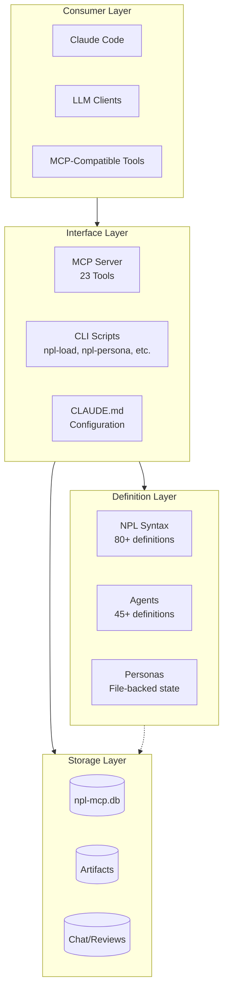
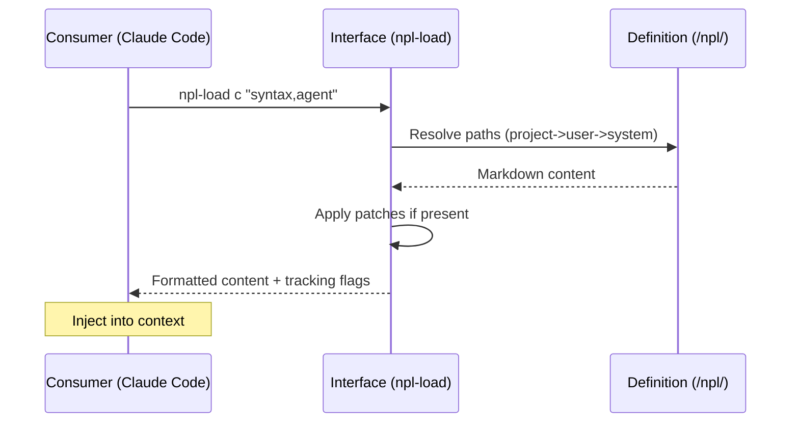
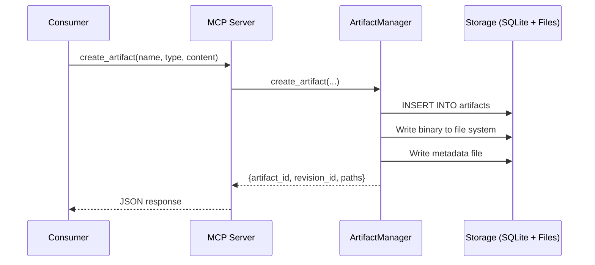
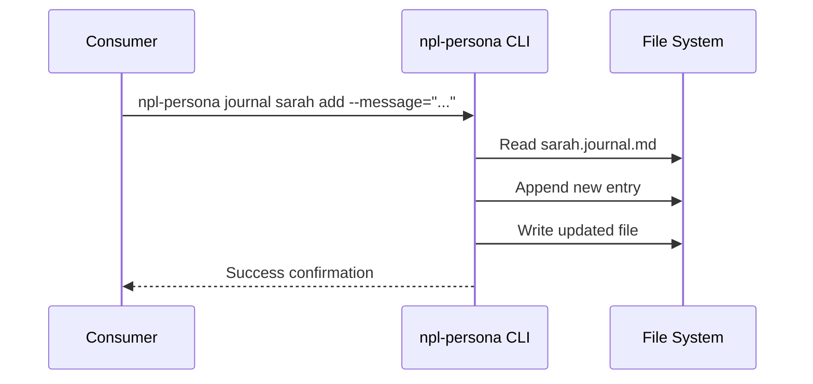

# Architectural Layers

Detailed breakdown of system layers for NoizuPromptLingo, documenting the flow from markdown-based definitions through interface tools to LLM consumers.

## Layer Overview



---

## Consumer Layer

**responsibility**
: Provides the runtime environment where NPL definitions are interpreted and executed. Consumers load CLAUDE.md configurations, invoke agents through the Interface Layer, and leverage the MCP protocol for persistent collaboration features.

**boundaries**
: This layer contains no NPL source code. All customization occurs through CLAUDE.md injection or MCP tool invocations. Consumers are responsible for prompt injection patterns and response interpretation.

### Components

**Claude Code**
: Primary development environment for NPL-powered workflows
: Location: External (Anthropic Claude CLI)
: Dependencies: CLAUDE.md, MCP Server (optional)

```example
# Claude Code loads NPL through CLAUDE.md system prompt
claude --project ./my-project
# CLAUDE.md automatically injected with NPL@1.0 framework
```

**LLM Clients**
: Any LLM client capable of processing NPL syntax in system prompts
: Location: External consumers (API integrations, chat interfaces)
: Dependencies: npl-load CLI for definition extraction

```example
# Load NPL definitions for external use
npl-load c "syntax,agent,formatting" > prompt-context.md
# Inject into LLM system prompt
```

**MCP-Compatible Tools**
: Tools supporting Model Context Protocol for persistent state
: Location: External MCP clients
: Dependencies: MCP Server (npl-mcp package)

```example
# MCP client configuration
{
  "servers": {
    "npl-mcp": {
      "command": "npl-mcp",
      "args": []
    }
  }
}
```

### Layer Contracts

**inbound**
: CLAUDE.md system prompt injection; MCP tool invocation protocol; CLI stdout for definitions

**outbound**
: User prompts with NPL syntax; MCP tool calls; npl-load command execution

---

## Interface Layer

**responsibility**
: Exposes NPL capabilities through multiple access patterns: the MCP Server provides 23 tools for persistent collaboration (artifacts, chat, reviews); CLI scripts offer command-line access to definition loading and project utilities; CLAUDE.md serves as the configuration surface for consumer integration.

**boundaries**
: Interfaces do not contain domain logic. The MCP Server delegates to managers; CLI scripts delegate to the NPLLoader class; CLAUDE.md contains configuration only. All persistent state flows to the Storage Layer.

### Components

**MCP Server (23 Tools)**
: FastMCP-based server providing artifact management, chat rooms, and review systems
: Location: `/mcp-server/src/npl_mcp/server.py`
: Dependencies: Storage Layer (Database), ArtifactManager, ChatManager, ReviewManager

```python
# Tool categories exposed by MCP Server
# Script Tools (4)
@mcp.tool() async def dump_files(path, glob_filter): ...
@mcp.tool() async def git_tree(path): ...
@mcp.tool() async def git_tree_depth(path): ...
@mcp.tool() async def npl_load(resource_type, items, skip): ...

# Artifact Tools (5)
@mcp.tool() async def create_artifact(...): ...
@mcp.tool() async def add_revision(...): ...
@mcp.tool() async def get_artifact(...): ...
@mcp.tool() async def list_artifacts(): ...
@mcp.tool() async def get_artifact_history(...): ...

# Review Tools (6)
@mcp.tool() async def create_review(...): ...
@mcp.tool() async def add_inline_comment(...): ...
@mcp.tool() async def add_overlay_annotation(...): ...
@mcp.tool() async def get_review(...): ...
@mcp.tool() async def generate_annotated_artifact(...): ...
@mcp.tool() async def complete_review(...): ...

# Chat Tools (8)
@mcp.tool() async def create_chat_room(...): ...
@mcp.tool() async def send_message(...): ...
@mcp.tool() async def react_to_message(...): ...
@mcp.tool() async def share_artifact(...): ...
@mcp.tool() async def create_todo(...): ...
@mcp.tool() async def get_chat_feed(...): ...
@mcp.tool() async def get_notifications(...): ...
@mcp.tool() async def mark_notification_read(...): ...
```

**CLI Scripts**
: Command-line utilities for NPL definition management and project inspection
: Location: `/core/scripts/`
: Dependencies: NPL definitions, file system

| Script | Purpose | Key Features |
|--------|---------|--------------|
| `npl-load` | Load NPL definitions with dependency tracking | Hierarchical search, skip patterns, 12 resource types |
| `npl-persona` | Persona lifecycle and state management | Journal, tasks, knowledge base, health checks |
| `dump-files` | Recursive file content dumping | Respects .gitignore, glob filtering |
| `git-tree` | Directory tree visualization | Git-aware, uses tree --fromfile |
| `git-tree-depth` | Directory listing with depth | Nesting level annotation |
| `npl-fim-config` | FIM solution configuration | Solution-specific setup |

```bash
# npl-load resource types
npl-load c "syntax,agent"       # Core NPL components
npl-load m "persona.qa"         # Metadata files
npl-load s "house-style"        # Style conventions
npl-load agent npl-thinker      # Agent definitions
npl-load spec "api-design"      # Specifications
npl-load persona "sarah"        # Persona definitions
npl-load prd "feature-x"        # PRD documents
npl-load story "user-auth"      # User stories
npl-load prompt "npl_load"      # Prompt templates
npl-load schema nimps           # SQL schemas
npl-load init                   # Main npl.md file
npl-load init-claude            # Initialize CLAUDE.md
```

**CLAUDE.md**
: Project configuration file that injects NPL framework into Claude Code sessions
: Location: `/CLAUDE.md` (project root)
: Dependencies: None (static configuration)

```markdown
# Key sections in CLAUDE.md

## NPL Load Directive
Environment variables and loading instructions

## NPL Scripts
Available CLI tools documentation

## SQLite Quick Guide
Database operation patterns

## NPL@1.0 Framework
Core syntax, concepts, and navigation guide
```

### Layer Contracts

**inbound (MCP Server)**
: MCP protocol tool invocations with JSON parameters

**outbound (MCP Server)**
: JSON responses, base64-encoded file content, database state changes

**inbound (CLI)**
: Command-line arguments, stdin for some operations

**outbound (CLI)**
: Stdout with markdown-formatted content, stderr for errors

**inbound (CLAUDE.md)**
: Claude Code session initialization

**outbound (CLAUDE.md)**
: System prompt injection with NPL framework

---

## Definition Layer

**responsibility**
: Contains all NPL language definitions, agent specifications, and persona configurations. This layer defines the vocabulary, syntax, and behavioral patterns that consumers use. Definitions are organized hierarchically with fallback paths (project -> user -> system).

**boundaries**
: Definitions are pure markdown/text content with no executable code. They describe behavior but do not implement it. Runtime interpretation happens in consumers; persistence happens in Storage Layer.

### Components

**NPL Syntax Definitions**
: Core language elements and conventions
: Location: `/npl/`
: Dependencies: None (foundational)

| Category | Count | Examples |
|----------|-------|----------|
| Core Syntax | 12 files | `syntax.md`, `syntax/placeholder.md`, `syntax/attention.md` |
| Directives | 9 files | `directive.md`, `directive/table.md`, `directive/calendar.md` |
| Fences | 10 files | `fences.md`, `fences/alg.md`, `fences/artifact.md` |
| Formatting | 6 files | `formatting.md`, `formatting/template.md` |
| Instructing | 10 files | `instructing.md`, `instructing/handlebars.md`, `instructing/alg.md` |
| Prefixes | 16 files | `prefix.md`, `prefix/speech.md`, `prefix/visual.md` |
| Pumps | 10 files | `pumps.md`, `pumps/cot.md`, `pumps/intent.md`, `pumps/panel.md` |
| Special Sections | 6 files | `special-section.md`, `special-section/agent.md` |

```markdown
# Core syntax element example (from syntax.md)

**placeholder**
: `<term>`, `{term}`, `<<qualifier>:term>`
: Expected input/output locations

**in-fill**
: `[...]`, `[...|details]`, `[...size]`
: Mark areas for dynamic content generation

**qualifier**
: `term|instructions`
: Extend syntax with additional details
```

**Agent Definitions**
: Behavioral specifications for specialized AI personas
: Location: `/core/agents/`, `/core/additional-agents/`
: Dependencies: NPL Syntax

| Category | Location | Count | Examples |
|----------|----------|-------|----------|
| Core Agents | `/core/agents/` | 19 | npl-thinker, npl-author, npl-persona |
| Infrastructure | `/core/additional-agents/infrastructure/` | 3 | npl-prototyper, npl-build-manager |
| Marketing | `/core/additional-agents/marketing/` | 4 | npl-conversion, npl-positioning |
| Project Management | `/core/additional-agents/project-management/` | 4 | npl-risk-monitor, npl-user-impact-assessor |
| Quality Assurance | `/core/additional-agents/quality-assurance/` | 4 | npl-tester, npl-benchmarker |
| Research | `/core/additional-agents/research/` | 4 | npl-claude-optimizer, npl-research-validator |
| User Experience | `/core/additional-agents/user-experience/` | 4 | npl-accessibility, npl-onboarding |
| Misc | `/core/additional-agents/misc/` | 2 | npl-incident-responder, npl-proxy-tuner |

```markdown
# Agent definition structure (from agent.md)
⌜agent-name|type|NPL@version⌝
# Agent Name
Brief description of primary function.

## Behavior
- Behavioral specifications
- Response patterns
- Constraints

⌞agent-name⌟
```

**Personas**
: File-backed AI character definitions with persistent state
: Location: `.npl/personas/` (hierarchical: project -> user -> system)
: Dependencies: npl-persona agent, Storage Layer (file system)

```markdown
# Persona file structure
{persona_id}.persona.md     # Core definition (role, voice, expertise)
{persona_id}.journal.md     # Experience log with reflections
{persona_id}.tasks.md       # Active tasks & responsibilities
{persona_id}.knowledge-base.md  # Accumulated knowledge
```

```markdown
# Persona definition structure
⌜persona:{persona_id}|{role}|NPL@1.0⌝
# {full_name}
`{role}` `{expertise_tags}`

## Identity
- **Role**: {role_title}
- **Personality**: {OCEAN_scores}

## Voice Signature
lexicon: [{preferred_terms}]
patterns: [{speech_patterns}]

## Expertise Graph
primary: [{core_competencies}]
boundaries: [{limitations}]

⌞persona:{persona_id}⌟
```

### Layer Contracts

**inbound**
: npl-load requests with resource type and items; direct file reads

**outbound**
: Markdown content with NPL syntax; structured definitions for consumer interpretation

---

## Storage Layer

**responsibility**
: Provides persistent storage for MCP Server features including artifacts, revisions, reviews, chat rooms, and notifications. Uses SQLite for structured data and file system for binary artifacts.

**boundaries**
: This layer contains no business logic. It provides CRUD operations and file path management. All interpretation of stored data happens in the Interface Layer managers.

### Components

**Database (npl-mcp.db)**
: SQLite database for structured collaboration data
: Location: `$NPL_MCP_DATA_DIR/npl-mcp.db` (default: `./data/npl-mcp.db`)
: Dependencies: aiosqlite

```sql
-- Core tables in schema.sql

-- Artifact Registry
CREATE TABLE artifacts (
    id INTEGER PRIMARY KEY,
    name TEXT NOT NULL UNIQUE,
    type TEXT NOT NULL,  -- 'document', 'image', 'code', 'data'
    current_revision_id INTEGER,
    created_at TEXT DEFAULT (datetime('now'))
);

-- Version History
CREATE TABLE revisions (
    id INTEGER PRIMARY KEY,
    artifact_id INTEGER NOT NULL,
    revision_num INTEGER NOT NULL,
    created_by TEXT,  -- persona slug
    file_path TEXT NOT NULL,
    meta_path TEXT NOT NULL,
    purpose TEXT,
    UNIQUE(artifact_id, revision_num)
);

-- Review Sessions
CREATE TABLE reviews (
    id INTEGER PRIMARY KEY,
    artifact_id INTEGER NOT NULL,
    revision_id INTEGER NOT NULL,
    reviewer_persona TEXT NOT NULL,
    status TEXT DEFAULT 'in_progress'
);

-- Inline Comments
CREATE TABLE inline_comments (
    id INTEGER PRIMARY KEY,
    review_id INTEGER NOT NULL,
    location TEXT NOT NULL,  -- 'line:58' or '@x:100,y:200'
    comment TEXT NOT NULL,
    persona TEXT NOT NULL
);

-- Chat Rooms
CREATE TABLE chat_rooms (
    id INTEGER PRIMARY KEY,
    name TEXT NOT NULL UNIQUE,
    description TEXT
);

-- Chat Events
CREATE TABLE chat_events (
    id INTEGER PRIMARY KEY,
    room_id INTEGER NOT NULL,
    event_type TEXT NOT NULL,  -- 'message', 'reaction', 'artifact_share'
    persona TEXT NOT NULL,
    data TEXT NOT NULL,  -- JSON
    reply_to_id INTEGER
);

-- Notifications
CREATE TABLE notifications (
    id INTEGER PRIMARY KEY,
    persona TEXT NOT NULL,
    event_id INTEGER NOT NULL,
    notification_type TEXT NOT NULL,
    read_at TEXT
);
```

**File Storage**
: Binary artifact content and metadata files
: Location: `$NPL_MCP_DATA_DIR/artifacts/` and `$NPL_MCP_DATA_DIR/chats/`
: Dependencies: File system

```text
data/
├── npl-mcp.db              # SQLite database
├── artifacts/
│   └── {artifact_name}/
│       ├── revision-0-{filename}    # Binary content
│       ├── revision-0.meta.md       # YAML frontmatter metadata
│       ├── revision-1-{filename}
│       └── revision-1.meta.md
└── chats/                  # Reserved for future chat exports
```

```python
# Database class interface (from db.py)
class Database:
    async def connect(self): ...
    async def disconnect(self): ...
    async def execute(self, sql, parameters): ...
    async def fetchone(self, sql, parameters): ...
    async def fetchall(self, sql, parameters): ...
    def get_artifact_path(self, name, revision, filename): ...
    def get_artifact_meta_path(self, name, revision): ...
```

### Layer Contracts

**inbound**
: SQL queries via Database class; file read/write via ArtifactManager

**outbound**
: Query results as Row objects; file paths for binary content

---

## Cross-Layer Patterns

### Definition Loading Flow



### MCP Collaboration Flow



### Persona State Synchronization



---

## Layer Dependencies Summary

| Layer | Depends On | Depended On By |
|-------|-----------|----------------|
| Consumer | Interface, Definition (via CLAUDE.md) | None |
| Interface | Definition, Storage | Consumer |
| Definition | None | Interface, Consumer |
| Storage | None | Interface |

---

## Key Files Reference

| Layer | Component | Primary File(s) |
|-------|-----------|-----------------|
| Interface | MCP Server | `/mcp-server/src/npl_mcp/server.py` |
| Interface | CLI npl-load | `/core/scripts/npl-load` |
| Interface | CLI npl-persona | `/core/scripts/npl-persona` |
| Interface | Configuration | `/CLAUDE.md` |
| Definition | Syntax | `/npl/syntax.md`, `/npl/agent.md` |
| Definition | Agents | `/core/agents/*.md` |
| Storage | Schema | `/mcp-server/src/npl_mcp/storage/schema.sql` |
| Storage | Database | `/mcp-server/src/npl_mcp/storage/db.py` |
| Storage | Artifacts | `/mcp-server/src/npl_mcp/artifacts/manager.py` |
| Storage | Chat | `/mcp-server/src/npl_mcp/chat/rooms.py` |
